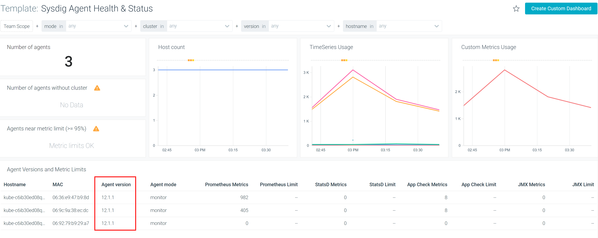

---

copyright:
  years:  2018, 2022
lastupdated: "2022-08-08"

keywords: IBM Cloud, monitoring, monitoring agent, versions

subcollection: monitoring

---

{{site.data.keyword.attribute-definition-list}}


# About agent versions
{: #agent_version}

The {{site.data.keyword.mon_full_notm}} agent version consists of multiple parts:

```text
X.Y.Z
```
{: codeblock}

Where

- `X` represents the major version of an image.
- `Y` represents the minor version of an image.
- `Z` represents an incremental ID that determines the latest patched minor version.

For more information about the agent new features and new versions, see [Sysdig Agent Release Notes](https://docs.sysdig.com/en/docs/release-notes/sysdig-agent-release-notes/){: external}.

## End of support
{: #agent_version_eos}

The {{site.data.keyword.mon_full_notm}} service supports `n-3` versions back based on the minor number.
{: note}

## Deprecation
{: #agent_version_deprecation}

When an agent version becomes unsupported, the agent version is maintained for vulnerabilities for 3 years. After 3 years, the image is deprecated and unavailable.

Unsupported versions of the {{site.data.keyword.mon_full_notm}} agent have a 3-year deprecation policy. 
{: note}


## Determining installed {{site.data.keyword.mon_short}} agent versions
{: #agent_version_ui}

Use the **Sysdig Agent Health & Status** dashboard to determine the {{site.data.keyword.mon_full}} agent versions that you have configured in your hosts.

Complete the following steps:

1. [Access your {{site.data.keyword.mon_short}} instance](/docs/monitoring?topic=monitoring-launch).

2. Click .

3. Click **Host Infrastructure** &gt; **Sysdig Agent Health & Status**.

The dashboard displays the agent versions corresponding to each host in the instance.

{: caption="Figure 1. Sysdig Agent Health & Status dashboard showing agent versions" caption-side="bottom"}

