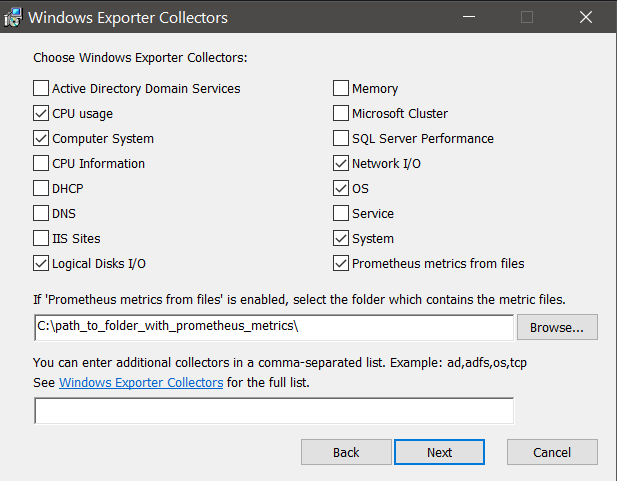

---

copyright:
  years:  2018, 2024
lastupdated: "2024-10-09"

keywords:

subcollection: monitoring

---

{{site.data.keyword.attribute-definition-list}}

# Configuring Windows to send metrics
{: #agent_windows}

After you provision an instance of the {{site.data.keyword.mon_full_notm}} service in the {{site.data.keyword.cloud_notm}}, you can use the Windows Prometheus Bundle to collect the metrics from a Windows system.
{: shortdesc}

The Windows Prometheus Bundle is a comprehensive package that installs and configures a [Prometheus Agent](https://prometheus.io/blog/2021/11/16/agent/){: external} and the [Windows Exporter](https://github.com/prometheus-community/windows_exporter){: external} allowing you to send metrics to your {{site.data.keyword.mon_full_notm}} instance.


## Key features of the Windows Prometheus Bundle
{: #win_agent_features}

The Windows Prometheus Bundle provides you the following features:

* A visual installation wizard.

* Interactive enabling of [collectors.](https://github.com/prometheus-community/windows_exporter/tree/v0.20.0#collectors){: external}

* A Prometheus Agent and Windows Exporter that run as Windows services.

* Metrics enriched with the Windows domain and instance host name for easy identification in {{site.data.keyword.mon_full_notm}}.

* Dashboards and alerts provided by default for Windows Host Overview, Windows IIS and Windows SQL Server.

## Default Collectors
{: #win_default_collectors}

If you accept all defaults when installing using the wizard, the following collectors will be enabled:

| Collector | Description |
| -------------- | ---------------- |
| `cpu` | CPU metrics |
| `cs` | Computer system metrics |
| `logical_disk` | Disk metrics |
| `os` | Operating System metrics |
| `system` | System metrics |
| `net` |  Network interface metrics |
{: caption="Default collectors" caption-side="bottom"}

If you are using Microsoft ISS or Microsoft MSSQL, you can enable collectors for these in the wizard or in the command line during the installation.
​
All collectors that can be configured can be found in the [Prometheus exporter documentation](https://github.com/prometheus-community/windows_exporter/tree/v0.20.0#collectors){: external}.

## Configuring
{: #win_config}

To begin monitoring your Windows systems, do the following:

1. Download the Windows Prometheus Bundle binary installer from the [latest project release.](https://github.com/sysdiglabs/Sysdig-Windows-Prometheus-Bundle/releases)

2. Run the installer on your Windows system.

3. Configure the [ingestion endpoints for remote write](/docs/monitoring?topic=monitoring-prometheus_remote_write#prometheus_remote_write_endpoints) and your [Monitor API token](/docs/monitoring?topic=monitoring-api_monitoring_token) in the wizard.

4. Click **Next**.

5. For the *Host Configuration* do not change the port or IP values. Specify any additional [CLI flags](https://github.com/prometheus-community/windows_exporter/tree/v0.20.0#flags){: externl} or remote IP addresses required for your Windows Firewall.

6. Click **Next**.

7. Select the collectors that you want to enable to generate metrics.

   {: caption="Windows Exporter selections" caption-side="bottom"}

   The most commonly used metrics can be selected. Additional [Windows Exporter](https://github.com/prometheus-community/windows_exporter){: external} metrics can be added as a comma separated list.

8. Metrics in Promethus format can be written by other processes to a file on the system. These metrics can be exported and sent to {{site.data.keyword.mon_full_notm}} by selecting `Prometheus metrics from files` then indicating the directory where the metrics are located.

9. Click **Install** then **Finish** to complete the installation.

10. Go to your {{site.data.keyword.mon_full_notm}} instance and start using the [Microsoft Windows dashboards and alerts](https://docs.sysdig.com/en/docs/sysdig-monitor/integrations/integration-library/infrastructure-integrations/windows/){: external}

   You can use the default dashboard `Windows Host Overview` to view the Windows metrics. This default dashboard is located in the **Dashboards** > **Applications** section. The `Windows Process Overview` dashboard is available when you have `process` metrics enabled. The `Windows Services Overview` dashboard is available when you have `service` metrics enabled. You can also search the **Alerts** > **Library** for `Windows` for available default alerts.
   {: tip}

   {: caption="Example of a Windows metrics dashboard" caption-side="bottom"}

## Installing using a command line
{: #win_config_cli}

You can automate the installation of the Windows Prometheus Bundle across multiple machines using the command line or PowerShell.
​
For example, you can use this command:

```sh
msiexec /i windows_exporter-1.0.0-x64.msi ENABLED_COLLECTORS=cpu,os SYSDIG_URL="https://eu-gb.monitoring.cloud.ibm.com/prometheus/remote/write" SYSDIG_TOKEN="yyyyyyy-zzzz-zzzz-zzzz-xxxxxxxx" /qn
```
{: pre}

This command will install the Windows Prometheus Bundle with `cpu` and `os` collectors.

### Comand line options
{: #win_cl_opts}

The following command line options are available:

`ENABLED_COLLECTORS`
:   A comma separated list of [collectors.](https://github.com/prometheus-community/windows_exporter/tree/v0.20.0#collectors){: external}

`SYSDIG_URL`
:   The [Prometheus endpoint](/docs/monitoring?topic=monitoring-prometheus_remote_write#prometheus_remote_write_endpoints) of your {{site.data.keyword.mon_full_notm}} region in the form `https://eu-gb.monitoring.cloud.ibm.com/prometheus/remote/write`.

`COMPUTER_NAME`
:   (Optional) Overrides the label `instance` in metrics generated by the Windows Exporter with a custom value. The default value is the computer name stored in the `COMPUTERNAME` Windows environment variable.

`PROMETHEUS_PORT`
:   (Optional) The Prometheus port. The default value is `9090`.

`WINDOWS_EXPORTER_LISTEN_ADDR`
:   (Optional) The Windows Exporter IP address. The default value is `0.0.0.0`.

`WINDOWS_EXPORTER_LISTEN_PORT`
:   (Optional) The Windows Exporter port. The default value is `9182`.

`WINDOWS_EXPORTER_EXTRA_FLAGS`
:   (Optional): Windows Exporter [additional CLI flags.](https://github.com/prometheus-community/windows_exporter/tree/v0.20.0#flags){: external} The default value is an empty string.

`WINDOWS_EXPORTER_FIREWALL_REMOTE_ADDR`
:   (Optional): A comma separated list of remote IP addresses for the Windows Firewall exception list (allowlist). The default value is an empty string which will allow any remote address.

`TEXTFILE_DIR`
:   The local folder where the `textfile` collector will look for files. This is only used when the `textfile` collector is enabled.

## Updating the configuration
{: #win_update}

If you need to add or remove configured metrics collectors, you can run the wizard, select the **Change** option, and make your required changes.

Optionally, you can edit the `config.yml` file in the `C:\Program Files\windows_exporter` directory. After saving your changes you will need to restart the `windows_exporter.exe` service.

## Removing the bundle
{: #win_uninstall}

Use the following command to uninstall the Windows Prometheus Bundle from a Windows system:

```sh
msiexec /x windows_exporter-1.0.0-x64.msi /qn
```
{: pre}

You can also uninstall the Windows Prometheus Bundle by running the wizard and selecting the **Remove** option.
