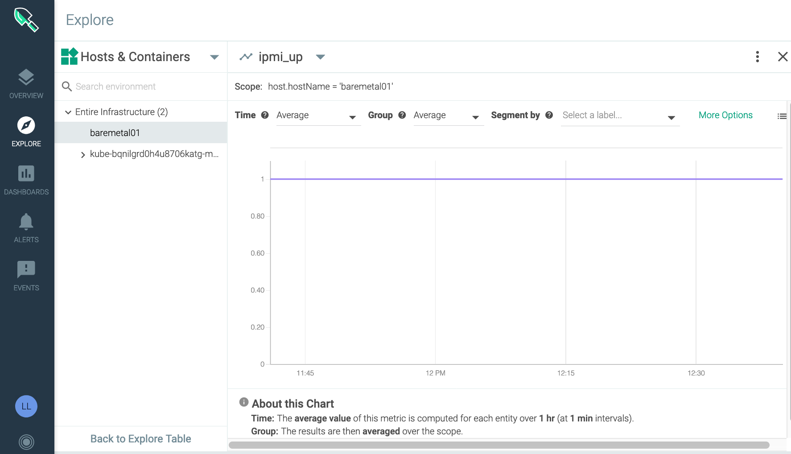

---

copyright:
  years:  2018, 2020
lastupdated: "2020-05-22"

keywords: Sysdig, IBM Cloud, monitoring, ubuntu, analyze metrics

subcollection: Monitoring-with-Sysdig

---

{:new_window: target="_blank"}
{:shortdesc: .shortdesc}
{:screen: .screen}
{:pre: .pre}
{:table: .aria-labeledby="caption"}
{:codeblock: .codeblock}
{:tip: .tip}
{:download: .download}
{:important: .important}
{:note: .note}


# Monitoring a Linux bare metal server
{: #baremetal_linux}

You can monitor a Bare Metal server with {{site.data.keyword.mon_full_notm}} by configuring a Sysdig agent in your server. The Sysdig agent uses an access key (token) to authenticate with the {{site.data.keyword.mon_full_notm}} instance. The Sysdig agent acts as a data collector. It automatically collects metrics. You view metrics via Sysdig's web-based user interface.
{:shortdesc}


## Before you begin
{: #baremetal_linux_prereqs}

1. [Read about {{site.data.keyword.mon_full_notm}}](/docs/Monitoring-with-Sysdig?topic=Monitoring-with-Sysdig-getting-started).

2. Install the {{site.data.keyword.cloud_notm}} CLI. For more information, see [Installing the {{site.data.keyword.cloud_notm}} CLI](/docs/cli?topic=cloud-cli-getting-started).

3. [Provision an {{site.data.keyword.mon_full_notm}} instance from the catalog](/docs/Monitoring-with-Sysdig?topic=Monitoring-with-Sysdig-provision#provision_ui).

4. [Provision a bare metal server](/docs/bare-metal?topic=bare-metal-getting-started). 

    To complete the steps in this topic, ensure you have internet access from the bare metal. This is needed for configuring the Sysdig agent.

5. Configure a VPN connection between your terminal and the bare metal server  

    Virtual Private Networking (VPN) access enables users to manage all servers remotely and securely over the {{site.data.keyword.cloud}} private network. A VPN connection from your location to the private network allows out-of-band management and server rescue through an encrypted VPN tunnel. VPN tunnels can be initiated to any IBM Cloud data center or PoP allowing you geographic redundancy. 

    Complete the following steps to configure a VPN connection between your terminal and the bare metal server:

    1. [Enable VPN access on each account that needs VPN access](/docs/iaas-vpn?topic=iaas-vpn-getting-started#enable-user-vpn-access).
    
    2. Depending on your operating system, download the latest `MotionPro` 32-bit or 64-bit files from the Array Networks [Clients and Tools](https://support.arraynetworks.net/prx/001/http/supportportal.arraynetworks.net/downloads/downloads.html) download site. [Learn more](/docs/iaas-vpn?topic=iaas-vpn-standalone-vpn-clients).
    
    3. Configure a standalone SSL VPN client and open a connection:

    For example, if you use the MotionPro Plus client for MacOS, to add a profile, click **Add**. 
    
    In the `Basic` section, enter a `Title`. Enter a `Gateway`, for example, for a bare metal in Dallas 10, enter `vpn.dal10.softlayer.com`. Enter your VPN user name. Check that the `Port` is set to `443`. Then, click **OK**.

    To open a secure connection, click **Login**.

6. Connect to a bare metal server by using SSH

    You may require a VPN to access your system depending on your security setup and `ssh` configuration on the bare metal host.

    You must `ssh` to the host by using your credentials, or the root credentials that are available from the {{site.data.keyword.cloud_notm}} Console.  
    
    You will require root permissions in order to install the Sysdig agent.

    For example, you can complete the following steps to get the bare metal information that you need to SSH into the server:

    1. [Log in to your {{site.data.keyword.cloud_notm}} account ](https://cloud.ibm.com/login){:new_window}.

    2. Click the **Menu** icon  &gt; **Classic Infrastructure** &gt; **Device List**.

    3. Identify the bare metal server that you want to monitor. Copy the **Public IP**.

    4. Click the bare metal server device name. 

    5. Select **Passwords**. Copy the password for the **root** user.

    Then, from a terminal, run the following command:

    ```
    ssh <USER_ID>@<IP_ADDRESS>
    ```
    {: pre}

    Where

    `<USER_ID>` is the user ID that you use to log in to the bare metal server. For example, use `root`.

    `<IP_ADDRESS>` is the public IP address of the bare metal server.

    For example, you can use the following ssh command: `root@45.123.122.12`


## Step 1. Configure a Sysdig agent to collect metrics from the bare metal server
{: #baremetal_linux_step1}

You must install a Sysdig agent to collect and forward metrics from a bare metal server to an {{site.data.keyword.mon_full_notm}} instance. 

Complete the following steps from the command line to install a Sysdig agent:

1. Obtain the Sysdig access key. For more information, see [Getting the access key through the {{site.data.keyword.cloud_notm}} UI](/docs/Monitoring-with-Sysdig?topic=Monitoring-with-Sysdig-access_key#access_key_ibm_cloud_ui).

2. Obtain the ingestion URL. For more information, see [Sysdig collector endpoints](/docs/Monitoring-with-Sysdig?topic=Monitoring-with-Sysdig-endpoints#endpoints_ingestion).

3. Deploy the Sysdig agent. Run the following command:

    ```
    curl -sL https://ibm.biz/install-sysdig-agent | sudo bash -s -- --access_key SYSDIG_ACCESS_KEY --collector COLLECTOR_ENDPOINT --collector_port 6443 --secure false --tags TAG_DATA --additional_conf 'sysdig_capture_enabled: false'
    ```
    {: pre}

    Where

    * SYSDIG_ACCESS_KEY is the ingestion key for the instance.

    * COLLECTOR_ENDPOINT is the ingestion URL for the region where the monitoring instance is available.

    * TAG_DATA are comma-separated tags that are formatted as *TAG_NAME:TAG_VALUE*. You can associate one or more tags to your Sysdig agent. For example, *role:serviceX,location:us-south*. Later on, you can use these tags to identify metrics from the environment where the agent is running.

    * Set **sysdig_capture_enabled** to *false* to disable the Sysdig capture feature. By default is set to *true*. For more information, see [Working with captures](/docs/Monitoring-with-Sysdig?topic=Monitoring-with-Sysdig-captures#captures).

    If `cURL` is not available, you must install it. For example, for an Ubuntu bare metal, run the following command: `sudo apt-get update`. Then, run the install command: `sudo apt-get install curl`.

    For example, see the following sample command to install a Sysdig agent that forwards metrics to a Sysdig instance in US South (Dallas):

    ```
    curl -sL https://ibm.biz/install-sysdig-agent | sudo bash -s -- -a xxxxxxxxxxxxx -c ingest.us-south.monitoring.cloud.ibm.com --collector_port 6443 --secure false -ac "sysdig_capture_enabled: false" --tags sourceType:baremetal,location:dallas
    ```
    {: screen}


## Step 2. Launch the Sysdig Web UI to verify that you are getting data to monitor the bare metal server
{: #baremetal_linux_step2}

Complete the following steps to launch the web UI:

1. [Log in to your {{site.data.keyword.cloud_notm}} account ](https://cloud.ibm.com/login){:new_window}.

	After you log in with your user ID and password, the {{site.data.keyword.cloud_notm}} console opens.

2. Click the **Menu** icon  &gt; **Observability**. 

3. Select **Monitoring**. 

    The list of instances that are available on {{site.data.keyword.cloud_notm}} is displayed.

4. Select your instance. Then, click **View Sysdig**.

The first time that you launch the Sysdig web UI, you might get a set of screens. Click **Next**, and **Complete Onboarding**.

If the Sysdig agent is configured successfully, in the **EXPLORE** view you can see your bare metal server in the **Hosts and Containers** section.


It may take some time before you see the bare metal entry while the information is initally collected and processed by the Sysdig agent.
{: note}

You only can monitor one instance per browser. You could have multiple tabs for the same instance.
{: tip}


## Step 3. [Optional] Configure the Prometheus IPMI Exporter to monitor sensor metrics
{: #baremetal_linux_step3}

In addition to the set of metrics that are automatically collected by the Sysdig agent, you might want to collect other metrics such as sensor metrics. You can use the `Prometheus IPMI Exporter` to perform the collection of Intelligent Platform Management Interface (IPMI) device sensor metrics from the bare metal server. For more information, see [Sysdig integration with Prometheus](https://docs.sysdig.com/en/integrate-prometheus-metrics.html){: new_window}. 

* The Prometheus IPMI Exporter exporter supports local IPMI devices and remote devices that can be accessed by using Remote Management Control Protocol (RMCP). 
* When you use RMCP to access remote devices, you can use an IPMI exporter to monitor multiple IPMI devices. You identify each device by passing the target hostname as a parameter. 
* The IPMI exporter relies on tools from the FreeIPMI suite.

You can collect the following metrics when you configure the IPMI exporter in a bare metal server:

* IPMI admin metrics

    The metric `ipmi_up {collector="<NAME>"}` reports `1` when data from a remote host is collected successfully. It reports `0` for collection of data in a local host. 
    
    The metric `ipmi_scrape_duration_seconds` reports the amount of time that it takes the collector to retrieve the data.

* IPMI System event log (SEL) metrics

    The metric `ipmi_sel_entries_count` reports the number of entries in the system event log. 

    The metric `ipmi_sel_free_space_bytes` reports the number of free bytes for new ystem event log entries.

* IPMI sensor data

    The IPMI exporter collects 2 metrics per sensor type: state and value. A value of `0` reports a normal state. A value of `1` reports a warning state. A value of `2` reports a critical state. A value of `NaN` reports information not available. For example, see the metrics for different sensors:

    Temperature sensor metrics: `ipmi_temperature_celsius`, `ipmi_temperature_state`
    
    Fan speed sensor metrics: `ipmi_fan_speed_rpm`, `ipmi_fan_speed_state`
    
    Voltage sensor metrics: `ipmi_voltage_state`, `ipmi_voltage_volts`

* IPMI chassis power state of the machine

    The metric `ipmi_chassis_power_state` informs about the current state of the chassis of the machine. It has a value of `1` when the power is on. It has a value of `0` when the power is off.

* DCMI data

    The metric `ipmi_dcmi_power_consumption_current_watts` informs about the live power consumption of the machine in Watts. 

* BMC details

    The metric ipmi_bmc_info includes information about the firmware revision and manufacturer in labels and has a value of `1`.

For more information, see [Prometheus IPMI Exporter ](https://github.com/soundcloud/ipmi_exporter){:new_window}.

 
Complete the following steps to configure the Prometheus IPMI Exporter:

### Step 3.1. Install the Prometheus IPMI exporter
{: #baremetal_linux_step3-1}

Complete the following steps:

1. From a local terminal,[download the Prometheus IPMI exporter ](https://github.com/soundcloud/ipmi_exporter){:new_window}.

2. In the bare metal server, from the `shh` session, create the directory `/usr/sysdig`. Run the following commands:

    ```
    cd /usr
    ```
    {: pre}

    ```
    mkdir sysdig
    ```
    {: pre}

3. Copy the file to the bare metal. From the directory where the file is available, run the following command:

    ```
    scp ipmi_exporter-v1.2.0.linux-amd64.tar.gz  root@<IP_ADDRESS>:/usr/sysdig/
    ```
    {: pre}

    Where `<IP_ADDRESS>` is the public IP address of the bare metal server.

    If the command fails, check that your VPN connection is still open.

4. In the bare metal server, from the `shh` session, uncompress the file. Run the following commands:

    ```
    cd /usr/sysdig/
    ```
    {: pre}

    ```
    tar -xvf ipmi_exporter-v1.2.0.linux-amd64.tar.gz 
    ```
    {: pre}

5. In the bare metal server, from the `shh` session, install the FreeIPMI suite. Run the following commands:

    ```
    sudo apt-get update
    ```
    {: pre}

    ```
    sudo apt-get install freeipmi
    ```
    {: pre}

6. In the bare metal server, from the `shh` session, check the `ipmi_local.yml` file. Optionally, you can update the file to exclude sensors that you do not want to monitor.

    Change to the directory where you have extracted the IPMI exporter:

    ```
    cd ipmi_exporter-v1.2.0.linux-amd64/
    ```
    {: pre}

    Check the configuration file. Run the command: `more ipmi_local.yml` You should see a file with similar content.

    ```yaml
    # Configuration file for ipmi_exporter

    # This is an example config for scraping the local host.
    # In most cases, this should work without using a config file at all.
    modules:
            default:
                    # Available collectors are bmc, ipmi, chassis, dcmi, and sel
                    collectors:
                    - bmc
                    - ipmi
                    - dcmi
                    - chassis
                    - sel
                    # Got any sensors you don't care about? Add them here.
                    exclude_sensor_ids:
                    # - 2
    ```
    {: codeblock}

7. In the bare metal server, from the `shh` session, run the IPMI exporter.

    ```
    ./ipmi_exporter --config.file=ipmi_local.yml &
    ```
    {: pre}

8. Check the IPMI exporter is running. Run the command:

    ```
    ps -aux | grep ipmi
    ```
    {: pre}
 
    You should see the IPMI exporter running.


### Step 3.2. Install the Prometheus exporter
{: #baremetal_linux_step3-2}

The Sysdig agent automatically collects metrics from Prometheus exporters. Therefore, to collect metrics from your IPMI exporter, you must also configure the Prometheus exporter.

Complete the following steps to run the Prometheus exporter:

1. From a local terminal,[download the Prometheus exporter ](https://github.com/martinlindhe/wmi_exporter/releases){:new_window}.

2. In the bare metal server, from the `shh` session, change to the directory `/usr/sysdig/`. Run the following command:

    ```
    cd /usr/sysdig/
    ```
    {: pre}

3. Copy the file to the bare metal. From the directory where the file is available, run the following command:

    ```
    scp prometheus-2.18.1.linux-amd64.tar.gz root@<IP_ADDRESS>:/usr/sysdig/
    ```
    {: pre}

    Where `<IP_ADDRESS>` is the public IP address of the bare metal server.

    If the command fails, check that your VPN connection is still open.

4. In the bare metal server, from the `shh` session, uncompress the file. Run the following commands:

    ```
    cd /usr/sysdig/
    ```
    {: pre}

    ```
    tar -xvf prometheus-2.18.1.linux-amd64.tar.gz
    ```
    {: pre}

4. Modify the `prometheus.yml` file to include information about the scrape_configuration for the IPMI exporter.

    Change to the Prometheus directory:

    ```
    cd prometheus-2.18.1.linux-amd64/
    ```
    {: pre}

    Edit the `prometheus.yml` file and add the section **scrape_configs**:

    ```yaml
    # my global config
    global:
      scrape_interval:     15s # Set the scrape interval to every 15 seconds. Default is every 1 minute.
      evaluation_interval: 15s # Evaluate rules every 15 seconds. The default is every 1 minute.
      # scrape_timeout is set to the global default (10s).

    # Alertmanager configuration
    alerting:
      alertmanagers:
      - static_configs:
        - targets:
          # - alertmanager:9093

    # Load rules once and periodically evaluate them according to the global 'evaluation_interval'.
    rule_files:
      # - "first_rules.yml"
      # - "second_rules.yml"

    # A scrape configuration containing exactly one endpoint to scrape:
    # Here it's Prometheus itself.
    scrape_configs:
      # The job name is added as a label `job=<job_name>` to any timeseries scraped from this config.
      - job_name: ipmi

        metrics_path: '/metrics'
        scheme: http

        static_configs:
        - targets: ['localhost:9290']
          labels:
            instance: baremetal01
            region: us-south
    ```
    {: codeblock}

5. Run the Prometheus exporter:

    ```
    ./prometheus &
    ```
    {: pre}
    


### Step 3.3. Configure network settings
{: #baremetal_linux_step3-3}

If you want to collect metrics from remote servers, complete the following steps:

1. Enable the firewall to allow access to the `ipmi_exporter`.

2. [Optional] Update the VPC rules

    If you use private endpoints, add an inbound rule to the security group for port `9290` with `source type = Security Group` and choose the security group for the bare metal server.


### Step 3.4. Update the Sysdig agent that is running in the bare metal server
{: #baremetal_linux_step3-4}
    
Complete the following steps:

1. In the bare metal server, from the `shh` session, change to the directory `/opt/draios/etc/`. Run the following command:

    ```
    cd /opt/draios/etc/
    ```
    {: pre}

2. Update the `/opt/draios/etc/dragent.yaml` to [enable remote scraping ](https://docs.sysdig.com/en/collecting-prometheus-metrics-from-remote-hosts.html){:new_window}. 

    Append the following section to the `dragent.yaml` file:

    ```yaml
    prometheus:
     enabled: true
     interval: 30
     log_errors: true
     max_metrics: 3000
     max_metrics_per_process: 3000
     max_tags_per_metric: 20
     process_filter:
       - include:
           port: 9090 
           conf:
             port: 9090 
             path: "/metrics"
       - include:
           port: 9290 
           conf:
             port: 9290 
             path: "/metrics"
    ```
    {: codeblock}

3. Restart the Sysdig agent. Run the following command:

    ```
    service dragent restart
    ```
    {: pre}


## Step 4. Verify that you can see the prometheus ipmi metrics
{: #baremetal_linux_step4}

Cpmplete the following steps:

1. Click the **Menu** icon  &gt; **Observability**. 

2. Select **Monitoring**. 

3. Identify the monitoring instance that you created. Then, click **Launch Sysdig**.

4. In the `Explore` view, select **Hosts and Containers**. Then, select the bare metal server that you want to monitor.

    

5. Select **Overview by Process**. Then, enter in the search bar **ipmi**. The list of IPMI metrics is displayed.

    


## Step 5. Configure a dashboard to analyze the IPMI status of your Bare metal
{: #baremetal_linux_step5}

To create a dashboard to monitor the IPMI metrics, complete the following steps:

1. Select the `ipmi_up` metric.

    

2. Select the 3 dots icon. Then, select **Copy to dashboard**.

    

3. Enter the name **[Bare Metal] IPMI monitoring**. Then, click **Copy and Open**.

    

    The dashboard opens.

    

4. Add more IPMI metrics to the **[Bare Metal] IPMI monitoring** custom dashboard. Repeat the steps for each of the IPMI metrics that you want to monitor.

5. Drag and drop, and resize panels to get the dashboard layout that you want. Save the layout.


