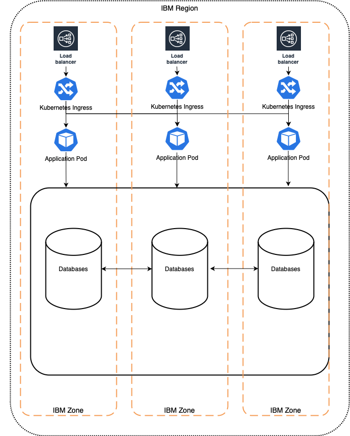

---

copyright:
  years:  2018, 2025
lastupdated: "2025-07-24"

keywords: HA for IBM Cloud Monitoring, DR for IBM Cloud Monitoring, IBM Cloud Monitoring recovery time objective, IBM Cloud Monitoring recovery point objective

subcollection: monitoring

---

{{site.data.keyword.attribute-definition-list}}

# Understanding high availability and disaster recovery for {{site.data.keyword.mon_full_notm}}
{: #monitoring-ha-dr}

[High availability](#x2284708){: term} (HA) is the ability for a service to remain operational and accessible in the presence of unexpected failures. [Disaster recovery](#x2113280){: term} is the process of recovering the service instance to a working state.
{: shortdesc}

{{site.data.keyword.mon_full}} is a highly available, multi-tenant, regional service for monitoring your applications, platform resources and infrastructure.

You can find the available region and data center locations in the [Regions for {{site.data.keyword.mon_full_notm}}](/docs/monitoring?topic=monitoring-regions) documentation. As a regional service, {{site.data.keyword.mon_full_notm}} fulfills the defined [Service Level Objectives (SLO)](/docs/resiliency?topic=resiliency-slo) with the Graduated Tier plan. The SLO is not a warranty and IBM will not issue credits for failure to meet an objective.

## High availability architecture
{: #ha-architecture}

{: caption="High availability architecture" caption-side="bottom"}

## Availability zones
{: #ha-dr-locations}

An availability zone is a logically and physically isolated location within an {{site.data.keyword.cloud_notm}} region where your data is processed and hosted.
* An availability zone has independent power, cooling, and network infrastructures that are isolated from other zones to strengthen fault tolerance by avoiding single points of failure between zones.
* An availability zone offers high bandwidth and low inter-zone latency within a region.

A region (location) is a geographically and physically separate group of one or more availability zones with independent electrical and network infrastructures isolated from other regions.
* Regions are designed to remove shared single points of failure with other regions and guarantee low inter-zone latency within the region.
* Each region has 3 different data centers (DC) for redundancy.

The following table lists the high-availability (HA) status for the regions (locations) where the {{site.data.keyword.mon_full_notm}} service is available:

| Geography             | Region                   | HA Status |
|-----------------------|--------------------------|-----------|
| `Asia Pacific`        | Sydney (`au-syd`)        | `MZR`     |
| `Asia Pacific`        | Tokyo (`jp-tok`)         | `MZR`     |
| `Asia Pacific`        | Osaka (`jp-osa`)         | `MZR`     |
| `Europe`              | Frankfurt (`eu-de`)      | `MZR`     |
| `Europe`              | London (`eu-gb`)         | `MZR`     |
| `Europe`              | Madrid (`eu-es`)         | `MZR`     |
| `North America`       | Dallas (`us-south`)      | `MZR`     |
| `North America`       | Washington (`us-east`)   | `MZR`     |
| `North America`       | Toronto (`ca-tor`)       | `MZR`     |
| `South America`       | São-Paulo (`br-sao`)     | `MZR`     |
{: caption="List of locations where the service is available" caption-side="top"}

Where
* A *geography* is a geographic area or larger political body that contains one or more regions.
* A *region* is a defined geographic territory.

    A region could be a specific postal code area, a town, a city, a state, a group of states, or even a group of countries.

    A region contains [multiple availability zones](https://www.ibm.com/solutions/cloud-data-centers){: external} to meet local access, low latency, and security requirements for the region.

* `N/A` means feature that is not applicable to that geography.
* `MZR` means multi-zone region. [Learn more](/docs/overview?topic=overview-locations#table-mzr).

## Availability of a {{site.data.keyword.mon_short}} instance
{: #ha-dr-region}

When you provision a {{site.data.keyword.mon_short}} instance, you select the MZR (location) where the instance is created. The region determines where the monitoring data is processed and the data is hosted.

A multizone region (MZR) consist of 3 or more availability zones that are independent from each other to ensure that single failure events affect only a single zone.

By default, each monitoring instance consist of 3 zones, one primary zone and two secondary zones:
* Each zone is located in a different data center in the region.
* The data in your primary zone is automatically replicated to the secondary zones with low latency. You don't need to do anything to enable the replication.
* When the primary zone fails, a secondary zone is elected as the primary to prevent your service instance from being affected.
* If 2 zones fail at the same time, the service is unavailable.

The MZR architecture offers automatic failover between 2 zones, and high availability for a {{site.data.keyword.mon_short}} instance withing a region.

### High availability features
{: #ha-features}

{{site.data.keyword.mon_full_notm}} supports the following high availability features:

| Feature | Description |
| -------------- | -------------- |
| Multi-zone region deployment | {{site.data.keyword.mon_full_notm}} is deployed into multi-zone regions (MZRs), and within a MZR, the data plane spans all three zones, ensuring that the loss of a zone does not impact service availability. |
| Platform metric replication across zones | Metrics ingested into {{site.data.keyword.mon_full_notm}} are replicated across three zones within MZRs. |
| Liveness / readiness monitoring | All microservices are monitored via Kubernetes liveness and readiness probes. |
{: caption="HA features for {{site.data.keyword.mon_full_notm}}" caption-side="bottom"}

## Disaster recovery architecture
{: #disaster-recovery-intro}

Single zone failure: {{site.data.keyword.mon_full_notm}} is HA and can continue to function through any single zone or machine failure.

Regional failure: {{site.data.keyword.mon_full_notm}} is a platform service. There is no automatic cross-regional failover or cross-regional disaster recovery. If all of the availability zones in a region fail, {{site.data.keyword.mon_full_notm}} becomes unavailable in that region.

Database backup and restore: {{site.data.keyword.mon_full_notm}} databases are backed up periodically and in a disaster recovery scenario a point-in-time recovery can be created to restore the data.

### Disaster recovery features
{: #dr-features}

{{site.data.keyword.mon_full_notm}} supports the following disaster recovery features:

| Feature | Description | Consideration |
| -------------- | -------------- | -------------- |
| Multiple configurable destinations | Details can be found for customers to connect to [available regions](/docs/monitoring?topic=monitoring-endpoints) | Configuration must be implemented by the customer. |
{: caption="DR features for {{site.data.keyword.mon_full_notm}}" caption-side="bottom"}

### Planning for DR
{: #features-for-disaster-recovery}

The DR steps must be practiced regularly. As you build your plan, consider the following failure scenarios and resolutions.

| Failure | Resolution |
| -------------- | -------------- |
| Hardware failure (single point) | IBM provides a database that is resilient from single point of hardware failure within a zone - no configuration required. |
| Zone failure | No configuration required |
| Data corruption | IBM runs frequent backups of the databases and in the event of data corruption the {{site.data.keyword.mon_full_notm}} service will attempt to restore using a point-in-time backup from the regional database. |
| Regional failure | Follow the steps under [Your responsibilities for HA and DR](#feature-responsibilities). |
{: caption="DR scenarios for {{site.data.keyword.mon_full_notm}}" caption-side="bottom"}

## Your responsibilities for HA and DR
{: #feature-responsibilities}

Disaster recovery is about surviving a catastrophic failure or loss of availability in a single location.

{{site.data.keyword.mon_full_notm}} follows {{site.data.keyword.cloud_notm}} requirements for [planning and recovering from disaster events](/docs/resiliency?topic=resiliency-PlanningforDR).

If a regional disaster occurs, consider the following information:
* The estimated recovery time for rebuilding the regional site and restoring the service at another location is 24 hours.
* You will have to update the endpoints of applications and monitoring agents to point to the ingestion endpoint in the new location.
* You will have to restore the service instance's metadata, that is, dashboards and alerts definitions, from your backups.

Historical data may be lost during a disaster. If you require historical metrics for auditing purposes, backup the metrics regularly by querying the metrics from the service and storing them at a remote backup site. For more information, see [Extracting metrics from a {{site.data.keyword.mon_short}} instance by using the API](/docs/monitoring?topic=monitoring-metrics_api).
{: note}

### Manual recovery of the service
{: #dr-rebuilt}

If a regional disaster occurs, the recovery time of the service depends on the recovery time for the region. To minimize the downtime of the service and impact to your business, you could implement a manual failover to switch to another region while the region is being restored. To reduce the time to get up and running in a new location, consider using access groups to manage permissions working with the service, and backup the monitoring metadata of each instance. You should backup your alerts, notifications, dashboards and team definitions on a regular basis.

#### How to continue working while a DR site is rebuilt?
{: #dr-continue-ops}

If the applications and services that you are monitoring through a monitoring instance are all co-located in the same region, then you must wait for the region to be available again for business.

If you have deployed monitoring agents on your systems, and those systems are not impacted by the regional failure, you may choose to redirect metrics to other instances of monitoring in a different region. To redirect metric data, complete the following steps:
1. [Provision a monitoring instance](/docs/monitoring?topic=monitoring-provision)
2. Reconfigure the monitoring agent of each system: Change the access key and ingestion endpoints in the agent configuration.
3. Define IAM permissions to work with the new monitoring instance.

    Using access groups to manage permissions to work with a monitoring instance, reduces the amount of work that you might have to do to set the correct policies and users to work with a new instance. Information about access groups is global and not region based.
    {: tip}

4. Launch the monitoring instance and import the alerts, notifications, teams, and dashboards to monitor your applications and systems.

To find out more about responsibility ownership between you and {{site.data.keyword.cloud_notm}} for using {{site.data.keyword.mon_full_notm}}, see [Understanding your responsibilities when using {{site.data.keyword.mon_full_notm}}](/docs/monitoring?topic=monitoring-shared-responsibilities).

## Recovery time objective (RTO) and recovery point objective (RPO)
{: #rto-rpo-features}

The following table indicates the estimated recovery times in the event of a DR situation:

| Recovery objective for DR | Estimated time |
|---------------------------|----------------|
| Maximum Tolerable Downtime (MTD) / Recovery Time Objective (RTO)  | Up to 24 hours |
| Recovery Point Objective (RPO) | Up to 24 hours |
{: caption="Recovery objectives for DR" caption-side="top"}

## Change management
{: #change-management}

Change management includes tasks such as upgrades, configuration changes, and deletion.

It is recommended that you grant users and processes the IAM roles and actions with the least privilege required for their work. See [How can I prevent accidental deletion of services?](/docs/resiliency?topic=resiliency-dr-faq#prevent-accidental-deletion).

You should backup your alerts, notifications, dashboards and team definitions on a regular basis. Consider creating a manual backup before upgrading to a new version of {{site.data.keyword.mon_full_notm}}.

## How {{site.data.keyword.IBM}} supports disaster recovery planning
{: #ibm-disaster-recovery}

{{site.data.keyword.IBM}} takes specific recovery actions in the case of a disaster.

* IBM conducts annual tests of various disaster scenarios and continuously refines our recovery documentation based on findings that are found during these tests. 

* 24 × 7 global support is available to customers with IBM® Subject Matter Experts who are on call to help in the case of a disaster.

* All IBM Subject Matter Experts are trained annually on business continuity and disaster recovery policies and procedures to ensure preparedness in the event of a disaster.

* A multizone region (MZR) consists of 3 or more availability zones that are independent from each other to ensure that single failure metrics affect only a single zone.

By default, {{site.data.keyword.mon_full_notm}} is deployed across 3 zones. Each zone is set up with active/active/active:

* Each zone is located in a different data center in the region.
* The platform metrics in each zone are automatically replicated to the other zones with low latency. You don't need to do anything to enable the replication.
* The service is designed to withstand a single zone failure with no interruption.
* The MZR architecture offers automatic failover between zones within the region, and high availability for an instance within a region.
* {{site.data.keyword.mon_full_notm}} data is backed up periodically and can be restored using a point-in-time recovery in case of a disaster.

### How {{site.data.keyword.IBM_notm}} recovers from zone failures
{: #ibm-zone-failure}

In case of zone failure, IBM Cloud will resolve the zone outage. Since the service spans across all three zones in a region, there will be no impact to service availability within a MZR. Upon zone recovery, events and API requests will resume sending to the restored zone. There will be no need for customer action at this time.

### How {{site.data.keyword.IBM_notm}} recovers from regional failures
{: #ibm-regional-failure}

When a region is restored after a failure, {{site.data.keyword.IBM_notm}} will attempt to restore the service instance from the regional state resulting in no loss of data and with the same connection strings.

If regional state is corrupted, the service is restored to the state of the last internal backup.  All data associated with the service is backed up once daily by the service. There is a potential for 24-hour’s worth of data loss. When a service is recovered from backups with the same connection strings. For customer data including dashboards, alerts and notifications, the customer is responsible for restoring the data.

If {{site.data.keyword.IBM_notm}} can’t restore the service instance, the customer must restore or redirect as described in [Manual recovery of the service](/docs/monitoring?topic=monitoring-monitoring-ha-dr#dr-rebuilt).

## How {{site.data.keyword.IBM_notm}} maintains services
{: #ibm-service-maintenance}

All upgrades follow the {{site.data.keyword.IBM_notm}} service best practices and have a recovery plan and rollback process in-place. Regular upgrades for new features and maintenance occur as part of normal operations. Such maintenance can occasionally cause short interruption intervals that are handled by [client availability retry logic](/docs/resiliency?topic=resiliency-high-availability-design#client-retry-logic-for-ha). Changes are rolled out sequentially, region by region and zone by zone within a region. Updates are backed out at the first sign of a defect.

* Complex changes are enabled and disabled with feature flags to control exposure.

* Changes that impact customer workloads are detailed in notifications. For more information, see [monitoring notifications and status](/docs/account?topic=account-viewing-cloud-status) for planned maintenance, announcements, and release notes that impact this service.
