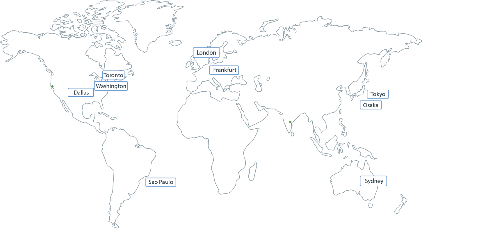

---

copyright:
  years:  2018, 2020
lastupdated: "2020-01-29"

keywords: Sysdig, IBM Cloud, monitoring, regions, endpoints

subcollection: Sysdig

---

{:new_window: target="_blank"}
{:shortdesc: .shortdesc}
{:screen: .screen}
{:pre: .pre}
{:table: .aria-labeledby="caption"}
{:codeblock: .codeblock}
{:tip: .tip}
{:download: .download}
{:important: .important}
{:note: .note}

# Regions and endpoints
{: #endpoints}

A list of supported regions and public and private endpoints for the {{site.data.keyword.mon_full_notm}} service.
{:shortdesc}

## Regions
{: #endpoints_regions}

The {{site.data.keyword.mon_full_notm}} service is available in the following regions:

{: caption="Figure 1. Displays the regions where you can create and manage {{site.data.keyword.mon_full_notm}} resources." caption-side="bottom"}

You can create {{site.data.keyword.mon_full_notm}} resources in one of the supported {{site.data.keyword.cloud_notm}} locations, which represent the geographic area where your {{site.data.keyword.mon_full_notm}} requests are handled and processed. 

The following table lists the locations where the service is available:

| Geography             | Region                   | EU-Supported | HA Status |
|-----------------------|--------------------------|--------------|-----------|
| `Asia Pacific`        | `Sydney (au-syd)`        | `N/A`        | `MZR`     |
| `Asia Pacific`        | `Tokyo (jp-tok)`         | `N/A`        | `MZR`     |
| `Europe`              | `Frankfurt (eu-de) (*)`  | `YES`        | `MZR`     |
| `Europe`              | `London (eu-gb)`         | `NO`         | `MZR`     |
| `North America`       | `Dallas (us-south)`      | `N/A`        | `MZR`     |
| `North America`       | `Washington (us-east)`   | `N/A`        | `MZR`     |
{: caption="Table 1. List of locations where the service is available" caption-side="top"} 

Where
* A *geography* is a geographic area or larger political body that contains one or more regions.
* A *region* is a defined geographic territory. A region could be a specific postal code area, a town, a city, a state, a group of states, or even a group of countries. 
* `N/A` means feature that is not applicable to that geography.

`(*)` For more information, see [Enabling the EU Supported setting](/docs/account?topic=account-eu-hipaa-supported#bill_eusupported).

## Sysdig Collector endpoints
{: #endpoints_ingestion}

**Sysdig Collector** endpoints are ingestion endpoints that you can use to send data.

The following table lists the **Sysdig Collector endpoints** that are available per region:

| Region        | Public Endpoint                                 | Private Endpoint                                      | Port     |
|---------------|-------------------------------------------------|-------------------------------------------------------|----------|
| `US South`    | `ingest.us-south.monitoring.cloud.ibm.com`      | `ingest.private.us-south.monitoring.cloud.ibm.com`    | TCP 6443 |
| `EU DE`       | `ingest.eu-de.monitoring.cloud.ibm.com`         | `ingest.private.eu-de.monitoring.cloud.ibm.com`       | TCP 6443 |
| `EU GB`       | `ingest.eu-gb.monitoring.cloud.ibm.com`         | `ingest.private.eu-gb.monitoring.cloud.ibm.com`       | TCP 6443 |
| `JP TOK`      | `ingest.jp-tok.monitoring.cloud.ibm.com`        | `ingest.private.jp-tok.monitoring.cloud.ibm.com`      | TCP 6443 |
| `US East`     | `ingest.us-east.monitoring.cloud.ibm.com`       | `ingest.private.us-east.monitoring.cloud.ibm.com`     | TCP 6443 |
| `AU SYD`      | `ingest.au-syd.monitoring.cloud.ibm.com`        | `ingest.private.au-syd.monitoring.cloud.ibm.com`      | TCP 6443 |
{: caption="Table 2. List of ingestion endpoints" caption-side="top"} 

To send metrics by using a private endpoint, you must [enable virtual routing and forwarding (VRF)](/docs/account?topic=account-vrf-service-endpoint) for your account. 
{: note}

## Sysdig endpoints
{: #endpoints_sysdig}

The following table lists the **Sysdig endpoints** that are available per region:

| Region       | Endpoint                                                  | Port            |
|--------------|-----------------------------------------------------------|-----------------|
| `US South`   | `https://us-south.monitoring.cloud.ibm.com`               | HTTPS (TLS) 443 |  
| `EU DE`      | `https://eu-de.monitoring.cloud.ibm.com `                 | HTTPS (TLS) 443 |
| `EU GB`      | `https://eu-gb.monitoring.cloud.ibm.com `                 | HTTPS (TLS) 443 |
| `JP TOK`     | `https://jp-tok.monitoring.cloud.ibm.com`                 | HTTPS (TLS) 443 |
| `US East`    | `https://us-east.monitoring.cloud.ibm.com`                | HTTPS (TLS) 443 |
| `AU SYD`     | `https://au-syd.monitoring.cloud.ibm.com`                 | HTTPS (TLS) 443 |
{: caption="Table 3. List of Sysdig endpoints" caption-side="top"} 

