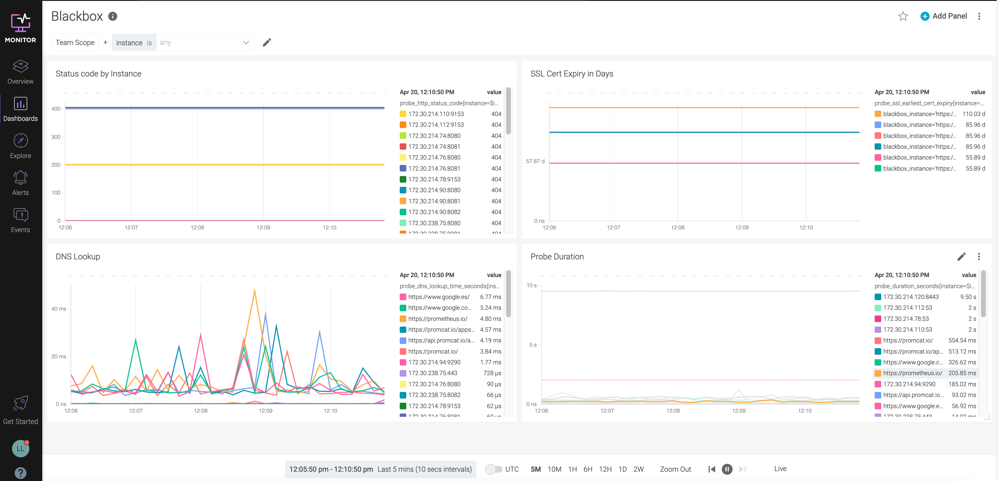

---

copyright:
  years:  2018, 2023
lastupdated: "2021-03-28"

keywords: IBM Cloud, monitoring, backbox, prometheus

subcollection: monitoring

content-type: tutorial
services: monitoring
account-plan: lite
completion-time: 1h

---

{{site.data.keyword.attribute-definition-list}}

# Collecting availability metrics by using the Prometheus Blackbox exporter
{: #blackbox}
{: toc-content-type="tutorial"}
{: toc-services="monitoring"}
{: toc-completion-time="1h"}

The Prometheus Blackbox exporter allows blackbox probing of endpoints over HTTP, HTTPS, DNS, TCP and ICMP. The monitoring agent can be used in conjunction with the Blackbox exporter to collect availability metrics. The availability metrics can then be alerted upon within {{site.data.keyword.mon_full_notm}} to alert users on the availability of the endpoints.
{: shortdesc}


Complete the following steps to configure the Prometheus Blackbox Exporter:


## Configure a monitoring agent to collect metrics
{: #blackbox_step1}
{: step}

To monitor 1 or more hosts, you must configure a monitoring agent. The agent collects automatically a set of metrics that you can monitor through the monitoring UI.

See [Install a monitoring agent to collect and forward metrics from a server to an {{site.data.keyword.mon_full_notm}} instance](/docs/monitoring?topic=monitoring-config_agent) and choose the monitoring agent that you want to configure to monitor a host.


## Install the Prometheus Blackbox exporter
{: #blackbox_step2}
{: step}

Complete the following steps to run the Blackbox exporter as a docker container:

1. Download the [blackbox.yml file](https://github.com/prometheus/blackbox_exporter/blob/master/blackbox.yml){: external} from Github.

    Save the file to the directory `/config/prometheus/blackbox/`.

2. Run the Blackbox exporter as a docker container:

    ```text
    docker run --rm -d -p 9115:9115 -l io.prometheus.scrape=true -l io.prometheus.port=9115 -l io.prometheus.path=/probe --name blackbox_exporter -v `pwd`:/config/prometheus/blackbox prom/blackbox-exporter:master --config.file=/config/prometheus/blackbox/blackbox.yml
    ```
    {: pre}

3. Check the exporter is up. Run the following command:

    ```text
    docker container ls
    ```
    {: pre}

    You can see an output like the following one:

    ```text
    CONTAINER ID        IMAGE                           COMMAND                  CREATED             STATUS              PORTS                    NAMES
    2480a0034bb4        prom/blackbox-exporter:master   "/bin/blackbox_expor…"   36 minutes ago      Up 36 minutes       0.0.0.0:9115->9115/tcp   blackbox_exporter
    ```
    {: screen}

    To stop the blackbox container, run the following command: `docker container stop 2480a0034bb4`.


## Configure network settings
{: #Blackbox_step3}
{: step}

If you want to collect metrics from remote servers, complete the following steps:

1. Enable the firewall to allow access to the `blackbox_exporter`.

2. [Optional] Update the VPC rules

    If you use private endpoints, add an inbound rule to the security group for port `9115` with `source type = Security Group` and choose the security group for the server.


## Update the monitoring agent that is running in the server
{: #Blackbox_step4}
{: step}

Run the following command to edit the configmap and add information about the Blackbox targets that you want to monitor by using the Kubernetes monitoring agent:

```text
kubectl edit configmap sysdig-agent -n ibm-observe
```
{: pre}

```yaml
log:
  file_priority: error
configmap: true
### Agent tags
# tags: linux:ubuntu,dept:dev,local:nyc

#### Monitoring Software related config ####

# Monitoring collector address
# collector: 192.168.1.1

# Collector TCP port
# collector_port: 6666

# Whether collector accepts ssl
# ssl: true

# collector certificate validation
# ssl_verify_certificate: true

#######################################
# new_k8s: true
# k8s_cluster_name: production
security:
  k8s_audit_server_url: 0.0.0.0
  k8s_audit_server_port: 7765
k8s_cluster_name: <CLUSTER_NAME>/<CLUSTER_ID>
tags: ibm.containers-kubernetes.cluster.id:<CLUSTER_ID>
collector: <INGESTION_ENDPOINT>
collector_port: 6443
ssl: true
ssl_verify_certificate: true
sysdig_capture_enabled: false
promscrape_fastproto: true
use_promscrape: true
prometheus:
  enabled: true
  prom_service_discovery: true
  log_errors: true
  max_metrics: 200000
  max_metrics_per_process: 200000
  max_tags_per_metric: 100
  ingest_raw: true
  ingest_calculated: false
prometheus.yaml:
----
global:
  scrape_interval: 10s
scrape_configs:
- job_name: blackbox
  metrics_path: /probe
  params:
    module: [http_2xx]
  static_configs:
  - targets:
    - https://prometheus.io/
    - https://promcat.io/
    - https://api.promcat.io/apps
    - https://www.google.com/search?q=promcat
    - https://promcat.io/apps/harbor
    - https://www.ibm.com/software/passportadvantage
  relabel_configs:
  - source_labels: [__address__]
    target_label: __param_target
  - source_labels: [__param_target]
    target_label: instance
  - source_labels: [__param_target]
    target_label: blackbox_instance
  - target_label: __address__
    replacement: blackbox-exporter.ibm-observe:9115
```
{: codeblock}

Where

* `<IP_ADDRESS_OF_REMOTE_SERVER>` is the IP address of a server that you want to monitor.
* `<INGESTION_ENDPOINT>` is the {{site.data.keyword.mon_full_notm}} instance ingestion endpoint, for example, `ingest.us-south.monitoring.cloud.ibm.com`. See [Collector endpoints](/docs/monitoring?topic=monitoring-endpoints#endpoints_ingestion).


When you save the file, changes are applied.


## Configure the default dashboard and alerts to analyze the Blackbox status of your server
{: #Blackbox_step5}
{: step}

Complete the following steps:

1. [Launch the monitoring UI](/docs/monitoring?topic=monitoring-launch).

2. Create a dashboard.

3. Add a panel for each of the following queries:


| Metric    | Query     | Options |
|-----------|-----------|----------|
| Status code by Instance | `probe_http_status_code{instance=$instance}` | `number (auto)` |
| SSL Cert Expiry in Days | `probe_ssl_earliest_cert_expiry{instance=$instance}-time()` | `time (auto)` |
| DNS Lookup | `probe_dns_lookup_time_seconds{instance=$instance}` | `time (auto)` |
| Probe duration | `probe_duration_seconds{instance=$instance}` | `time (auto)` |
{: caption="Table 1. Blackbox exporter sample queries" caption-side="top"}

For example, you can create a dashboard that looks as follows:

{: caption="Figure 1. Sample Blackbox dashboard" caption-side="bottom"}
