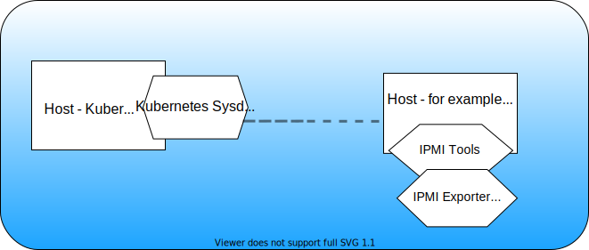
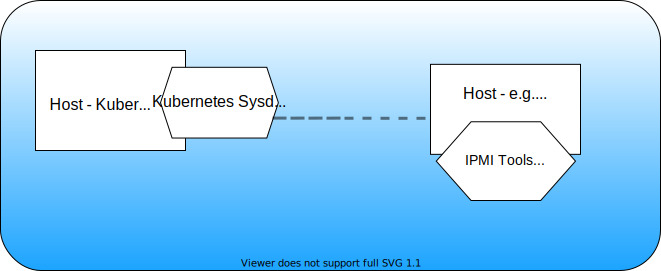

---

copyright:
  years:  2018, 2021
lastupdated: "2021-03-28"

keywords: IBM Cloud, monitoring, ubuntu, analyze metrics

subcollection: Monitoring-with-Sysdig

---

{:new_window: target="_blank"}
{:shortdesc: .shortdesc}
{:screen: .screen}
{:pre: .pre}
{:table: .aria-labeledby="caption"}
{:codeblock: .codeblock}
{:tip: .tip}
{:download: .download}
{:important: .important}
{:note: .note}
{:external: target="_blank" .external}

# Configuring the Prometheus IPMI Exporter to monitor IPMI metrics
{: #ipmi}

In addition to the set of metrics that are automatically collected by the monitoring agent, you might want to collect other metrics such as sensor metrics. You can use the `Prometheus IPMI Exporter` to perform the collection of Intelligent Platform Management Interface (IPMI) device sensor metrics. 
{:shortdesc}

* The Prometheus IPMI Exporter exporter supports local IPMI devices and remote devices that can be accessed by using Remote Management Control Protocol (RMCP). 
* When you use RMCP to access remote devices, you can use an IPMI exporter to monitor multiple IPMI devices. You identify each device by passing the target hostname as a parameter. 
* The IPMI exporter relies on tools from the FreeIPMI suite.

The following figures shows different configurations that you can use to monitor sensor metrics from hosts that can be available in IBM Cloud or outside the IBM Cloud:






You can collect the following metrics when you configure the IPMI exporter in a server:

* IPMI admin metrics

    The metric `ipmi_up {collector="<NAME>"}` reports `1` when data from a remote host is collected successfully. It reports `0` for collection of data in a local host. 
    
    The metric `ipmi_scrape_duration_seconds` reports the amount of time that it takes the collector to retrieve the data.

* IPMI System event log (SEL) metrics

    The metric `ipmi_sel_entries_count` reports the number of entries in the system event log. 

    The metric `ipmi_sel_free_space_bytes` reports the number of free bytes for new ystem event log entries.

* IPMI sensor data

    The IPMI exporter collects 2 metrics per sensor type: state and value. A value of `0` reports a normal state. A value of `1` reports a warning state. A value of `2` reports a critical state. A value of `NaN` reports information not available. For example, see the metrics for different sensors:

    Temperature sensor metrics: `ipmi_temperature_celsius`, `ipmi_temperature_state`
    
    Fan speed sensor metrics: `ipmi_fan_speed_rpm`, `ipmi_fan_speed_state`
    
    Voltage sensor metrics: `ipmi_voltage_state`, `ipmi_voltage_volts`

* IPMI chassis power state of the machine

    The metric `ipmi_chassis_power_state` informs about the current state of the chassis of the machine. It has a value of `1` when the power is on. It has a value of `0` when the power is off.

* DCMI data

    The metric `ipmi_dcmi_power_consumption_current_watts` informs about the live power consumption of the machine in Watts. 

* BMC details

    The metric ipmi_bmc_info includes information about the firmware revision and manufacturer in labels and has a value of `1`.

For more information, see [Prometheus IPMI Exporter](https://github.com/soundcloud/ipmi_exporter){: external}.


Complete the following steps to configure a monitoring agent to collect IPMI metrics from 1 or more hosts:


## Step 1. Configure a monitoring agent
{: #ipmi_step1}

To monitor 1 or more hosts, you must configure a monitoring agent. The agent collects automatically a set of metrics that you can monitor through the monitoring UI.

See [Install a monitoring agent to collect and forward metrics from a server to an {{site.data.keyword.mon_full_notm}} instance](/docs/Monitoring-with-Sysdig?topic=Monitoring-with-Sysdig-config_agent) and choose the monitoring agent that you want to configure to monitor a host.


## Step 2. Configuring the Prometheus IPMI Exporter
{: #ipmi_step2}

You can install the IPMI exporer in 1 or more hosts to collect IPMI metrics.
{: note}

For each host that you want to collect IPMI metrics, complete the following steps to install the IPMI exporter. For example, complete the following steps for a Linux-based host:

1. From a local terminal,[download the Prometheus IPMI exporter](https://github.com/soundcloud/ipmi_exporter){: external}.

2. In the server, from the `ssh` session, create the directory `/usr/sysdig`. Run the following commands:

    ```
    cd /usr
    ```
    {: pre}

    ```
    mkdir sysdig
    ```
    {: pre}

3. Copy the file to the server. From the directory where the file is available, run the following command:

    ```
    scp ipmi_exporter-v1.2.0.linux-amd64.tar.gz  root@<IP_ADDRESS>:/usr/sysdig/
    ```
    {: pre}

    Where `<IP_ADDRESS>` is the public IP address of the server.

    If the command fails, check that your VPN connection is still open.

4. Uncompress the file. Run the following commands:

    ```
    cd /usr/sysdig/
    ```
    {: pre}

    ```
    tar -xvf ipmi_exporter-v1.2.0.linux-amd64.tar.gz 
    ```
    {: pre}

5. Install the FreeIPMI suite. Run the following commands:

    ```
    sudo apt-get update
    ```
    {: pre}

    ```
    sudo apt-get install freeipmi
    ```
    {: pre}

6. Configure the `ipmi_local.yml` file. 

    - You can update the file to exclude sensors that you do not want to monitor.

    Change to the directory where you have extracted the IPMI exporter:

    ```
    cd ipmi_exporter-v1.2.0.linux-amd64/
    ```
    {: pre}

    Check the configuration file. Run the command: `more ipmi_local.yml` You should see a file with similar content.

    ```yaml
    # Configuration file for ipmi_exporter

    # This is an example config for scraping the local host.
    # In most cases, this should work without using a config file at all.
    modules:
            default:
                    # Available collectors are bmc, ipmi, chassis, dcmi, and sel
                    collectors:
                    - bmc
                    - ipmi
                    - dcmi
                    - chassis
                    - sel
                    # Got any sensors you don't care about? Add them here.
                    exclude_sensor_ids:
                    # - 2
    ```
    {: codeblock}

7. If the IPMI exporter is installed in a host from which you plan to collect sensor metrics from multiple hosts, configure the `ipmi_remote.yml` file. See[IPMI remote sample file](https://github.com/soundcloud/ipmi_exporter/blob/master/ipmi_remote.yml){: external}.

8. Run the IPMI exporter.

    ```
    ./ipmi_exporter --config.file=ipmi_local.yml &
    ```
    {: pre}

9. Check the IPMI exporter is running. Run the command:

    ```
    ps -aux | grep ipmi
    ```
    {: pre}
 
    You should see the IPMI exporter running.


## Step 3. Configure network settings
{: #ipmi_step3}

If you want to collect IPMI metrics from remote servers, complete the following steps:

1. Enable the firewall to allow access to the `ipmi_exporter`.

2. [Optional] Update the VPC rules

    If you use private endpoints, add an inbound rule to the security group for port `9290` with `source type = Security Group` and choose the security group for the server.


## Step 4. Update the monitoring agent to collect IPMI metrics
{: #ipmi_step4}

You must configure the monitoring agent to enable collection of IPMI metrics.

Choose one of the following options based on the type of monitoring agent that you configured:

### Kubernetes monitoring agent
{: #ipmi_step4-1}

Run the following command to edit the configmap and add information about the hosts where the IPMI exporter is configured:

```
kubectl edit configmap sysdig-agent -n ibm-observe
```
{: pre}

Modify the yaml file to add the prometheus configuration of the IPMI exporter:

```yaml
log:
  file_priority: error
configmap: true
### Agent tags
# tags: linux:ubuntu,dept:dev,local:nyc

#### Sysdig Software related config ####

# Sysdig collector address
# collector: 192.168.1.1

# Collector TCP port
# collector_port: 6666

# Whether collector accepts ssl
# ssl: true

# collector certificate validation
# ssl_verify_certificate: true

#######################################
# new_k8s: true
# k8s_cluster_name: production
security:
  k8s_audit_server_url: 0.0.0.0
  k8s_audit_server_port: 7765
k8s_cluster_name: <CLUSTER_NAME>/<CLUSTER_ID>
tags: ibm.containers-kubernetes.cluster.id:<CLUSTER_ID>
collector: <INGESTION_ENDPOINT>
collector_port: 6443
ssl: true
ssl_verify_certificate: true
sysdig_capture_enabled: false
promscrape_fastproto: true
use_promscrape: true
prom_service_discovery: true
prometheus:
  enabled: true
  log_errors: true
  max_metrics: 200000
  max_metrics_per_process: 200000
  max_tags_per_metric: 100
  ingest_raw: true
  ingest_calculated: false
prometheus.yaml:
----
global:
  scrape_interval: 10s
scrape_configs:
- job_name: ipmi
  metrics_path: /metrics
  static_configs:
  - targets:
    - '<IP_ADDRESS_OF_REMOTE_SERVER_WHERE_IPMI_EXPORTER_IS_RUNNING>:9290'
    - '<IP_ADDRESS_OF_REMOTE_SERVER_WHERE_IPMI_EXPORTER_IS_RUNNING>:9290'
    - '<IP_ADDRESS_OF_REMOTE_SERVER_WHERE_IPMI_EXPORTER_IS_RUNNING>:9290'
```
{: codeblock}

Where 

* `<IP_ADDRESS_OF_REMOTE_SERVER>` is the IP address of a server that you want to monitor.
* `<INGESTION_ENDPOINT>` is the Sysdig instance ingestion endpoint, for example, `ingest.us-south.monitoring.cloud.ibm.com`. See [Sysdig Collector endpoints](/docs/Monitoring-with-Sysdig?topic=Monitoring-with-Sysdig-endpoints#endpoints_ingestion). 
* `<IP_ADDRESS_OF_REMOTE_SERVER>:9290` is the IP address of the server that you want to monitor.

When you save the file, changes are applied.


### Linux service monitoring agent
{: #ipmi_step4-3}

Complete the following steps to update the monitoring agent to collect IPMI metrics:

1. SSH into the host where the monitoring agent is running. Then, change to the directory `/opt/draios/etc/` and run the following command:

    ```
    cd /opt/draios/etc/
    ```
    {: pre}

2. Update the `/opt/draios/etc/dragent.yaml` to enable remote scraping. 

    Append the following section to the `dragent.yaml` file:

    ```yaml
    customerid: xxxxxxxxxx 
    collector: ingest.us-south.monitoring.cloud.ibm.com
    collector_port: 6443
    ssl: true
    sysdig_capture_enabled: false
    use_promscrape: true
    promscrape_fastproto: false
    prom_service_discovery: true
    prometheus:
      enabled: true
      process_filter:
        - include:
            port: 9290
            conf:
              port: 9290
              path: "/metrics"
    ```
    {: codeblock}

3. Restart the monitoring agent. Run the following command:

    ```
    service dragent restart
    ```
    {: pre}


## Step 5. Configuring the default dashboard and alerts to analyze the IPMI status of your server
{: #ipmi_step5}


To configure the default dashboard and alerts to analyze the IPMI status of your server, run the following command:

```
docker run -it --rm sysdiglabs/promcat-connect:0.1 install ipmi:2.5.0 -t <SYSDIG_TOKEN>  -u <ENDPOINT>
```
{: codeblock}

Where

* `<SYSDIG_TOKEN>` is the Sysdig token. See [Getting the Sysdig API token](/docs/Monitoring-with-Sysdig?topic=Monitoring-with-Sysdig-api_token#api_token_get).
* `<ENDPOINT>` is the Sysdig instance endpoint. See [Sysdig endpoints](/docs/Monitoring-with-Sysdig?topic=Monitoring-with-Sysdig-endpoints).


Then, [launch the monitoring UI](/docs/Monitoring-with-Sysdig?topic=Monitoring-with-Sysdig-launch), and go to the *Dashboards* section.


