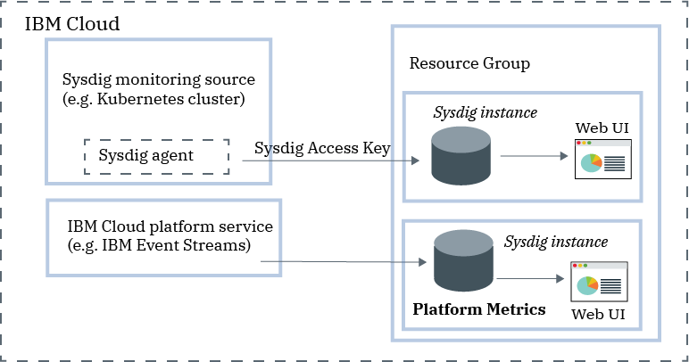

---

copyright:
  years:  2018, 2020
lastupdated: "2020-07-16"

keywords: Sysdig, IBM Cloud, monitoring, getting started

subcollection: Monitoring-with-Sysdig

---

{:new_window: target="_blank"}
{:shortdesc: .shortdesc}
{:screen: .screen}
{:pre: .pre}
{:table: .aria-labeledby="caption"}
{:codeblock: .codeblock}
{:tip: .tip}
{:download: .download}
{:important: .important}
{:note: .note}

# Getting started tutorial
{: #getting-started}

{{site.data.keyword.mon_full_notm}} is a cloud-native, and container-intelligence management system that you can include as part of your {{site.data.keyword.cloud_notm}} architecture. Use it to gain operational visibility into the performance and health of your applications, services, and platforms. It offers administrators, DevOps teams and developers full stack telemetry with advanced features to monitor and troubleshoot, define alerts, and design custom dashboards. {{site.data.keyword.mon_full_notm}} is operated by Sysdig in partnership with {{site.data.keyword.IBM_notm}}.
{:shortdesc}

The following figure shows the components overview for the {{site.data.keyword.mon_full_notm}} service that is running on {{site.data.keyword.cloud_notm}}:

To add monitoring features with {{site.data.keyword.mon_full_notm}} in the {{site.data.keyword.cloud_notm}}, you must provision an instance of the {{site.data.keyword.mon_full_notm}} service.

Before you provision an instance, consider the following information:
* The account owner can create, view, and delete an instance of a service in the {{site.data.keyword.cloud_notm}}. This user can also grant permissions to other users to work with the {{site.data.keyword.mon_full_notm}} service.
* Other {{site.data.keyword.cloud_notm}} users with `administrator` or `editor` permissions can manage the {{site.data.keyword.mon_full_notm}} service in the {{site.data.keyword.cloud_notm}}. These users must also have platform permissions to create resources within the context of the resource group where they plan to provision the instance.

You provision an instance within the context of a resource group. You use a resource group to organize your services for access control and billing purposes. You can provision the {{site.data.keyword.mon_full_notm}} instance in the *default* resource group or in a custom resource group.

When you [provision an instance](/docs/Monitoring-with-Sysdig?topic=Monitoring-with-Sysdig-provision#provision), you automatically get an ingestion key, known as the [Sysdig access key](/docs/Monitoring-with-Sysdig?topic=Monitoring-with-Sysdig-access_key#access_key).

After you provision an instance, you must configure metric sources, enable platform metrics, or both. 
* A metric source is any resource that you want to monitor and control its performance and health through a Sysdig instance. 
* You can configure a Sysdig agent to collect metrics from a source. For example, you can configure a Sysdig agent for a Kubernetes cluster. You use the access key to configure the Sysdig agent that is responsible for collecting and forwarding metric data to your instance.

    The Sysdig agent can be configured to push metrics to Sysdig via the public or private endpoints by using the appropriate ingestion URL. Details can found in the [Sysdig endpoints](/docs/Monitoring-with-Sysdig?topic=Monitoring-with-Sysdig-endpoints#endpoints) section.

    After the {{site.data.keyword.mon_full_notm}} agent is deployed in a metric source, collection and forwarding of metrics to the instance is automatic. The {{site.data.keyword.mon_full_notm}} agent automatically collects and reports on pre-defined metrics. You can configure which metrics to monitor in an environment.

* You can enable platform metrics to monitor {{site.data.keyword.cloud_notm}} services. You can only configure 1 Sysdig instance in a region to collect automatically platform metrics. [Learn more](/docs/Monitoring-with-Sysdig?topic=Monitoring-with-Sysdig-platform_metrics_enabling).

You can [monitor](/docs/Monitoring-with-Sysdig?topic=Monitoring-with-Sysdig-monitoring#monitoring), and [manage](/docs/Monitoring-with-Sysdig?topic=Monitoring-with-Sysdig-manage#manage) data through the {{site.data.keyword.mon_full_notm}} Web UI.  

## Features
{: #features}

**Accelerate the diagnosis and resolution of performance incidents.**

{{site.data.keyword.mon_full_notm}} offers deep visibility into your infrastructure and applications with the ability to troubleshoot from service level all the way down to the system level. Pre-defined dashboards and alerts simplify identification of potential threats or problems. By using {{site.data.keyword.mon_full_notm}}, developers and DevOps teams monitor and troubleshoot performance issues in real-time, identify the source of errors, and eliminate problems. 

**Control the cost of your monitoring infrastructure.**

{{site.data.keyword.mon_full_notm}} includes functionality that help you control the cost of your monitoring infrastructure in the {{site.data.keyword.cloud_notm}}. You can configure the metric sources for which you want to monitor their performance. You can enable a pre-defined alert to warn you of usage changes that will impact your billing. 

**Explore and visualize easily your entire environment.**

{{site.data.keyword.mon_full_notm}} makes it easy to visually explore your environment. Dynamic topology maps provide a view of dependencies between services. Multi-dimensional queries across high churn, high cardinality, high frequency metrics accelerate troubleshooting. Customizable dashboards allow you to visualize what matters most. 

**Get critical Kubernetes and container insights for dynamic microservice monitoring.**

{{site.data.keyword.mon_full_notm}} auto-discovers Kubernetes environments providing out-of-the-box dashboards and alerts for clusters, nodes, namespaces, services, deployments, pods and more. A single agent per node dynamically discovers all microservices and auto-collects metrics and events from various sources including Kubernetes, hosts, networks, containers, processes, applications and custom metrics like Prometheus, JMX, and StatsD. 

**Mitigate the impact of abnormal situations with proactive notifications.**

{{site.data.keyword.mon_full_notm}} includes alerts and multi-channel notifications that you can use to reduce the impact on your day to day operations and accelerate your reaction and response time to anomalies, downtime, and performance degradation. Notification channels that you can easily configure include *email*, *slack*, *PagerDuty*, *Webhooks*, *OpsGenie*, and *VictorOps*.

## Before you begin
{: #prereqs}

You must have a user ID that is a member or an owner of an {{site.data.keyword.cloud_notm}} account. To get an {{site.data.keyword.cloud_notm}} user ID, go to: [Registration ](https://cloud.ibm.com/login){:new_window}.

Check the regions where the service is available. [Learn more](/docs/Monitoring-with-Sysdig?topic=Monitoring-with-Sysdig-endpoints#endpoints_regions).

You can complete the getting started steps in any of the supported regions.

## Step 1. Manage user access
{: #step1}

Every user that accesses the {{site.data.keyword.mon_full_notm}} service in your account must be assigned an access policy with an IAM user role defined. The policy determines what actions the user can perform within the context of the service or instance you select. The allowable actions are customized and defined as operations that are allowed to be performed on the service. The actions are then mapped to IAM user roles. For more information, see [Managing user access in the {{site.data.keyword.cloud_notm}}](/docs/Monitoring-with-Sysdig?topic=Monitoring-with-Sysdig-iam#iam).

When a user is granted permissions in the {{site.data.keyword.cloud_notm}} to work with the {{site.data.keyword.mon_full_notm}} service, the user is automatically granted a Sysdig role. This role determines the actions that a user has permissions to run. Valid roles are *Sysdig admin* and *Sysdig user*. For more information, see [Controlling access through IAM](/docs/Monitoring-with-Sysdig?topic=Monitoring-with-Sysdig-iam).

Before you can provision an instance, consider the following information:
* The account owner can create, view, and delete an instance of a service in the {{site.data.keyword.cloud_notm}}, and can grant permissions to other users to work with the {{site.data.keyword.mon_full_notm}} service.
* You must have permissions to create resources in the *Default* resource group.
* Other {{site.data.keyword.cloud_notm}} users with `administrator` or `editor` permissions can manage the {{site.data.keyword.mon_full_notm}} service in the {{site.data.keyword.cloud_notm}}. These users must also have platform permissions to create resources within the context of the resource group where they plan to provision the instance.

To grant a user administrator role for the service and to manage instances within a resource group in the account, the user must have an IAM policy for the {{site.data.keyword.mon_full_notm}} service with the platform role **Administrator** within the context of the resource group. 

Complete the following steps to assign a user administrator role to the {{site.data.keyword.mon_full_notm}} service within the context of a resource group: 

1. From the menu bar, click **Manage** &gt; **Access (IAM)**, and then select **Users**.
2. From the row for the user that you want to assign access, select the **Actions** menu, and then click **Assign access**.
3. Select **Assign access within a resource group**.
4. Select a resource group.
5. If the user does not have a role already granted for the selected resource group, choose a role for the **Assign access to a resource group** field. 

    Depending on the role that you select, the user can view the resource group on their dashboard, edit the resource group name, or manage user access to the group. 
    
    You can select **No access**, if you want the user to only have access to the {{site.data.keyword.mon_full_notm}} service in the resource group.

6. Select **{{site.data.keyword.mon_full_notm}}**.
7. Select the platform role **Administrator**.
8. Click **Assign**.

## Step2. Provision an instance of the {{site.data.keyword.mon_full_notm}} service
{: #step2}

To add monitoring features with {{site.data.keyword.mon_full_notm}} in the {{site.data.keyword.cloud_notm}}, you must provision an instance of the {{site.data.keyword.mon_full_notm}} service. 

You provision an instance within the context of a resource group. A resource group lets you organize your services for access control and billing purposes. You can provision the {{site.data.keyword.mon_full_notm}} instance in the *default* resource group or in a custom resource group.

When you provision an instance, you automatically get an ingestion key, known as the *Sysdig access key*.

To provision an instance of through the {{site.data.keyword.cloud_notm}} UI, complete the following steps:

1. Log in to your {{site.data.keyword.cloud_notm}} account.

    Click [{{site.data.keyword.cloud_notm}} dashboard ](https://cloud.ibm.com/login){:new_window} to launch the {{site.data.keyword.cloud_notm}} dashboard.

	After you log in with your user ID and password, the {{site.data.keyword.cloud_notm}} UI opens.

2. Click **Catalog**. The list of the services that are available in {{site.data.keyword.cloud_notm}} opens.

3. To filter the list of services that is displayed, select the **Developer Tools** category.

4. Click the **{{site.data.keyword.mon_full_notm}}** tile.

5. Select the region. 

6. Select a service plan. By default, the **Trial** plan is set.

    For more information about the service plans, see [Service plans](/docs/Monitoring-with-Sysdig?topic=Monitoring-with-Sysdig-pricing_plans#pricing_plans).

7. Enter a service name.

8. Select a resource group. By default, the **Default** resource group is set.

9. Set on automatic collection of platform metrics by clicking **Enable**.

10. Click **Create** to provision an instance.

The service UI opens.

To provision an instance of Sysdig through the CLI, see [Provisioning Sysdig through the {{site.data.keyword.cloud_notm}} CLI](/docs/Monitoring-with-Sysdig?topic=Monitoring-with-Sysdig-provision#provision_cli).
{: tip}

## Step3. Configure a Sysdig agent
{: #step3}

After you provision an instance, you must configure a Sysdig agent for each metric source that you want to monitor. A metric source is a cloud resource that you want to monitor and control its performance and health. For example, a metric source can be a Kubernetes cluster.  

The Sysdig agent automatically collects and reports on pre-defined metrics. You use the *Sysdig access key* to configure the Sysdig agent that is responsible for collecting and forwarding metric data to your instance. For more information, see [Working with access keys](/docs/Monitoring-with-Sysdig?topic=Monitoring-with-Sysdig-access_key#access_key).

Data is stored in {{site.data.keyword.cloud_notm}}.
{: important}

You can configure a Sysdig agent for different environments. For example, to configure your Kubernetes cluster to send metrics to your Sysdig instance, you must install a `sysdig-agent` pod on each node of your cluster. The Sysdig agent collects data from the pod where it is installed, and forwards it to your Sysdig instance.

Complete one of the following tutorials to learn how to deploy a Sysdig agent:

| Resource                |	Tutorial                        | Environment                | Scenario   |
|-------------------------|---------------------------------|----------------------------|------------|
| Containers running on the {{site.data.keyword.containershort}} |[Analyze metrics for an app that is deployed in a Kubernetes cluster](/docs/Monitoring-with-Sysdig?topic=Monitoring-with-Sysdig-kubernetes_cluster#kubernetes_cluster) | {{site.data.keyword.cloud_notm}} Public |  |
|Linux Ubuntu/Debian | [Analyze metrics for an Ubuntu server](/docs/Monitoring-with-Sysdig?topic=Monitoring-with-Sysdig-ubuntu#ubuntu) | On-premises |  |
{: caption="Table 1. Tutorials to get started working with {{site.data.keyword.mon_full_notm}}" caption-side="top"} 

For more information, see [Configuring a Sysdig agent](/docs/Monitoring-with-Sysdig?topic=Monitoring-with-Sysdig-config_agent#config_agent) and [Removing a Sysdig agent](/docs/Monitoring-with-Sysdig?topic=Monitoring-with-Sysdig-remove#remove).

After the Sysdig agent is deployed, collection and forwarding of metrics to the instance is automatic. The Sysdig agent automatically collects and reports on pre-defined metrics. You can also configure which metrics to monitor in an environment. Data for custom metrics is also automatically collected.

## Step 4. Launch the web UI
{: #step4}

After you provision an instance of the {{site.data.keyword.mon_full_notm}} service in the {{site.data.keyword.Bluemix}}, and configure a Sysdig agent for your node, you can view, monitor, and manage data through the service's web UI.

You launch the web UI within the context of the Sysdig instance, from the {{site.data.keyword.cloud_notm}} UI. 

Complete the following steps to launch the Sysdig web UI:

1. Log in to your {{site.data.keyword.cloud_notm}} account.

    Click [{{site.data.keyword.cloud_notm}} dashboard ](https://cloud.ibm.com/login){:new_window} to launch the {{site.data.keyword.cloud_notm}} dashboard.

	After you log in with your user ID and password, the {{site.data.keyword.cloud_notm}} Dashboard opens.

2. In the navigation menu, select **Observability**. 

3. Select **Monitoring**. 

    The list of monitoring instances that are available on {{site.data.keyword.cloud_notm}} is displayed.

4. Select one instance. Then, click **View Sysdig**.

The {{site.data.keyword.mon_full_notm}} Web UI opens. By default, the *Explore* tab is displayed.

By default, users are automatically added as members of the **Monitor Operations** team that is predefined for each {{site.data.keyword.mon_full_notm}} instance. Users have full permissions to see all the data in the web UI. **Note:** An administrator can restrict access to data by managing users in teams and controlling what data is visible. For example, to restrict users viewing permissions, an administrator can create a default team with limited scope and visibility. Then, manually assign users to other teams. For more information, see [Working with teams](/docs/Monitoring-with-Sysdig?topic=Monitoring-with-Sysdig-teams#teams).

## Step 5. Monitor your environment
{: #step5}

You can analyze data in the *Explore* tab and in the *Dashboard* tab of the web UI. You monitor the data through metric views and dashboards. 

* Use a metric view to monitor an individual metric.
* Use dashboards to get a specialized insight into network data, application data, topology, services, hosts, and containers by monitoring data through panels. A panel displays a metric or group of metrics in a dashboard.
{: tip}

In the *Explore* tab, you can monitor data by using default metrics and default dashboards. You can use labels to define new infrastructure groups that you can then use to aggregate data differently and monitor your environment. You can also use custom dashboards that you define through the *Dashboard* tab.

In the *Dashboards* tab, you can monitor data by using any of the default dashboards or by creating new ones.

For more information, see [Monitoring your environment](/docs/Monitoring-with-Sysdig?topic=Monitoring-with-Sysdig-monitoring#monitoring)

## Step 6. Manage data
{: #step6}

You can use labels to group infrastructure resources into logical hierarchies, filter out data, and split aggregated data into segments. Customize how data is aggregated when you configure a graph or create an alert for a metric. Set the scope of a dashboard, a panel, or an alert to filter out data points. Restrict access to data by managing users' data access through teams. 

For example, for a metric view, you can define the scope of the data, how to aggregate data, and what time and group filters to apply to the data. 

For more information, see [Managing data](/docs/Monitoring-with-Sysdig?topic=Monitoring-with-Sysdig-manage#manage).

## Step 7. Configure alerts and explore events
{: #step7}

You can use events to review, track, and resolve issues. An event is a notification that informs about something that has occurred in any of the nodes that forward data to your {{site.data.keyword.mon_full_notm}} instance. 

There are different types of events: 

* *Alert events* are events that are triggered by user-configured alerts. For example, configure alerts to be notified of problems that require attention. For more information, see [Working with alerts](/docs/Monitoring-with-Sysdig?topic=Monitoring-with-Sysdig-monitoring#monitoring_alerts).
* *Infrastructure-based events* are events that are collected from Docker and Kubernetes nodes. By default, the Sysdig agent automatically discovers and collects data from a select group of events. You can edit the agent configuration file to enable more events.
* *Custom events* that you configure through any of the following integrations: Slackbot, pre-built Python scripts, custom user-created Python scripts, or cURL requests.

When you define an alert, you must define the condition that triggers the notification, one or more notification channels through which you want to be notified, the severity of the alert, and the type of alert. 

You configure one or more notification channels in the *Settings* section in the web UI. Valid notification channels are: *email*, *slack*, *PagerDuty*, *Webhooks*, *OpsGenie*, and *VictorOps*. For more information, see [Working with notification channels](/docs/Monitoring-with-Sysdig?topic=Monitoring-with-Sysdig-notifications#notifications).

The *Alerts* section in the web UI shows the list of pre-defined alerts. From this view, you can enable and disable pre-defined alerts; you can modify existing alerts; and you can create new alerts. For more information, see [Working with alerts ](https://docs.sysdig.com/en/alerts.html){:new_window}.

Next, explore [Working with custom events ](https://docs.sysdig.com/en/events.html){:new_window}.

## Step 8. Monitor usage
{: #step8}

To monitor the usage and costs of your service, see [Viewing your usage](/docs/billing-usage?topic=billing-usage-viewingusage#viewingusage).

