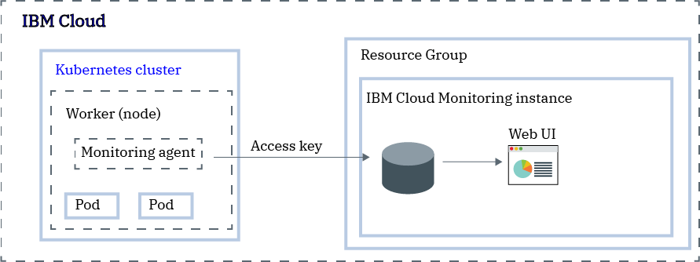
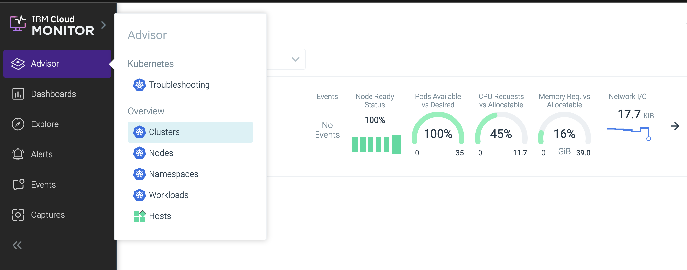
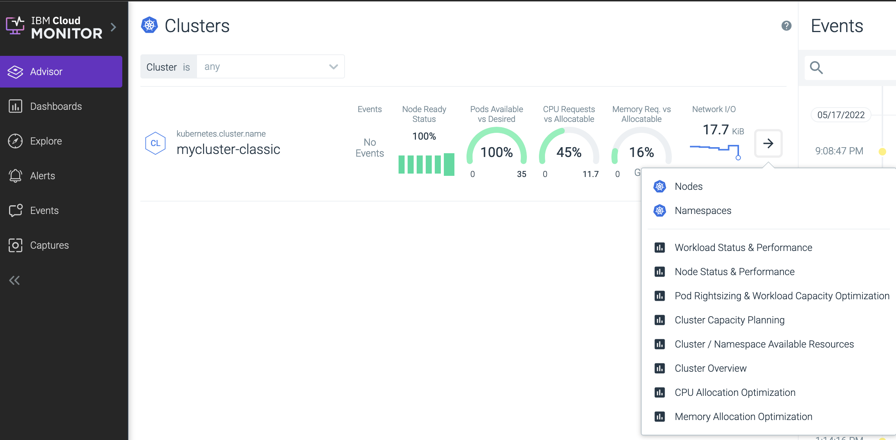

---

copyright:
  years:  2018, 2023
lastupdated: "2023-09-20"

keywords:

subcollection: monitoring

content-type: tutorial
services: monitoring
account-plan: lite
completion-time: 1h

---

{{site.data.keyword.attribute-definition-list}}


# Monitoring a Kubernetes cluster
{: #kubernetes_cluster}
{: toc-content-type="tutorial"}
{: toc-services="monitoring"}
{: toc-completion-time="1h"}

Use this tutorial to learn how to configure an {{site.data.keyword.containerlong}} cluster to forward metrics to the {{site.data.keyword.mon_full}} service.  You can monitor clusters in {{site.data.keyword.cloud_notm}}, on-prem, and in other clouds.
{: shortdesc}

To configure a cluster to forward metrics, you must install a monitoring agent onto each worker node in your Kubernetes cluster by using a [DaemonSet](https://kubernetes.io/docs/concepts/workloads/controllers/daemonset/){: external}. The monitoring agent uses an access key (token) to authenticate with the {{site.data.keyword.mon_full_notm}} instance. The monitoring agent acts as a data collector. It automatically collects metrics such as *worker node CPU* and *worker node memory* usage, *HTTP traffic into and out of your containers*, and data about several infrastructure components. In addition, the agent can collect custom application metrics by using either a Prometheus-compatible scraper or a StatsD facade.

{: caption="Figure 1. Components overview on the {{site.data.keyword.cloud_notm}}" caption-side="bottom"}

For example, to configure your Kubernetes cluster to forward metrics to your {{site.data.keyword.mon_full_notm}} instance, you can deploy the agent by using Helm or a script:
- [Helm](/docs/monitoring?topic=monitoring-agent-deploy-kube-helm)
- [Script](/docs/monitoring?topic=monitoring-agent_Kube)

The {{site.data.keyword.mon_short}} agent automatically collects the following types of system metrics per host:

- `System hosts metrics` provide information about CPU, memory, and storage usage metrics, that you can use to analyze the performance and resource utilization of all your processes.

- `File and File System metrics` provide information about files and file system that you can use to analyze file interactions that occur in your system. For example, you can find information about your open files, bytes going in and out, or the percentage of usage of a given file system.

- `Process metrics` provide information about the processes that run in your servers. For example, you can use these metrics to  explore the number of processes, or get client or server information.

- `Network metrics` provide information about the network. They offer insight to the connections that are established between your applications, containers, and servers. For example, you can find information about the bytes that are being sent or received, or the number of HTTP requests, connections, and latency. In addition, for SQL or MongoDB, the agent collects additional information when it is configured in troubleshooting mode.

The {{site.data.keyword.mon_short}} agent automatically collects the following types of metrics per Kubernetes cluster:

- `State metrics`: Kube state metrics report on the health and state of the various objects that run inside Kubernetes components, such as deployments, nodes and pods. To see the list of metrics that are collected by default, see [Kubernetes State](hhttps://docs.sysdig.com/en/docs/sysdig-monitor/using-monitor/metrics/metrics-library/sysdig-legacy-format/kubernetes/kubernetes-state/){: external}.

- `Resource usage metrics`: Resource usage metrics reports on the health and state of CPU and memory for workers (nodes) and pods that are running in the cluster. The data can be analyzed by namespace, by worker, by pod, by workload object such as deployments, daemonSets, and more.

For a list of collected metrics, see [Metrics Available for orchestrated environments](https://docs.sysdig.com/en/docs/sysdig-monitor/using-monitor/metrics/metrics-library/prometheus-format/).

Through the {{site.data.keyword.mon_short}} UI, you can analyze data in the *Advisor* tab, the *Explore* tab, and in the *Dashboard* tab. You monitor the data through metric views and dashboards.
{: shortdesc}

Consider the following information when monitoring your data:
* In the *Explorer* tab, you can monitor individual metrics.
* In the *Advisor* tab, you can monitor Kubernetes or host level metrics.

    This tab is only available for users that belong to a team that has access to monitor Kubernetes or host level metrics.
    {: note}

* In the *Dashboard* tab, you can monitor through panels predefined dashboards or custom ones and get a specialized insight into network data, application data, topology, services, hosts, and containers. A panel displays a metric or group of metrics in a dashboard.


For each metric view and dashboard, you can define the scope of the data, how to aggregate data, and what time and group filters to apply to the data. For more information, see [Managing panels](/docs/monitoring?topic=monitoring-panels).


You can configure a dashboard as the default entry point for a team, unifying a team's experience, and allowing users to focus their immediate attention on the most relevant information for them.
{: tip}

For more information, see [Viewing metrics](/docs/monitoring?topic=monitoring-monitoring).


## Objectives
{: #kubernetes_cluster_objectives}

In this tutorial, you configure metrics for your {{site.data.keyword.containerlong}} cluster. In particular, you:
*  Provision an {{site.data.keyword.mon_full_notm}} instance.
*  Configure the monitoring agent in your cluster to sent metrics.
*  Use the monitoring UI to analyze your cluster metrics.


## Before you begin
{: #kubernetes_cluster_prereqs}

- [Read about {{site.data.keyword.mon_short}}](/docs/monitoring?topic=monitoring-getting-started).

- Have a user ID that is a member or an owner of an {{site.data.keyword.cloud_notm}} account. To get an {{site.data.keyword.cloud_notm}} user ID, go to: [Registration](https://cloud.ibm.com/login){: external}.

- [Get information about Kubernetes monitoring agent images](/docs/monitoring?topic=monitoring-monitoring_agent_image).

- [Check the Kubernetes resource requirements](/docs/monitoring?topic=monitoring-resource_requirements).

- [Install the {{site.data.keyword.cloud_notm}} CLI and plug-ins](/docs/containers?topic=containers-cs_cli_install#cs_cli_install_steps):

    * {{site.data.keyword.cloud_notm}} CLI (`ibmcloud`)

    * {{site.data.keyword.containerlong_notm}} plug-in (`ibmcloud ks`)

    * {{site.data.keyword.registrylong_notm}} plug-in (`ibmcloud cr`)

    * {{site.data.keyword.containerlong_notm}} observability plug-in (`ibmcloud ob`)

- [Install the Kubernetes CLI (kubectl)](/docs/containers?topic=containers-cs_cli_install#kubectl)

    Make sure that the `kubectl` version is compatible with your cluster version. If the `kubectl` version is not compatible, you can get an error such as `kubectl create clusterrolebinding failed!`. You can use `kubectl version --short` to check versions of your cluster and your `kubectl` client.

- [Create a cluster](/docs/containers?topic=containers-clusters#clusters) or use an existing {{site.data.keyword.containerlong_notm}} cluster.

- Make sure that your user ID is assigned the following {{site.data.keyword.iamlong}} policies:

| Resource                             | Scope of the access policy | Role    | Region    | Information                  |
|--------------------------------------|----------------------------|---------|-----------|------------------------------|
| Resource group **default**           |  Resource group            | Viewer  | US-south  | This policy is required to allow the user to see service instances in the Default resource group.    |
| {{site.data.keyword.mon_full_notm}} service |  Resource group            | Editor  | Us-south  | This policy is required to allow the user to provision and administer the {{site.data.keyword.mon_full_notm}} service in the default resource group.   |
| Kubernetes cluster instance          |  Resource                 | Editor  | Us-south  | This policy is required to configure the secret and the monitoring agent in the Kubernetes cluster. |
{: caption="Table 1. List of IAM policies required to complete the tutorial" caption-side="top"}

For more information about the {{site.data.keyword.containerlong}} IAM roles, see [User access permissions](/docs/containers?topic=containers-access_reference#access_reference).


## Provision an {{site.data.keyword.mon_full_notm}} instance
{: #kubernetes_cluster_step1}
{: step}

In this getting tutorial, instructions are provided to provision an instance of the {{site.data.keyword.mon_full_notm}} in the US-South region. For more information about supported regions, see [Regions](/docs/monitoring?topic=monitoring-endpoints).

To provision an instance of {{site.data.keyword.mon_full_notm}} through the {{site.data.keyword.cloud_notm}} UI, complete the following steps:

1. [Log in to your {{site.data.keyword.cloud_notm}} account](https://cloud.ibm.com/login){: external}.

	After you log in with your user ID and password, the {{site.data.keyword.cloud_notm}} UI opens.

2. Click **Catalog**. The list of the services that are available in {{site.data.keyword.cloud_notm}} opens.

3. To filter the list of services that is displayed, select the **Logging and monitoring** category.

4. Click the **{{site.data.keyword.mon_full_notm}}** tile.

5. Select a location and a service plan.

    By default, the **Lite** plan is set.

    For more information about other service plans, see [Pricing plans](/docs/monitoring?topic=monitoring-pricing_plans#pricing_plans).

6. Configure the resource.

    Enter a name for the service instance.

    Select a resource group.

    Optionally add tags.

7. Click **Create**.

    After you provision an instance, the *Observability* dashboard opens and shows details for your **Monitoring** instances.


To provision an instance through the CLI, see [Provisioning an instance through the {{site.data.keyword.cloud_notm}} CLI](/docs/monitoring?topic=monitoring-provision#provision_cli).
{: note}


## Configure your Kubernetes cluster to send metrics to your instance
{: #kubernetes_cluster_step2}
{: step}

To configure your Kubernetes cluster to send metrics to your {{site.data.keyword.mon_full_notm}} instance, you must install a monitoring agent pod on each node of your cluster. The monitoring agent is installed via a DaemonSet which ensures an instance of the agent is running on every worker node. The monitoring agent collects metrics from the pod where it is installed, and forwards the data to your instance.

In order to provide the full suite of system metrics, the monitoring agent needs to have a privileged status.
{: note}


Complete the following steps from the command-line to deploy the agent by using a script:

1. Open a terminal. Then, log in to the {{site.data.keyword.cloud_notm}}. Run the following command and follow the prompts:

    ```text
    ibmcloud login -a cloud.ibm.com
    ```
    {: codeblock}

    Select the account where the cluster is available.

2. Set up the cluster environment. Run the following commands:

    First, get the command to set the environment variable and download the Kubernetes configuration files.

    ```text
    ibmcloud ks cluster config --cluster <cluster_name_or_ID>
    ```
    {: codeblock}

    When the download of the configuration files is finished, a command is displayed that you can use to set the path to the local Kubernetes configuration file as an environment variable. Copy and paste the command that is displayed in your terminal to set the `KUBECONFIG` environment variable.

    Every time you log in to the {{site.data.keyword.containerlong}} CLI to work with clusters, you must run these commands to set the path to the cluster's configuration file as a session variable. The Kubernetes CLI uses this variable to find a local configuration file and certificates that are necessary to connect with the cluster in {{site.data.keyword.cloud_notm}}.
    {: tip}

3. Obtain the access key. For more information, see [Getting the access key through the {{site.data.keyword.cloud_notm}} UI](/docs/monitoring?topic=monitoring-access_key#access_key_ibm_cloud_ui).

4. Obtain the ingestion URL from the [collector endpoints](/docs/monitoring?topic=monitoring-endpoints#endpoints_ingestion).

5. Deploy the monitoring agent. Run the following command:

    ```text
    curl -sL https://raw.githubusercontent.com/draios/sysdig-cloud-scripts/master/agent_deploy/IBMCloud-Kubernetes-Service/install-agent-k8s.sh | bash -s -- -a ACCESS_KEY -c COLLECTOR_ENDPOINT -t TAG_DATA -ac 'sysdig_capture_enabled: false'
    ```
    {: pre}

    Where

    * **ACCESS_KEY** is the ingestion key for the instance that you previously retrieved.

    * **COLLECTOR_ENDPOINT** is the ingestion URL for the region where the monitoring instance is available that you previously retrieved.

    * **TAG_DATA** are comma-separated tags that are formatted as *TAG_NAME:TAG_VALUE*. You can associate one or more tags to your monitoring agent. For example: *role:serviceX,location:us-south*. Later on, you can use these tags to identify metrics from the environment where the agent is running.

    * Set **sysdig_capture_enabled** to *false* to disable the  capture feature. By default is set to *true*. For more information, see [Working with captures](/docs/monitoring?topic=monitoring-captures#captures).

6. Verify that the monitoring agent is created successfully and its status. Run the following command:

    ```text
    kubectl get pods -n ibm-observe
    ```
    {: codeblock}

    The deployment is successful when you see one or more `sysdig-agent` pods. The number of `sysdig-agent` pods equals the number of worker nodes in your cluster. All pods must be in a `Running` state.


## Launch the monitoring UI
{: #kubernetes_cluster_step3}
{: step}

To launch the monitoring UI through the {{site.data.keyword.cloud_notm}} console, complete the following steps.

1. [Log in to your {{site.data.keyword.cloud_notm}} account](https://cloud.ibm.com/login){: external}.

	After you log in with your user ID and password, the {{site.data.keyword.cloud_notm}} Dashboard opens.

2. From the menu , select **Observability**.

3. Select **Monitoring**. The list of instances that are available on {{site.data.keyword.cloud_notm}} is displayed.

4. Find your instance and click **Open dashboard**. The web UI opens.

It may take some time before you see the cluster entry while the information is initally collected and processed by the monitoring agent.
{: note}

You only can monitor one instance per browser. You could have multiple tabs for the same instance.
{: tip}

## Monitor your cluster
{: #kubernetes_cluster_step4}
{: step}

In the *Advisor* tab, you can monitor and troubleshoot the health, risk, and capacity of hosts and Kubernetes clusters.

{: caption="Advisor tab" caption-side="bottom"}

- Data is refreshed every 10 minutes.
- Metrics are prioritized by event count and severity.
- For more information, see [Advisor](https://docs.sysdig.com/en/docs/sysdig-monitor/advisor/){: external}.

In the *Advisor* section, you can choose to monitor your Kubernetes clusters by cluster, by node, by namespace, or by workload. Each option offers a set of predefined dashboards that you can use to monitor the health of your resources. You can also select to monitor by host.

### Monitoring Kubernetes clusters by cluster
{: #monitoring_advisor_1}

When you choose to monitor your Kubernetes clusters by cluster, you can select more filters to display data by node or by namespace, or you can choose any of the following dashboards:
- Workload Status & Performance
- Node Status & Performance
- Pod Rightsizing & Workload Capacity Optimization
- Cluster Capacity Planning
- Cluster / Namespace Available Resources
- Cluster Overview
- CPU Allocation Optimization
- Memory Allocation Optimization

{: caption="Advisor predefined dashboards by cluster" caption-side="bottom"}

For more information on how to interpret this view, see [About Clusters Overview](https://docs.sysdig.com/en/docs/sysdig-monitor/advisor/overview/clusters-data/){: external}.

### Monitoring Kubernetes clusters by node
{: #monitoring_advisor_2}

When you choose to monitor your Kubernetes clusters by node, you can choose any of the following dashboards:
- Node Status & Performance
- Pod Scheduling Troubleshooting
- Node Overview
- CPU Allocation Optimization
- Memory Allocation Optimization


For more information on how to interpret this view, see [About Nodes Overview](https://docs.sysdig.com/en/docs/sysdig-monitor/advisor/overview/nodes-data/){: external}.

### Monitoring Kubernetes clusters by namespace
{: #monitoring_advisor_3}

When you choose to monitor your Kubernetes clusters by namespace, you can select more filters to display data by workload, or you can choose any of the following dashboards:
- Workload Status & Performance
- Pod Status & Performance
- Pod Rightsizing & Workload Capacity Optimization
- Namespace Overview
- Workloads CPU Usage and Allocation
- Workloads Memory Usage and Allocation

For more information on how to interpret this view, see [About Namespaces Overview](https://docs.sysdig.com/en/docs/sysdig-monitor/advisor/overview/namespaces-data/){: external}.

### Monitoring Kubernetes clusters by workloads
{: #monitoring_advisor_4}

When you choose to monitor your Kubernetes clusters by workloads, you can choose any of the following dashboards:
- Container Resource Usage & Troubleshooting
- Pod Status & Performance
- Pod Rightsizing & Workload Capacity Optimization
- Workload Status & Performance
- Deployment Overview
- Pod Overview
- Workloads CPU Usage and Allocation
- Workloads Memory Usage and Allocation


For more information on how to interpret this view, see [About Workloads Overview](https://docs.sysdig.com/en/docs/sysdig-monitor/advisor/overview/workloads-data/){: external}.


## Next steps
{: #kubernetes_cluster_next_steps}
{: step}


- Create a custom dashboard. For more information, see [Working with dashboards](/docs/monitoring?topic=monitoring-dashboards#dashboards).

- Learn about alerts. For more information, see [Working with alerts](/docs/monitoring?topic=monitoring-monitoring#monitoring_alerts).

- Learn how to manage logs from your cluster. See [Logging with Kubernetes clusters](/docs/log-analysis?topic=log-analysis-kube).

- Learn about the {{site.data.keyword.mon_full_notm}} {{site.data.keyword.sysdigsecure_short}} functionality to find and prioritize software vulnerabilities, detect and respond to threats, and manage configurations, permissions and compliance from source to run. See [Getting started with {{site.data.keyword.sysdigsecure_full}}](/docs/workload-protection?topic=workload-protection-getting-started).
