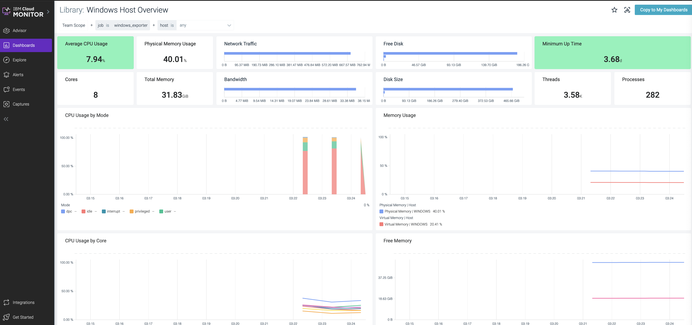

---

copyright:
  years:  2018, 2022
lastupdated: "2021-07-01"

keywords: IBM Cloud, monitoring, windows

subcollection: monitoring

content-type: tutorial
services: monitoring
account-plan: lite
completion-time: 1h

---

{{site.data.keyword.attribute-definition-list}}


# Monitoring a Windows environment
{: #windows}
{: toc-content-type="tutorial"}
{: toc-services="monitoring"}
{: toc-completion-time="1h"}

The standard monitoring agent cannot be installed on a Windows platform. In order to monitor a Windows system with {{site.data.keyword.mon_full_notm}}, you can leverage the [Prometheus Windows Exporter](https://promcat.io/apps/windows){: external} to perform the collection of the metrics on the system.
{: shortdesc}

If you need information on the legacy Prometheus WMI Exporter, see [Monitoring a Windows environment using the legacy WMI Exporter](/docs/monitoring?topic=monitoring-windows_wmi).  
{: note}

Once the metrics are collected you have two options for publishing the metrics, remotely scraping the metrics with a Linux monitoring agent,or pushing from a local instance of Prometheus using remote write. Step 3 will cover these two options, but step 1 and 2 are the same regardless of how the metrics are sent.

Complete the following steps to configure the following Windows images to send metrics to a monitoring instance:
* Windows Server 2019 Standard Edition (64 bit)
* Windows Server 2016 Standard Edition (64 bit)

## Configure the Prometheus Windows exporter
{: #windows_step1}
{: step}

Configure the [Prometheus `windows_exporter`](https://github.com/prometheus-community/windows_exporter){: external} to collect Windows system metrics.

The Prometheus Windows exporter runs as a Windows service. You configure the metrics that you want to monitor by enabling collectors. 

The following collectors are supported:

| Collector name | Information about metrics collected per collector | 
|----------------|---------------------------------------------------|
| `cpu`          | [CPU metrics](https://github.com/prometheus-community/windows_exporter/blob/master/docs/collector.cpu.md){: external} |
| `cs`           | [Computer system metrics](https://github.com/prometheus-community/windows_exporter/blob/master/docs/collector.cs.md){: external} |
| `logical_disk` | [Disk metrics](https://github.com/prometheus-community/windows_exporter/blob/master/docs/collector.logical_disk.md){: external} |
| `os`           | [Operating System metrics](https://github.com/prometheus-community/windows_exporter/blob/master/docs/collector.os.md){: external} |
| `system`       | [System metrics](https://github.com/prometheus-community/windows_exporter/blob/master/docs/collector.system.md){: external} |
| `net`          | [Network interface metrics](https://github.com/prometheus-community/windows_exporter/blob/master/docs/collector.net.md){: external} |
| `memory`       | [Memory metrics](https://github.com/prometheus-community/windows_exporter/blob/master/docs/collector.memory.md){: external} |
{: caption="Table 1. Collectors" caption-side="top"} 


Complete the following steps to configure the Prometheus Windows exporter in your Windows system:

1. Login to your Windows system, for example, you can connect via remote desktop (RDP).

2. [Download the Prometheus `windows_exporter`](https://github.com/martinlindhe/wmi_exporter/releases){: external} appropriate for your environment.

3. Identify the collectors that include data for the metric data that you want to collect.  

4. Change to the directory where you downloaded the Prometheus Windows exporter.

5. Run the `windows_exporter` and configure the collectors that you want to enable.  For example:

    ```text
    .\windows_exporter-0.16.0-amd64.exe --collectors.enabled <COLLECTORS> 
    ```
    {: codeblock}

    Where `<COLLECTORS>` indicates the list of connectors that you want to configure.

    For example, to collect computer system metrics (cs), CPU metrics, disk metrics and network interface I/O metrics, see the following example:

    ```text
    .\windows_exporter-0.16.0-amd64.exe --collectors.enabled "os,cpu,logical_disk,net,system"
    ```
    {: codeblock}

## Configure network settings
{: #windows_step2}
{: step}

Complete the following steps:
1. Enable the Windows firewall to allow access to `windows_exporter-0.16.0-amd64.exe`.

2. [Optional] Update the VPC rules

    If you use private endpoints, add an inbound rule to the security group for port `9182` with `source type = Security Group` and choose the security group for the Windows system.


## Choose the method to collect metrics
{: #windows_step3}
{: step}


### Option 1. Collect metrics by running a monitoring agent on a Linux system
{: #windows_step3_1}

Run a monitoring agent on a Linux system and remotely scrape the Windows endpoint.

Complete the following steps:

1. [Install the monitoring agent on a Linux node](/docs/monitoring?topic=monitoring-config_agent#config_agent_linux).

    You can collect a maximum of 3000 time series per Linux agent. If you need to collect more than 3000 time series for all your Windows systems, you need more than one Linux agent.
    {: important}
    
2. Update the `/opt/draios/etc/dragent.yml` to [enable remote scraping](https://docs.sysdig.com/en/docs/installation/prometheus-remote-write/){: external}. 

    ```yaml
    prometheus:
        enabled: true
        interval: 30
        log_errors: true
        max_metrics: 3000
        max_metrics_per_process: 3000
        max_tags_per_metric: 20
        remote_services:
            - <HOSTNAME>:
                always: true
                conf:
                    url: "http://<WINDOWS_IP>:9182/metrics"
                    tags:
                        region: us-east
                        instance: <HOSTNAME>
                        job: <JOBNAME>
    ```
    {: codeblock}

    Where

    `<WINDOWS_IP>` is the IP of the Windows system

    `<HOSTNAME>` is the name of the Windows system

    `<JOBNAME>` is a custom attribute that you can set to identify the role of the node that you are scraping, and you can also use to scope the data

    See the following sample configuration that you can set to enable scraping for a Windows system with hostname `my-windows-hostname` in your environment:
 
    ```yaml
    prometheus:
        enabled: true
        interval: 30
        log_errors: true
        max_metrics: 3000
        max_metrics_per_process: 3000
        max_tags_per_metric: 20
        remote_services:
            - my-windows-hostname:
                always: true
                conf:
                    url: "http://10.245.0.5:9182/metrics"
                    tags:
                        region: us-east
                        instance: my-windows-hostname
                        job: my-job-name
    ```
    {: screen}

3. Configure the monitoring agent to reduce the number of metrics that are collected by the Windows `windows_exporter`. 

    You can configure the `metrics_filter` section to remove metrics. For example, you can remove collector metrics. You can also remove specific metrics that you do not wish to collect.

    For example, to remove go metrics and the logical disk request metrics, you can set the section in the following way:

    ```yaml
    metrics_filter:
      - exclude: go_*
      - exclude: windows_logical_disk_requests_queued
    ```
    {: codeblock}

    The `go_*` metrics are metrics generated by the `Go` programming language, and are collected by default.  The `windows_logical_disk_requests_queued` is the number of requests outstanding on the disk at the time the performance data is collected.

4. Restart the monitoring agent. Run the following command:

    ```text
    service dragent restart
    ```
    {: pre}

### Option 2. Collect metrics by running Prometheus as a client collector on Windows
{: #windows_step3_2}

Use the Prometheus remote-write capabilities to push the metrics from the Windows system by running Prometheus as a client collector on Windows.

Complete the following steps:

1. Download the Prometheus monitoring system and time series database. [Download prometheus-2.27.1.windows-amd64.tar.gz](https://prometheus.io/download/){: external} 

2. Unzip the file `prometheus-2.27.1.windows-amd64.tar.gz`. 

3. Edit the `prometheus.yml` file. For example, you can edit it with Notepad. 

4. Configure the `scrape_configs` section of `prometheus.yml` configuration file as follows to have prometheus scrape the `windows_exporter`.

    ```yaml
    scrape_configs:
      # The job name is added as a label `job=<job_name>` to any timeseries scraped from this configuration.
      - job_name: 'windows_exporter'

        static_configs:
         - targets: ['localhost:9182']

         labels:
           region: "us-east"
           instance: "<HOSTNAME>"
           job: "<JOBNAME>"
    ```
    {: codeblock}

    Where

    `<HOSTNAME>` is the name of the Windows system

    `<JOBNAME>` is a custom attribute that you can set to identify the role of the node that you are scraping, and you can also use to scope the data in {{site.data.keyword.mon_full_notm}}

    Next, you will add the `remote_write` configuration to the end of the `prometheus.yml` file to configure the target  monitoring instance that will receive the metrics.

    ```yaml
    remote_write:
      - url: "<ENDPOINT>/prometheus/remote/write"
  
        bearer_token_file: C:\Users\Administrator\prom\sysdig-apikey

        write_relabel_configs:
          # Drop forwarding the metrics generated by the exporter that are not supported
          - source_labels: ["__name__"]
            regex: "^windows_(.*)"
            action: keep

          - regex: "(__name__)|(job)|(region)|(instance)|(status)|(core)|(name)|(start_mode)|(nic)|(volume)|(state)|(version)|(mode)|(branch)|(timezone)|(goversion)|(collector)|(revision)"
            action: labelkeep
    ```
    {: codeblock}

    Where 
    
    `ENDPOINT` is the monitoring collector endpoint. To see the list of endpoints, see [collector endpoints](/docs/monitoring?topic=monitoring-endpoints#endpoints_ingestion).

    `monitoring-apikey` is the file that contains the **Monitor API Token**. Notice that the file name does not have an extension.  For more information about how to get the API token, see [Working with Monitor API tokens](/docs/monitoring?topic=monitoring-api_monitoring_token).

    For example, the completed version of the prometheus.yml could look like :
  
    ```yaml
    # my global config
    global:
      scrape_interval:     15s # Set the scrape interval to every 15 seconds. Default is every 1 minute.
      evaluation_interval: 15s # Evaluate rules every 15 seconds. The default is every 1 minute.
      # scrape_timeout is set to the global default (10s).

    # Alertmanager configuration
    alerting:
      alertmanagers:
      - static_configs:
        - targets:
          # - alertmanager:9093

    # Load rules once and periodically evaluate them according to the global 'evaluation_interval'.
    rule_files:
      # - "first_rules.yml"
      # - "second_rules.yml"

    # A scrape configuration containing exactly one endpoint to scrape:
    # Here it's Prometheus itself.
    scrape_configs:
      # The job name is added as a label `job=<job_name>` to any timeseries scraped from this config.
      - job_name: 'windows_exporter'

        static_configs:
        - targets: ['localhost:9182']

          labels:
            instance: "my-windows-hostname"
            region: "us-south"

    # Connection
    remote_write:
      - url: "https://ingest.eu-gb.monitoring.cloud.ibm.com/prometheus/remote/write"

        bearer_token_file: C:\Users\Administrator\prom\sysdig-api

        write_relabel_configs:
          - source_labels: ["__name__"]
            regex: "^windows_(.*)"
            action: keep

          - regex: "(__name__)|(job)|(region)|(instance)|(status)|(core)|(name)|(start_mode)|(nic)|(volume)|(state)|(version)|(mode)|(branch)|(timezone)|(goversion)|(collector)|(revision)"
            action: labelkeep
    ```
    {: codeblock}

5. Start the Prometheus executable from the location containing the `prometheus.yml` file.

   ```text
   .\prometheus.exe
   ```
   {: pre}


## Monitor Windows system metrics
{: #windows_step4}
{: step}

To monitor Windows systems metrics, you can use the default dashboard `Windows Node Overview`  to view the Windows metrics. This default dashboard is located in the section **My Dashboards**.

{: caption="Figure 1. Example of a Windows metrics dashboard" caption-side="bottom"}

Run the following command to install the default dashboard.

```text
docker run -it --rm sysdiglabs/promcat-connect:0.1 install windows:2019 -t <MONITORING_TOKEN>  -u <ENDPOINT>
```
{: codeblock}

Where

* `<MONITORING_TOKEN>` is the Monitoring (sysdig) token. See [Working with Monitor API tokens](/docs/monitoring?topic=monitoring-api_monitoring_token).
* `<ENDPOINT>` is the {{site.data.keyword.mon_full_notm}} instance endpoint. See [endpoints](/docs/monitoring?topic=monitoring-endpoints).

When the dashboard is installed it is only available to be viewed by the user who installed it.  To make the dashboard available to other users click the **Actions** icon  > **Dashboard Settings** and change **Shared with** to include the desired teams and **Member Permissions**.
{: important}


## [Optional] Verifying uptime for Windows with Prometheus Blackbox exporter
{: #windows_step5}
{: step}

You can configure the Prometheus Blackbox exporter to get information about the availability of a Windows system.

The Prometheus Blackbox exporter can be run as an application or a docker container from a Linux system in conjunction with the monitoring agent.

The Prometheus Blackbox exporter allows blackbox probing of endpoints over HTTP, HTTPS, DNS, TCP and ICMP.  The monitoring agent can be used in conjunction with the Blackbox exporter to collect availability metrics. The availability metrics can then be configured to alert users on the availability of the endpoints.

The exporters are available as [binary releases](https://github.com/prometheus/blackbox_exporter/releases){: external}, as a [docker container](https://hub.docker.com/r/prom/blackbox-exporter/){: external} or the [code is available in github](https://github.com/prometheus/blackbox_exporter){: external}.

For example, complete the following instructions when the container approach is used:

1. Download the [blackbox.yml file](https://github.com/prometheus/blackbox_exporter/blob/master/blackbox.yml){: external} from Github.

2. Start the blackbox exporter.

    ```text
    docker run --rm -d -p 9115:9115 --name blackbox_exporter -v `pwd`:/config/ prom/blackbox-exporter:master --config.file=/config/blackbox.yml
    ```
    {: codeblock}

3. Test the blackbox exporter is working by manually running the probe to test your Windows system.  

    For example, you can do a simple `icmp` check to see if the system is responding. See the [documentation](https://github.com/prometheus/blackbox_exporter/blob/master/README.md){: external} for other options. 

    ```text
    curl 'http://localhost:9115/probe?module=icmp&target=<system ip>'
    ```
    {: codeblock}

    where `<system ip>` is the IP of the host you are checking.

    You should get a payload back with `probe_success 1` as the last line to indicate that the system at `<system ip>` is up.

4. Update the `/opt/draios/etc/dragent.yaml` to enable `probe_success` metrics.

    You must add details about the check that you want to run on the call. 

    ```yaml
    prometheus:
        enabled: true
        interval: 30
        log_errors: true
        max_metrics: 3000
        max_metrics_per_process: 3000
        max_tags_per_metric: 20
        remote_services:
            - blackbox_win_1:
                always:
                conf:
                url: "http://localhost:9115/probe?module=icmp&target=10.240.0.5"
                tags:
                    service: windows_uptime
                    windows_hostname: windows-test-01
    ```
    {: codeblock}

    When you enable this option, you can segment data by `windows_hostname` and build alerts upon this metric.

5. Restart the monitoring agent. Run the following command:

    ```text
    service dragent restart
    ```
    {: pre}

