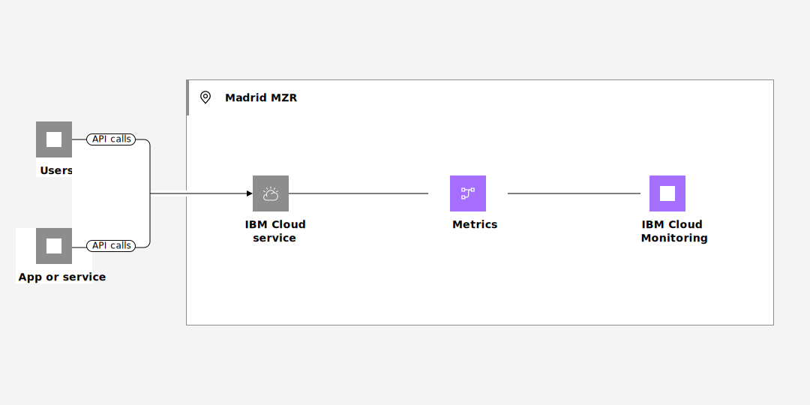

---

copyright:
  years: 2019, 2023
lastupdated: "2023-09-13"

keywords:

subcollection: monitoring

---

{{site.data.keyword.attribute-definition-list}}

# Managing metrics in a new location after {{site.data.keyword.mon_short}} is available
{: #manage-metrics-to-new-region}

To manage metrics from {{site.data.keyword.cloud_notm}} services that generate metrics in a new region where the {{site.data.keyword.mon_full_notm}} service is not available until a later date, complete these instructions.
{: shortdesc}

For example, the Madrid region opened for business in June 2023. {{site.data.keyword.cloud_notm}} services that are available and generate metrics send currently those metrics to the Frankfurt region. You can manage metrics from these services in Frankfurt. Platform metrics include the attribute `ibm_location` that specifies the region, location, or data center where the resource is available. For example, for Madrid, you can see the location of metrics set to `eu-es`.

You cannot control when an {{site.data.keyword.cloud_notm}} service makes the switch to send metrics from one region to another one. However, you can provision an instance in the new region to prepare for that switch.

Data is not sent to both locations, complete the steps before that switch is done by a service to mitigate any loss of data.
{: important}

{: caption="Figure 1. Flow of metrics in a single region" caption-side="bottom"}

Complete the following steps to enable the service in the new region:

## Step 1. Provision an instance of the service in the new region
{: #manage-metrics-to-new-region-1}

As soon as the {{site.data.keyword.mon_full_notm}} service is available in the new region, for example, Madrid, complete the following steps:

1. [Create a new {{site.data.keyword.mon_full_notm}} instance](/docs/monitoring?topic=monitoring-provision).

2. [Configure IAM access](/docs/monitoring?topic=monitoring-iam) for the new instance.

## Step 2. Configure the new instance
{: #manage-metrics-to-new-region-2}

Complete the following steps:

1. [Configure platform metrics](/docs/monitoring?topic=monitoring-platform_metrics_enabling).

    - The Schematics service will continue to send metrics to the Frankfurt region.

    - For Cloud Object Storage buckets, once the service makes the change to send metrics to Madrid, you will continue to receive metrics in Frankfurt. To move the metrics that are gerenared by a bucket to be managed through Madrid, you must use the [COS Resource Configuration API](https://cloud.ibm.com/apidocs/cos/cos-configuration){: external} to reconfigure the {{site.data.keyword.mon_short}} instance to the one located in Madrid. Otherwise, these metrics will continue to go to the instance that is configured for the bucket.

2. Customize the UI for the new instance as needed. Add your custom dashboards.

    For example, you might need to update the location to `eu-es` for a configuration in the Madrid location.

4. Create any alerts that are required for your organization on the new instance.

## Step 3. [Optional] Configure monitoring agents
{: #manage-metrics-to-new-region-3}

If you have monitoring agents configured to send data from Kubernetes clusters or Openshift clusters, for example, you can update the agents to point to the new instance in the new location (for example, Madrid).

For more information, see:
- [Configuring a Kubernetes agent](/docs/monitoring?topic=monitoring-kubernetes_cluster).
- [Configuring an Openshift cluster](/docs/monitoring?topic=monitoring-openshift_cluster).
- [Configuring a Linux VPC server instance](/docs/monitoring?topic=monitoring-ubuntu#ubuntu).
- [Configuring a Linux bare metal server](/docs/monitoring?topic=monitoring-baremetal_linux).
- [Configuring a Windows environment](/docs/monitoring?topic=monitoring-windows).
- [Configuring VMware vCenter server deployments](/docs/monitoring?topic=monitoring-vmware-vcenter).

## Step 4. Check the new instance is working
{: #manage-metrics-to-new-region-4}

To monitor metrics, [launch the web UI](/docs/monitoring?topic=monitoring-getting-started#getting-started-step4), and verify platform metrics are flowing to your instance. For more information, see [Working with platform metrics](/docs/monitoring?topic=monitoring-platform_metrics_working).
