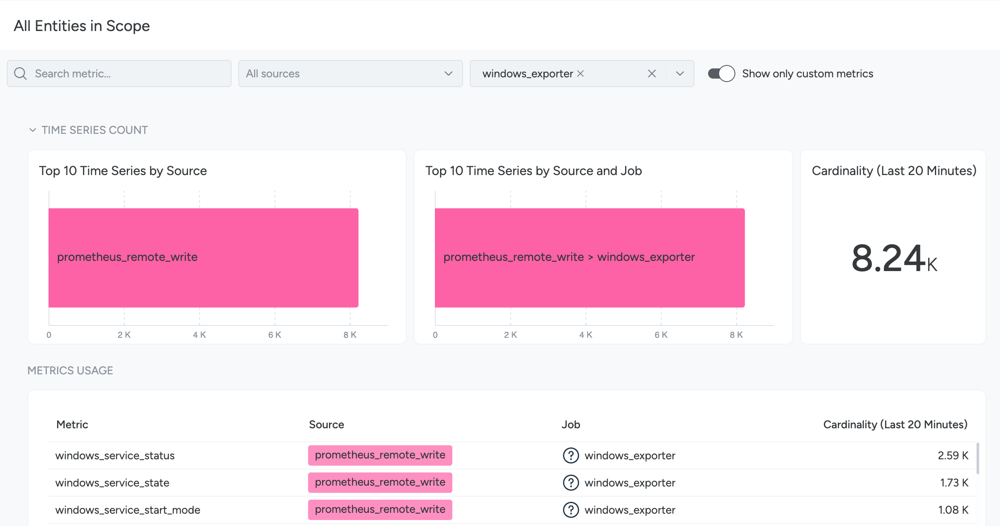

---
copyright:
  years:  2018, 2025
lastupdated: "2025-04-03"

keywords:

subcollection: monitoring
---

{{site.data.keyword.attribute-definition-list}}

# Metrics Usage
{: #metrics_usage}

Metrics Usage helps you understand how metrics are used in your {{site.data.keyword.mon_full}} environment.
{: shortdesc} 

With Metrics Usage, you can:

- Get a comprehensive view of the number of time series (cardinality) that your {{site.data.keyword.mon_full_notm}} instance is ingesting.

  This information, coupled with the ability to search for a metric within your entire infrastructure or within a scope, lets you quickly access the time series information you need when you need it.

- Obtain the time series count for each metric and an overview of the time series ingested in the last 20 minutes.

  This functionality gives you valuable data regarding metric influx.

- Download time series per metric count as a CSV or JSON file.

  This provides a tangible, offline reference point that can be helpful in trend identification and reporting.

- Discover which dashboards and alerts are using a given metric.

To access Metrics Usage, click **Explore** > **Metrics Usage** in the {{site.data.keyword.mon_full_notm}} UI.

## Search for Metrics
{: #search_metrics}

On the **Metrics Usage** tab, open the infrastructure filtering menu and select the infrastructure object you want to search. You can use all the filtering mechanisms to find what you are looking for.

### Search a metric
{: #search_a_metric}

In the **Search** field, enter the full (such as `container_cpu_usage_seconds_total`) or partial (such as `container_cpu`) metric name. The metric list and panels will be updated to show the metrics that match your search criteria.

{: caption="Searching for a single metric" caption-side="bottom"}

### Search by source
{: #search_by_source}

Select one or more sources from the **All sources** drop-down to filter metrics coming from different sources (`platform metrics`, `agent`, `prometheus_remote_write`).

{: caption="Search by source"  caption-side="bottom"}

### Search by jobs
{: #search_by_jobs

Select one or more jobs from the **All jobs** drop-down to filter all the metrics scraped by that job.  

{: caption="Search by jobs" caption-side="bottom"}

## View Metrics Details
{: #view_metric_details}

Select any metric from the **Metrics Usage** list to access additional information and actions in the slider window. The details and actions available will vary from metric to metric.

The slider has four tabs:

**Overview**
:   In the **Overview** tab, you find:

    - **Job**: Name of the job used to collect this metric.
    - **Source**: The source of this metric, such as `agent`, `prometheus_remote_write`, or `aws`.
    - **Type**: Specifies if the metric is a counter or a gauge. See [Metric Types](https://prometheus.io/docs/concepts/metric_types/){: external}.
    - **Unit**: The unit of the metric, such as `number`, `relativeTime` and `Kilobyte`.
    - **Description**: A short description of the metric.
    - **Manage Integrations**: If the metric originates from an {{site.data.keyword.mon_full_notm}} integration. This link lets you view and manage the integration.
    - **Disable Metric**: If the metric is a `custom_metric` reported by an {{site.data.keyword.mon_full_notm}} integration, you manually disable the integration to stop associated metrics from being reported. To re-enable the metric, see [Monitoring Integrations](https://docs.sysdig.com/en/docs/sysdig-monitor/integrations/monitoring-integrations/){: external}.
    - **Cardinality**: The number of time series associated with a single metric. Cardinality is shown across periods of five minutes, twenty minutes, and two hours.
    - **Open in Metrics Explorer**: Takes you to the **Metrics Explorer**, where you can further explore this metric in the context of other metrics.
    - **Open in PromQL Query**: Takes you to the **PromQL Query Explorer**, where you can craft complex PromQL queries.

**Labels**
:   The **Labels** tab features the **Label Usage** panel. This panel takes account of the active grouping and scope, and enables you to have a deeper understanding of which labels are part of a selected metric and the metric's estimated cardinality.

    Labels are listed in descending order of their estimated count. Hover over a label to reveal three actions:

    - **Label Values Preview:** A preview of label values.
    - **Open in Metrics Explorer:** Takes you to **Metrics Explorer** where you can further explore this metric and label combination over time.
    - **Open in PromQL Query:** Takes you to the **PromQL Query** where you can further explore this metric and label combination over time.

**Dashboards**
:   The **Dashboards** tab lets you explore which dashboards are using the selected metric. Results are presented in four categories:

    - **Dashboards in current Team**: The dashboards that are currently accessible and visible to the current team.
    - **Dashboard Library**: The read-only dashboards available in the library.
    - **Dashboards in other Teams**: The dashboards that are created by other teams but are not shared with the current team.
    - **Other dashboards**: The dashboards that are created privately by other users or created by the teams that you are not a part of.

**Alerts**
:   The **Alerts** tab lets you explore which alerts are using the selected metric. Results are presented in three categories:

    - **Alerts in current Team**: The alerts that are currently accessible and visible to the current active team.
    - **Alerts in other Teams**: The alerts created by other teams.
    - **Other alerts**: The alerts created by the teams that you are not a part of.

## Export Metrics Usage Data
{: #export_metrics_usage_data}

To export metrics usage data to CSV or JSON format for further processing:

1. Log in to  {{site.data.keyword.mon_full_notm}}, and select **Explore** > **Metrics Usage**.

2. Click **Export all results** at the bottom of the **Metrics Usage** table.

   A wizard will appear.

3. Select your preferred **Format**: `JSON` or `CSV`, and enter a **File name**.

4. Click **Export**.
