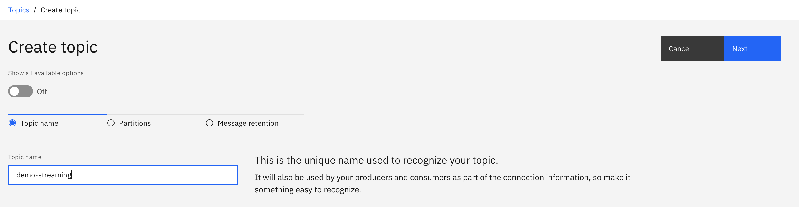
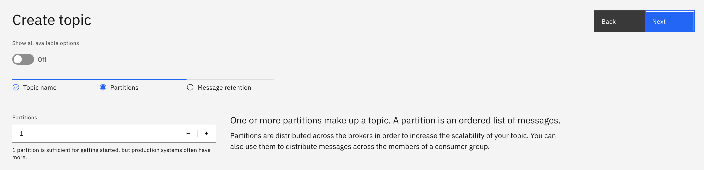
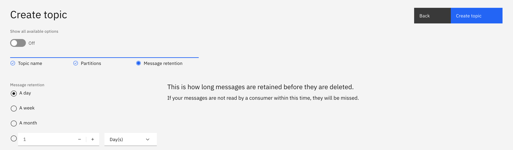
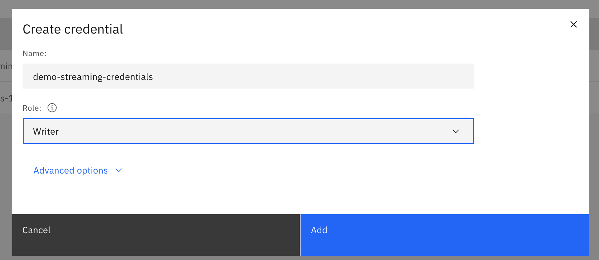
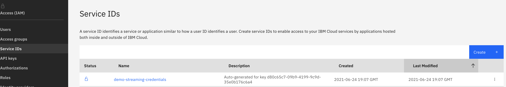
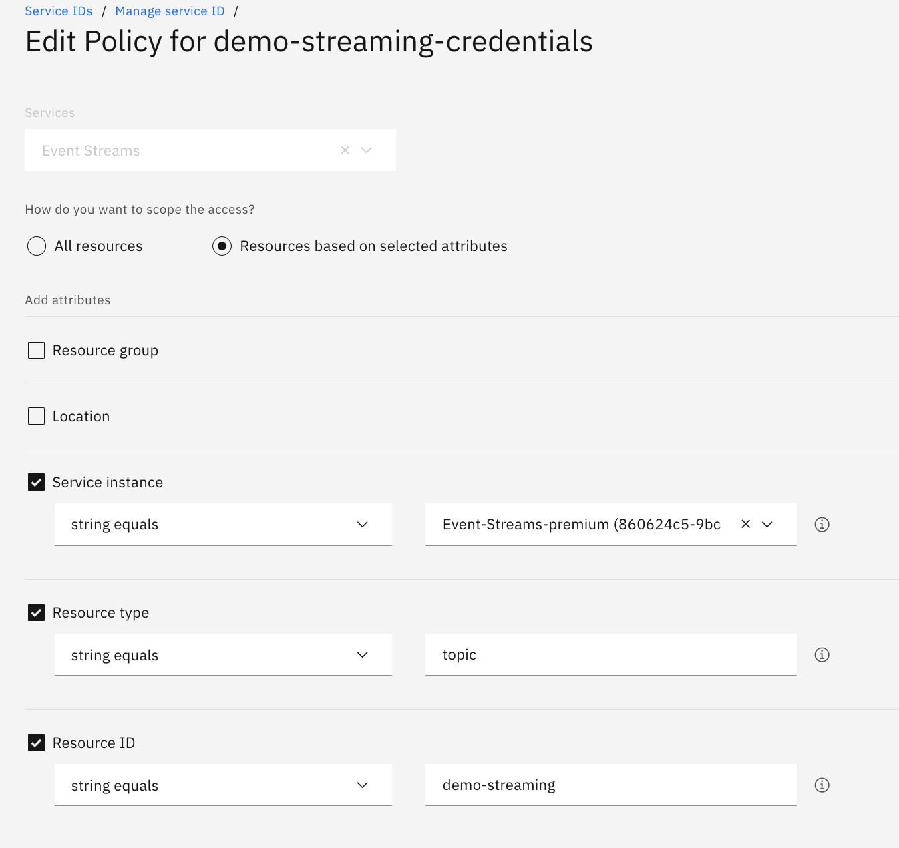
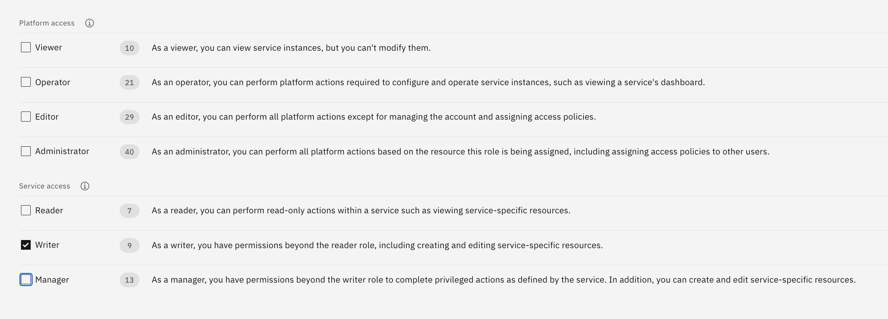
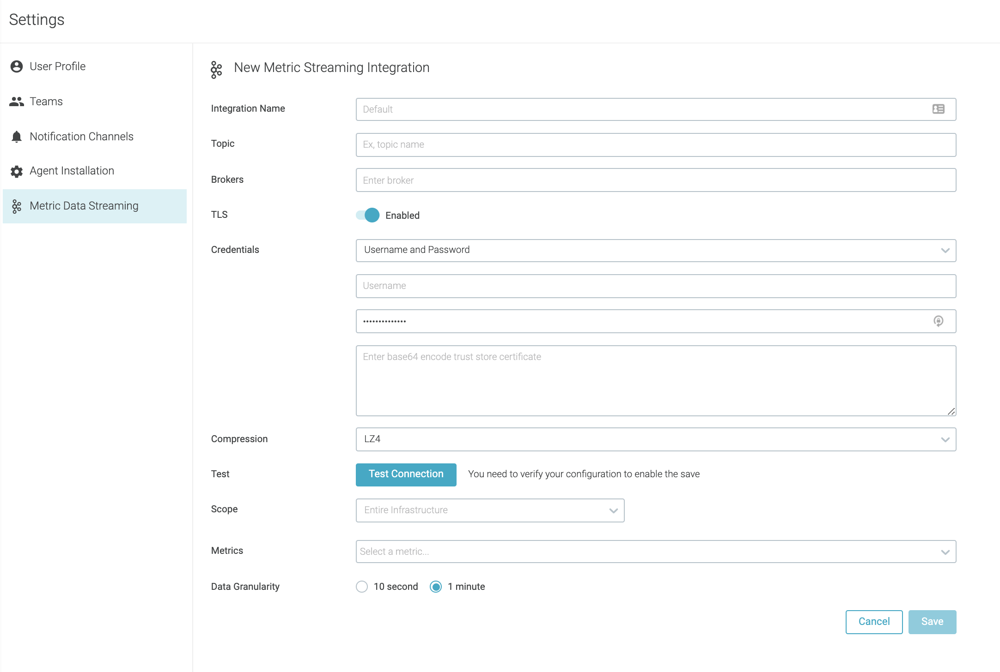
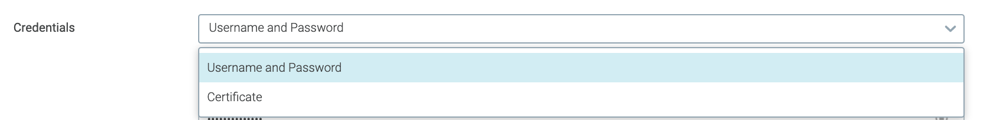
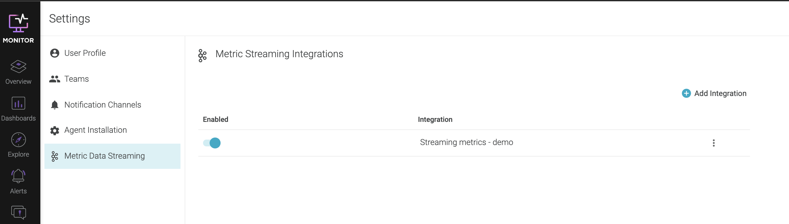

---

copyright:
  years:  2018, 2023
lastupdated: "2023-05-17"

keywords:

subcollection: monitoring

---

{{site.data.keyword.attribute-definition-list}}

# Streaming metrics to a Kafka service
{: #data_streaming}

You can use {{site.data.keyword.mon_full}} to push a set of selected metrics to a Kafka service such as {{site.data.keyword.messagehub}}.
{: shortdesc}

You will need to configure:

* The metrics to export within a defined scope.

    The metric names and scope are specified in PromQL format.
    {: important}

* The granularity of the data.

    For example, 10 seconds (10s) or 1 minute (1m).  The recommended aggregation is 1m.

* The Kafka topic to be used by {{site.data.keyword.mon_full_notm}} to export the data.


## Prereqs
{: #data_streaming_prereqs}

Check the following prereqs before managing streaming:
* [Create an {{site.data.keyword.messagehub}} instance.](/docs/EventStreams?topic=EventStreams-connecting#provision_instance).
* Check the limitations of the service plans. For more information, see [Limits and quotas](https://cloud.ibm.com/docs/EventStreams?topic=EventStreams-kafka_quotas).
* Make sure you have the appropriate permissions.

    * You must have the **manager** role to configure streaming.
    * When you configure streaming, the {{site.data.keyword.mon_full_notm}} instance and the {{site.data.keyword.messagehub}} instance must be provisioned in the same account.
    * To connect the {{site.data.keyword.mon_full_notm}} instance to the {{site.data.keyword.messagehub}} instance, you need the following information:

        * You must have the **manager** role to configure streaming in the {{site.data.keyword.mon_full_notm}} instance. This role includes the **sysdig-monitor.launch.admin** IAM action role that allows a user to perform admin tasks such as configure streaming.
        * When you configure streaming, the {{site.data.keyword.mon_short}} instance and the {{site.data.keyword.messagehub}} instance must be provisioned in the same account.
        * To connect the {{site.data.keyword.mon_short}} instance to the {{site.data.keyword.messagehub}} instance, you need the following information:

            * Endpoint URLs to call the APIs

            * Credentials for authentication

    * To create a topic in {{site.data.keyword.messagehub}}, you must have the **manager** role. This role includes the **messagehub.topic.manage** IAM action role that allows an app or user to create or delete topic.

    * The credential that {{site.data.keyword.mon_short}} uses to publish data in {{site.data.keyword.messagehub}} must have the **writer** role. This role includes the **messagehub.topic.write** IAM action role that allows an app or service to write data to 1 or more topics.

* If you configure the account to restrict access to configured IP addresses via IAM settings, or if the account limits the network locations that connections are accepted from via context based restrictions rules (CBR) for the {{site.data.keyword.messagehub}} service, you must allowlist the {{site.data.keyword.mon_short}} IPs in the account. For more information, see [{{site.data.keyword.mon_short}} endpoints](/docs/monitoring?topic=monitoring-endpoints) and [{{site.data.keyword.messagehub}} - Restricting network access](/docs/EventStreams?topic=EventStreams-restrict_access).

The instructions on this topic are based on using an Enterprise plan.
{: note}


## Manage streaming through the UI
{: #data_streaming_ui}

### Configure streaming
{: #data_streaming_ui_1}

Complete the following steps to configure streaming through the UI:

#### Step 1. Create a topic in {{site.data.keyword.messagehub}}
{: #data_streaming_step1_1}

Complete the following steps to create an Event Streams topic:

1. [Log in to your {{site.data.keyword.cloud_notm}} account](https://cloud.ibm.com/login){: external}.

	After you log in with your user ID and password, the {{site.data.keyword.cloud_notm}} dashboard opens.

2. Click the **Menu** icon  &gt; **Resource list**.

3. Look for the {{site.data.keyword.messagehub}} instance that you plan to use, and select it.

4. In the {{site.data.keyword.messagehub}} instance console, click **Manage** &gt; **Launch Dashboard**.

5. Click **Create a topic**.

    {: caption="Create a topic" caption-side="bottom"}

6. Enter a topic name and click **Next**.

    {: caption="Enter topic name" caption-side="bottom"}

7. Enter the number of partitions and click **Next**.

    One or more partitions make up a topic. A partition is an ordered list of messages. Partitions are distributed across the brokers in order to increase the scalability of your topic. You can also use them to distribute messages across the members of a consumer group.
    {: note}

    {: caption="Enter number of partitions" caption-side="bottom"}

8.  Select a **Message retention** and click **Create Topic**.

    **Message retention** defines how long messages are retained before they are deleted. If your messages are not read by a consumer within this time, they will be missed.
    {: important}


#### Step 2. Create credentials to authenticate the monitoring instance with {{site.data.keyword.messagehub}}
{: #data_streaming_step1_2}

You need the following information to connect the {{site.data.keyword.mon_short}} instance to the {{site.data.keyword.messagehub}} instance:
- Endpoint URLs to call the APIs
- Credentials for authentication

Complete the following steps to create service credentials that the {{site.data.keyword.mon_short}} instance needs to communicate with the {{site.data.keyword.messagehub}} instance:

1. In the {{site.data.keyword.cloud_notm}}, click the **Menu** icon  &gt; **Resource list**.

2. Look for the {{site.data.keyword.messagehub}} instance that you plan to use, and select it.

3. In the {{site.data.keyword.messagehub}} console, click **Service credentials**.

4. Select **New credential**.

5. Enter a name and select the **writer** role.

    {: caption="Create a credential" caption-side="bottom"}

6. Click **Add**.

To restrict access to 1 topic, complete the following steps:

1. From the menu bar, click **Manage** &gt; **Access (IAM)**, and select **Service IDs**.

    {: caption="Select Service IDs" caption-side="bottom"}

2. Select the service ID.
3. Select **Access policies**.
4. Select the policy and modify it to specify the topic.

    {: caption="Edit policy" caption-side="bottom"}

    {: caption="Modify policy" caption-side="bottom"}

5. [Get credentials using the IBM Cloud CLI](/docs/EventStreams?topic=EventStreams-connecting#connect_enterprise_external_cli) and make note of the api key and broker URL values.


#### Step 3. Configure the connection in {{site.data.keyword.mon_short}} to {{site.data.keyword.messagehub}}
{: #data_streaming_step1_3}

To configure {{site.data.keyword.mon_full_notm}} metric data streaming, do the following:

1. Launch the web UI as a user with administrator authority. For more information on how to launch the Web UI, see [Navigating to the Web UI](/docs/monitoring?topic=monitoring-launch#launch).

2. Click the **user icon**. This is the icon with the initials of the logged on user. Then click **Settings**.

3. Select **Metric Data Streaming**.

4. Click **Add Integration**. The **New Metric Streaming Integration** panel is displayed.

    {: caption="Metrics Streaming integration panel" caption-side="bottom"}

5. Specify the following information:

    Integration Name
    :   The name of the streaming configuration.

    Topic
    :   The name of the Kafka topic to receive the metrics.

    Brokers
    :   A list of Kafka brokers separated by commas, for example `kafka-2.mh-svc.eu-de.containers.appdomain.cloud:9093,kafka-1.mh-svc.eu-de.containers.appdomain.cloud:9093,kafka-0.mh-svc.eu-de.containers.appdomain.cloud:9093`. Notice that you must not enclose within `"` the URLs.

    TLS
    :   The Transport Layer Security (TLS) method. Enable TLS to encrypt and protect the transfer of data.

    Credentials
    :   The credentials used by {{site.data.keyword.mon_short}} to to export the data from the {{site.data.keyword.mon_short}} instance to the Kafka server. You can choose user and password, or a base64 encoded certificate.

    {: caption="Credential options" caption-side="bottom"}

    Compression
    :   Choose the type of compression. Valid options are: `LZ4`, `Snappy`, `Gzip`, and `Zstandard`. For more information, see [Message compression in Apache Kafka](https://developer.ibm.com/articles/benefits-compression-kafka-messaging/){: external}.

6. Click **Test Connection** to verify the connection between {{site.data.keyword.mon_full_notm}} and Kafka has been successfully configured.

    You must test the connection before saving and enable the configuration.
    {: important}

7. Select the **Scope** and define the **Metrics** to be exported.

    For **Scope**, select one or more labels to filter the defined metrics.

    **Metrics** must specify the complete metric name using PromQL.  

8. Click **Save**.

After you save the confuguration, you must wait at least 30 minutes before the streaming is active.
{: note}


### Enable or stop streaming through the UI
{: #data_streaming_ui_mng}

You can start and stop streaming of metrics from the *Metric Data Streaming* page:

1. Launch the web UI as a user with administrator authority. For more information on how to launch the Web UI, see [Navigating to the Web UI](/docs/monitoring?topic=monitoring-launch#launch).

2. Click the **user icon**. This is the icon with the initials of the logged on user. Then click **Settings**.

3. Select **Metric Data Streaming**. The list of streaming configurations is displayed.

    {: caption="Streaming configurations" caption-side="bottom"}

4. Enable or disable a streaming configuration through the toggle.


## Manage streaming by using the API
{: #data_streaming_api}

Complete the following steps to manage streaming through the UI:

### List the streaming configurations
{: #data_streaming_api_1}

Use this method to get the details for all the existing streaming configurations.

```text
curl --request GET https://<ENDPOINT>/api/v1/dataStream/configs
 -H "content-type: application/json"
 -H "Authorization: <TOKEN>"
```
{: pre}

Where
- `<ENDPOINT>`indicates the endpoint targetted by the REST API call. For more information, see [Monitoring REST API endpoints](/docs/monitoring?topic=monitoring-endpoints#endpoints_rest_api). For example, the public endpoint for an instance that is available in us-south is the following: `https://us-south.monitoring.cloud.ibm.com/api`
- `<TOKEN>` API token that you use to authenticate with the {{site.data.keyword.mon_short}} service. You must include `Bearer` with the token. For more information, see [Working with {{site.data.keyword.mon_short}} API tokens](/docs/monitoring?topic=monitoring-api_monitoring_token).


The response will be similar to the following:

```text
{"dataStreamConfigs":[{"uuid":"xxxxxxxx-xxxx-xxxx-xxxx-xxxxxxxxxxxx","enabled":true,"name":"Streaming metrics - demo","type":"kafka"}]}
```
{: codeblock}


### Get details for a streaming configuration
{: #data_streaming_api_2}

Use this method to get the details for 1 streaming configuration.

```text
curl --request GET https://<ENDPOINT>/api/v1/dataStream/configs/<STREAMING_CONFIG_ID>
 -H "content-type: application/json"
 -H "Authorization: <TOKEN>"
```
{: pre}

Where
- `<ENDPOINT>` represents the endpoint that is targetted by the REST API call. For more information, see [Monitoring REST API endpoints](/docs/monitoring?topic=monitoring-endpoints#endpoints_rest_api). For example, the public endpoint for an instance that is available in us-south is the following: `https://us-south.monitoring.cloud.ibm.com/api`
- `<TOKEN>` API token that you use to authenticate with the {{site.data.keyword.mon_short}} service. You must include `Bearer` with the token. For more information, see [Working with {{site.data.keyword.mon_short}} API tokens](/docs/monitoring?topic=monitoring-api_monitoring_token).
- `<STREAMING_CONFIG_ID>` represents the UUID of the streaming configuration for which you want to get details.


The response will be similar to the following:

```json
{
    "dataStreamConfig": {
        "uuid": "xxxxxxxx-xxxx-xxxx-xxxx-xxxxxxxxxxxx",
        "enabled": true,
        "name": "Streaming metrics - demo",
        "emitterType": "kafka",
        "emitterProperties": {
            "bootstrap.servers": "kafka-0.mh-svc1.eu-de.containers.appdomain.cloud:9093, kafka-2.mh-svc2-0000.eu-de.containers.appdomain.cloud:9093,kafka-1.mh-svc3.eu-de.containers.appdomain.cloud:9093",
            "topic.name": "my-monitoring-topic",
            "compression.type": "lz4",
            "security.protocol": "SASL_SSL",
            "sasl.mechanism": "PLAIN",
            "sasl.jaas.config": "org.apache.kafka.common.security.plain.PlainLoginModule required username=\"token\" password=\"xxxxxxxxxxxxx\";","ssl.truststore.base64.content":""}},"dataStreamRules":[{"uuid":"xxxxxxxx-xxxx-xxxx-xxxx-xxxxxxxxxxxx","enabled":true,"metrics":["kube_daemonset_labels","kube_node_status_condition"],"aggregation":"avg","aggregationSec":10,"scope":"kubernetes.cluster.name = \"mycluster\"",
            "dataStreamConfigUuid": "xxxxxxxx-xxxx-xxxx-xxxx-xxxxxxxxxxxx"
        }
    ]
}
```
{: codeblock}


### Create a streaming configuration
{: #data_streaming_api_3}


Use this method to configure 1 streaming configuration that forwards a set of metrics to {{site.data.keyword.messagehub}}.

```text
curl --request POST https://<ENDPOINT>/api/v1/dataStream/configs
 -H "content-type: application/json"
 -H "Authorization: <TOKEN>"
 -d @streaming-config.json
```
{: pre}

Where
- `<ENDPOINT>` represents the endpoint that is targetted by the REST API call. For more information, see [Monitoring REST API endpoints](/docs/monitoring?topic=monitoring-endpoints#endpoints_rest_api). For example, the public endpoint for an instance that is available in us-south is the following: `https://us-south.monitoring.cloud.ibm.com/api`
- `<TOKEN>` API token that you use to authenticate with the {{site.data.keyword.mon_short}} service. You must include `Bearer` with the token. For more information, see [Working with {{site.data.keyword.mon_short}} API tokens](/docs/monitoring?topic=monitoring-api_monitoring_token).

A sample `streaming-config.json` file looks as follows:

```json
{
    "dataStreamConfig": {
        "enabled": true,
        "name": "Streaming metrics config",
        "emitterType": "kafka",
        "emitterProperties": {
            "bootstrap.servers": "kafka-0.mh-svc1.eu-de.containers.appdomain.cloud:9093,kafka-2.mh-svc2.eu-de.containers.appdomain.cloud:9093,kafka-1.mh-svc3.eu-de.containers.appdomain.cloud:9093",
            "topic.name": "my-monitoring-topic",
            "compression.type": "lz4",
            "security.protocol": "SASL_SSL",
            "sasl.mechanism": "PLAIN",
            "sasl.jaas.config": "org.apache.kafka.common.security.plain.PlainLoginModule required username=\"token\" password=\"xxxxxxxxxx\";",
            "ssl.truststore.base64.content": ""
        }
    },
    "dataStreamRules": [
        {
            "enabled": true,
            "metrics": [
                "kube_daemonset_labels",
                "kube_node_status_condition"
            ],
            "aggregation": "avg",
            "aggregationSec": 10,
            "scope": "kubernetes.cluster.name = \"mycluster\""
        }
    ]
}
```
{: codeblock}


### Update a streaming configuration
{: #data_streaming_api_4}

Update a streaming configuration in any of the following siuations:
- The API key to authenticate with {{site.data.keyword.messagehub}} is rotated, compromissed or needs changing.
- When you want to change the metrics that you stream, by either adding new metrics or removing metrics.
- When you must change the scope.
- To enable or disable data streaming for the configuration.


Use this method to update 1 streaming configuration that forwards a set of metrics to {{site.data.keyword.messagehub}}.

```text
curl --request PUT https://<ENDPOINT>/api/v1/dataStream/configs/<STREAMING_CONFIG_ID>
 -H "content-type: application/json"
 -H "Authorization: <TOKEN>"
 -d @streaming-config.json
```
{: pre}

Where
- `<ENDPOINT>` represents the endpoint that is targetted by the REST API call. For more information, see [Monitoring REST API endpoints](/docs/monitoring?topic=monitoring-endpoints#endpoints_rest_api). For example, the public endpoint for an instance that is available in us-south is the following: `https://us-south.monitoring.cloud.ibm.com/api`
- `<TOKEN>` API token that you use to authenticate with the {{site.data.keyword.mon_short}} service. You must include `Bearer` with the token. For more information, see [Working with {{site.data.keyword.mon_short}} API tokens](/docs/monitoring?topic=monitoring-api_monitoring_token).
- `<STREAMING_CONFIG_ID>` represents the UUID of the streaming configuration.

A sample `streaming-config.json` file looks as follows:

```json
{
    "dataStreamConfig": {
        "uuid": "xxxxxxxx-xxxx-xxxx-xxxx-xxxxxxxxxxxx",
        "enabled": true,
        "name": "Streaming metrics - demo",
        "emitterType": "kafka",
        "emitterProperties": {
            "bootstrap.servers": "kafka-0.mh-svc1.eu-de.containers.appdomain.cloud:9093, kafka-2.mh-svc2-0000.eu-de.containers.appdomain.cloud:9093,kafka-1.mh-svc3.eu-de.containers.appdomain.cloud:9093",
            "topic.name": "my-monitoring-topic",
            "compression.type": "lz4",
            "security.protocol": "SASL_SSL",
            "sasl.mechanism": "PLAIN",
            "sasl.jaas.config": "org.apache.kafka.common.security.plain.PlainLoginModule required username=\"token\" password=\"xxxxxxxxxxxxx\";","ssl.truststore.base64.content":""}},"dataStreamRules":[{"uuid":"xxxxxxxx-xxxx-xxxx-xxxx-xxxxxxxxxxxx","enabled":true,"metrics":["kube_daemonset_labels","kube_node_status_condition"],"aggregation":"avg","aggregationSec":10,"scope":"kubernetes.cluster.name = \"mycluster\"",
            "dataStreamConfigUuid": "xxxxxxxx-xxxx-xxxx-xxxx-xxxxxxxxxxxx"
        }
    ]
}
```
{: codeblock}


### Delete a streaming configuration
{: #data_streaming_api_5}

Use this method to delete 1 streaming configuration that forwards a set of metrics to {{site.data.keyword.messagehub}}.

```text
curl --request DELETE https://<ENDPOINT>/api/v1/dataStream/configs/<STREAMING_CONFIG_ID>
 -H "content-type: application/json"
 -H "Authorization: <TOKEN>"
```
{: pre}

Where
- `<ENDPOINT>` represents the endpoint that is targetted by the REST API call. For more information, see [Monitoring REST API endpoints](/docs/monitoring?topic=monitoring-endpoints#endpoints_rest_api). For example, the public endpoint for an instance that is available in us-south is the following: `https://us-south.monitoring.cloud.ibm.com/api`
- `<TOKEN>` API token that you use to authenticate with the {{site.data.keyword.mon_short}} service. You must include `Bearer` with the token. For more information, see [Working with {{site.data.keyword.mon_short}} API tokens](/docs/monitoring?topic=monitoring-api_monitoring_token).
- `<STREAMING_CONFIG_ID>` represents the UUID of the streaming configuration.


## Monitoring streaming by using {{site.data.keyword.mon_full_notm}}
{: #data_streaming_mon}

{{site.data.keyword.messagehub}} is integrated with the {{site.data.keyword.mon_short}} service. {{site.data.keyword.mon_short}} provides a default template that you can customize to monitor the {{site.data.keyword.messagehub}} instance, how data is streamed out of {{site.data.keyword.mon_short}} and consumed by any application or service that is subscribed to {{site.data.keyword.messagehub}}.


Complete the following steps to monitor the {{site.data.keyword.messagehub}} instance:

1. Check that you have an instance of the {{site.data.keyword.mon_short}} in the same region as your {{site.data.keyword.messagehub}} instance. This instance must be configured to collect platform metrics. For more information, see [Enabling platform metrics](/docs/monitoring?topic=monitoring-platform_metrics_enabling).
2. [Launch the {{site.data.keyword.mon_short}} UI](/docs/monitoring?topic=monitoring-launch).
3. In the **Dashboards** section, go to **Dashboard templates** and select the template **IBM Event Streams (Enterprise)**.
4. Create a copy of the temnplate by clicking **Create custom dashboard**.

    You can use the metric *Topic bytes in per second* to see how data is sent by {{site.data.keyword.mon_short}} to {{site.data.keyword.messagehub}}.

    You can use the metric *Topic bytes out per second* to see how data is consumed by any application or service that is subscribed to {{site.data.keyword.messagehub}}.

5. (Optional) Edit the panel *Topic bytes in per second*.

    {: caption="Edit panel" caption-side="bottom"}

    Then, customize the metric to see data per topic.

    {: caption="Customize metric" caption-side="bottom"}

    Check that the resolution is set to **10M**.
