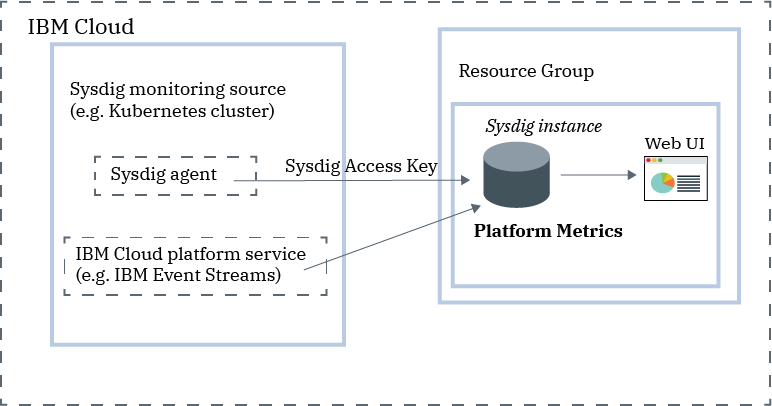

---

copyright:
  years:  2018, 2020
lastupdated: "2020-10-14"

keywords: Sysdig, IBM Cloud, monitoring, getting started

subcollection: Monitoring-with-Sysdig

---

{:new_window: target="_blank"}
{:shortdesc: .shortdesc}
{:screen: .screen}
{:pre: .pre}
{:table: .aria-labeledby="caption"}
{:codeblock: .codeblock}
{:tip: .tip}
{:download: .download}
{:important: .important}
{:note: .note}

# Getting started tutorial
{: #getting-started-monitor}

{{site.data.keyword.mon_full_notm}} is a cloud-native, and container-intelligence management system that you can include as part of your {{site.data.keyword.cloud_notm}} architecture. Use it to gain operational visibility into the performance and health of your applications, services, and platforms. It offers administrators, DevOps teams and developers full stack telemetry with advanced features to monitor and troubleshoot, define alerts, and design custom dashboards. {{site.data.keyword.mon_full_notm}} is operated by Sysdig in partnership with {{site.data.keyword.IBM_notm}}.
{:shortdesc}

The following figure shows the components overview for the {{site.data.keyword.mon_full_notm}} service that is running on {{site.data.keyword.cloud_notm}}:

To add monitoring features with {{site.data.keyword.mon_full_notm}} in the {{site.data.keyword.cloud_notm}}, you must provision an instance of the {{site.data.keyword.mon_full_notm}} service.

Before you provision an instance, consider the following information:
* The account owner can create, view, and delete an instance of a service in the {{site.data.keyword.cloud_notm}}. This user can also grant permissions to other users to work with the {{site.data.keyword.mon_full_notm}} service.
* Other {{site.data.keyword.cloud_notm}} users with `administrator` or `editor` permissions can manage the {{site.data.keyword.mon_full_notm}} service in the {{site.data.keyword.cloud_notm}}. These users must also have platform permissions to create resources within the context of the resource group where they plan to provision the instance.

You provision an instance within the context of a resource group. You use a resource group to organize your services for access control and billing purposes. You can provision the {{site.data.keyword.mon_full_notm}} instance in the *default* resource group or in a custom resource group.

When you [provision an instance](/docs/Monitoring-with-Sysdig?topic=Monitoring-with-Sysdig-provision#provision), you automatically get an ingestion key, known as the [Sysdig access key](/docs/Monitoring-with-Sysdig?topic=Monitoring-with-Sysdig-access_key#access_key).

After you provision an instance, you must configure metric sources, enable platform metrics, or both. 
* A metric source is any resource that you want to monitor and control its performance and health through a Sysdig instance. 
* You can configure a Sysdig agent to collect metrics from a source. For example, you can configure a Sysdig agent for a Kubernetes cluster. You use the access key to configure the Sysdig agent that is responsible for collecting and forwarding metric data to your instance.

    The Sysdig agent can be configured to push metrics to Sysdig via the public or private endpoints by using the appropriate ingestion URL. Details can found in the [Sysdig endpoints](/docs/Monitoring-with-Sysdig?topic=Monitoring-with-Sysdig-endpoints#endpoints) section.

    After the {{site.data.keyword.mon_full_notm}} agent is deployed in a metric source, collection and forwarding of metrics to the instance is automatic. The {{site.data.keyword.mon_full_notm}} agent automatically collects and reports on pre-defined metrics. You can configure which metrics to monitor in an environment.

* You can enable platform metrics to monitor {{site.data.keyword.cloud_notm}} services. You can only configure 1 Sysdig instance in a region to collect automatically platform metrics. [Learn more](/docs/Monitoring-with-Sysdig?topic=Monitoring-with-Sysdig-platform_metrics_enabling).

You can [monitor](/docs/Monitoring-with-Sysdig?topic=Monitoring-with-Sysdig-monitoring#monitoring), and [manage](/docs/Monitoring-with-Sysdig?topic=Monitoring-with-Sysdig-manage#manage) data through the {{site.data.keyword.mon_full_notm}} Web UI.  

Notice that there is a delay showing metric data for new time series. Data is not ready until the initial indexing of a new metric source is completed.  Therefore, new sources such as clusters, platform metrics, or systems that you configure, all take some time to become visible through the Sysdig UI.
{: note}

## Before you begin
{: #getting-started-monitor_prereqs}

You must have a user ID that is a member or an owner of an {{site.data.keyword.cloud_notm}} account. To get an {{site.data.keyword.cloud_notm}} user ID, go to: [Registration](https://cloud.ibm.com/login){: external}.

Check the regions where the service is available. [Learn more](/docs/Monitoring-with-Sysdig?topic=Monitoring-with-Sysdig-endpoints#endpoints_regions).

You can complete the getting started steps in any of the supported regions.

## Step 1. Manage user access
{: #step1}

See [Manage user access](/docs/Monitoring-with-Sysdig?topic=Monitoring-with-Sysdig-getting-started#step1).

## Step2. Provision an instance of the {{site.data.keyword.mon_full_notm}} service
{: #getting-started-monitor_step2}

See [Provision an instance of the IBM Cloud Monitoring with Sysdig service](/docs/Monitoring-with-Sysdig?topic=Monitoring-with-Sysdig-getting-started#step2).

## Step3. Configure a Sysdig agent
{: #getting-started-monitor_step3}

See [Configure a Sysdig agent](/docs/Monitoring-with-Sysdig?topic=Monitoring-with-Sysdig-getting-started#step3).

## Step 4. Launch the web UI
{: #getting-started-monitor_step4}

See [Launch the web UI](/docs/Monitoring-with-Sysdig?topic=Monitoring-with-Sysdig-getting-started#step4).

## Step 5. Monitor your environment
{: #getting-started-monitor_step5}

You can analyze data in the *Explore* tab and in the *Dashboard* tab of the web UI. You monitor the data through metric views and dashboards. 

* Use a metric view to monitor an individual metric.
* Use dashboards to get a specialized insight into network data, application data, topology, services, hosts, and containers by monitoring data through panels. A panel displays a metric or group of metrics in a dashboard.
{: tip}

In the *Explore* tab, you can monitor data by using default metrics and default dashboards. You can use labels to define new infrastructure groups that you can then use to aggregate data differently and monitor your environment. You can also use custom dashboards that you define through the *Dashboard* tab.

In the *Dashboards* tab, you can monitor data by using any of the default dashboards or by creating new ones.

For more information, see [Monitoring your environment](/docs/Monitoring-with-Sysdig?topic=Monitoring-with-Sysdig-monitoring#monitoring)

## Step 6. Manage data
{: #getting-started-monitor_step6}

You can use labels to group infrastructure resources into logical hierarchies, filter out data, and split aggregated data into segments. Customize how data is aggregated when you configure a graph or create an alert for a metric. Set the scope of a dashboard, a panel, or an alert to filter out data points. Restrict access to data by managing users' data access through teams. 

For example, for a metric view, you can define the scope of the data, how to aggregate data, and what time and group filters to apply to the data. 

For more information, see [Managing data](https://docs.sysdig.com/en/metrics.html){: external}.

## Step 7. Configure alerts and explore events
{: #getting-started-monitor_step7}

You can use events to review, track, and resolve issues. An event is a notification that informs about something that has occurred in any of the nodes that forward data to your {{site.data.keyword.mon_full_notm}} instance. 

There are different types of events: 

* *Alert events* are events that are triggered by user-configured alerts. For example, configure alerts to be notified of problems that require attention. 
* *Infrastructure-based events* are events that are collected from Docker and Kubernetes nodes. By default, the Sysdig agent automatically discovers and collects data from a select group of events. You can edit the agent configuration file to enable more events.
* *Custom events* that you configure through any of the following integrations: Slackbot, pre-built Python scripts, custom user-created Python scripts, or cURL requests.

When you define an alert, you must define the condition that triggers the notification, one or more notification channels through which you want to be notified, the severity of the alert, and the type of alert. The *Alerts* section in the web UI shows the list of pre-defined alerts. From this view, you can enable and disable pre-defined alerts; you can modify existing alerts; and you can create new alerts. For more information, see [Working with alerts](https://docs.sysdig.com/en/alerts.html){: external}.

You configure one or more notification channels in the *Settings* section in the web UI. Valid notification channels are: *email*, *slack*, *PagerDuty*, *Webhooks*, *OpsGenie*, and *VictorOps*. For more information, see [Working with notification channels](/docs/Monitoring-with-Sysdig?topic=Monitoring-with-Sysdig-notifications).

Next, explore [Working with custom events](https://docs.sysdig.com/en/events.html){: external}.

