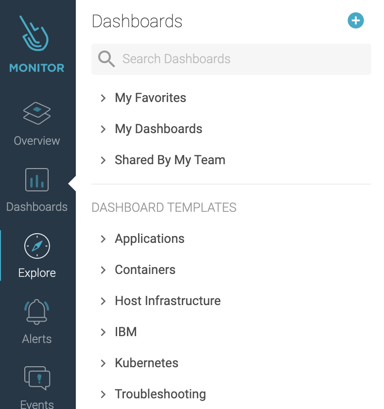
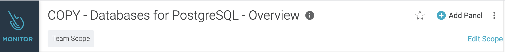
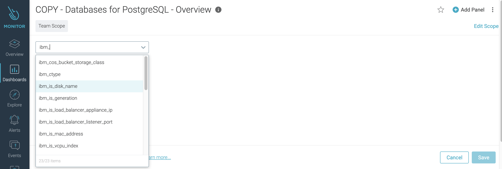
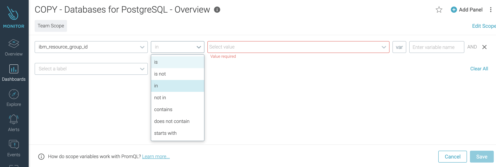

---

copyright:
  years:  2018, 2020
lastupdated: "2020-11-12"

keywords: Sysdig, IBM Cloud, monitoring, platform metrics

subcollection: Monitoring-with-Sysdig

---

{:new_window: target="_blank"}
{:shortdesc: .shortdesc}
{:screen: .screen}
{:pre: .pre}
{:table: .aria-labeledby="caption"}
{:codeblock: .codeblock}
{:tip: .tip}
{:download: .download}
{:important: .important}
{:note: .note}
{:external: target="_blank" .external}

 
# Working with platform metrics
{: #platform_metrics_working}

Platform metrics are metrics that are exposed by enabled-Sysdig services and the platform in {{site.data.keyword.cloud_notm}}. 
{:shortdesc}

* Platform metrics are regional. 

    You can monitor metrics from enabled-Sysdig services on the {{site.data.keyword.cloud_notm}} in the region where the service is available. 

* You can configure 1 instance only of the {{site.data.keyword.mon_full_notm}} service per region to collect *platform metrics* in that location. 

    To configure a Sysdig instance, you must set on the *platform metrics* configuration setting. 

    You must be assigned the IAM Editor role or higher for the IBM Cloud Monitoring with Sysdig service to configure platform metrics.

* If a Sysdig instance in a region is already enabled to collect platform metrics, metrics from enabled-Sysdig services are collected automatically and available for monitoring through this instance. For more information about enabled-Sysdig services, see [Cloud services](/docs/Monitoring-with-Sysdig?topic=Monitoring-with-Sysdig-cloud_services).

* To monitor platform metrics for a service instance, check that the {{site.data.keyword.mon_full_notm}} instance is provisioned in the same region where the service instance that you want to monitor is provisioned.

## Controlling what data is visible 
{: global-attributes}

You can use attributes to segment metrics so that you can define what data is visible to users.

The following global attributes are available for segmenting metrics:

| Attribute               | Attribute Name              | Attribute Description |
|-------------------------|-----------------------------|-----------------------|
| `Cloud Type`            | `ibm_ctype`                 | Type.  Valid values: `public`, `dedicated`, or `local` |
| `Location`              | `ibm_location`              | Location of the monitored resource.   This field can be set to a region, a data center, or global. |
| `Scope`                 | `ibm_scope`                 | Scope of the metric.   This field can be set to the account GUID, an organization GUID, or a space GUID. |
| `Service name`          | `ibm_service_name`          | Name of the service generating this metric. |
| `Service instance`      | `ibm_service_instance`      | Service instance GUID that identifies the instance the metric is associated with. |
| `Service instance name` | `ibm_service_instance_name` | Service instance name.  This field provides the user-provided name of the service instance which isn't necessarily a unique value depending on the name provided by the user. |
| `Resource group name`   | `ibm_resource_group_name`   | The resource group name where the service instance is created. |
| `Resource group ID`     | `ibm_resource_group_id`     | The resource group GUID where the service instance is created. |
{: caption="Table 1. Global attributes" caption-side="top"}

Other attributes are available per {{site.data.keyword.cloud_notm}} service. In the [Cloud services](/docs/Monitoring-with-Sysdig?topic=Monitoring-with-Sysdig-cloud_services) topic, identify the service tha you want to monitor and navigate the the *More info* section. Look for the section **Attributes for segmentation** to get the list of attributes that you can use to segment metrics for that service. 

You can control the data that is visible for analysis per team, per dashboard, and per panel. 

### Dashboards
{: global-attributes-1}

You can use global attributes to set the scope of dashboards:
- The scope defines the data that is valid for aggregation. 
- Only the data that is in scope is displayed. 
- The scope that is set at the dashboard level applies to all panels in the dashboard.
- You can override the main dashboard scope and specify a specific scope for a panel.

### Panels
{: global-attributes-2}

You can use global attributes to set the scope of a panel:
- The scope defines the data that is valid for aggregation. 
- Only the data that is in scope is displayed. 

### Teams
{: global-attributes-3}

You can use global attributes to define the data that is visible and available for analysis in a team.

 
## Monitoring platform metrics by using dashboards
{: #platform_metrics_working_dash}

Each {{site.data.keyword.cloud_notm}} provides 1 or more dashboard templates that you can use to monitor that service. 

- Dashboard templates are available in the **Dashboards** section of the Sysdig web UI, under the **IBM** section. 

    

- Dashboard templates are only visible in the Sysdig web UI if you have an instance of the service running in that region.
- Dashboard templates cannot be customized. 

You can create a copy of a dashboard template. You can customize the copy of the dashboard.

### Creating a custom dashboard
{: #platform_metrics_working_dash-1}

Complete the following steps to create a custom dashboard:

1. [Launch the Sysdig web UI](/docs/Monitoring-with-Sysdig?topic=Monitoring-with-Sysdig-launch).
2. Navigate to the **DASHBOARD** section () in the Web UI.
3. In the **DASHBOARD TEMPLATES** section, expand **IBM**, and select a dashboard template for a service that you want to monitor.
4. Select **Create Custom Dashboard**. The window *Create Dashboard from Template* opens. 
5. Enter a name for your dashboard, and click **Create and Open**. The dashboard opens.

You can locate the dashboard tha you have copied in the section **DASHBOARDS** &gt **My Dashboads**.

Next, customize the scope and panels in the dashboard.

### Defining the scope of a dashboard
{: #platform_metrics_working_dash-2}

Complete the following steps:

1. [Launch the Sysdig web UI](/docs/Monitoring-with-Sysdig?topic=Monitoring-with-Sysdig-launch).
2. Navigate to the **DASHBOARD** section () in the Web UI.
3. Select a custom dashboard in the **My Dashboards** section.
4. To modify the scope, click **Edit scope**.

    

    The following page opens:

    

5. In the drop-down box, enter **ibm** and select an attribute. 

6. Select an operator.

    

7. Select 1 or more values.

    

    You can also define the value empty, and select **var** ()to define a variable so users can choose 1 value when they analyze data through the dashboard.
    {: note}

8. Continue adding more attributes. When you have the scope defined, click **Save**.

### Defining the scope of a panel
{: #platform_metrics_working_dash-3}

Complete the following steps:

1. [Launch the Sysdig web UI](/docs/Monitoring-with-Sysdig?topic=Monitoring-with-Sysdig-launch).
2. Navigate to the **DASHBOARD** section () in the Web UI.
3. Select a custom dashboard in the **My Dashboards** section.
4. Select a panel where you want to change the scope of the data.
5. Select the *Pencil* icon . Then, in the *Scope* section, click **Dashboard scope**.

    

6. By default, **Inherit Dashboard Scope* is selected. To specify a custom scope, you must deselect this option.

    1. In the drop-down box, enter **ibm** and select an attribute. 

    2. Select an operator.

    3. Select 1 or more values.

7. In a panel, you can configure 1 or more metrics. Select **Apply to All Queries** if you want the scope to apply to all the metrics that are configured for the panel.

To save the scope, you must click **Save** at the panel level.

## Monitoring platform metrics by defining alerts

## Limiting access to platform metrics through teams

### Configuring the data that is visible for a team

