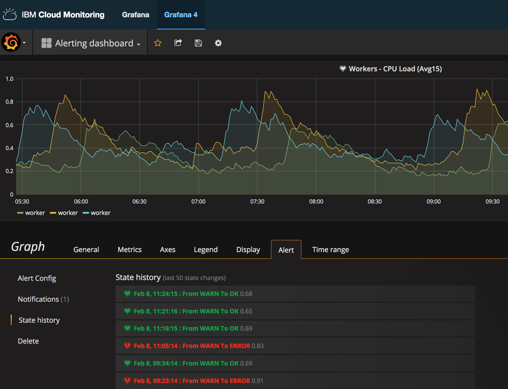

---

copyright:
  years: 2017, 2019

lastupdated: "2019-03-06"

keywords: IBM Cloud, monitoring

subcollection: cloud-monitoring

---

{:new_window: target="_blank"}
{:shortdesc: .shortdesc}
{:screen: .screen}
{:pre: .pre}
{:table: .aria-labeledby="caption"}
{:codeblock: .codeblock}
{:tip: .tip}
{:download: .download}
{:important: .important}
{:note: .note}

# Verlaufsprotokoll eines Alerts in Grafana abrufen
{: #retrieve_history_grafana}

In Grafana können Sie das Verlaufsprotokoll eines Alerts anzeigen. 
{:shortdesc}

Führen Sie die folgenden Schritte aus, um das Verlaufsprotokoll eines Alerts abzurufen:

1. Wählen Sie das Steuerelement zum Hin- und Herschalten  in der seitlichen Menüleiste aus.
2. Wählen Sie **Dashboards** aus.
3. Wählen Sie das Dashboard aus, für das der Alert definiert ist.
4. Klicken Sie auf den Grafiktitel und wählen Sie anschließend **Bearbeiten** aus.
    
    Die Registerkarte *Metriken* wird angezeigt. 

5. Wählen Sie die Registerkarte **Alert** aus.
6. Wählen Sie **Statusverlaufsprotokoll** aus.

    Alle aufgeführten Einträge stellen jeweils eine Instanz dar, wenn der Alert ausgelöst wurde.

