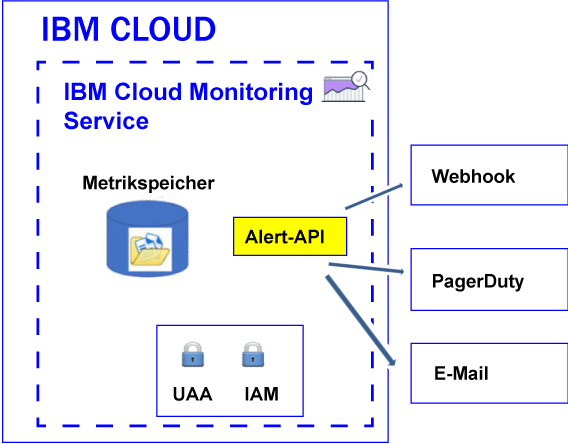

---

copyright:
  years: 2017, 2019

lastupdated: "2019-03-06"

keywords: IBM Cloud, monitoring

subcollection: cloud-monitoring

---

{:new_window: target="_blank"}
{:shortdesc: .shortdesc}
{:screen: .screen}
{:pre: .pre}
{:table: .aria-labeledby="caption"}
{:codeblock: .codeblock}
{:tip: .tip}
{:download: .download}
{:important: .important}
{:note: .note}


# Alerts konfigurieren
{: #config_alerts_ov}

Der {{site.data.keyword.monitoringshort}}-Service stellt ein abfragebasiertes Alertausgabesystem zur Verfügung. Sie können Alerts mithilfe der {{site.data.keyword.monitoringshort}}-API oder über Grafana konfigurieren. Zur Konfiguration eines Alerts müssen Sie Regeln und Benachrichtigungsmethoden für jede Metrikabfrage festlegen, die Sie überwachen möchten. Sie können durch Senden einer E-Mail, durch Auslösen eines Webhooks oder durch Senden eines Alerts an PagerDuty benachrichtigt werden.
{:shortdesc}

Sie können einen Alert definieren, um eine Benachrichtigung für eine Metrik auszulösen. Ein Alert wird durch eine Regel, die die zu überwachende Metrikabfrage, den Schwellenwert und die beim Überschreiten des Schwellenwerts auszuführende Aktion beschreibt, sowie durch eine oder mehrere Benachrichtigungsmethoden definiert.  

In der folgenden Tabelle sind die verschiedenen Methoden und unterstützten Aktionen aufgeführt, die Sie bei der Arbeit mit Alerts verwenden können:

<table>
  <caption>Methoden für die Arbeit mit Alerts</caption>
	<tr>
    <th>Methode</th>
		<th>Alert definieren</th>
		<th>Alert aktualisieren</th>
		<th>Alert löschen</th>
	</tr>
	<tr>
    <td>Alert-API</td>
		<td>Ja</td>
		<td>Ja</td>
		<td>Ja</td>
	</tr>
	<tr>
    <td>Grafana</td>
		<td>Ja</td>
		<td>Ja</td>
		<td>Ja</td>
	</tr>
</table>

**Hinweis:** Alerts, die Sie mithilfe der Alert-API definieren, werden nicht im Grafana-Dashboard angezeigt.


In der folgenden Abbildung sind die verschiedenen Benachrichtigungstypen dargestellt, die Sie im {{site.data.keyword.monitoringshort}}-Service konfigurieren können, um Alerts zu erhalten:



Sie können Alerts für eine einzelne Instanz oder für mehrere Instanzen definieren. Wenn eine Abfrage, die Sie mithilfe einer Alertregel überwachen, einen Platzhalter enthält, gibt der Platzhalter mehrere Ziele, d. h., mehrere Serviceinstanzen oder Anwendungsinstanzen, an. Alle 5 Minuten führt der {{site.data.keyword.monitoringshort}}-Service die in einer Alertregel konfigurierte Abfrage aus und überprüft die letzten Datenpunkte, die für die einzelnen Instanzen zurückgegeben werden. Der {{site.data.keyword.monitoringshort}}-Service protokolliert den letzten Status der einzelnen Instanzen und generiert einen neuen Alert, wenn sich der Status des Alerts ändert. 


## Mit Alerts mithilfe der Alert-API arbeiten
{: #api}

Sie können Alerts mithilfe der Alert-API definieren, aktualisieren oder löschen.

Um einen Alert für eine Metrikabfrage mithilfe der Alert-API zu definieren, müssen Sie die folgenden Aktionen ausführen:

1. Definieren Sie mindestens eine Metrikabfrage in einem Grafana-Dashboard. 

    **Hinweis:** Sie können keine Alerts in Grafana-Dashboards definieren, die Vorlagenvariablen verwenden.

2. Konfigurieren Sie einen Alert für eine Metrikabfrage, die im Grafana-Dashboard definiert ist.

    * [Alert konfigurieren, der eine E-Mail sendet](/docs/services/cloud-monitoring/alerts?topic=cloud-monitoring-configure_email_alert#configure_email_alert).
    * [Alert konfigurieren, der eine PagerDuty-Benachrichtigung sendet](/docs/services/cloud-monitoring/alerts?topic=cloud-monitoring-configure_pagerduty_alert#configure_pagerduty_alert).
    * [Alert konfigurieren, der eine Webhook-Benachrichtigung sendet](/docs/services/cloud-monitoring/alerts?topic=cloud-monitoring-configure_webhook_alert#configure_webhook_alert).

    **Hinweis:** Sie können nur E-Mail-Benachrichtigungen für Metrikabfragen definieren, die in der Kontometrikdomäne angegeben sind.


## Mit Alerts in Grafana arbeiten
{: #grafana}

Sie können Alerts direkt in einem Grafana-Dashboard definieren und löschen. Zudem können Sie Regeldefinitionen aktualisieren. Änderungen am Benachrichtigungskanal müssen jedoch über die Alert-API vorgenommen werden.

Berücksichtigen Sie bei der Arbeit mit Alerts in Grafana die folgenden Informationen:

* Um die einer Regel zugewiesenen Benachrichtigungskanäle zu ändern, müssen Sie die Alert-API verwenden.
* Wenn Sie einen Benachrichtigungskanal in einer Bereichsdomäne löschen, werden Regeln, für die dieser Kanal konfiguriert ist, nicht aktualisiert. Um die Regel zu ändern und den Benachrichtigungskanal aus dieser Regel zu entfernen, müssen Sie die Alert-API verwenden. 

Um einen Alert für eine Metrikabfrage direkt in einem Grafana-Dashboard zu definieren, müssen Sie die folgenden Aktionen ausführen:

1. Definieren Sie mindestens eine Metrikabfrage in einem Grafana-Dashboard. 

    **Hinweis:** Sie können keine Alerts in Grafana-Dashboards definieren, die Vorlagenvariablen verwenden.

2. Konfigurieren Sie einen Alert für eine Metrikabfrage, die im Grafana-Dashboard definiert ist.

    Weitere Informationen finden Sie unter [Alerts in Grafana konfigurieren](/docs/services/cloud-monitoring/alerts?topic=cloud-monitoring-config_alerts_grafana#config_alerts_grafana).


## Alertstatus
{: #status}

Ein Alert kann einen der folgenden Status aufweisen, wenn die Regel aktiviert ist:

* *OK*: Der Status einer Regel lautet *OK*, wenn Folgendes zutrifft:
    
	* Im {{site.data.keyword.monitoringshort}}-Service sind Daten für die Metrikabfrage verfügbar, die dieser Regel zugeordnet ist. Sie haben einen Schwellenwert für Warnungen und für Fehler festgelegt. Der Wert der Daten überschreitet den Schwellenwert nicht.
	 
	* Im {{site.data.keyword.monitoringshort}}-Service sind keine Daten für die Metrikabfrage verfügbar, die dieser Regel zugeordnet ist, und Sie haben für die Regeleigenschaft `allow_no_data` die Einstellung *true* konfiguriert.           
	 
* *WARNING*: Der Status der Regel lautet *WARNING*, wenn im {{site.data.keyword.monitoringshort}}-Service Daten für die Metrikabfrage verfügbar sind, die dieser Regel zugeordnet ist. Sie haben einen Schwellenwert für Warnungen und für Fehler festgelegt. Der Wert der Daten liegt zwischen dem Warnungsschwellenwert und dem Fehlerschwellenwert.
	
* *ERROR*: Der Status der Regel lautet *ERROR*, wenn im {{site.data.keyword.monitoringshort}}-Service Daten für die Metrikabfrage verfügbar sind, die dieser Regel zugeordnet ist. Sie haben einen Schwellenwert für Warnungen und für Fehler festgelegt. Der Fehlerschwellenwert ist erreicht.  

* *UNKNOWN*: Der Status der Regel lautet *UNKNOWN*, wenn im {{site.data.keyword.monitoringshort}}-Service keine Daten für die Metrikabfrage verfügbar sind, die dieser Regel zugeordnet ist. Sie können mithilfe der Eigenschaft `allow_no_data`, die Sie für die Regel konfigurieren, angeben, ob Sie eine Benachrichtigung erhalten möchten. Wenn Sie für diese Eigenschaft `false` festlegen, werden Sie benachrichtigt, dass für die Regel keine Daten gefunden wurden.


	
## Alertprotokoll
{: #history}

Immer dann, wenn der Status eines Alerts sich ändert, wird der Protokollsatz des Alerts aktualisiert. Sie können die Alerts-API (*/v1/alert/history*) verwenden, um Informationen über das Verlaufsprotokoll einer Metrik abzurufen.

Der Status eines Alerts wird verwendet, um den Status in einem der folgenden Szenarios zu definieren:

* Status der Abfrage bevor die Regel eine Benachrichtigung auslöst.
* Status der Abfrage nachdem die Regel ausgelöst wurde. 

Wenn zum Beispiel ein Warnungsschwellenwert überschritten wird, wird ein Protokollsatz generiert, der den Übergang von *OK* zu *WARNING* aufzeichnet. Ebenso wird ein Protokollsatz generiert, wenn der Wert wieder unter den Schwellenwert sinkt. Dieser Protokollsatz zeichnet dann den Übergang von *WARNING* zu *OK* auf.

Weitere Informationen finden Sie unter [Verlaufsprotokoll einer Regel abrufen](/docs/services/cloud-monitoring/alerts?topic=cloud-monitoring-retrieve_history#retrieve_history).


## Regeln
{: #rules1}

Eine Regel beschreibt die zu überwachende Metrikabfrage, den Schwellenwert und die Aktion, die ausgeführt werden soll, wenn der Schwellenwert überschritten wird. 

* Sie können mithilfe der Alert-API eine Regel erstellen, löschen, aktualisieren, Details für eine Regel anzeigen und alle Regeln auflisten. [Mit Regeln arbeiten](/docs/services/cloud-monitoring/alerts?topic=cloud-monitoring-rules#rules).

    * Informationen zum Erstellen einer Regel finden Sie unter [Eine Regel erstellen](/docs/services/cloud-monitoring/alerts?topic=cloud-monitoring-rules#create).
	* Informationen zum Löschen einer Regel finden Sie unter [Eine Regel löschen](/docs/services/cloud-monitoring/alerts?topic=cloud-monitoring-rules#delete).
	* Informationen zum Aktualisieren einer Regel finden Sie unter [Eine Regel aktualisieren](/docs/services/cloud-monitoring/alerts?topic=cloud-monitoring-rules#update).
	* Informationen zum Auflisten aller Regeln finden Sie unter [Alle Regeln auflisten](/docs/services/cloud-monitoring/alerts?topic=cloud-monitoring-rules#list).
	* Informationen zum Anzeigen von Informationen zu einer Regel finden Sie unter [Details einer Regel anzeigen](/docs/services/cloud-monitoring/alerts?topic=cloud-monitoring-rules#showing-the-details-of-a-rule).

* Das Alertsystem überprüft alle 5 Minuten die Regeln, die im Bereich aktiviert sind.

* Standardmäßig wird eine Regel aktiviert, wenn Sie sie erstellen. Sie können die Regel jedoch definieren und inaktivieren, indem Sie für das Feld *enable* die Einstellung `false` konfigurieren.

* Wenn für den Regelparameter *comparison* die Einstellung 'below' festgelegt wird, muss der Wert für 'error_level' niedriger sein als der Warnungsschwellenwert. Wenn für den Regelparameter *comparison* die Einstellung 'above' festgelegt wird, muss der Wert für 'error_level' höher sein als der Warnungsschwellenwert.

* Standardmäßig ist beim Erstellen einer Regel für das Feld *allow_no_data* die Einstellung `true` festgelegt. Wenn keine Datenpunkte verfügbar sind, werden nur dann Benachrichtigungen gesendet, wenn die Regelbedingung ausgelöst wird. Wenn Sie eine Benachrichtigung erhalten möchten, in der Sie darüber informiert werden, dass keine Daten für Regel X gefunden wurden, müssen Sie für das Feld *allow_no_data* die Einstellung `false` festlegen. 

**Tipp:** Überprüfen Sie die Abfrage, die Sie mithilfe einer Alertregel überwachen, in Grafana. Stellen Sie sicher, dass es zu keiner Zeitlimitüberschreitung kommt. Eine Zeitlimitüberschreitung kann auftreten, weil ein langer Zeitraum konfiguriert ist oder die definierte Abfrage ein Platzhalterzeichen enthält. Beachten Sie, dass ein für eine Abfrage konfigurierter Alert nicht ausgelöst wird, wenn für die betreffende Abfrage eine Zeitlimitüberschreitung in Grafana auftritt.

Die folgenden Felder sind erforderlich, um eine Regel zu definieren:

<table>
  <caption>Tabelle 1. Liste der Felder, die zum Definieren einer Regel verwendet werden.</caption>
  <tr>
    <th>Feldname</th>
	<th>Beschreibung</th>
  </tr>
  <tr>
    <td>name</td>
	<td>Der Name der Regel. Dieser Name muss eindeutig sein.</td>
  </tr>
  <tr>
    <td>description</td>
	<td>Zusammenfassung der Regel.</td>
  </tr>
  <tr>
    <td>expression</td>
	<td>Metrikabfrage, die Sie überwachen möchten und für die Sie einen Alert senden möchten, wenn der Schwellenwert überschritten wird. <br>Gültige Ausdrücke sind: ein einzelner Metrikname, mehrere Metriken, die durch Platzhalterzeichen angegeben werden, oder Funktionen zur Aggregation von Daten. <br>** Tipp:** Sie können eine verifizierte Abfrage von Grafana kopieren.</td>
  </tr>
  <tr>
    <td>enabled</td>
	<td>Beschreibt den Status der Regel: <br>Setzen Sie die Eigenschaft auf `true`, um die Regel zu aktivieren. <br>Setzen Sie die Eigenschaft auf `false`, um die Regel zu inaktivieren. <br>Standardmäßig ist hierfür `true` festgelegt.</td>
  </tr>
  <tr>
    <td>from</td>
	<td>Anfangszeitpunkt, der für die Analyse der Daten auf Grundlage von Grenzwerten verwendet wird, die Sie für die von Ihnen im Ausdrucksfeld definierte Abfrage festgelegt haben. Beispiel: `"from": "-5min"`</td>
  </tr>
  <tr>
    <td>until</td>
	<td>Endzeitpunkt, der für die Analyse der Daten auf Grundlage von Grenzwerten verwendet wird, die Sie für die von Ihnen im Ausdrucksfeld definierte Abfrage festgelegt haben. Beispiel: `"until": "now"`</td>
  </tr>
  <tr>
    <td>comparison</td>
	<td>Vergleichsoperation, die verwendet wird, um zu bestimmen, welche Art der Überprüfung durchgeführt wird. Gültige Werte sind: *below* und *above*. </td>
  </tr>
  <tr>
    <td>comparison_scope</td>
	<td>Definiert den Bereich der Daten, die analysiert werden. <br>Legen Sie *last* fest, um den letzten Wert in den Serien (in den Daten, die für Ihre Abfrage erforderlich sind) anzuzeigen.</td>
  </tr>
  <tr>
    <td>error_level</td>
	<td>Definiert den Schwellenwert, den Sie festlegen, um einen Fehleralert auszulösen. <br>Legen Sie den Wert fest, bei dessen erreichen ein Fehleralert generiert werden soll. Beispiel: `"error_level" : 27.94`</td>
  </tr>
  <tr>
    <td>warning_level</td>
	<td>Definiert den Schwellenwert, den Sie festlegen, um einen Warnungsalert auszulösen. <br>Legen Sie den Wert fest, bei dessen erreichen ein Warnungsalert generiert werden soll. Beispiel: `"warning_level" : 24`</td>
  </tr>
  <tr>
    <td>frequency</td>
	<td>Definiert, wie häufig die Prüfung durchgeführt wird. <br>Die Messung erfolgt in Minuten, Stunden oder Tagen, z. B. 5min, 1h, 7d. <br>Für die Durchführung einer Prüfung einmal pro Minute können Sie zum Beispiel `"frequency": "1min"` festlegen. <br>**Hinweis:** Zum gegenwärtigen Zeitpunkt ist für die Häufigkeit eine Einstellung von 5 Minuten festgelegt.</td>
  </tr>
  <tr>
    <td>dashboard_url</td>
	<td>Definiert die URL zu einem Grafana-Dashboard, in dem die überwachte Abfrage definiert ist.</td>
  </tr>
    <tr>
    <td>allow_no_data</td>
	<td>Definiert die Bedingung für das Senden einer Benachrichtigung, wenn keine Datenpunkte verfügbar sind. <br>Standardmäßig ist hierfür `true` festgelegt. <br>Legen Sie `false` fest, wenn Sie benachrichtigt werden möchten, dass keine Daten für Regel X gefunden wurden.</td>
  </tr>
  <tr>
    <td>notifications</td>
	<td>Der Name der Benachrichtigung, der die Aktion definiert, die Sie für die Regel auslösen möchten. <br>**Hinweis:** Sie können eine oder mehrere Benachrichtigungen pro Regel definieren, indem Sie Benachrichtigungsnamen durch Kommas getrennt auflisten.</td>
  </tr>
</table>

Es folgt ein Beispiel für eine Regel:

```
{
  "name": "checkbytesin1",
  "description": "MH check Bytes In per second",
  "expression": "movingAverage(messagehub.65ad9211-1234-5678-a751-c82123411eee.1.kafka-java-console-sa
mple-topic.BytesInPerSec.15MinuteRate,\"5min\")",
  "enabled": true,
  "from": "-5min",
  "until": "now",
  "comparison": "below",
  "comparison_scope": "last",
   "error_level" : 22.94,
   "warning_level" : 25,
  "frequency": "1min",
  "dashboard_url": "https://metrics.ng.bluemix.net",
  "notifications": [
    "emailXXX"
  ]
}
```
{: screen}


## Benachrichtigungen
{: #alert_notifications}

Eine Benachrichtigung beschreibt die Methode und die Details, die für die Benachrichtigung verwendet werden, wenn ein Alert ausgelöst wird. Um zum Beispiel eine Warnbenachrichtigung und eine Fehlerbenachrichtigung für eine Metrik zu erhalten, definieren Sie eine Regel, die den Schwellenwert für Warnung überwacht, und eine andere Regel, die den Fehlerschwellenwert überwacht. 

* Eine Benachrichtigung wird nur dann gesendet, wenn sich der Status des Alerts ändert, z. B., wenn sich der Status eines Alerts für eine Metrik von "OK" in "ERROR" oder von "ERROR" in "WARNING" ändert. 

    **Hinweis:** Wenn sich der Status *OK*, *WARNING*, *ERROR* oder *UNKNOWN* einer Alertregel nicht ändert, wird der Alert bei der nächsten Iteration nicht erneut ausgelöst.

* Benachrichtigungen werden als 24-Stunden-Ereignisse betrachtet. Sie können kein Zeitintervall dafür angeben, wann eine Benachrichtigung ausgelöst werden kann.

* Sie können eine oder mehrere Benachtichtigungsmethoden pro Regel konfigurieren, indem Sie Benachrichtigungsnamen durch Kommas getrennt auflisten. 

* Sie können die [Alerts-REST-API](https://console.bluemix.net/apidocs/940-ibm-cloud-monitoring-alerts-api?&language=node#introduction){: new_window} verwenden, um eine Benachrichtigung zu erstellen, zu löschen oder zu aktualisieren, um die Details einer Benachrichtigung anzuzeigen und um die Benachrichtigungen aufzulisten, die in einem Bereich definiert sind.

    * Informationen zum Erstellen einer Benachrichtigung finden Sie unter [Eine Benachrichtigung erstellen ](/docs/services/cloud-monitoring/alerts?topic=cloud-monitoring-notifications#notifications_create).
	* Informationen zum Löschen einer Benachrichtigung finden Sie unter [Eine Benachrichtigung löschen](/docs/services/cloud-monitoring/alerts?topic=cloud-monitoring-notifications#notifications_delete).
	* Informationen zum Aktualisieren einer Benachrichtigung finden Sie unter [Eine Benachrichtigung aktualisieren](/docs/services/cloud-monitoring/alerts?topic=cloud-monitoring-notifications#notifications_update).
	* Informationen zum Auflisten aller Benachrichtigungen finden Sie unter [Alle Benachrichtigungen auflisten](/docs/services/cloud-monitoring/alerts?topic=cloud-monitoring-notifications#notifications_list).
	* Informationen zum Anzeigen von Informationen zu einer Benachrichtigung finden Sie unter [Details einer Benachrichtigung anzeigen](/docs/services/cloud-monitoring/alerts?topic=cloud-monitoring-notifications#show).

* Sie können eine E-Mail-Benachrichtigung, eine PagerDuty-Konfiguration und eine Webhook-Benachrichtigung konfigurieren. 

**Hinweis:** Sie definieren Alertbenachrichtigungen unabhängig von Regeln, sodass Sie die Benachrichtigungen in mehreren Regeln wiederverwenden können.

	
## Benachrichtigung - JSON-Vorlagen
{: #notification_template}
	
Eine Benachrichtigung ist eine JSON-Datei. 

Die folgende Tabelle enthält eine Benachrichtigungsvorlage für den Typ der Benachrichtigungsmethode:

<table>
  <caption>Tabelle 3. Benachrichtigungsvorlagen</caption>
  <tr>
    <th>Typ</th>
	<th>Vorlage</th>
	<th>Beispiel</th>
  </tr>
  <tr>
    <td>E-Mail</td>
	<td>
	```
	{
	"name": "Template_Name",
	"type": "Email",
	"description" : "Description",
	"detail": "EmailAddress"
	}
	```
	{: screen}
	</td>
	<td>
	```
	{
	"name": "my-email",
	"type": "Email",
	"description" : "Send email notification when there is an infrastructure problem.",
	"detail": "xxx@yyy.com"
	}
	```
	{: screen}
	</td>
  </tr>
  <tr>
    <td>Webhook</td>
	<td>
	```
	{
	"name": "Template_Name",
	"type": "Webhook",
	"description" : "Description",
	"detail": "Endpoint"
	}
	```
	{: codeblock}
	</td>
	<td>
	```
	{
	"name": "my-webhook",
	"type": "Webhook",
	"description" : "Fire a webhook when there is an infrastructure problem..",
	"detail": "https://myendpoint.bluemix.net?key=abcd1234"
	}
	```
	{: screen}
	</td>
  </tr>
  <tr>
    <td>PagerDuty</td>
	<td>
	```
	"name": "Template_Name",
	"type": "PagerDuty",
	"description" : "Description",
	"detail": "Pagerduty_APIkey"
	}
	```
	{: codeblock}
	</td>
	<td>
	```
	{
	"name": "my-pagerduty",
	"type": "PagerDuty",
	"description" : "Fire a PagerDuty alert when there is an infrastructure problem..",
	"detail": "abcd1234"
	}
	```
	{: screen}
	</td>
  </tr>
</table>

Dabei gilt:

* *Template_Name* definiert den Namen der Benachrichtigungsvorlage.
* *Description* erläutert, wann dieser Typ von Benachrichtigung verwendet wird.
* *EmailAddress* definiert die E-Mail-Adresse des Empfängers der Benachrichtigung.
* *Endpoint* definiert die URL, bei der der POST vorgenommen werden soll. 
* *Pagerduty_APIkey* definiert einen eindeutigen API-Schlüssel. Dieser API-Schlüssel wird vom Administrator oder Eigner eines PagerDuty-Kontos generiert.


## Regeln - JSON-Vorlage
{: #rules_template}

Eine Regel wird unter Verwendung einer JSON-Datei beschrieben. 

Der folgende Code ist eine Vorlage für eine Regel:

```
{
"name": "Enter rule name",
"description": "Desccribe rule",
"expression": "Add metric query",
"enabled": true,
"from": "-5min",
"until": "now",
"comparison": "below",
"comparison_scope": "last",
"error_level" : xxxx,
"warning_level" : xxxx,
"frequency": "1min",
"dashboard_url": "https://metrics.ng.bluemix.net",
"notifications": [
 "Liste der Benachrichtigungen nach Namen. Alle Benachrichtigungsmethoden für diese Regel werden durch Kommas getrennt."
 ]
}
```
{: screen}


