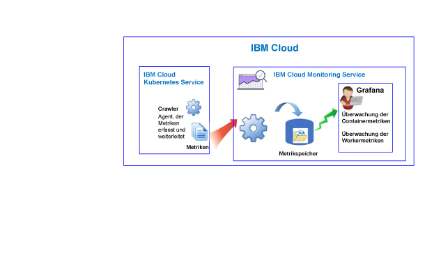
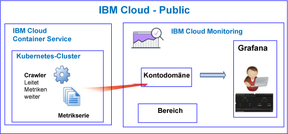

---

copyright:
  years: 2017, 2019

lastupdated: "2019-03-06"

keywords: IBM Cloud, monitoring

subcollection: cloud-monitoring

---

{:new_window: target="_blank"}
{:shortdesc: .shortdesc}
{:screen: .screen}
{:pre: .pre}
{:table: .aria-labeledby="caption"}
{:codeblock: .codeblock}
{:tip: .tip}
{:download: .download}
{:important: .important}
{:note: .note}

# {{site.data.keyword.containershort_notm}}
{: #monitoring_bmx_containers_ov}

In {{site.data.keyword.Bluemix}} werden Clustermetriken automatisch erfasst. Sie können Grafana verwenden, um die Leistung Ihres Clusters zu überwachen. 
{:shortdesc}

**Anmerkung:** 

* Metriken werden mithilfe des {{site.data.keyword.monitoringshort}}-Service für Container erfasst und verfügbar gemacht, die in Standardclustern ausgeführt werden.
* Zur Überwachung von Clustermetriken müssen Sie eine Instanz des Monitoring-Service bereitstellen. Weitere Informationen finden Sie in [Monitoring-Service bereitstellen](/docs/services/cloud-monitoring/how-to/provision.html#provision). 

## Informationen zur Überwachung in Public
{: #public1}

In {{site.data.keyword.Bluemix_notm}} können Sie mit dem {{site.data.keyword.monitoringshort}}-Service Containermetriken und die Kubernetes-Clustermetriken speichern und analysieren, die automatisch vom {{site.data.keyword.containershort}} in Public erfasst werden.

Sie können über einen oder mehrere Kubernetes-Cluster in einem Konto verfügen. Sobald der Cluster bereitgestellt wird, werden Metriken automatisch vom {{site.data.keyword.containershort}} erfasst.  Containermetriken werden erfasst, sobald der Pod bereitgestellt ist. Metriken werden automatisch an den {{site.data.keyword.monitoringshort}}-Service weitergeleitet:

Wenn Sie einen Cluster erstellen, werden Metriken an die Kontodomäne im {{site.data.keyword.monitoringshort}}-Service weitergeleitet. Wenn Metriken an die Kontodomäne weitergeleitet werden sollen, muss der Eigner des {{site.data.keyword.containershort}}-Schlüssels über die folgenden IAM-Richtlinien verfügen:

* IAM-Richtlinie mit **Bearbeitungsberechtigungen** für den {{site.data.keyword.monitoringshort}}-Service.
* IAM-Richtlinie mit **Administratorberechtigungen** für {{site.data.keyword.containershort}}.

Die folgende Abbildung zeigt eine Übersicht der Überwachung für {{site.data.keyword.containershort}}:

Der Crawler ist ein Prozess, der auf einem Host ausgeführt wird und die Überwachung von Metriken ohne Agenten ausführt. Der Crawler erfasst kontinuierlich CPU- und Speichermetriken von allen Containern.

Berücksichtigen Sie beim Analysieren von Metriken in Grafana für einen Cluster die folgenden Informationen:

* Sie müssen Grafana in einer Public-Region starten, in der die {{site.data.keyword.monitoringshort}}-Instanz, in der Sie Metriken anzeigen, bereitgestellt ist. 
* Sie können zum Überwachen Ihres Clusters das Grafana-Standarddashboard **ClusterMonitoringDashboard** verwenden.
* Sie können zudem angepasste Grafana-Dashboards konfigurieren, um Metrikdaten für einen Cluster in der Cloud Public-Region zu visualisieren, in der der Cluster erstellt wird.
* Ihre Benutzer-ID muss über Berechtigungen zum Anzeigen von Metriken verfügen. 

    Um Metriken in der Kontodomäne anzuzeigen, muss ein Benutzer über eine IAM-Richtlinie für den {{site.data.keyword.monitoringshort}}-Service verfügen. Der Benutzer benötigt die Berechtigung **Anzeigeberechtigter**. 

Die folgende Abbildung zeigt eine Übersicht der Überwachung in Public für {{site.data.keyword.containershort}}. Der Cluster leitet Metriken an die Kontodomäne weiter:

## Informationen zur Überwachung in Dedicated
{: #dedicated}

In {{site.data.keyword.Bluemix_notm}} können Sie mit dem {{site.data.keyword.monitoringshort}}-Service in Public Containermetriken und die Kubernetes-Clustermetriken speichern und analysieren, die automatisch vom {{site.data.keyword.containershort}} für Dedicated erfasst werden.

Sie können über einen oder mehrere Kubernetes-Cluster in einem Konto verfügen. Sobald der Cluster bereitgestellt wird, werden Metriken automatisch vom {{site.data.keyword.containershort}} erfasst.  Containermetriken werden erfasst, sobald der Pod bereitgestellt ist. Metriken werden automatisch an die Kontodomäne des {{site.data.keyword.monitoringshort}}-Service weitergeleitet.

Wenn Sie einen Cluster erstellen, werden Metriken an die Kontodomäne im {{site.data.keyword.monitoringshort}}-Service weitergeleitet. Wenn Metriken an die Kontodomäne weitergeleitet werden sollen, muss der Eigner des {{site.data.keyword.containershort}}-Schlüssels über die folgenden IAM-Richtlinien verfügen:

* IAM-Richtlinie mit **Bearbeitungsberechtigungen** für den {{site.data.keyword.monitoringshort}}-Service.
* IAM-Richtlinie mit **Administratorberechtigungen** für {{site.data.keyword.containershort}}.

Um Metriken für einen Cluster in Grafana anzuzeigen und zu analysieren, berücksichtigen Sie die folgenden Informationen:

* Sie müssen Grafana in der Cloud Public-Region starten, in der der Cluster für Dediciated zur Verfügung steht. Wenn ein Cluster beispielsweise für Dedicated in 'USA (Süden)' bereitgestellt wurde, müssen Sie Grafana in der Region 'USA (Süden)' für Public starten.
* Sie können zum Überwachen Ihres Clusters das Grafana-Standarddashboard **ClusterMonitoringDashboard** verwenden.
* Sie können zudem angepasste Grafana-Dashboards konfigurieren, um Metrikdaten für einen Cluster in der Cloud Public-Region zu visualisieren, in der der Cluster erstellt wird.
* Ihrer Benutzer-ID muss eine IAM-Richtlinie für die Arbeit mit dem {{site.data.keyword.monitoringshort}}-Service zugewiesen sein. Sie benötigen die Berechtigung **Anzeigeberechtigter**, um Metriken in der Kontodomäne anzuzeigen.  

Die folgende Abbildung zeigt eine Übersicht der Überwachung in Dedicated für {{site.data.keyword.containershort}}:

## Container: CPU-Metriken
{: #cpu_metrics_containers}

In der folgenden Tabelle sind die CPU-Metriken aufgelistet, die automatisch für einen Container erfasst werden:

| Metrik | Beschreibung | Einheiten |
|----------|---------|---------|
| `cpu.num-cores` | Diese Metrik gibt die Anzahl der CPU-Kerne aus, die dem Container zur Verfügung stehen.  Standardmäßig gibt diese Metrik die Anzahl der Kerne auf dem Worker an. Wenn Sie eine Begrenzung für die Anzahl der für den Container verfügbaren Kerne festlegen, gibt diese Metrik die Anzahl der Kerne an, die Sie in diesem Grenzwert festgelegt haben. | Dezimalzahl |
| `cpu.usage` | Diese Metrik gibt die Nanosekunden der CPU-Zeit über alle Kerne hinweg aus.  Wenn die CPU-Auslastung hoch ist, können Verzögerungen auftreten. Eine hohe CPU-Belastung weist auf eine nicht ausreichende Verarbeitungskapazität hin. | Nanosekunden |
| `cpu.usage-pct` | Diese Metrik gibt die verwendete CPU-Zeit als Prozentsatz der CPU-Kapazität aus.  Standardmäßig ist die CPU-Kapazität durch die Anzahl der Kerne auf dem Worker festgelegt. Wenn Sie Grenzwerte für die Container-CPU-Kapazität festlegen, gibt diese Metrik die CPU-Auslastung als Prozentsatz der von Ihnen festgelegten Grenzwerte an. Wenn der Prozentsatz der CPU-Auslastung hoch ist, können Verzögerungen auftreten. Eine hohe CPU-Belastung weist auf eine nicht ausreichende Verarbeitungskapazität hin. | Prozentsatz |
| `cpu.usage-pct-container-requested`  | Diese Metrik gibt die verwendete CPU-Zeit als Prozentsatz der angeforderten CPU des Containers aus.  Wenn Sie die angeforderte CPU nicht für einen Container festlegen, wird diese Metrik für den Container nicht bereitgestellt. | Prozentsatz |
{: caption="CPU-Metriken für Container" caption-side="top"} 

## Container: Speichermetriken
{: #memory_metrics}

In der folgenden Tabelle sind die Speichermetriken aufgelistet, die automatisch erfasst werden:

| Metrik | Beschreibung | Einheiten |
|----------|---------|---------|
| `memory.current` | Diese Metrik gibt die Anzahl an Byte des Speichers aus, die der Container gerade verwendet. | Byte |
| `memory.limit` | Diese Metrik gibt den Speichergrenzwert des Containers an. Der Container wird standardmäßig ohne Speichergrenzwerte ausgeführt. Ein Container kann so viel Speicher verbrauchen, wie auf dem Worker zur Verfügung steht, auf dem er ausgeführt wird. Wenn Sie einen Pod bereitstellen, können Sie Grenzwerte für die Speichermenge festlegen, die die zugehörigen Container nutzen können.| Byte |
| `memory.usage-pct` | Diese Metrik gibt den verwendeten Speicher als Prozentsatz der Speicherbegrenzung des Containers aus.  Wenn Sie Grenzwerte für die Speicherkapazität festlegen, berichtet diese Metrik die Speichernutzung als Prozentsatz der von Ihnen festgelegten Grenzwerte. | Prozentsatz | 
| `memory.working-set` | Diese Metrik gibt die Menge an aktivem Speicher (in Byte) an, die der Container momentan im vorbereiteten Cache verwendet. | Byte |
{: caption="Speichermetriken für Container" caption-side="top"} 

## Pods: Netzmetriken
{: #network_metrics_pods}

In der folgenden Tabelle sind die Netzmetriken aufgelistet, die sich auf den Empfang von Daten beziehen und die automatisch erfasst werden:

| Metrik | Beschreibung | Einheiten |
|----------|---------|---------|
| `container.namespace.podName.network.rx.bytes` | Diese Metrik gibt die Anzahl der Byte aus, die vom Pod empfangen werden.  | Byte  |
| `container.namespace.podName.network.rx.error` | Diese Metrik gibt die Anzahl der Fehler aus, die im Pod beim Empfangen von Frames aufgetreten sind. | Anzahl  |
| `container.namespace.podName.network.rx.packets` | Diese Metrik gibt die Anzahl der Pakete aus, die vom Pod empfangen werden.  | Anzahl  |
{: caption="Netzmetriken des Empfangs für Pods" caption-side="top"} 

In der folgenden Tabelle sind die Netzmetriken aufgelistet, die sich auf die Übertragung von Daten beziehen und die automatisch erfasst werden:

| Metrik | Beschreibung | Einheiten |
|----------|---------|---------|
| `container.namespace.podName.network.tx.bytes` | Diese Metrik gibt die Anzahl der Byte aus, die an den Pod gesendet werden.  | Byte  |
| `container.namespace.podName.network.tx.errors` | Diese Metrik gibt die Anzahl der Fehler aus, die im Pod beim Senden von Frames aufgetreten sind.  | Anzahl  |
| `container.namespace.podName.network.tx.packets` | Diese Metrik gibt die Anzahl der Pakete aus, die an den Pod gesendet werden.  | Anzahl  |
{: caption="Netzmetriken der Übertragung für Pods" caption-side="top"} 

## Worker: Plattenmetriken
{: #disk_metrics_workers}

In der folgenden Tabelle sind die Plattenmetriken aufgelistet, die automatisch für einen Worker erfasst werden:

| Metrik | Beschreibung | Einheiten |
|----------|---------|---------|
| `worker.disk.diskDevice.read.bytes` | Diese Metrik gibt die Lese-E/A-Geschwindigkeit der Platteneinheit aus.  | Byte  |
| `worker.disk.diskDevice.read.io` | Diese Metrik gibt den Durchsatz beim Lesen für die Einheit aus.  | Byte pro Sekunde  |
| `worker.disk.diskDevice.read.reads` | Diese Metrik gibt die maximale Lese-E/A-Geschwindigkeit der Platteneinheit aus.  | Byte pro Sekunde  |
| `worker.disk.diskDevice.read.waits` | Diese Metrik gibt aus, wie lange ein Worker auf eine E/-Anforderung zum Lesen wartet.  | Byte pro Sekunde  |
| `worker.disk.diskDevice.write.bytes` | Diese Metrik gibt die Schreib-E/A-Geschwindigkeit einer Platteneinheit aus.  | Byte  |
| `worker.disk.diskDevice.write.io` | Diese Metrik gibt den Durchsatz beim Schreiben für die Einheit aus.  | Byte pro Sekunde  |
| `worker.disk.diskDevice.write.writes` | Diese Metrik gibt die maximale Schreib-E/A-Geschwindigkeit der Platteneinheit aus.  | Byte pro Sekunde  |
| `worker.disk.diskDevice.write.waits` | Diese Metrik gibt aus, wie lange ein Worker auf eine E/-Anforderung zum Schreiben wartet.  | Byte pro Sekunde  |
| `worker.disk.diskDevice.size`| Diese Metrik gibt die Speicherkapazität der Einheit aus.  | Byte  |
| `worker.disk.diskDevice.used` | Diese Metrik gibt aus, wie viele Byte auf der Einheit belegt sind.  | Byte  |
| `worker.disk.diskDevice.usedpct` | Diese Metrik gibt den Prozentsatz des Speicherplatzes aus, der auf dem Gerät belegt ist.  | Prozentsatz  |
{: caption="Plattenmetriken für Worker" caption-side="top"} 

## Worker: Lademetriken
{: #load_metrics_workers}

In der folgenden Tabelle sind die CPU-Metriken aufgelistet, die automatisch für einen Worker erfasst werden:

| Metrik | Beschreibung | Einheiten |
|----------|---------|---------|
| `load.avg-1` | Diese Metrik gibt die durchschnittliche CPU-Auslastung für den Kubernetes-Host im Verlauf der letzten 1 Minute aus.  Eine durchschnittliche CPU-Belastung, die größer ist als die Anzahl der Kerne im Worker, gibt an, dass der Datenverkehr zum Host in die Warteschlange gestellt wurde.  | Anzahl  |
| `load.avg-5` | Diese Metrik gibt die durchschnittliche CPU-Auslastung für den Kubernetes-Host im Verlauf der letzten 5 Minuten aus.  Eine durchschnittliche CPU-Belastung, die größer ist als die Anzahl der Kerne im Worker, gibt an, dass der Datenverkehr zum Host in die Warteschlange gestellt wurde.  | Anzahl  |
| `load.avg-15` | Diese Metrik gibt die durchschnittliche CPU-Auslastung für den Kubernetes-Host im Verlauf der letzten 15 Minuten aus.  Eine durchschnittliche CPU-Belastung, die größer ist als die Anzahl der Kerne im Worker, gibt an, dass der Datenverkehr zum Host in die Warteschlange gestellt wurde.  |  Anzahl |
{: caption="Lademetriken für Worker" caption-side="top"} 

## Worker: Hauptspeichermetriken
{: #memory_metrics_workers}

In der folgenden Tabelle sind die Hauptspeichermetriken aufgelistet, die automatisch für einen Worker erfasst werden:

| Metrik | Beschreibung | Einheiten |
|----------|---------|---------|
| `memory.available` | Diese Metrik gibt aus, wie viele Byte an Hauptspeicher frei sind und von einem Worker verwendet werden können.   | Byte  |
| `memory.used` | Diese Metrik gibt aus, wie viele Byte an Hauptspeicher momentan vom Worker verwendet werden.  | Byte  |
{: caption="Hauptspeichermetriken für Worker" caption-side="top"} 

## Worker: Netzmetriken
{: #network_metrics_workers}

In der folgenden Tabelle sind die Netzmetriken aufgelistet, die sich auf den Empfang von Daten beziehen und die automatisch erfasst werden:

| Metrik | Beschreibung | Einheiten |
|----------|---------|---------|
| `network.interface.rx.bytes` | Diese Metrik gibt die Anzahl der Byte aus, die der Worker über die Schnittstelle empfangen hat.  | Byte  |
| `network.interface.rx.errs` | Diese Metrik gibt die Anzahl der Fehler aus, die im Worker beim Empfangen von Frames über die Schnittstelle aufgetreten sind. | Anzahl |
| `network.interface.rx.packets` | Diese Metrik gibt die Anzahl der Pakete aus, die der Worker über die Schnittstelle empfangen hat. | Anzahl |
{: caption="Netzmetriken des Empfangs für Worker" caption-side="top"} 

In der folgenden Tabelle sind die Netzmetriken aufgelistet, die sich auf die Übertragung von Daten beziehen und die automatisch erfasst werden:

| Metrik | Beschreibung | Einheiten |
|----------|---------|---------|
| `network.interface.tx.bytes` | Diese Metrik gibt die Anzahl der Byte aus, die der Worker über die Schnittstelle gesendet hat. | Byte  |
| `network.interface.tx.err` | Diese Metrik gibt die Anzahl der Fehler aus, die im Worker beim Senden von Frames über die Schnittstelle aufgetreten sind.  | Anzahl  |
| `network.interface.tx.packets` | Diese Metrik gibt die Anzahl der Pakete aus, die der Worker über die Schnittstelle gesendet hat.  | Anzahl  |
{: caption="Netzmetriken der Übertragung für Worker" caption-side="top"} 

In der folgenden Tabelle sind die Netzmetriken aufgelistet, die sich auf offene Sockets beziehen und die automatisch erfasst werden:

| Metrik | Beschreibung | Einheiten |
|----------|---------|---------|
| `network.sockets.udp`  `network.sockets.udp6`  `network.sockets.tcp`  `network.sockets.tcp6.open` | Diese Metrik gibt die Anzahl der offenen Sockets für ein Protokoll aus.   | Anzahl  |
| `network.sockets.tcp`  `network.sockets.tcp6.timewait` | Diese Metrik gibt die Anzahl der offenen TCP-Sockets mit dem Status  `time wait` aus.  | Anzahl  |
{: caption="Netzmetriken zu Sockets für Worker" caption-side="top"} 

## Abfragen zum Überwachen von Ressourcen in einem Kubernetes-Cluster definieren
{: #monitoring_metrics_kube}

Verwenden Sie Grafana, um die Leistung von Containern und Workern zu überwachen, die in einem Kubernetes-Cluster in {{site.data.keyword.Bluemix_notm}} bereitgestellt wurden. 

Der {{site.data.keyword.monitoringlong}}-Service verwendet Grafana, eine Open-Source-Analyse- und Darstellungsplattform, mit der Sie Ihre Metriken in einer Vielfalt von Grafiken (z. B. Diagramme und Tabellen) überwachen, durchsuchen, analysieren und visualisieren können.

Sie können Grafana von einem Browser starten. Weitere Informationen finden Sie unter [Von einem Web-Browser zum Grafana-Dashboard navigieren](/docs/services/cloud-monitoring/grafana/navigating_grafana.html#launch_grafana_from_browser).

Zum Überwachen von Containern und Workern, die in einem Kubernetes-Cluster ausgeführt werden, müssen Sie für jede Ressource eine Abfrage in Grafana definieren:

* Informationen darüber, wie Sie eine Abfrage definieren, mit der eine CPU-Metrik für einen Container überwacht wird, finden Sie unter [CPU-Metriken für einen Container in Grafana konfigurieren](/docs/services/cloud-monitoring/containers/config_cpu_containers.html#config_cpu_containers).
* Informationen darüber, wie Sie eine Abfrage definieren, mit der eine Speichermetrik für einen Container überwacht wird, finden Sie unter [Speichermetriken für einen Container in Grafana konfigurieren](/docs/services/cloud-monitoring/containers/config_mem_container.html#config_mem_container).
* Informationen darüber, wie Sie eine Abfrage definieren, mit der eine Lademetrik für einen Worker überwacht wird, finden Sie unter [Auslastungsmetriken für einen Worker in Grafana konfigurieren](/docs/services/cloud-monitoring/containers/config_load_worker.html#config_load_worker).

Das Format der Abfrage ist je nach Ressourcentyp und Art der Abfrage anders:

* Weitere Informationen zum Format der Abfragen zum Überwachen der CPU für einen Container finden Sie unter [Abfrageformat für CPU-Metriken für einen Container](/docs/services/cloud-monitoring/reference/metrics_format_containers.html#cpu_containers). 
* Weitere Informationen zum Format der Abfragen zum Überwachen der Auslastung für einen Worker finden Sie unter [Abfrageformat für Lademetriken für einen Worker](/docs/services/cloud-monitoring/reference/metrics_format_containers.html#load_workers).
* Weitere Informationen zum Format der Abfragen zum Überwachen von Speicher für einen Container finden Sie unter [Abfrageformat für Speichermetriken für einen Container](/docs/services/cloud-monitoring/reference/metrics_format_containers.html#mem_containers).

## Netzverkehr für angepasste Firewallkonfigurationen in {{site.data.keyword.Bluemix_notm}} konfigurieren
{: #ports}

Wenn Sie eine zusätzliche Firewall eingerichtet oder die Firewalleinstellungen in {{site.data.keyword.Bluemix_notm}} Infrastructure (SoftLayer) angepasst haben, müssen Sie abgehenden Netzverkehr vom Workerknoten an den {{site.data.keyword.monitoringshort}}-Service zulassen. 

Sie müssen TCP-Port 443 und TCP-Port 9091 an jedem Worker für den {{site.data.keyword.monitoringshort}}-Service für die folgenden IP-Adressen in der angepassten Firewall öffnen:

<table>
  <tr>
    <th>Region</th>
    <th>Einpflege-URL</th>
	<th>Öffentliche IP-Adressen</th>
  </tr>
  <tr>
    <td>Deutschland</td>
	<td>ingest-eu-fra.logging.bluemix.net</td>
	<td>158.177.88.43  159.122.87.107</td>
  </tr>
  <tr>
    <td>Vereinigtes Königreich</td>
	<td>ingest.logging.eu-gb.bluemix.net</td>
	<td>169.50.115.113</td>
  </tr>
  <tr>
    <td>USA (Süden)</td>
	<td>ingest.logging.ng.bluemix.net</td>
	<td>169.48.79.236  169.46.186.113</td>
  </tr>
  <tr>
    <td>Sydney</td>
	<td>ingest-au-syd.logging.bluemix.net</td>
	<td>130.198.76.125  168.1.209.20</td>
  </tr>
</table>

## Lernprogramme
{: #tutorial}

Informationen zur Verwendung des {{site.data.keyword.monitoringshort}}-Service für die Überwachung der Containerleistung finden Sie in [Metriken in Grafana für eine App analysieren, die in einem Kubernetes-Cluster bereitgestellt wurde](/docs/services/cloud-monitoring/tutorials/container_service_metrics.html#container_service_metrics).

Informationen zur Erstellung eines Grafana-Dashboards im {{site.data.keyword.monitoringshort}}-Service für die Überwachung der Clusterleistung finden Sie in [Erstellen eines Grafana-Dashboards für die Überwachung eines Kubernetes-Clusters](/docs/services/cloud-monitoring/tutorials/container_grafana_dashboard.html#container_grafana_dashboard).
