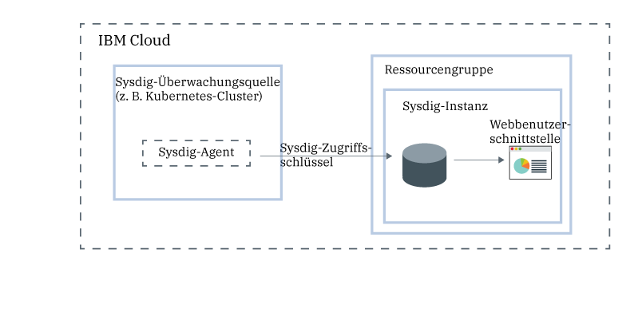
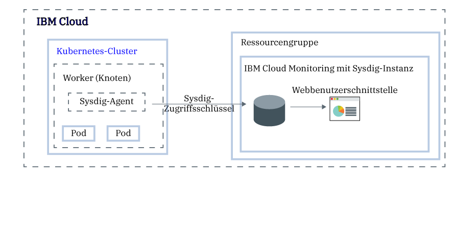

---

copyright:
  years:  2018, 2019
lastupdated: "2019-05-09"

keywords: Sysdig, IBM Cloud, monitoring, getting started

subcollection: Sysdig

---

{:new_window: target="_blank"}
{:shortdesc: .shortdesc}
{:screen: .screen}
{:pre: .pre}
{:table: .aria-labeledby="caption"}
{:codeblock: .codeblock}
{:tip: .tip}
{:download: .download}
{:important: .important}
{:note: .note}

# Lernprogramm zur Einführung
{: #getting-started}

{{site.data.keyword.mon_full_notm}} ist ein für die Cloud natives Container-Intelligence-Managementsystem eines Drittanbieters, das Sie als Teil Ihrer {{site.data.keyword.cloud_notm}}-Architektur verwenden können. Nutzen Sie es, um Einblick in die Leistung und den Status Ihrer Anwendungen, Services und Plattformen zu erhalten. Es bietet Administratoren, DevOps-Teams und Entwicklern eine vollständige Stack-Telemetrie mit erweiterten Funktionen zum Überwachen und Beheben von Fehlern, zum Definieren von Alerts und zum Entwerfen angepasster Dashboards. {{site.data.keyword.mon_full_notm}} wird von Sysdig in Partnerschaft mit {{site.data.keyword.IBM_notm}} betrieben.
{:shortdesc}

Die folgende Abbildung zeigt die Komponentenübersicht für den {{site.data.keyword.mon_full_notm}}-Service, der unter {{site.data.keyword.cloud_notm}} ausgeführt wird:

## Features
{: #features}

**Beschleunigen Sie die Diagnose und die Lösung von Leistungsvorfällen.**

{{site.data.keyword.mon_full_notm}} bietet umfassende Einblicke in Ihre Infrastruktur und Anwendungen und ermöglicht die Fehlerbehebung von der Serviceebene bis hin zur Systemebene. Vordefinierte Dashboards und Alerts erleichtern die Identifizierung potenzieller Bedrohungen oder Probleme. Durch die Verwendung von {{site.data.keyword.mon_full_notm}} können Entwickler und DevOps-Teams Leistungsprobleme in Echtzeit überwachen und beheben, die Fehlerquelle identifizieren und Probleme beheben. 

**Steuern Sie die Kosten für Ihre Überwachungsinfrastruktur.**

{{site.data.keyword.mon_full_notm}} enthält Funktionen, mit deren Hilfe Sie die Kosten für Ihre Überwachungsinfrastruktur in {{site.data.keyword.cloud_notm}} steuern können. Sie können die Metrikquellen konfigurieren, deren Leistung Sie überwachen möchten. Sie können einen vordefinierten Alert aktivieren, um sich vor Nutzungsänderungen warnen zu lassen, die sich auf Ihre Abrechnung auswirken. 

**Lernen Sie die gesamte Umgebung kennen und visualisieren Sie sie ohne großen Aufwand.**

{{site.data.keyword.mon_full_notm}} macht es Ihnen leicht, Ihre Umgebung visuell zu erkunden. Dynamische Topologiemaps stellen eine Ansicht der Abhängigkeiten zwischen Services bereit. Mehrdimensionale Abfragen hohe Abwanderungs-, hohe Kardinalitäts- und hohe Frequenzmetriken beschleunigen die Fehlerbehebung. Anpassbare Dashboards ermöglichen die Visualisierung der wichtigsten Punkte. 

**Rufen Sie kritische Kubernetes- und Container-Einblicke für die dynamische Mikroservice-Überwachung ab.**

{{site.data.keyword.mon_full_notm}} erkennt automatisch Kubernetes-Umgebungen, die sofort einsatzfähige Dashboards und Alerts für Cluster, Knoten, Namensbereiche, Services, Implementierungen, Pods und vieles mehr bereitstellen. Ein einzelner Agent pro Knoten erkennt dynamisch alle Mikroservices und erfasst Metriken und Ereignisse aus verschiedenen Quellen, einschließlich Kubernetes, Hosts, Netze, Container, Prozesse, Anwendungen und benutzerdefinierte Metriken wie Prometheus, JMX und StatsD. 

**Mindern Sie die Auswirkungen abnormaler Situationen mit proaktiven Benachrichtigungen.**

{{site.data.keyword.mon_full_notm}} enthält Alerts und Mehrkanal-Benachrichtigungen, die Sie verwenden können, um die Auswirkungen auf das Tagesgeschäft zu reduzieren und Ihre Reaktions- und Antwortzeit auf Anomalien, Ausfälle und Leistungseinbußen zu verkürzen. Zu den Benachrichtigungskanälen, die Sie einfach konfigurieren können, gehören *E-Mail*, *Slack*, *PagerDuty*, *Webhooks*, *OpsGenie* und *VictorOps*.

## Vorbemerkungen
{: #prereqs}

Sie müssen über eine Benutzer-ID verfügen, die Mitglied oder ein Eigentümer eines {{site.data.keyword.cloud_notm}}-Kontos ist. Gehen Sie zum Abrufen einer {{site.data.keyword.cloud_notm}}-Benutzer-ID zu [Registrierung ](https://cloud.ibm.com/login){:new_window}.

Der Service ist in den folgenden Regionen verfügbar:
* *USA (Süden)*
* *EU-DE*
* *EU-GB*
* *JP-TOK*

Sie können die Einführungsschritte für eine der unterstützten Regionen abschließen.

## Schritt 1: Benutzerzugriff verwalten
{: #step1}

Jedem Benutzer, der auf den {{site.data.keyword.mon_full_notm}}-Service in Ihrem Konto zugreift, muss eine Zugriffsrichtlinie mit einer definierten IAM-Benutzerrolle zugeordnet werden. Die Richtlinie bestimmt, welche Aktionen der Benutzer im Kontext des ausgewählten Service oder der ausgewählten Instanz ausführen kann. Die zulässigen Aktionen werden angepasst und als Operationen definiert, die für den Service ausgeführt werden dürfen. Die Aktionen werden dann IAM-Benutzerrollen zugeordnet. Weitere Informationen hierzu finden Sie im Abschnitt [Benutzerzugriff in {{site.data.keyword.cloud_notm}} verwalten](/docs/services/Monitoring-with-Sysdig?topic=Sysdig-iam#iam).

Wenn einem Benutzer in {{site.data.keyword.cloud_notm}} Berechtigungen erteilt werden, um mit dem {{site.data.keyword.mon_full_notm}}-Service zu arbeiten, erhält der Benutzer automatisch die Sysdig-Rolle. Diese Rolle bestimmt die Aktionen, die ein Benutzer ausführen darf. Gültige Rollen sind *Sysdig-Admin* und *Sysdig-Benutzer*. Weitere Informationen finden Sie im Abschnitt [Sysdig-Rollen zu {{site.data.keyword.cloud_notm}}-Rollen zuordnen](/docs/services/Monitoring-with-Sysdig?topic=Sysdig-iam#iam_sysdig).

Bevor Sie eine Instanz bereitstellen können, sollten Sie die folgenden Informationen beachten:
* Der Kontoeigner kann eine Instanz eines Service in {{site.data.keyword.cloud_notm}} erstellen, anzeigen und löschen sowie anderen Benutzern die Berechtigung erteilen, mit dem {{site.data.keyword.mon_full_notm}}-Service zu arbeiten.
* Sie müssen über die Berechtigungen zum Erstellen von Ressourcen in der Ressourcengruppe *Standard* verfügen.
* Andere {{site.data.keyword.cloud_notm}}-Benutzer mit `Administrator`- oder `Editor`-Berechtigungen können den {{site.data.keyword.mon_full_notm}}-Service in {{site.data.keyword.cloud_notm}} verwalten. Diese Benutzer müssen außerdem über die Plattform-Berechtigungen verfügen, um Ressourcen im Kontext der Ressourcengruppe zu erstellen, in der sie die Instanz bereitstellen wollen.

Um dem Service eine Benutzeradministratorrolle zu erteilen und Instanzen innerhalb einer Ressourcengruppe im Konto zu verwalten, muss der Benutzer über eine IAM-Richtlinie für den {{site.data.keyword.mon_full_notm}}-Service mit der Plattformrolle **Administrator** im Kontext der Ressourcengruppe verfügen. 

Führen Sie die folgenden Schritte aus, um dem {{site.data.keyword.mon_full_notm}}-Service im Kontext einer Ressourcengruppe eine Benutzeradministratorrolle zuzuordnen: 

1. Klicken Sie in der Menüleiste auf **Verwalten** &gt; **Zugriff (IAM)** und wählen Sie dann **Benutzer** aus.
2. Wählen Sie in der Zeile für den Benutzer, dem Sie Zugriff zuweisen möchten, das Menü **Aktionen** aus und klicken Sie dann auf **Zugriff zuweisen**.
3. Wählen Sie **Zugriff in einer Ressourcengruppe zuweisen** aus.
4. Wählen Sie eine Ressourcengruppe aus.
5. Wenn dem Benutzer noch keine Rolle für die ausgewählte Ressourcengruppe erteilt wurde, wählen Sie eine Rolle aus dem Feld **Zugriff für eine Ressourcengruppe zuweisen** aus. 

    Je nachdem, welche Rolle Sie auswählen, kann der Benutzer die Ressourcengruppe in seinem Dashboard anzeigen, den Namen der Ressourcengruppe bearbeiten oder den Benutzerzugriff auf die Gruppe verwalten. 
    
    Sie können **Kein Zugriff** auswählen, wenn der Benutzer ausschließlich Zugriff auf den {{site.data.keyword.mon_full_notm}}-Service in der Ressourcengruppe haben soll.

6. Wählen Sie **{{site.data.keyword.mon_full_notm}}** aus.
7. Wählen Sie die Plattformrolle **Administrator** aus.
8. Klicken Sie auf **Zuweisen**.

## Schritt 2: Eine Instanz des {{site.data.keyword.mon_full_notm}}-Service bereitstellen
{: #step2}

Um Überwachungsfunktionen mit {{site.data.keyword.mon_full_notm}} in {{site.data.keyword.cloud_notm}} hinzuzufügen, müssen Sie eine Instanz des {{site.data.keyword.mon_full_notm}}-Service bereitstellen. 

enn Sie eine Instanz bereitstellen, werden Ihre Daten an einen Drittanbieter gesendet.
{: tip}

Sie können eine Instanz im Kontexts einer Ressourcengruppe bereitstellen. Mit einer Ressourcengruppe können Sie Ihre Services für die Zugriffssteuerung und die Abrechnung organisieren. Sie können die {{site.data.keyword.mon_full_notm}}-Instanz in der *Standard*-Ressourcengruppe oder in einer angepassten Ressourcengruppe bereitstellen.

Wenn Sie eine Instanz bereitstellen, erhalten Sie automatisch einen Aufnahmeschlüssel, der auch als *Sysdig-Zugriffsschlüssel* bezeichnet wird.

Führen Sie die folgenden Schritte aus, um eine Instanz über die {{site.data.keyword.cloud_notm}}-Benutzerschnittstelle bereitzustellen:

1. Melden Sie sich bei Ihrem {{site.data.keyword.cloud_notm}}-Konto an.

    Klicken Sie auf das [{{site.data.keyword.cloud_notm}}-Dashboard ](https://cloud.ibm.com/login){:new_window}, um das {{site.data.keyword.cloud_notm}}-Dashboard zu starten.

	Nachdem Sie sich mit Ihrer Benutzer-ID und Ihrem Kennwort angemeldet haben, wird die {{site.data.keyword.cloud_notm}}-Benutzerschnittstelle geöffnet.

2. Klicken Sie auf **Katalog**. Die Liste der Services, die in {{site.data.keyword.cloud_notm}} verfügbar sind, wird geöffnet.

3. Wenn Sie die Liste der angezeigten Services filtern möchten, wählen Sie die Kategorie **Entwicklertools** aus.

4. Klicken Sie auf die Kachel **{{site.data.keyword.mon_full_notm}}**.

5. Wählen Sie einen Serviceplan aus. Standardmäßig ist der Plan **Testversion** festgelegt.

    Weitere Informationen zu den Serviceplänen finden Sie im Abschnitt [Preisstruktur](/docs/services/Monitoring-with-Sysdig?topic=Sysdig-pricing_plans#pricing_plans).

6. Wählen Sie eine Ressourcengruppe aus. Standardmäßig ist die Einstellung **Standard** festgelegt.

7. Klicken Sie auf **Erstellen**, um eine Instanz bereitzustellen.

Die Service-Benutzerschnittstelle wird geöffnet.

**Hinweis:** Wenn Sie eine Instanz von Sysdig über die Befehlszeilenschnittstelle (CLI) bereitstellen möchten, lesen Sie die Informationen in [Sysdig über die {{site.data.keyword.cloud_notm}}-CLI bereitstellen](/docs/services/Monitoring-with-Sysdig?topic=Sysdig-provision#provision_cli).

## Schritt 3: Einen Sysdig-Agenten konfigurieren
{: #step3}

Nachdem Sie eine Instanz bereitgestellt haben, müssen Sie einen Sysdig-Agenten für jede Metrikquelle konfigurieren, die Sie überwachen wollen. Eine Metrikquelle ist die Cloudressource, die Sie überwachen und deren Leistung und Status Sie steuern möchten. Eine Metrikquelle kann z. B. ein Kubernetes-Cluster sein.  

Der Sysdig-Agent erfasst und berichtet automatisch über vordefinierte Metriken. Sie verwenden den *Sysdig-Zugriffsschlüssel*, um den Sysdig-Agenten zu konfigurieren, der für die Erfassung und Weiterleitung von Metriken an Ihre Instanz verantwortlich ist. Weitere Informationen finden Sie im Abschnitt [Mit Zugriffsschlüsseln arbeiten](/docs/services/Monitoring-with-Sysdig?topic=Sysdig-access_key#access_key).

Sie können für jede der folgenden Umgebungen einen Sysdig-Agenten konfigurieren:

* Kubernetes, GKE und OpenShift.
* Docker-Container oder nicht-containerbasierte Services.
* Mesos, Marathon und DCOS.
* Linux-Installationen.

Wenn Sie beispielsweise Ihren Kubernetes-Cluster so konfigurieren möchten, dass Metriken an Ihre Sysdig-Instanz gesendet werden, müssen Sie auf jedem Knoten des Clusters ein `sysdig-agent`-Pod installieren. Der Sysdig-Agent erfasst Daten aus dem Pod, wo er installiert ist, und leitet diese an Ihre Sysdig-Instanz weiter.

Führen Sie eines der folgenden Lernprogramme aus, um zu erfahren, wie ein Sysdig-Agent implementiert wird:

| Ressource                |	Lernprogramm                        | Umgebung                | Szenario   |
|-------------------------|---------------------------------|----------------------------|------------|
| Unter {{site.data.keyword.containershort}} ausgeführte Container |[Analysieren Sie die Metriken für eine App, die in einem Kubernetes-Cluster implementiert ist.](/docs/services/Monitoring-with-Sysdig?topic=Sysdig-kubernetes_cluster#kubernetes_cluster) | {{site.data.keyword.cloud_notm}} Public |  |
|Linux Ubuntu/Debian | [Analysieren Sie die Metriken für einen Ubuntu-Server.](/docs/services/Monitoring-with-Sysdig?topic=Sysdig-ubuntu#ubuntu) | Vor Ort |  |
{: caption="Tabelle 1. Lernprogramme für den Einstieg in die Arbeit mit {{site.data.keyword.mon_full_notm}}" caption-side="top"} 

Weitere Informationen hierzu finden Sie in den Abschnitten [Einen Sysdig-Agenten konfigurieren](/docs/services/Monitoring-with-Sysdig?topic=Sysdig-config_agent#config_agent) und [Einen Sysdig-Agenten entfernen](/docs/services/Monitoring-with-Sysdig?topic=Sysdig-remove#remove).

Nachdem der Sysdig-Agent bereitgestellt wurde, wird die Erfassung und Weiterleitung von Metriken an die Instanz automatisch ausgeführt. Der Sysdig-Agent erfasst und berichtet automatisch über vordefinierte Metriken. Sie können auch konfigurieren, welche Metriken in einer Umgebung überwacht werden sollen. Die Daten für benutzerdefinierte Metriken werden ebenfalls automatisch erfasst.

## Schritt 4: Die Webbenutzerschnittstelle starten
{: #step4}

Nachdem Sie eine Instanz des {{site.data.keyword.mon_full_notm}}-Service in {{site.data.keyword.Bluemix}} bereitgestellt und einen Sysdig-Agenten für Ihren Knoten konfiguriert haben, können Sie Daten über die Webbenutzerschnittstelle des Service anzeigen, überwachen und verwalten.

Sie starten die Webbenutzerschnittstelle im Kontext der Sysdig-Instanz über die {{site.data.keyword.cloud_notm}}-Benutzerschnittstelle. 

Führen Sie die folgenden Schritte aus, um die Sysig-Webbenutzerschnittstelle zu starten:

1. Melden Sie sich bei Ihrem {{site.data.keyword.cloud_notm}}-Konto an.

    Klicken Sie auf das [{{site.data.keyword.cloud_notm}}-Dashboard ](https://cloud.ibm.com/login){:new_window}, um das {{site.data.keyword.cloud_notm}}-Dashboard zu starten.

	Nachdem Sie sich mit Ihrer Benutzer-ID und Ihrem Kennwort angemeldet haben, wird das {{site.data.keyword.cloud_notm}}-Dashboard geöffnet.

2. Wählen Sie im Navigationsmenü die Option **Beobachtbarkeit** aus. 

3. Wählen Sie **Überwachung** aus. 

    Die Liste der Überwachungsinstanzen, die unter {{site.data.keyword.cloud_notm}} verfügbar sind, wird angezeigt.

4. Wählen Sie eine Instanz aus. Klicken Sie dann auf **Sysdig anzeigen**.

Die {{site.data.keyword.mon_full_notm}}-Webbenutzerschnittstelle öffnet sich. Standardmäßig wird die Registerkarte *Erkunden* angezeigt.

Standardmäßig werden Benutzer automatisch als Mitglieder des Teams **Operationen überwachen** hinzugefügt, das für jede {{site.data.keyword.mon_full_notm}}-Instanz vordefiniert ist. Die Benutzer verfügen über die vollständigen Berechtigungen, um alle Daten in der Webbenutzerschnittstelle anzuzeigen. **Hinweis:** Ein Administrator kann den Zugriff auf Daten einschränken, indem er Benutzer in Teams verwaltet und steuert, welche Daten sichtbar sind. Um beispielsweise die Anzeigeberechtigungen für Benutzer einzuschränken, kann ein Administrator ein Standardteam mit eingeschränktem Geltungsbereich und eingeschränkter Sichtbarkeit erstellen. Ordnen Sie dann Benutzer manuell anderen Teams zu. Weitere Informationen finden Sie im Abschnitt [Mit Teams arbeiten](/docs/services/Monitoring-with-Sysdig?topic=Sysdig-teams#teams).

## Schritt 5: Die Umgebung überwachen
{: #step5}

Sie können Daten auf der Registerkarte *Erkunden* und auf der Registerkarte *Dashboard* der Webbenutzerschnittstelle analysieren. Sie überwachen die Daten über Metrikansichten und Dashboards. 

* Verwenden Sie eine Metrikansicht, um eine bestimmte Metrik zu überwachen.
* Verwenden Sie Dashboards, um einen spezialisierten Einblick in Netzdaten, Anwendungsdaten, Topologie, Services, Hosts und Container zu erhalten, indem Daten über Anzeigen überwacht werden. In einer Anzeige wird eine Metrik oder eine Gruppe von Metriken in einem Dashboard angezeigt.
{: tip}

Auf der Registerkarte *Erkunden* können Sie Daten mithilfe von Standardmetriken und Standarddashboards überwachen. Sie können Bezeichnungen verwenden, um neue Infrastrukturgruppen zu definieren, die Sie dann verwenden können, um Daten auf unterschiedliche Weise zusammenzufassen und Ihre Umgebung zu überwachen. Sie können auch benutzerdefinierte Dashboards verwenden, die Sie über die Registerkarte *Dashboard* definieren.

Auf der Registerkarte *Dashboards* können Sie Daten überwachen, indem Sie eines der Standarddashboards verwenden oder neue Dashboards erstellen.

Weitere Informationen finden Sie im Abschnitt [Ihre Umgebung überwachen](/docs/services/Monitoring-with-Sysdig?topic=Sysdig-monitoring#monitoring).

## Schritt 6: Daten verwalten
{: #step6}

Verwenden Sie Bezeichnungen, um Infrastrukturressourcen in logische Hierarchien zu gruppieren, Daten herauszufiltern und zusammengefasste Daten in Segmente aufzuteilen. Passen Sie an, wie Daten aggregiert werden, wenn Sie ein Diagramm konfigurieren oder einen Alert für eine Metrik erstellen. Legen Sie den Geltungsbereich eines Dashboards, einer Anzeige oder eines Alerts fest, um Datenpunkte zu filtern. Beschränkten Sie den Zugriff auf Daten, indem der Datenzugriff der Benutzer durch die Teams verwaltet werden. 

Für eine Metrikansicht können Sie beispielsweise den Geltungsbereich der Daten definieren und festlegen, wie Daten zusammengefasst und welche Zeit- und Gruppenfilter auf die Daten angewendet werden sollen. 

Weitere Informationen hierzu finden Sie im Abschnitt [Daten verwalten](/docs/services/Monitoring-with-Sysdig?topic=Sysdig-manage#manage).

## Nächste Schritte: Alerts konfigurieren und Ereignisse erkunden
{: #next}

Sie können Ereignisse verwenden, um Probleme zu überprüfen, zu verfolgen und zu beheben. Ein Ereignis ist eine Benachrichtigung, die darüber informiert, dass in einem der Knoten, die Daten an Ihre {{site.data.keyword.mon_full_notm}}-Instanz weiterleiten, etwas aufgetreten ist. 

Es gibt verschiedene Arten von Ereignissen: 

* *Alertereignisse* sind Ereignisse, die durch vom Benutzer konfigurierte Alerts ausgelöst werden. Konfigurieren Sie beispielsweise Alerts so, dass Sie über Probleme benachrichtigt werden, die Ihre Aufmerksamkeit erfordern. Weitere Informationen finden Sie im Abschnitt [Mit Alerts arbeiten](/docs/services/Monitoring-with-Sysdig?topic=Sysdig-monitoring#monitoring_alerts).
* *Infrastrukturbasierte Ereignisse* sind Ereignisse, die von Docker- und Kubernetes-Knoten erfasst werden. Standardmäßig erkennt der Sysdig-Agent automatisch Daten aus einer ausgewählten Gruppe von Ereignissen und erfasst diese. Sie können die Agentenkonfigurationsdatei bearbeiten, um weitere Ereignisse zu aktivieren.
* *Angepasste Ereignisse*, die Sie über eine der folgenden Integrationen konfigurieren: Slackbot, vordefinierte Python-Scripts, angepasste und vom Benutzer erstellte Python-Scripts oder cURL-Anforderungen.

Wenn Sie einen Alert definieren, müssen Sie die Bedingung, die die Benachrichtigung auslöst, einen oder mehrere Benachrichtigungskanäle, über die Sie benachrichtigt werden möchten, die Prioritätsstufe des Alerts und den Typ des Alerts definieren. 

Sie konfigurieren einen oder mehrere Benachrichtigungskanäle im Abschnitt *Einstellungen* in der Webbenutzerschnittstelle. Gültige Benachrichtigungskanäle sind: *E-Mail*, *Slack*, *PagerDuty*, *Webhooks*, *OpsGenie* und *VictorOps*. Weitere Informationen finden Sie im Abschnitt [Arbeiten mit Benachrichtigungskanälen](/docs/services/Monitoring-with-Sysdig?topic=Sysdig-notifications#notifications).

Der Abschnitt *Alerts* in der Webbenutzerschnittstelle zeigt die Liste der vordefinierten Alerts an. Aus dieser Ansicht können Sie vordefinierte Alerts aktivieren und inaktivieren. Sie können vorhandene Alerts ändern und neue Alerts erstellen. Weitere Informationen finden Sie im Abschnitt [Mit Alerts arbeiten ](https://sysdigdocs.atlassian.net/wiki/spaces/Monitor/pages/205324292/Alerts){:new_window}.

Erkunden Sie als Nächstes [Mit angepassten Ereignissen arbeiten ](https://sysdigdocs.atlassian.net/wiki/spaces/Monitor/pages/222822463/Custom+Events){:new_window}.

