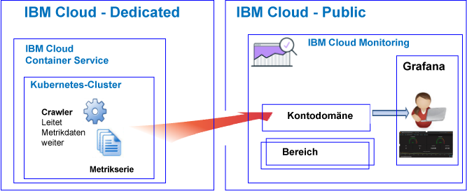
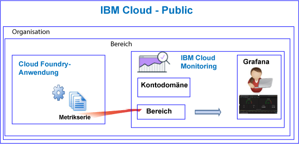

---

copyright:
  years: 2017, 2019

lastupdated: "2019-03-06"

keywords: IBM Cloud, monitoring

subcollection: cloud-monitoring

---

{:new_window: target="_blank"}
{:shortdesc: .shortdesc}
{:screen: .screen}
{:pre: .pre}
{:table: .aria-labeledby="caption"}
{:codeblock: .codeblock}
{:tip: .tip}
{:download: .download}
{:important: .important}
{:note: .note}

# Lernprogramm zur Einführung
{: #getting-started-with-ibm-cloud-monitoring}

In diesem Lernprogramm erfahren Sie, wie Sie mit dem {{site.data.keyword.monitoringlong}}-Service in {{site.data.keyword.Bluemix}} arbeiten können.
{:shortdesc}

Standardmäßig bietet {{site.data.keyword.Bluemix_notm}} integrierte Überwachungsfunktionen für auswählte Services. Sie können den {{site.data.keyword.monitoringlong_notm}}-Service zur Erweiterung Ihrer Erfassungs- und Aufbewahrungsfunktionen verwenden, wenn Sie mit Metriken arbeiten, und um Regeln und Alerts definieren zu können, die Sie über Bedingungen informieren, die Ihre Aufmerksamkeit erfordern. Der {{site.data.keyword.monitoringshort}}-Service bietet Funktionen, die Ihnen einen Einblick in die Leistung und Nutzung von Ressourcen der Apps liefern. Außerdem können Sie schnell aktuelle Trends und Probleme sofort erkennen und diagnostizieren. Dies amortisiert sich sofort und ist eine Investition mit geringen Anschaffungs- und Betriebskoste. Sie können Ihre Umgebung mit Grafana überwachen. 

## Vorbemerkungen
{: #cm_prereqs}

Sie müssen über eine Benutzer-ID verfügen, die ein Mitglied oder Eigner eines {{site.data.keyword.Bluemix_notm}}-Kontos ist. Um eine {{site.data.keyword.Bluemix_notm}}-Benutzer-ID zu erhalten, rufen Sie die Seite für die [Registrierung ](https://console.bluemix.net/registration/){:new_window} auf.

## Schritt 1: Zu überwachende Cloudressource auswählen
{: #cm_step1}

In {{site.data.keyword.Bluemix_notm}} erfassen CF-Anwendungen, Container, die für den {{site.data.keyword.containershort}} ausgeführt werden, und ausgewählte Services Daten für Metrikserien automatisch und leiten diese an den {{site.data.keyword.monitoringshort}}-Service weiter.

In der folgenden Tabelle sind verschiedene Cloudressourcen aufgelistet. Führen Sie das Lernprogramm für eine Ressource aus, um mit der Arbeit mit dem {{site.data.keyword.monitoringshort}}-Service zu beginnen:

<table>
  <caption>Lernprogramm als Einführung in die Arbeit mit dem {{site.data.keyword.monitoringshort}}-Service </caption>
  <tr>
    <th>Ressource</th>
    <th>Lernprogramm</th>
    <th>Cloudumgebung</th>
    <th>Szenario</th>
  </tr>
  <tr>
    <td>Container, die für den {{site.data.keyword.containershort}} ausgeführt werden</td>
    <td>[Metriken in Grafana für eine App analysieren, die in einem Kubernetes-Cluster bereitgestellt wurde](/docs/services/cloud-monitoring/tutorials/container_service_metrics.html#container_service_metrics)</td>
    <td>Public  Dedicated</td>
    <td></td>
  </tr>
  <tr>
    <td>CF-Apps</td>
    <td>[Metriken in Grafana für eine CF-App analysieren](/docs/services/cloud-monitoring/tutorials/cfapps_metrics.html#cfapps_metrics)</td>
    <td>Public</td>
    <td></td>
  </tr>
</table>

## Schritt 2: Berechtigungen für einen Benutzer zum Anzeigen von Metriken festlegen
{: #cm_step2}

Um zu steuern, welche {{site.data.keyword.monitoringshort}}-Aktionen ein Benutzer ausführen darf, können Sie einem Benutzer Rollen und Richtlinien zuweisen. 

Es gibt zwei Typen von Sicherheitsberechtigungen in {{site.data.keyword.Bluemix_notm}}, mit denen die Aktionen gesteuert werden, die Benutzer bei der Arbeit mit dem {{site.data.keyword.monitoringshort}}-Service ausführen können:

* CF-Rollen (CF, Cloud Foundry): Sie weisen einem Benutzer eine CF-Rolle zu, um die Berechtigungen zu definieren, die der Benutzer zum Anzeigen von Metriken in einem Bereich benötigt.
* IAM-Rollen: Sie weisen einem Benutzer eine IAM-Richtlinie zu, um die Berechtigungen zu definieren, die der Benutzer zum Anzeigen von Metriken in der Kontodomäne benötigt.

Führen Sie die folgenden Schritte aus, um einem Benutzer Berechtigungen zum Anzeigen von Metriken in einem Bereich zu erteilen:

1. Melden Sie sich bei der {{site.data.keyword.Bluemix_notm}}-Konsole an.

    Öffnen Sie einen Web-Browser und starten Sie das {{site.data.keyword.Bluemix_notm}}-Dashboard: [http://bluemix.net ](http://bluemix.net){:new_window}
	
	Nach der Anmeldung mit Ihrer Benutzer-ID und Ihrem Kennwort wird die {{site.data.keyword.Bluemix_notm}}-Benutzerschnittstelle geöffnet.

2. Klicken Sie in der Menüleiste auf **Verwalten>Konto>Benutzer**. 

    Im Fenster *Benutzer* wird eine Liste der Benutzer mit ihren E-Mail-Adressen für das aktuell ausgewählte Konto angezeigt.
	
3. Wenn der Benutzer Mitglied des Kontos ist, wählen Sie den Benutzernamen in der Liste aus oder klicken Sie im Menü *Aktionen* auf **Benutzer verwalten**.

    Wenn der Benutzer kein Mitglied des Kontos ist, finden Sie weitere Informationen unter [Benutzer einladen](/docs/iam/iamuserinv.html#iamuserinv).

4. Wählen Sie **Cloud Foundry-Zugriff** und anschließend die Organisation aus.

    Die Liste der in dieser Organisation verfügbaren Bereiche wird angezeigt.

5. Wählen Sie den Bereich aus, in dem Sie den {{site.data.keyword.monitoringshort}}-Service bereitgestellt haben. Wählen Sie dann als Menüaktion die Option **Bereichsrolle bearbeiten** aus.

6. Wählen Sie *Prüfer* aus. 

    Sie können eine oder mehrere Bereichsrollen auswählen. Mit allen der folgenden Rollen kann ein Benutzer Protokolle anzeigen: *Manager*, *Entwickler*, und *Prüfer*.
	
7. Klicken Sie auf **Rolle speichern**.

Weitere Informationen finden Sie unter [Berechtigungen erteilen](/docs/services/cloud-monitoring/security/assign_policy.html#grant_permissions).

Um sicherzustellen, dass der Benutzer Metrikdaten anzeigen kann, starten Sie Grafana in der Cloud-Region, in der Sie eines der Lernprogramme absolviert haben. Öffnen Sie beispielsweise in der Region 'USA (Süden)' einen Web-Browser und geben Sie die folgende URL ein: [https://metrics.ng.bluemix.net/](https://metrics.ng.bluemix.net/).

Weitere Informationen darüber, wie Sie Grafana in anderen Regionen starten, finden Sie unter [Zu Grafana über einen Web-Browser navigieren](/docs/services/cloud-monitoring/grafana/navigating_grafana.html#navigating_grafana).

**Hinweis:** Wenn Ihnen beim Starten von Grafana eine Nachricht angezeigt wird, die angibt, dass das *Trägertoken nicht gültig* ist, überprüfen Sie die Berechtigungen im Bereich. Diese Nachricht ist ein Hinweis darauf, dass Ihre Benutzer-ID nicht über die Berechtigung zum Anzeigen von Metriken verfügt.
    

## Nächste Schritte 
{: #cm_next_steps}

Definieren Sie einen Alert für eine Metrik. Weitere Informationen finden Sie unter [Alerts konfigurieren ](/docs/services/cloud-monitoring/config_alerts_ov.html#config_alerts_ov).
