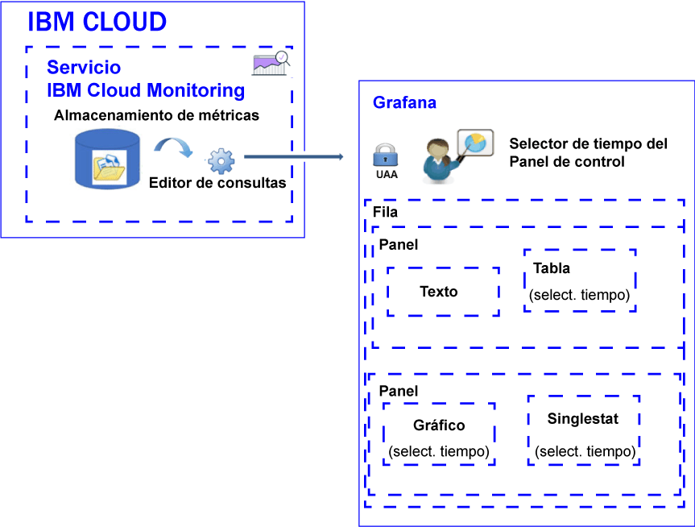

---

copyright:
  years: 2017, 2019

lastupdated: "2019-03-06"

keywords: IBM Cloud, monitoring

subcollection: cloud-monitoring

---

{:new_window: target="_blank"}
{:shortdesc: .shortdesc}
{:screen: .screen}
{:pre: .pre}
{:table: .aria-labeledby="caption"}
{:codeblock: .codeblock}
{:tip: .tip}
{:download: .download}
{:important: .important}
{:note: .note}

# Análisis de métricas
{: #analyze_metrics_ov}

En {{site.data.keyword.Bluemix}}, puede utilizar Grafana, una plataforma de visualización y supervisión de código abierto, para supervisar, buscar, analizar y visualizar métricas en diversos gráficos, como diagramas y tablas. 
{:shortdesc}

## Visión general de los componentes
{: #overview}

El servicio {{site.data.keyword.monitoringshort}} almacena series de datos en la base de datos de almacenamiento de métricas. Puede consultar estos datos en el Editor de consultas. 

En Grafana, para acceder a los datos disponibles en la base de datos de almacenamiento de métricas, debe iniciar sesión en una organización, una región y un espacio con el ID de usuario y la contraseña que utiliza para iniciar sesión en {{site.data.keyword.Bluemix_notm}}. 

Para visualizar los datos, configure un panel de control que puede incluir una o más filas. En cada fila, puede definir varios paneles. 

* Una fila agrupa paneles en un panel de control. 
* Un panel es el recurso de visualización básico para supervisar métricas. 
* Un panel de control se puede etiquetar y puede incluir anotaciones con datos que puede utilizar para correlacionar datos entre paneles.

Puede definir los siguientes tipos de paneles: texto, gráfico, tabla, singlestat. Cada panel ofrece diferentes estilos y opciones de formato que puede personalizar. 

La cantidad de datos que se visualizan en un panel está determinada por la consulta y el rango de tiempo que se establece. Puede establecer un rango de tiempo común para todos los paneles a nivel del panel de control o rangos de tiempo individuales para cada panel.

La figura siguiente muestra los distintos componentes del servicio {{site.data.keyword.monitoringshort}} que utiliza Grafana para filtrar datos, y los recursos que se pueden utilizar en Grafana para visualizar y analizar los datos:

