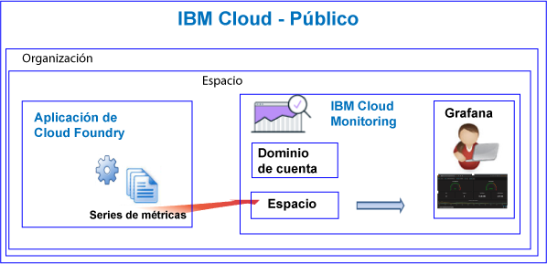

---

copyright:
  years: 2017, 2019

lastupdated: "2019-03-06"

keywords: IBM Cloud, monitoring

subcollection: cloud-monitoring

---

{:new_window: target="_blank"}
{:shortdesc: .shortdesc}
{:screen: .screen}
{:pre: .pre}
{:table: .aria-labeledby="caption"}
{:codeblock: .codeblock}
{:tip: .tip}
{:download: .download}
{:important: .important}
{:note: .note}


# Apps de Cloud Foundry
 {:#monitoring_bluemix_apps}

En {{site.data.keyword.Bluemix}}, las métricas se recopilan automáticamente para las apps de Cloud Foundry (CF) que se ejecutan en la región Public, y que se reenvían al servicio {{site.data.keyword.monitoringlong}}. Puede utilizar Grafana para análisis para supervisar el rendimiento de la aplicación de CF. También puede utilizar la API de métricas para consultar las métricas de la app de CF y tomar medidas basadas en los datos.
{:shortdesc}


## Supervisión de apps de CF que se ejecutan en Public
{: #public}


Considere la siguiente información cuando utilice el servicio {{site.data.keyword.monitoringshort}} para supervisar una app de CF:

* Debe suministrar el servicio {{site.data.keyword.monitoringshort}} en el mismo espacio en el que se ejecuta la app de CF.
* Las métricas recopiladas para una app de CF se reenvían automáticamente al dominio de espacio en el servicio {{site.data.keyword.monitoringshort}}. 
* Las métricas se reenvían a un dominio de espacio. El dominio de espacio se corresponde con aquel donde se ejecuta la app de CF. 
* También puede utilizar la API de métricas para consultar las métricas y tomar medidas basadas en los datos. Por ejemplo, puede crear una automatización que consulta la utilización de CPU de la app de CF, y que la escala si la CPU está llegando demasiado alto.

La figura siguiente muestra una vista de nivel alto de supervisión de las apps de CF en {{site.data.keyword.Bluemix_notm}}:



## Supervisión de apps de CF en ejecución fuera de {{site.data.keyword.Bluemix_notm}}
{: #outside}

Para supervisar apps de CF que se ejecutan fuera de {{site.data.keyword.Bluemix_notm}}, puede utilizar la API de métricas para reenviar las métricas de la app CF al servicio {{site.data.keyword.monitoringshort}}.

* Para obtener más información sobre la API, consulte [API de métricas](https://console.bluemix.net/apidocs/927-ibm-cloud-monitoring-metrics-api?&language=node#introduction).
* Para obtener más información sobre el uso de la API, consulte [Envío de datos mediante la API de métricas](/docs/services/cloud-monitoring/send-metrics?topic=cloud-monitoring-send_data_api#send_data_api).


## Ver y analizar las métricas de apps CF
{: #monitoring_cfapps}

Para supervisar el rendimiento de las aplicaciones CF en {{site.data.keyword.Bluemix_notm}}, utilice Grafana. 

El servicio {{site.data.keyword.monitoringlong}} utiliza Grafana, un análisis de código abierto y una plataforma de visualización, que puede utilizar para supervisar, buscar, analizar y visualizar las métricas en diversos gráficos, como por ejemplo diagramas y tablas.

Grafana se puede iniciar desde un navegador. Para obtener más información, consulte [Navegación al panel de control de Grafana desde un navegador web](/docs/services/cloud-monitoring/grafana?topic=cloud-monitoring-navigating_grafana#launch_grafana_from_browser).

**Nota:** Debe iniciar Grafana en la misma región de {{site.data.keyword.Bluemix_notm}} donde está en ejecución la instancia de app CF.


Para supervisar aplicaciones CF, debe definir una o varias consultas en Grafana. Para obtener más información, consulte [Configuración de una consulta de métricas en Grafana](/docs/services/cloud-monitoring/grafana?topic=cloud-monitoring-define_query#define_query). 

También puede definir alertas en las consultas. Para obtener más información, consulte [Configuración de alertas](/docs/services/cloud-monitoring?topic=cloud-monitoring-config_alerts_ov#config_alerts_ov).


## Métricas de CPU
{: #cpu_metrics}

La serie de métricas recopiladas automáticamente para cada aplicación CF incluye datos sobre la utilización de CPU.


<table>
  <caption>Métricas de CPU recopiladas para una aplicación CF</caption>
  <tr>
    <th>Métrica</th>
    <th>Descripción</th>
  </tr>
  <tr>
    <td>cpu-utilization</td>
    <td>Porcentaje de utilización de CPU hacia el límite del contenedor.</td>
  </tr>
</table>


## Métricas de disco
{: #disk_metrics}

La serie de métricas recopiladas automáticamente para cada aplicación CF incluye datos sobre el tamaño de disco utilizado, el tamaño total de disco disponible y el porcentaje de disco utilizado.


<table>
  <caption>Métricas de disco recopiladas para una aplicación CF</caption>
  <tr>
    <th>Métrica</th>
    <th>Descripción</th>
  </tr>
  <tr>
    <td>disk-bytes-total</td>
    <td>Tamaño de disco del contenedor en el que se está ejecutando la app CF. Valor definido en bytes.</td>
  </tr>
  <tr>
    <td>disk-bytes-used</td>
    <td>Tamaño de disco del contenedor que utiliza la app CF en disco. Valor definido en bytes.</td>
  </tr>
  <tr>
    <td>disk-utilization</td>
    <td>Porcentaje de disco que utiliza la app CF.</td>
  </tr>
</table>

**Nota:** 

* Especifique el tamaño del disco al enviar la app CF.
* Cuando la utilización de disco alcanza el 90%, considere escalar la app CF.

## Métricas de memoria
{: #mem_metrics}

La serie de métricas que se recopilan automáticamente para cada aplicación CF incluye datos sobre la memoria utilizada, la memoria total disponible y el porcentaje de memoria utilizado.

<table>
  <caption>Métricas de memoria recopiladas para una aplicación CF</caption>
  <tr>
    <th>Métrica</th>
    <th>Descripción</th>
  </tr>
  <tr>
    <td>memory-bytes-total</td>
    <td>Memoria en bytes disponible para la app CF.</td>
  </tr>
  <tr>
    <td>memory-bytes-used</td>
    <td>Memoria en bytes utilizada por la instancia de app CF.</td>
  </tr>
  <tr>
    <td>memory-utilization</td>
    <td>Porcentaje de memoria utilizada por la app CF.</td>
  </tr>
</table>


## Formato de consulta de métricas
{: #query_format}


Las consultas que define en Grafana para supervisar una aplicación Cloud Foundry deben cumplir con el formato siguiente: 

```
{Origen}.{Tipo de nube}.{Nombre de servicio}.{Región}.{Nombre de CFapp}.{Índice de CFapp}.{Contenedor de CFapp}.{Tipo de métrica}.{Subtipo de métrica}.[Funciones]
```
{: codeblock}

Por ejemplo, consulte muestras de la serie de métricas recopiladas para una instancia de app CF denominada logtester en la región de Sídney:

```
ibmcloud.public.cloud-foundry.au-syd.logtester.0.container.cpu.utilization
ibmcloud.public.cloud-foundry.au-syd.logtester.0.container.disk.bytes-total
ibmcloud.public.cloud-foundry.au-syd.logtester.0.container.disk.bytes-used
ibmcloud.public.cloud-foundry.au-syd.logtester.0.container.disk.utilization
ibmcloud.public.cloud-foundry.au-syd.logtester.0.container.memory.bytes-total
ibmcloud.public.cloud-foundry.au-syd.logtester.0.container.memory.bytes-used
ibmcloud.public.cloud-foundry.au-syd.logtester.0.container.memory.utilization
```
{: screen}

Para obtener más información, consulte [Formato de métricas de apps CF](/docs/services/cloud-monitoring/reference?topic=cloud-monitoring-cfapps_metrics_format#cfapps_metrics_format).

**Nota:** No todos los caracteres permitidos en los nombres de app CF están permitidos en los nombres de serie de métricas. Por ejemplo, no están permitidas las mayúsculas. El nombre de la app CF que puede ver en Grafana al definir una consulta se modifica a todo en minúsculas.


