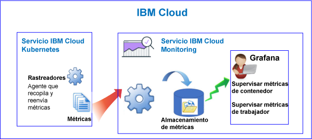
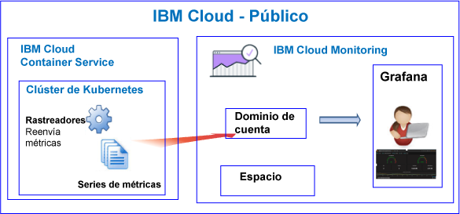
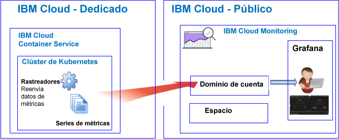

---

copyright:
  years: 2017, 2019

lastupdated: "2019-03-06"

keywords: IBM Cloud, monitoring

subcollection: cloud-monitoring

---

{:new_window: target="_blank"}
{:shortdesc: .shortdesc}
{:screen: .screen}
{:pre: .pre}
{:table: .aria-labeledby="caption"}
{:codeblock: .codeblock}
{:tip: .tip}
{:download: .download}
{:important: .important}
{:note: .note}

# {{site.data.keyword.containershort_notm}}
{: #monitoring_bmx_containers_ov}

En {{site.data.keyword.Bluemix}}, las métricas de clúster se recopilan automáticamente. Puede utilizar Grafana para supervisar el rendimiento de su clúster. 
{:shortdesc}

**Nota:** 

* Las métricas se recopilan y están disponibles para la supervisión a través del servicio {{site.data.keyword.monitoringshort}} para contenedores que se ejecutan en clústeres estándares.
* Para supervisar las métricas de clúster, debe suministrar una instancia del servicio de supervisión. Para obtener más información, consulte [Suministro del servicio de supervisión](/docs/services/cloud-monitoring/how-to?topic=cloud-monitoring-provision#provision).

## Acerca de la supervisión en Public
{: #public1}

En {{site.data.keyword.Bluemix_notm}}, puede utilizar el servicio {{site.data.keyword.monitoringshort}} para almacenar y analizar métricas de contenedor y métricas de clúster de Kubernetes recopiladas automáticamente por {{site.data.keyword.containershort}} en Public.

Puede tener uno o varios clústeres de Kubernetes en una cuenta. Las métricas las recopila automáticamente {{site.data.keyword.containershort}} en cuanto se suministra el clúster.  Las métricas de contenedor se recopilan en cuanto se despliega el pod. Las métricas se reenvían automáticamente al servicio {{site.data.keyword.monitoringshort}}:

Al crear un clúster, las métricas se reenviarán al dominio de cuenta en el servicio {{site.data.keyword.monitoringshort}}. Para que las métricas se reenvíen al dominio de cuenta, el propietario de la clave {{site.data.keyword.containershort}} debe tener las siguientes políticas de IAM:

* Política de IAM con permisos de **editor** para el servicio {{site.data.keyword.monitoringshort}}.
* Política de IAM con permisos de **administrador** para {{site.data.keyword.containershort}}.

En la siguiente figura se muestra una vista de alto nivel de la supervisión para {{site.data.keyword.containershort}}:

El rastreador es un proceso que se ejecuta en el host y realiza una supervisión sin agente para las métricas. El rastreador recopila constantemente métricas de CPU y de memoria de todos los contenedores de forma predeterminada.

Para analizar métricas en Grafana para un clúster, tenga en cuenta la información siguiente:

* Debe iniciar Grafana en la región Public donde se suministra la instancia de {{site.data.keyword.monitoringshort}} que utiliza para ver métricas. 
* Puede utilizar el panel de control de Grafana predeterminado **ClusterMonitoringDashboard** para supervisar el clúster.
* También puede configurar paneles de control de Grafana personalizados para visualizar datos de métricas para un clúster de la región Cloud Public donde se ha creado el clúster.
* El ID de usuario debe tener permisos para ver las métricas. 

    Para ver las métricas en el dominio de la cuenta, un usuario necesita una política de IAM para el servicio {{site.data.keyword.monitoringshort}}. El usuario necesita permisos de **Visor**. 

En la siguiente figura se muestra una vista de alto nivel de supervisión en Public para {{site.data.keyword.containershort}}. El clúster reenvía métricas al dominio de la cuenta:

## Acerca de la supervisión en Dedicated
{: #dedicated}

En {{site.data.keyword.Bluemix_notm}}, puede utilizar el servicio {{site.data.keyword.monitoringshort}} en Public para almacenar y analizar métricas de contenedor y métricas de clúster de Kubernetes que recopila automáticamente {{site.data.keyword.containershort}} en Dedicated.

Puede tener uno o varios clústeres de Kubernetes en una cuenta. Las métricas las recopila automáticamente {{site.data.keyword.containershort}} en cuanto se suministra el clúster.  Las métricas de contenedor se recopilan en cuanto se despliega el pod. Las métricas se reenvían automáticamente al dominio de cuenta del servicio {{site.data.keyword.monitoringshort}}.

Al crear un clúster, las métricas se reenviarán al dominio de cuenta en el servicio {{site.data.keyword.monitoringshort}}. Para que las métricas se reenvíen al dominio de cuenta, el propietario de la clave {{site.data.keyword.containershort}} debe tener las siguientes políticas de IAM:

* Política de IAM con permisos de **editor** para el servicio {{site.data.keyword.monitoringshort}}.
* Política de IAM con permisos de **administrador** para {{site.data.keyword.containershort}}.

Para ver y analizar las métricas de un clúster en Grafana, tenga en cuenta la información siguiente:

* Debe iniciar Grafana en la región Cloud Public donde está disponible el clúster en Dedicated. Por ejemplo, si se suministra un clúster en Dedicated en EE.UU. sur, debe iniciar Grafana en la región EE.UU. sur en Public.
* Puede utilizar el panel de control de Grafana predeterminado **ClusterMonitoringDashboard** para supervisar el clúster.
* También puede configurar paneles de control de Grafana personalizados para visualizar datos de métricas para un clúster de la región Cloud Public donde se ha creado el clúster.
* Su ID de usuario debe tener una política de IAM para trabajar con el servicio {{site.data.keyword.monitoringshort}}. Debe tener permisos de **Visor** para ver métricas en el dominio de la cuenta.  

En la siguiente figura se muestra una vista de alto nivel de supervisión en Dedicated para {{site.data.keyword.containershort}}:

## Contenedores: Métricas de CPU
{: #cpu_metrics_containers}

La tabla siguiente lista las métricas de CPU que se capturan automáticamente para un contenedor:

| Métrica | Descripción | Unidades |
|----------|---------|---------|
| `cpu.num-cores` | Esta métrica informa del número de núcleos de CPU disponibles en el contenedor.  De forma predeterminada, esta métrica informa del número de núcleos en el trabajador. Si establece un límite en el número de núcleos disponibles en el contenedor, la métrica informa del número de núcleos que se establece en dicho límite. | Número decimal |
| `cpu.usage` | Esta métrica informa de los nanosegundos del tiempo de CPU en todos los núcleos.  Cuando la utilización de la CPU es elevada, podría presentarse algún tipo de retardo. Una utilización de CPU elevada indica la falta de potencia de proceso. | Nanosegundos |
| `cpu.usage-pct` | Esta métrica informa sobre el tiempo de CPU que se utiliza como un porcentaje de la capacidad de la CPU.  De forma predeterminada, la capacidad de CPU está determinada por el número de núcleos en el trabajador. Si establece los límites en la capacidad de CPU del contenedor, la métrica informa del uso de CPU como un porcentaje de los límites que establece. Cuando el porcentaje de utilización de CPU es elevado, podría presentarse algún tipo de retardo. Una utilización de CPU elevada indica la falta de potencia de proceso. | Porcentaje |
| `cpu.usage-pct-container-requested`  | Esta métrica informa del tiempo de CPU utilizado como porcentaje de la CPU solicitada del contenedor.  Si no establece la CPU solicitada en un contenedor, la métrica no está expuesta para el contenedor. | Porcentaje |
{: caption="Métricas de CPU para contenedores" caption-side="top"} 

## Contenedores: Métricas de memoria
{: #memory_metrics}

La tabla siguiente lista las métricas de memoria capturadas automáticamente:

| Métrica | Descripción | Unidades |
|----------|---------|---------|
| `memory.current` | Esta métrica informa de los bytes de memoria que el contenedor está utilizando actualmente. | Bytes |
| `memory.limit` | Esta métrica informa del límite de memoria del contenedor. De forma predeterminada, los contenedores se ejecutan sin límites de memoria. Un contenedor puede consumir tanta memoria como la que haya en el trabajador en el que se ejecuta. Cuando se despliega un pod, se pueden establecer límites a la cantidad de memoria que sus contenedores pueden utilizar. | Bytes |
| `memory.usage-pct` | Esta métrica informa de la memoria que se utiliza como porcentaje del límite de memoria del contenedor.  Si establece límites a la cantidad de memoria que puede utilizar un contenedor, la métrica informa del uso de memoria como porcentaje de los límites que establece. | Porcentaje | 
| `memory.working-set` | Esta métrica informa de los bytes de memoria activa que el contenedor está utilizando actualmente en la memoria caché en caliente. | Bytes |
{: caption="Métricas de memoria para contenedores" caption-side="top"} 

## Pods: Métricas de red
{: #network_metrics_pods}

La tabla siguiente lista las métricas de red relacionadas con la recepción de datos y capturadas automáticamente:

| Métrica | Descripción | Unidades |
|----------|---------|---------|
| `container.namespace.podName.network.rx.bytes` | Esta métrica informa del número de bytes que recibe el pod.  | Bytes  |
| `container.namespace.podName.network.rx.error` | Esta métrica informa del número de errores que tenía el pod al recibir tramas. | Número  |
| `container.namespace.podName.network.rx.packets` | Esta métrica informa del número de paquetes que recibe el pod.  | Número  |
{: caption="Métricas de red de RX para pods" caption-side="top"} 

La tabla siguiente lista las métricas de red relacionadas con la transmisión de datos y capturadas automáticamente:

| Métrica | Descripción | Unidades |
|----------|---------|---------|
| `container.namespace.podName.network.tx.bytes` | Esta métrica informa del número de bytes enviados al pod.  | Bytes  |
| `container.namespace.podName.network.tx.errors` | Esta métrica informa del número de errores que tenía el pod al enviar las tramas.  | Número  |
| `container.namespace.podName.network.tx.packets` | Esta métrica informa del número de paquetes enviados al pod.  | Número  |
{: caption="Métricas de red de TX para pods" caption-side="top"} 

## Trabajadores: Métricas de disco
{: #disk_metrics_workers}

La tabla siguiente lista las métricas de disco que se capturan automáticamente para un trabajador:

| Métrica | Descripción | Unidades |
|----------|---------|---------|
| `worker.disk.diskDevice.read.bytes` | Esta métrica informa de la velocidad de entrada/salida de lectura del dispositivo de disco.  | Bytes  |
| `worker.disk.diskDevice.read.io` | Esta métrica informa del rendimiento de lectura para el dispositivo.  | Bytes por segundo  |
| `worker.disk.diskDevice.read.reads` | Esta métrica informa de la velocidad de entrada/salida de lectura máxima del dispositivo de disco.  | Bytes por segundo  |
| `worker.disk.diskDevice.read.waits` | Esta métrica informa del tiempo que espera el trabajador una solicitud de entrada/salida de lectura.  | Bytes por segundo  |
| `worker.disk.diskDevice.write.bytes` | Esta métrica informa de la velocidad de entrada/salida de escritura para un dispositivo de disco.  | Bytes  |
| `worker.disk.diskDevice.write.io` | Esta métrica informa del rendimiento de escritura para el dispositivo.  | Bytes por segundo  |
| `worker.disk.diskDevice.write.writes` | Esta métrica informa de la velocidad de entrada/salida de escritura máxima del dispositivo de disco.  | Bytes por segundo  |
| `worker.disk.diskDevice.write.waits` | Esta métrica informa del tiempo que espera el trabajador una solicitud de entrada/salida de escritura.  | Bytes por segundo  |
| `worker.disk.diskDevice.size`| Esta métrica informa de la capacidad de almacenamiento del dispositivo.  | Bytes  |
| `worker.disk.diskDevice.used` | Esta métrica informa del número de bytes utilizados en el dispositivo.  | Bytes  |
| `worker.disk.diskDevice.usedpct` | Esta métrica informa del porcentaje de almacenamiento utilizado en el dispositivo.  | Porcentaje  |
{: caption="Métricas de disco para trabajadores" caption-side="top"} 

## Trabajadores: Métricas de carga
{: #load_metrics_workers}

La tabla siguiente lista las métricas de CPU que se capturan automáticamente para un trabajador:

| Métrica | Descripción | Unidades |
|----------|---------|---------|
| `load.avg-1` | Esta métrica informa de la carga de CPU promedio para el host de Kubernetes en el último minuto.  Una carga de CPU promedio que es mayor que el número de núcleos en el trabajador indica que el tráfico hacia el host está en cola.  | Número  |
| `load.avg-5` | Esta métrica informa de la carga de CPU promedio para el host de Kubernetes de los últimos 5 minutos.  Una carga de CPU promedio que es mayor que el número de núcleos en el trabajador indica que el tráfico hacia el host está en cola.  | Número  |
| `load.avg-15` | Esta métrica informa de la carga de CPU promedio para el host de Kubernetes de los últimos 15 minutos.  Una carga de CPU promedio que es mayor que el número de núcleos en el trabajador indica que el tráfico hacia el host está en cola.  |  Número |
{: caption="Métricas de carga para trabajadores" caption-side="top"} 

## Trabajadores: Métricas de memoria
{: #memory_metrics_workers}

La tabla siguiente lista las métricas de memoria que se capturan automáticamente para un trabajador:

| Métrica | Descripción | Unidades |
|----------|---------|---------|
| `memory.available` | Esta métrica informa de los bytes de memoria que están libres para que los utilice un trabajador.   | Bytes  |
| `memory.used` | Esta métrica informa de los bytes de memoria que el trabajador está utilizando actualmente.  | Bytes  |
{: caption="Métricas de memoria para trabajadores" caption-side="top"} 

## Trabajadores: Métricas de red
{: #network_metrics_workers}

La tabla siguiente lista las métricas de red relacionadas con la recepción de datos y capturadas automáticamente:

| Métrica | Descripción | Unidades |
|----------|---------|---------|
| `network.interface.rx.bytes` | Esta métrica informa del número de bytes que el trabajador ha recibido en la interfaz.  | Bytes  |
| `network.interface.rx.errs` | Esta métrica informa del número de errores que el trabajador tenía al recibir tramas en la interfaz. | Número |
| `network.interface.rx.packets` | Esta métrica informa del número de paquetes que el trabajador ha recibido en la interfaz. | Número |
{: caption="Métricas de red de RX para trabajadores" caption-side="top"} 

La tabla siguiente lista las métricas de red relacionadas con la transmisión de datos y capturadas automáticamente:

| Métrica | Descripción | Unidades |
|----------|---------|---------|
| `network.interface.tx.bytes` | Esta métrica informa del número de bytes que el trabajador ha enviado mediante la interfaz. | Bytes  |
| `network.interface.tx.err` | Esta métrica informa del número de errores que el trabajador tenía al enviar tramas en la interfaz.  | Número  |
| `network.interface.tx.packets` | Esta métrica informa del número de paquetes que el trabajador ha enviado mediante la interfaz.  | Número  |
{: caption="Métricas de red de TX para trabajadores" caption-side="top"} 

La tabla siguiente lista las métricas de red relacionadas con los sockets abiertos y que se capturan automáticamente:

| Métrica | Descripción | Unidades |
|----------|---------|---------|
| `network.sockets.udp`  `network.sockets.udp6`  `network.sockets.tcp`  `network.sockets.tcp6.open` | Esta métrica informa del número de sockets abiertos para un protocolo.   | Número  |
| `network.sockets.tcp`  `network.sockets.tcp6.timewait` | Esta métrica informa del número de sockets TCP abiertos en el estado `time wait`.  | Número  |
{: caption="Métricas de red de sockets para trabajadores" caption-side="top"} 

## Definición de consultas para supervisar recursos en un clúster de Kubernetes
{: #monitoring_metrics_kube}

Para supervisar el rendimiento de contenedores y trabajadores desplegados en un clúster de Kubernetes en {{site.data.keyword.Bluemix_notm}}, utilice Grafana. 

El servicio {{site.data.keyword.monitoringlong}} utiliza Grafana, un análisis de código abierto y una plataforma de visualización, que puede utilizar para supervisar, buscar, analizar y visualizar las métricas en diversos gráficos, como por ejemplo diagramas y tablas.

Grafana se puede iniciar desde un navegador. Para obtener más información, consulte [Navegación al panel de control de Grafana desde un navegador web](/docs/services/cloud-monitoring/grafana?topic=cloud-monitoring-navigating_grafana#launch_grafana_from_browser).

Para supervisar contenedores y trabajadores que se ejecutan en un clúster de Kubernetes, debe definir una consulta en Grafana para cada recurso:

* Para definir una consulta que supervisa una métrica CPU para un contenedor, consulte [Configuración de métricas de CPU para un contenedor en Grafana](/docs/services/cloud-monitoring/containers?topic=cloud-monitoring-config_cpu_containers#config_cpu_containers).
* Para definir una consulta que supervisa una métrica de memoria para un contenedor, consulte [Configuración de métricas de memoria para un contenedor en Grafana](/docs/services/cloud-monitoring/containers?topic=cloud-monitoring-config_mem_container#config_mem_container).
* Para definir una consulta que supervisa una métrica de carga para un trabajador, consulte [Configuración de métricas de carga para un trabajador en Grafana](/docs/services/cloud-monitoring/containers?topic=cloud-monitoring-config_load_worker#config_load_worker).

El formato de la consulta es diferente por tipo de recurso y tipo de consulta:

* Para obtener más información sobre el formato de las consultas para supervisar CPU para un contenedor, consulte [Formato de consulta de métricas de CPU para un contenedor](/docs/services/cloud-monitoring/reference?topic=cloud-monitoring-metrics_format_containers#cpu_containers). 
* Para obtener más información sobre el formato de las consultas para supervisar la carga para un trabajador, consulte [Formato de consulta de métricas de carga para un trabajador](/docs/services/cloud-monitoring/reference?topic=cloud-monitoring-metrics_format_containers#load_workers).
* Para obtener más información sobre el formato de las consultas para supervisar la memoria para un contenedor, consulte [Formato de consulta de métricas de memoria para un contenedor](/docs/services/cloud-monitoring/reference?topic=cloud-monitoring-metrics_format_containers#mem_containers).

## Configuración del tráfico de red para configuraciones personalizadas de cortafuegos en {{site.data.keyword.Bluemix_notm}}
{: #ports}

Si tiene configurado un cortafuegos adicional, o si ha personalizado los valores de cortafuegos en la infraestructura de {{site.data.keyword.Bluemix_notm}} (SoftLayer), debe permitir el tráfico de red de salida entre el nodo trabajador y el servicio {{site.data.keyword.monitoringshort}}. 

Debe abrir el puerto TCP 443 y el puerto TCP 9091 entre cada trabajador y el servicio {{site.data.keyword.monitoringshort}} para las siguientes direcciones IP en el cortafuegos personalizado:

<table>
  <tr>
    <th>Región</th>
    <th>URL de ingestión</th>
	<th>Direcciones IP públicas</th>
  </tr>
  <tr>
    <td>Alemania</td>
	<td>ingest-eu-fra.logging.bluemix.net</td>
	<td>158.177.88.43  159.122.87.107</td>
  </tr>
  <tr>
    <td>Reino Unido</td>
	<td>ingest.logging.eu-gb.bluemix.net</td>
	<td>169.50.115.113</td>
  </tr>
  <tr>
    <td>EE.UU. sur</td>
	<td>ingest.logging.ng.bluemix.net</td>
	<td>169.48.79.236  169.46.186.113</td>
  </tr>
  <tr>
    <td>Sídney</td>
	<td>ingest-au-syd.logging.bluemix.net</td>
	<td>130.198.76.125  168.1.209.20</td>
  </tr>
</table>

## Guías de aprendizaje
{: #tutorial}

Para aprender a utilizar el servicio {{site.data.keyword.monitoringshort}} para supervisar el rendimiento de su contenedor, consulte [Analice métricas en Grafana para una app desplegada en un clúster de Kubernetes](/docs/services/cloud-monitoring/tutorials?topic=cloud-monitoring-container_service_metrics#container_service_metrics).

Para aprender a crear un panel de control de Grafana en el servicio {{site.data.keyword.monitoringshort}} para supervisar el rendimiento de su clúster, consulte [Cree un panel de control de Grafana para supervisar un clúster de Kubernetes](/docs/services/cloud-monitoring/tutorials?topic=cloud-monitoring-container_grafana_dashboard#container_grafana_dashboard).
