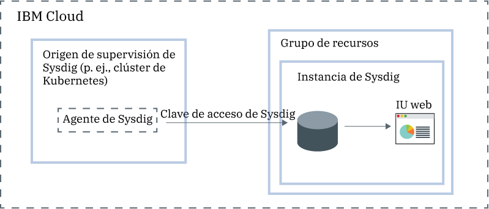

---

copyright:
  years:  2018, 2019
lastupdated: "2019-03-06"

keywords: Sysdig, IBM Cloud, monitoring, getting started

subcollection: Sysdig

---

{:new_window: target="_blank"}
{:shortdesc: .shortdesc}
{:screen: .screen}
{:pre: .pre}
{:table: .aria-labeledby="caption"}
{:codeblock: .codeblock}
{:tip: .tip}
{:download: .download}
{:important: .important}
{:note: .note}

# Guía de aprendizaje de iniciación
{: #getting-started}

{{site.data.keyword.mon_full_notm}} es un sistema de gestión inteligente de contenedores de terceros nativo de la nube que puede incluir como parte de la arquitectura {{site.data.keyword.cloud_notm}}. Utilícelo para obtener visibilidad operativa sobre el rendimiento y el estado de las aplicaciones, los servicios y las plataformas. Ofrece a los administradores, a los equipos DevOps y a los desarrolladores telemetría de pila completa con funciones avanzadas para supervisar y solucionar problemas, definir alertas y diseñar paneles de control personalizados. {{site.data.keyword.mon_full_notm}} es una característica gestionada por Sysdig en asociación con {{site.data.keyword.IBM_notm}}.
{:shortdesc}

En la figura siguiente se muestra una visión general de los componentes del servicio {{site.data.keyword.mon_full_notm}} que se ejecuta en {{site.data.keyword.cloud_notm}}:

## Características
{: #features}

**Acelerar el diagnóstico y la resolución de los incidentes de rendimiento.**

{{site.data.keyword.mon_full_notm}} ofrece una visibilidad profunda de la infraestructura y de las aplicaciones, con la posibilidad de resolver problemas desde el nivel de servicio hasta el nivel del sistema. Los paneles de control predefinidos y las alertas simplifican la identificación de amenazas o problemas potenciales. Mediante {{site.data.keyword.mon_full_notm}}, los desarrolladores y los equipos de DevOps supervisan y solucionan problemas de rendimiento en tiempo real, identifican el origen de los errores y eliminan los problemas. 

**Controlar el coste de la infraestructura de supervisión.**

{{site.data.keyword.mon_full_notm}} incluye funciones que le ayudan a controlar el coste de la infraestructura de supervisión en {{site.data.keyword.cloud_notm}}. Puede configurar los orígenes de métricas cuyo rendimiento desea supervisar. Puede habilitar una alerta predefinida para advertirle de los cambios de uso que afectarán a su facturación. 

**Explorar y visualizar fácilmente todo el entorno.**

{{site.data.keyword.mon_full_notm}} facilita la exploración visual del entorno. Los mapas dinámicos de topología proporcionan una vista de las dependencias entre servicios. Las consultas multidimensionales entre métricas de alta rotación, alta cardinalidad y alta frecuencia aceleran la resolución de problemas. Los paneles de control personalizables le permiten visualizar lo que más le interesa. 

**Obtener información detallada sobre los Kubernetes y los contenedores críticos para la supervisión dinámica de microservicios.**

{{site.data.keyword.mon_full_notm}} descubre automáticamente los entornos de Kubernetes que proporcionan paneles de control y alertas listos para el uso para clústeres, nodos, espacios de nombres, servicios, despliegues, pods y más. Un solo agente por nodo descubre dinámicamente todos los microservicios y recopila automáticamente las métricas y sucesos de varios orígenes, que incluyen Kubernetes, hosts, redes, contenedores, procesos, aplicaciones y métricas personalizadas, como Prometheus, JMX y StatsD. 

**Mitigar el impacto de las situaciones anómalas con notificaciones proactivas.**

{{site.data.keyword.mon_full_notm}} incluye alertas y notificaciones multicanal que puede utilizar para reducir el impacto en las operaciones diarias y para acelerar su reacción y el tiempo de respuesta frente a anomalías, tiempo de inactividad y degradación del rendimiento. Los canales de notificación que se pueden configurar fácilmente incluyen *correo electrónico*, *slack*, *PagerDuty*, *Webhooks*, *OpsGenie* y *VictorOps*.

## Antes de empezar
{: #prereqs}

Debe tener un ID de usuario que sea miembro o propietario de una cuenta de {{site.data.keyword.cloud_notm}}. Para obtener un ID de usuario de {{site.data.keyword.cloud_notm}}, vaya a: [Registro ](https://cloud.ibm.com/login){:new_window}.

El servicio está actualmente disponible en la región EE. UU. sur. Complete los pasos de iniciación en la región EE. UU. sur.

## Paso 1: Gestionar el acceso de los usuarios
{: #step1}

Todos los usuarios que acceden al servicio {{site.data.keyword.mon_full_notm}} en su cuenta deben tener asignada una política de acceso con un rol de usuario de IAM definido. La política determina qué acciones puede llevar a cabo el usuario en el contexto del servicio o de la instancia que seleccione. Las acciones permitidas se pueden personalizar y se definen como operaciones que se permite realizar en el servicio. A continuación, las acciones se correlacionan con los roles de usuario de IAM. Para obtener más información, consulte [Gestión del acceso de usuarios en {{site.data.keyword.cloud_notm}}](/docs/services/Monitoring-with-Sysdig?topic=Sysdig-iam#iam).

Cuando se otorgan permisos a un usuario en {{site.data.keyword.cloud_notm}} para que trabaje con el servicio {{site.data.keyword.mon_full_notm}}, se otorga automáticamente al usuario un rol de Sysdig. Este rol determina las acciones que puede ejecutar el usuario. Los roles válidos son *Admin de Sysdig* y *Usuario de Sysdig*. Para obtener más información, consulte [Correlación de roles de Sysdig con roles de {{site.data.keyword.cloud_notm}}](/docs/services/Monitoring-with-Sysdig?topic=Sysdig-iam#iam_sysdig).

Antes de poder suministrar una instancia, tenga en cuenta la información siguiente:
* El propietario de la cuenta puede crear, ver y suprimir una instancia de un servicio en {{site.data.keyword.cloud_notm}}, y puede otorgar permisos a otros usuarios para que trabajen con el servicio {{site.data.keyword.mon_full_notm}}.
* Debe tener permisos para crear recursos en el grupo de recursos *Predeterminado*.
* Otros usuarios de {{site.data.keyword.cloud_notm}} con permisos de `administrador` o de `editor` pueden gestionar el servicio {{site.data.keyword.mon_full_notm}} en {{site.data.keyword.cloud_notm}}. Estos usuarios también deben tener permisos de la plataforma para crear recursos dentro del contexto del grupo de recursos en el que van a suministrar la instancia.

Para otorgar a un usuario el rol de administrador para el servicio y para gestionar instancias dentro de un grupo de recursos en la cuenta, el usuario debe tener una política de IAM para el servicio {{site.data.keyword.mon_full_notm}} con el rol de **Administrador** de la plataforma
dentro del contexto del grupo de recursos. 

Siga los pasos siguientes para asignar a un usuario el rol de administrador sobre el servicio {{site.data.keyword.mon_full_notm}} dentro del contexto de un grupo de recursos: 

1. En la barra de menús, pulse **Gestionar** &gt; **Acceso (IAM)** y seleccione **Usuarios**.
2. En la fila del usuario al que desea asignar acceso, seleccione el menú **Acciones** y, a continuación, pulse **Asignar acceso**.
3. Seleccione **Asignar acceso dentro de un grupo de recursos**.
4. Seleccione un grupo de recursos.
5. Si el usuario aún no tiene un rol otorgado para el grupo de recursos seleccionado, elija un rol para el campo **Asignar acceso a un grupo de recursos**. 

    En función del rol que seleccione, el usuario puede ver el grupo de recursos en su panel de control, editar el nombre del grupo de recursos o gestionar el acceso de usuarios al grupo. 
    
    Puede seleccionar **Sin acceso** si desea que el usuario solo tenga acceso al servicio {{site.data.keyword.mon_full_notm}} en el grupo de recursos.

6. Seleccione **{{site.data.keyword.mon_full_notm}}**.
7. Seleccione el rol de **Administrador** de la plataforma.
8. Pulse **Asignar**.

## Paso 2: Suministrar una instancia del servicio {{site.data.keyword.mon_full_notm}}
{: #step2}

Para añadir características de supervisión con {{site.data.keyword.mon_full_notm}} en {{site.data.keyword.cloud_notm}}, debe suministrar una instancia del servicio {{site.data.keyword.mon_full_notm}}. 

Cuando se suministra una instancia, los datos se envían a un tercero.
{: tip}

Una instancia se suministra dentro del contexto de un grupo de recursos. Un grupo de recursos le permite organizar los servicios para el control de accesos y para la facturación. Puede suministrar la instancia de {{site.data.keyword.mon_full_notm}} en el grupo de recursos *predeterminado* o en un grupo de recursos personalizado.

Cuando se suministra una instancia, se obtiene automáticamente una clave de ingestión, conocida como la *clave de acceso de Sysdig*.

Para suministrar una instancia mediante la interfaz de usuario de {{site.data.keyword.cloud_notm}}, siga los pasos siguientes:

1. Inicie una sesión en su cuenta de {{site.data.keyword.cloud_notm}}.

    Pulse el [panel de control de {{site.data.keyword.cloud_notm}} ](https://cloud.ibm.com/login){:new_window} para iniciar el panel de control de {{site.data.keyword.cloud_notm}}.

	Cuando inicia una sesión con su ID de usuario y su contraseña, se abre la interfaz de usuario de {{site.data.keyword.cloud_notm}}.

2. Pulse **Catálogo**. Se abrirá la lista de servicios disponibles en {{site.data.keyword.cloud_notm}}.

3. Para filtrar la lista de servicios que se visualiza, seleccione la categoría **Herramientas de desarrollador**.

4. Pulse el mosaico **{{site.data.keyword.mon_full_notm}}**.

5. Seleccione un plan de servicio. De forma predeterminada, se selecciona el plan de **Prueba**.

    Para obtener más información sobre los planes de servicio, consulte el apartado sobre [Tarifas](/docs/services/Monitoring-with-Sysdig?topic=Sysdig-pricing_plans#pricing_plans).

6. Seleccione un grupo de recursos. De forma predeterminada, se selecciona el **predeterminado**.

7. Pulse **Crear** para suministrar una instancia.

Se abre la interfaz de usuario de servicio.

**Nota:** para suministrar una instancia de Sysdig a través de la CLI, consulte [Suministro de Sysdig a través de la CLI de {{site.data.keyword.cloud_notm}}](/docs/services/Monitoring-with-Sysdig?topic=Sysdig-provision#provision_cli).

## Paso 3: Configurar un agente de Sysdig
{: #step3}

Después de suministrar una instancia, debe configurar un agente de Sysdig para cada origen de métrica que desee supervisar. Un origen de métrica es un recurso de la nube que desea supervisar y cuyo rendimiento y estado desea controlar. Por ejemplo, un origen de métrica puede ser un clúster de Kubernetes.  

El agente de Sysdig recopila e informa de forma automática sobre métricas predefinidas. Utilice la *clave de acceso de Sysdig* para configurar el agente de Sysdig que es responsable de recopilar y reenviar los datos de métrica a la instancia. Para obtener más información, consulte [Cómo trabajar con claves de acceso](/docs/services/Monitoring-with-Sysdig?topic=Sysdig-access_key#access_key).

Puede configurar un agente de Sysdig para cualquiera de los entornos siguientes:

* Kubernetes, GKE y OpenShift.
* Contenedores de Docker o servicios no contenerizados.
* Mesos, Marathon y DCOS.
* Instalaciones Linux.

Por ejemplo, para configurar el clúster de Kubernetes para que envíe métricas a la instancia de Sysdig, debe instalar un pod `sysdig-agent`
en cada nodo de su clúster. El agente de Sysdig recopila datos del pod en el que está instalado y los reenvía a la instancia de Sysdig.

Complete una de las guías de aprendizaje siguientes para obtener información sobre cómo desplegar un agente de Sysdig:

| Recurso                |	Guía de aprendizaje                        | Entorno                | Escenario   |
|-------------------------|---------------------------------|----------------------------|------------|
| Contenedores que se ejecutan en {{site.data.keyword.containershort}} |[Análisis de métricas para una app desplegada en un clúster de Kubernetes](/docs/services/Monitoring-with-Sysdig?topic=Sysdig-kubernetes_cluster#kubernetes_cluster) | {{site.data.keyword.cloud_notm}} público |  |
|Linux Ubuntu/Debian | [Análisis de métricas para un servidor Ubuntu](/docs/services/Monitoring-with-Sysdig?topic=Sysdig-ubuntu#ubuntu) | Local |  |
{: caption="Tabla 1. Guías de aprendizaje para empezar a trabajar con {{site.data.keyword.mon_full_notm}}" caption-side="top"} 

Para obtener más información, consulte [Configuración de un agente de Sysdig](/docs/services/Monitoring-with-Sysdig?topic=Sysdig-config_agent#config_agent) y [Eliminación de un agente de Sysdig](/docs/services/Monitoring-with-Sysdig?topic=Sysdig-remove#remove).

Después de desplegar el agente de Sysdig, la recopilación y el reenvío de las métricas a la instancia es automática. El agente de Sysdig recopila e informa de forma automática sobre métricas predefinidas. También puede configurar qué métricas se deben supervisar en un entorno. También se recopilan automáticamente datos de las métricas personalizadas.

## Paso 4: Iniciar la interfaz de usuario web
{: #step4}

Después de suministrar una instancia del servicio {{site.data.keyword.mon_full_notm}} en {{site.data.keyword.Bluemix}} y de configurar un agente de Sysdig para el nodo, puede ver, supervisar y gestionar datos mediante la interfaz de usuario web del servicio.

La interfaz de usuario web dentro del contexto de la instancia de Sysdig se inicia desde la interfaz de usuario de {{site.data.keyword.cloud_notm}}. 

Siga los pasos siguientes para iniciar la interfaz de usuario web de Sysdig:

1. Inicie una sesión en su cuenta de {{site.data.keyword.cloud_notm}}.

    Pulse el [panel de control de {{site.data.keyword.cloud_notm}} ](https://cloud.ibm.com/login){:new_window} para iniciar el panel de control de {{site.data.keyword.cloud_notm}}.

	Cuando inicia una sesión con su ID de usuario y su contraseña, se abre el panel de control de {{site.data.keyword.cloud_notm}}.

2. En el menú de navegación, seleccione **Observabilidad**. 

3. Seleccione **Supervisión**. 

    Se muestra la lista de instancias de supervisión que están disponibles en {{site.data.keyword.cloud_notm}}.

4. Seleccione una instancia. A continuación, pulse **Ver Sysdig**.

Se abre la interfaz de usuario web de {{site.data.keyword.mon_full_notm}}. De forma predeterminada, se visualiza el separador *Explorar*.

De forma predeterminada, los usuarios se añaden automáticamente como miembros del equipo de **Operaciones de supervisión** que está predefinido para cada instancia de {{site.data.keyword.mon_full_notm}}. Los usuarios tienen permisos completos para ver todos los datos de la interfaz de usuario web. **Nota:** un administrador puede restringir el acceso a los datos mediante la gestión de usuarios en equipos y el control de los datos que están visibles. Por ejemplo, para restringir los permisos de visualización de los usuarios, un administrador puede crear un equipo predeterminado con un ámbito y visibilidad limitados. A continuación, asigne manualmente usuarios a otros equipos. Para obtener más información, consulte [Cómo trabajar con equipos](/docs/services/Monitoring-with-Sysdig?topic=Sysdig-teams#teams).

## Paso 5: Supervisar el entorno
{: #step5}

Puede analizar los datos en el separador *Explorar* y en el separador *Panel de control* de la interfaz de usuario web. Los datos se supervisan mediante vistas de métricas y paneles de control. 

* Utilice una vista de métricas para supervisar una métrica individual.
* Utilice paneles de control para obtener una visión especializada de los datos de red, los datos de aplicación, la topología, los servicios, los hosts y los contenedores mediante la supervisión de los datos a través de paneles. Un panel muestra una métrica o un grupo de métricas en un panel de control.
{: tip}

En el separador *Explorar*, puede supervisar los datos utilizando métricas predeterminadas y paneles de control predeterminados. Puede utilizar etiquetas para definir nuevos grupos de infraestructura que puede utilizar para agregar datos de forma diferente y supervisar el entorno. También puede utilizar paneles de control personalizados que se definen mediante el separador *Panel de control*.

En el separador *Paneles de control*, puede supervisar los datos utilizando cualquiera de los paneles de control predeterminados o creando nuevos.

Para obtener más información, consulte [Supervisión del entorno](/docs/services/Monitoring-with-Sysdig?topic=Sysdig-monitoring#monitoring)

## Paso 6: Gestionar datos
{: #step6}

Puede utilizar etiquetas para agrupar recursos de la infraestructura en jerarquías lógicas, filtrar datos y dividir en segmentos datos agregados. Personalice la forma en que se agregan los datos cuando se configura un gráfico o se crea una alerta para una métrica. Defina el ámbito de un panel de control, un panel o una alerta para filtrar puntos de datos. Restrinja el acceso a los datos gestionando el acceso a los datos de los usuarios mediante equipos. 

Por ejemplo, para una vista de métrica, puede definir el ámbito de los datos, cómo agregar los datos y qué filtros de tiempo y de grupo se deben aplicar a los datos. 

Para obtener más información, consulte [Gestión de datos](/docs/services/Monitoring-with-Sysdig?topic=Sysdig-manage#manage).

## Siguientes pasos: Configurar alertas y explorar sucesos
{: #next}

Puede utilizar sucesos para revisar, realizar un seguimiento y resolver problemas. Un suceso es una notificación que informa sobre algo que ha sucedido en cualquiera de los nodos que reenvían datos a la instancia de {{site.data.keyword.mon_full_notm}}. 

Existen distintos tipos de sucesos: 

* Los *sucesos de alerta* son sucesos que se desencadenan mediante alertas configuradas por el usuario. Por ejemplo, puede configurar alertas para que se notifique sobre los problemas que requieren atención. Para obtener más información, consulte [Cómo trabajar con alertas](/docs/services/Monitoring-with-Sysdig?topic=Sysdig-monitoring#monitoring_alerts).
* Los *sucesos basados en infraestructura* son sucesos que se recopilan de los nodos Docker y Kubernetes. De forma predeterminada, el agente de Sysdig descubre y recopila automáticamente datos de un grupo de sucesos seleccionado. Puede editar el archivo de configuración del agente para habilitar más sucesos.
* *Sucesos personalizados* que se configuran a través de cualquiera de las siguientes integraciones: Slackbot, scripts Python previamente creados, scripts Python personalizados creados por el usuario o solicitudes cURL.

Cuando defina una alerta, debe definir la condición que desencadena la notificación, uno o varios canales de notificación a través de los cuales desea que se le notifique, la gravedad de la alerta y el tipo de alerta. 

Puede configurar uno o varios canales de notificación en la sección *Valores* de la interfaz de usuario web. Los canales de notificación válidos son: *correo electrónico*, *slack*, *PagerDuty*, *Webhooks*, *OpsGenie* y *VictorOps*. Para obtener más información, consulte [Cómo trabajar con canales de notificación](/docs/services/Monitoring-with-Sysdig?topic=Sysdig-notifications#notifications).

La sección *Alertas* de la interfaz de usuario web muestra la lista de alertas predefinidas. Desde esta vista, puede habilitar e inhabilitar alertas predefinidas, modificar las alertas existentes y crear alertas nuevas. Para obtener más información, consulte [Cómo trabajar con alertas ](https://sysdigdocs.atlassian.net/wiki/spaces/Monitor/pages/205324292/Alerts){:new_window}.

A continuación, consulte [Cómo trabajar con sucesos personalizados ](https://sysdigdocs.atlassian.net/wiki/spaces/Monitor/pages/222822463/Custom+Events){:new_window}.

