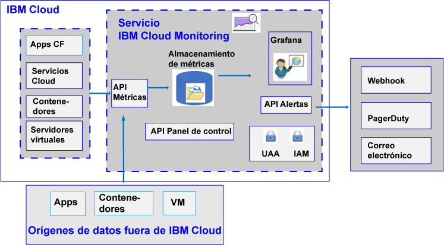

---

copyright:
  years: 2017, 2019

lastupdated: "2019-03-06"

keywords: IBM Cloud, monitoring

subcollection: cloud-monitoring

---

{:new_window: target="_blank"}
{:shortdesc: .shortdesc}
{:screen: .screen}
{:pre: .pre}
{:table: .aria-labeledby="caption"}
{:codeblock: .codeblock}
{:tip: .tip}
{:download: .download}
{:important: .important}
{:note: .note}

# Acerca de
{: #monitoring_ov}

Utilice el servicio {{site.data.keyword.monitoringlong}} para ampliar la capacidad de recopilación y retención cuando trabaje con métricas, y para poder definir reglas y alertas que le notifiquen sobre las condiciones que requieran atención. Autorice al equipo de DevOps a utilizar características que le ofrezcan detalles sobre el rendimiento y el consumo de recursos de sus apps. Identifique rápidamente tendencias y detecte y diagnostique de forma inmediata a fin de reducir el coste total del uso de recursos. Utilice Grafana para supervisar el entorno. 
{:shortdesc}

En la figura siguiente se muestra una vista de nivel alto de los distintos recursos desde los que puede enviar métricas al servicio {{site.data.keyword.monitoringshort}} para que las analice:

{{site.data.keyword.Bluemix}}, de forma predeterminada, recopila y muestra las métricas de uso de CPU, utilización de memoria y E/S de red para {{site.data.keyword.containershort}}. Puede utilizar el servicio {{site.data.keyword.monitoringshort}} de {{site.data.keyword.Bluemix_notm}} para recopilar y calcular automáticamente métricas clave del entorno y las aplicaciones. No se requiere ninguna instrumentación especial para recopilar medidas. Por ejemplo, puede utilizar la información que proporcionan las medidas de rendimiento para supervisar la forma en que se ejecuta un servicio en la nube, detectar cuellos de botella de recursos y supervisar el acuerdo de nivel de servicio (SLA). Al analizar los datos de rendimiento de un servicio, puede detectar situaciones que pueden dar lugar a un cuello de botella del recurso, lo que afectaría al SLA de servicio de los clientes. Al emprender una acción temprana, puede evitar situaciones que podrían perjudicar a su negocio.  

Puede enviar las medidas para sus aplicaciones de Cloud Foundry (CF) y sus máquinas virtuales (VM) al servicio {{site.data.keyword.monitoringshort}}. Para obtener información sobre cómo enviar métricas, consulte [Envío de métricas al servicio {{site.data.keyword.monitoringshort}}](/docs/services/cloud-monitoring/send_retrieve_metrics_ov.html#send_retrieve_metrics_ov).

Puede suministrar el servicio {{site.data.keyword.monitoringshort}} a través del catálogo de {{site.data.keyword.Bluemix_notm}}.  

Puede ver y analizar métricas recopiladas por el servicio {{site.data.keyword.monitoringshort}} a través del panel de control de {{site.data.keyword.Bluemix_notm}}.  

## Por qué utilizar el servicio de supervisión
{: #value}

1. **Dedique menos tiempo a instrumentar la aplicación y más tiempo a mejorar su valor**

    El servicio {{site.data.keyword.monitoringlong_notm}} recopila automáticamente datos de métricas de los servicios {{site.data.keyword.IBM_notm}} Cloud, eliminando la necesidad de disponer de agentes. Las API permiten añadir métricas personalizadas y consultar los datos de supervisión. 
	
	El servicio {{site.data.keyword.monitoringlong_notm}} ofrece recopilación de métricas una vez por minuto.  El plan Lite retiene métricas a resolución completa durante 15 días.  El plan Premium retiene métricas a resolución completa durante 45 días.

2. **Amplíe fácilmente la supervisión a la aplicación con las API**

    Integre los datos de supervisión en sus aplicaciones y operaciones a través de las API del servicio {{site.data.keyword.monitoringshort}}. Utilice las API para añadir métricas empresariales y de aplicación relevantes a los datos de supervisión de la nube. También puede utilizar las API para enviar los datos de métricas de fuera de {{site.data.keyword.IBM_notm}} Cloud al servicio {{site.data.keyword.monitoringshort}}.

3. **Consulte detalles del entorno para poder detectar, diagnosticar e identificar problemas con rapidez**

    Visualice el pulso de la aplicación y de la infraestructura con paneles de control flexibles que el usuario puede personalizar. {{site.data.keyword.monitoringlong_notm}} le ofrece la potencia, flexibilidad y familiaridad de Grafana para crear y adaptar rápidamente el panel de control a los requisitos de sus aplicaciones.
	
4. **Cree paneles control reutilizables y haga que sean interactivos**

    Grafana alojado del servicio {{site.data.keyword.monitoringlong_notm}} proporciona soporte para crear paneles de control personalizados con un gran abanico de opciones de visualización.  Haga que los paneles de control sean dinámicos con plantillas utilizando consultas de métricas con variables.

5. **Reciba alertas**

    Defina reglas para que se le notifique cuando se produzcan condiciones que requieran su atención. El servicio {{site.data.keyword.monitoringlong_notm}} ofrece una API que se puede utilizar para establecer umbrales de rendimiento y para recibir notificaciones cuando se rebasen dichos umbrales. Defina reglas de alerta para una única instancia de servicio o de app, y reglas de alerta que informen sobre un conjunto de instancias. Cuando se active una alerta, reciba una notificación a través de un correo electrónico, un suceso de PagerDuty, una notificación de webhook o cualquier combinación de las tres opciones.

6. **Elija el plan de servicio que se adapte a sus necesidades** 

    Puede elegir el plan de servicio Lite o el plan de servicio Premium para cubrir sus necesidades de uso.  El plan Lite ofrece recopilación básica de métricas de plataforma y alertas complementarias.  Como alternativa, puede seleccionar el plan Premium para permitir un mayor consumo de métricas con un periodo de retención más largo, para aumentar el número de alertas que puede definir, incluidas las alertas que informan sobre varios servicios y apps, y para obtener acceso a las API de servicio.

 
## Planes de servicio
{: #plan}

El servicio {{site.data.keyword.monitoringshort}} proporciona varios planes. Cada plan tiene distinta capacidad de recopilación de métricas, retención y definición de alertas. 

Puede modificar un plan a través de la interfaz de usuario de {{site.data.keyword.Bluemix_notm}} o de la línea de mandatos. Puede actualizar o reducir el plan siempre que lo desee. Para obtener más información acerca de las actualizaciones de los planes de servicio en {{site.data.keyword.Bluemix_notm}}, consulte [Cambio del plan](/docs/services/cloud-monitoring/plan/change_plan.html#change_plan). 

La tabla siguiente describe los planes que están disponibles cuando se suministra el servicio {{site.data.keyword.monitoringshort}} en un espacio:

<table>
    <caption>Tabla 1. Resumen de planes para el servicio {{site.data.keyword.monitoringshort}} por espacio.</caption>
      <tr>
        <th>Plan</th>
        <th>Envío de medidas mediante la API</th>
        <th>Periodo de retención de métricas</th>
        <th>Alertas</th>
		    <th>Métodos de notificación</th>
      </tr>
      <tr>
        <td>Lite (predeterminado)</td>
        <td>No disponible</td>
        <td>15 días</td>
        <td>Puede definir un máximo de 10 reglas de alerta con consultas de métrica individuales, o 1 regla de alerta que incluya un comodín.</td>
		    <td>Correo electrónico</td>
      </tr>
      <tr>
        <td>Premium</td>
        <td>Disponible</td>
        <td>45 días</td>
        <td>Puede definir reglas de alerta que incluyan reglas con comodines.</td>
		    <td>Correo electrónico, webhook, PagerDuty</td>
      </tr>
</table>

**Nota:** El plan Lite ofrece las mismas características que las funciones de supervisión integradas en {{site.data.keyword.Bluemix_notm}}. El dominio de cuenta ofrece las mismas funciones que el plan Lite.

## Periodo de retención de métricas
{: #metrics_retention}

En la tabla siguiente se resume el período de retención en función de su plan de servicio:

<table>
    <caption>Tabla 2. Resumen del periodo de retención del servicio {{site.data.keyword.monitoringshort}}.</caption>
      <tr>
        <th>Plan</th>
        <th>Periodo de retención</th>
      </tr>
      <tr>
        <td>Lite (predeterminado)</td>
        <td>Las métricas se almacenan cada minuto durante 15 días. (1m:15d)</td>
      </tr>
      <tr>
        <td>Premium</td>
        <td>Las métricas se almacenan cada minuto durante 45 días. (1m:45d)</td>
      </tr>
</table>

Las métricas que no hayan recibido datos en los últimos 7 días, se suprimen. El servicio {{site.data.keyword.monitoringshort}} suprime todos los datos correspondientes a una vía de acceso a una métrica que parece transitoria por naturaleza, es decir, una métrica en la que no se ha grabado nada durante los últimos 7 días. Por ejemplo:

* Cuando se suprime un contenedor, las métricas asociadas a dicho contenedor se guardan durante 7 días; transcurrido este periodo, las métricas se suprimen.
* Si tiene un indicador de statsd denominado `<space_id>.test.statsd.gauge-hello` y no graba en el mismo durante una semana, la métrica se identificará como transitoria y dicha métrica se suprimirá, junto a toda su información histórica. 

## Suministro del servicio de supervisión
{: #provision1}

En el catálogo de {{site.data.keyword.Bluemix_notm}}, encontrará el servicio {{site.data.keyword.monitoringshort}} en la sección **DevOps**. Para obtener más información sobre el suministro de un servicio en {{site.data.keyword.Bluemix_notm}}, consulte [Suministro del servicio {{site.data.keyword.monitoringshort}}](/docs/services/cloud-monitoring/how-to/provision.html#provision).

Tenga en cuenta la información siguiente sobre el servicio {{site.data.keyword.monitoringshort}}:

* Solo puede suministrar una instancia del servicio {{site.data.keyword.monitoringshort}} por espacio.
* Para recopilar métricas correspondientes a recursos de nube que se ejecutan en un espacio de Cloud Foundry, debe suministrar el servicio en el mismo espacio en el que se ejecutan los recursos.

## Regiones
{: #regions}

El servicio {{site.data.keyword.monitoringshort}} está disponible en las regiones siguientes:

* Alemania
* Sídney
* Reino Unido
* EE.UU. sur

## URL para el servicio de supervisión
{: #region}

El servicio {{site.data.keyword.monitoringshort}} está disponible para cualquiera que tenga un ID de {{site.data.keyword.Bluemix_notm}} y permisos para trabajar con el servicio en {{site.data.keyword.Bluemix_notm}}.

* Para cada región en la que esté disponible el servicio {{site.data.keyword.monitoringshort}}, hay un conjunto distinto de puntos finales. 
* Hay un único URL compartido por los puntos finales de ingestión y de la interfaz de usuario de API/Web.
* El puerto 443 es un puerto TLS que se utiliza para acceder a las métricas a través de la API y la interfaz de usuario Web (Grafana).

La tabla siguiente lista los URL por región:

<table>
  <caption>Tabla 3. Lista de los puntos finales para trabajar con el servicio {{site.data.keyword.monitoringshort}}</caption>
  <tr>
    <th>Región</th>
	<th>Punto final</th>
  </tr>
  <tr>
    <td>Alemania</td>
	<td>[https://metrics.eu-de.bluemix.net](https://metrics.eu-de.bluemix.net)</td>
  </tr>
  <tr>
    <td>Sídney</td>
	<td>[https://metrics.au-syd.bluemix.net](https://metrics.au-syd.bluemix.net)</td>
  </tr>
  <tr>
    <td>Reino Unido</td>
	<td>[https://metrics.eu-gb.bluemix.net](https://metrics.eu-gb.bluemix.net)</td>
  </tr>
  <tr>
    <td>EE.UU. sur</td>
	<td>[https://metrics.ng.bluemix.net/](https://metrics.ng.bluemix.net/)</td>
  </tr>
</table>

