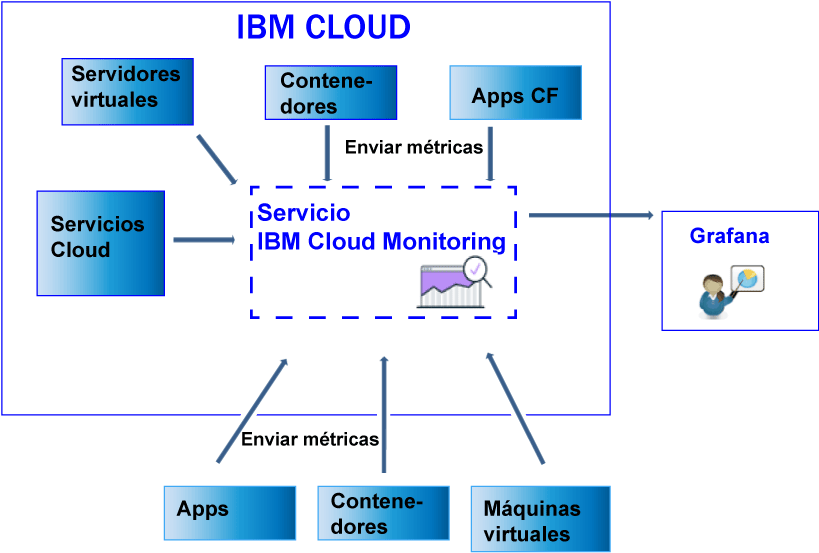

---

copyright:
  years: 2017, 2019

lastupdated: "2019-03-06"

keywords: IBM Cloud, monitoring

subcollection: cloud-monitoring

---

{:new_window: target="_blank"}
{:shortdesc: .shortdesc}
{:screen: .screen}
{:pre: .pre}
{:table: .aria-labeledby="caption"}
{:codeblock: .codeblock}
{:tip: .tip}
{:download: .download}
{:important: .important}
{:note: .note}

# Envío y recuperación de datos
{: #send_retrieve_metrics_ov}

Puede enviar métricas a un espacio mediante la API de Métricas, o configurando el plugin de {{site.data.keyword.monitoringshort}}, que es un plugin collectd. Puede recuperar las métricas mediante la API de métricas.
{:shortdesc}

		
## Envío de métricas
{: #send}

La figura siguiente muestra una vista de alto nivel de las distintas fuentes de datos desde las que se pueden enviar métricas al servicio {{site.data.keyword.monitoringshort}}:

En los contenedores que se ejecutan en un clúster Kubernetes en {{site.data.keyword.Bluemix_notm}}, y para los servicios seleccionados, las métricas del sistema básico se recopilan automáticamente. 
También puede recopilar más métricas, o enviar métricas desde fuera de {{site.data.keyword.IBM_notm}} Cloud, en el servicio {{site.data.keyword.monitoringshort}}. Hay disponibles diferentes métodos. Las tablas siguientes listan los métodos por origen de métrica:

<table>
  <caption>Tabla 1. Métodos para enviar métricas al servicio {{site.data.keyword.monitoringshort}} para los recursos de {{site.data.keyword.IBM_notm}} Cloud.</caption>
  <tr>
    <th>Origen de métricas</th>
	<th>API de métricas</th>
    <th>Plugin de {{site.data.keyword.monitoringshort}} (collectd)</th>	
	<th>Más información</th>
  </tr>
  <tr>
    <td>Contenedores que se ejecutan en un clúster Kubernetes en {{site.data.keyword.Bluemix_notm}}</td>
	<td>Sí</td>
	<td>Sí</td>
	<td>Las métricas del sistema básico se recopilan automáticamente. Puede instalar collectd de forma explicita y enviar métricas avanzadas o personalizadas que no se proporcionan de forma predeterminada.</td>
  </tr>
  <tr>
    <td>Aplicaciones de Cloud Foundry</td>
	<td>Sí</td>
	<td>No</td>
	<td></td>
  </tr>
  <tr>
    <td>Servidores virtuales </td>
	<td>Sí</td>
	<td>Sí</td>
	<td>**Nota:** No se soporta en Windows.</td>
  </tr>
</table>

<table>
  <caption>Tabla 2. Métodos para enviar métricas al servicio {{site.data.keyword.monitoringshort}} fuera de {{site.data.keyword.IBM_notm}} Cloud.</caption>
  <tr>
    <th>Origen de métricas</th>
	<th>API de métricas</th>
    <th>Plugin de {{site.data.keyword.monitoringshort}} (collectd)</th>	
	<th>Más información</th>
  </tr>
  <tr>
    <td>Contenedores</td>
	<td>Sí</td>
	<td>Sí</td>
	<td>Puede utilizar *supervisord* como punto final de contenedor para ejecutar y gestionar la app y collectd.</td>
  </tr>
  <tr>
    <td>Aplicaciones</td>
	<td>Sí</td>
	<td>No</td>
	<td></td>
  </tr>
  <tr>
    <td>Servicios</td>
	<td>Sí</td>
	<td>No</td>
	<td></td>
  </tr>
  <tr>
    <td>Máquinas virtuales (VM)</td>
	<td>Sí</td>
	<td>Sí</td>
	<td>**Nota:** No se soporta en Windows.</td>
  </tr>
</table>

Para enviar métricas al servicio {{site.data.keyword.monitoringshort}}, tenga en cuenta la información siguiente: 

* Debe especificar el espacio al que desea enviar métricas.

* Debe proporcionar una señal de seguridad o una clave de API para trabajar con el servicio {{site.data.keyword.monitoringshort}}. 

* El ID de {{site.data.keyword.IBM_notm}} del usuario que envía métricas debe tener una política de IAM asignada para el servicio {{site.data.keyword.monitoringshort}}. Los roles de IAM siguientes permite al usuario enviar métricas: *Administrador*, *Editor*, y *Operador*.

* Debe especificar el punto final de API al que está enviando las métricas. Hay un punto final por región. Por ejemplo, para la región EE.UU. sur, el punto final es el siguiente: `https://metrics.ng.bluemix.net/v1/metrics`. Para obtener más información acerca de los puntos finales, consulte los [URL para el servicio {{site.data.keyword.monitoringshort}}](/docs/services/cloud-monitoring/monitoring_ov.html#region){: new_window}.

Puede enviar métricas al servicio {{site.data.keyword.monitoringshort}} utilizando cualquiera de los métodos siguientes:

* *Método 1: Configurar el plugin de {{site.data.keyword.monitoringshort}}.*

    Para obtener más información, consulte [Configuración del plugin de {{site.data.keyword.monitoringshort}}](/docs/services/cloud-monitoring/send-metrics/conf_monitoring_plugin.html#conf_monitoring_plugin).

    La figura siguiente muestra una vista de nivel alto sobre cómo utilizar el plugin de {{site.data.keyword.monitoringshort}} para enviar métricas al servicio {{site.data.keyword.monitoringshort}}:

    

* *Método 2: Utilizar la API de métricas.*

    Para obtener más información, consulte [Envío de métricas mediante la API de métricas](/docs/services/cloud-monitoring/send-metrics/send_data_api.html#send_data_api).

## Recuperación de métricas
{: #retrieve}

Si necesita realizar más análisis fuera del servicio {{site.data.keyword.monitoringshort}}, o si su aplicación desea utilizar métricas para tomar decisiones, puede utilizar la API de métricas para recuperar un máximo de cinco métricas por solicitud. 

* Para obtener más información sobre cómo recuperar métricas, consulte [Recuperación de métricas desde un dominio](/docs/services/cloud-monitoring/retrieve-metrics/retrieve_data_api.html#retrieve_data_api)
* Para obtener más información acerca la de API de métricas, consulte [API de métricas](https://console.bluemix.net/apidocs/927-ibm-cloud-monitoring-rest-api?&language=node#introduction){: new_window}.

Para recuperar métricas, tenga en cuenta la información siguiente: 

* Debe establecer el espacio desde el que desea recuperar los datos. 
* Debe proporcionar una señal de seguridad o una clave de API para trabajar con el servicio {{site.data.keyword.monitoringshort}}. 
* Debe especificar una vía de acceso a 1 o más métricas. Para obtener más información, consulte [Definición de las métricas](/docs/services/cloud-monitoring/retrieve-metrics/retrieve_data_api.html#metrics).
* De forma opcional, puede especificar un periodo de tiempo personalizado. De forma predeterminada, si no especifica un periodo de tiempo, los datos que recupera son los datos que corresponden a las últimas 24 horas. Para obtener más información, consulte [Configuración de un periodo de tiempo](/docs/services/cloud-monitoring/retrieve-metrics/retrieve_data_api.html#time).

## Listado de métricas
{: #show_metrics}

Puede listar las métricas que están disponibles en un espacio.

Para enumerar las métricas, tenga en cuenta la información siguiente: 

* Debe establecer el espacio de {{site.data.keyword.Bluemix_notm}} para el que desea listar las métricas que están disponibles.

* Debe proporcionar una señal de seguridad o una clave de API para trabajar con el servicio {{site.data.keyword.monitoringshort}}. 

* Debe especificar una consulta que defina la vía de acceso desde la que enumerar las métricas. Por ejemplo, para listar todas las métricas en un espacio, puede establecer la consulta en: `query=*` 

    El valor predeterminado es `*`, que especifica el punto de inicio en el nivel raíz del espacio.
	
* Puede utilizar la llamada de API `Endpoint/v1/metrics/list` donde Endpoint representa el punto de entrada al servicio. 

    Cada región tiene un URL diferente. Por ejemplo, para la región EE.UU. sur, puede utilizar el punto final de la API `https://metrics.ng.bluemix.net/v1/metrics/list` 

    Para obtener la lista de puntos finales por región, consulte [Puntos finales](/docs/services/cloud-monitoring/send_retrieve_metrics_ov.html#endpoints).

    Para obtener más información acerca de la API, consulte [la API de métricas](https://console.bluemix.net/apidocs/927-ibm-cloud-monitoring-rest-api?&language=node#introduction){: new_window}.

## Puntos finales para enviar métricas
{: #endpoints}

 La tabla siguiente lista los puntos finales por región:
	
<table>
    <caption>Lista de puntos finales</caption>
	<tr>
	  <th>Región</th>
	  <th>URL</th>
	  <th>puerto collectd</th>
	</tr>
	<tr>
	  <td>Alemania</td>
	  <td>[https://metrics.eu-de.bluemix.net](https://metrics.eu-de.bluemix.net)</td>
	  <td>9095</td>
	</tr>
	<tr>
	  <td>Sídney</td>
	  <td>[https://metrics.au-syd.bluemix.net](https://metrics.au-syd.bluemix.net)</td>
	  <td>9095</td>
	</tr>
	<tr>
	  <td>Reino Unido</td>
	  <td>[https://metrics.eu-gb.bluemix.net](https://metrics.eu-gb.bluemix.net)</td>
	  <td>9095</td>
	</tr>
	<tr>
	  <td>EE.UU. sur</td>
	  <td>[https://metrics.ng.bluemix.net](https://metrics.ng.bluemix.net)</td>
	  <td>9095</td>
	</tr>
</table>

 
