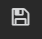

---

copyright:
  years: 2017, 2019

lastupdated: "2019-03-06"

keywords: IBM Cloud, monitoring

subcollection: cloud-monitoring

---

{:new_window: target="_blank"}
{:shortdesc: .shortdesc}
{:screen: .screen}
{:pre: .pre}
{:table: .aria-labeledby="caption"}
{:codeblock: .codeblock}
{:tip: .tip}
{:download: .download}
{:important: .important}
{:note: .note}

# Cree un panel de control de Grafana para supervisar un clúster de Kubernetes
{: #container_grafana_dashboard}

Utilice esta guía de aprendizaje para aprender a crear un panel de control de Grafana en el servicio {{site.data.keyword.monitoringlong}} para supervisar el rendimiento del clúster. 
{:shortdesc}

## Objetivos
{: #cgd_objectives}

Aprenda a buscar y analizar métricas de contenedor de una app que se despliega en un clúster de Kubernetes:

1. Inicie Grafana y establezca el dominio {{site.data.keyword.monitoringshort}} donde pueda ver las métricas del clúster.
2. Cree un panel de control de Grafana y defina una métrica que supervise el uso de CPU de un contenedor.

## Supuestos
{: #cgd_assumptions}

La guía de aprendizaje presupone:

* Un clúster está disponible en la región EE.UU. sur. 
* El ID de usuario tiene una política de IAM para el servicio {{site.data.keyword.monitoringshort}} con permisos de **visor**.

Para completar esta guía de aprendizaje, debe completar la guía de aprendizaje [Analizar métricas en Grafana para una app desplegada en un clúster de Kubernetes](/docs/services/cloud-monitoring/tutorials?topic=cloud-monitoring-container_service_metrics#container_service_metrics) o tener un clúster suministrado con al menos una aplicación desplegada.

## Paso 1: Iniciar Grafana
{: #cgd_step1}

Inicie Grafana desde un navegador y establezca el dominio de {{site.data.keyword.monitoringshort}} donde puede ver las métricas de clúster.

Para analizar las métricas de un clúster, debe acceder a Grafana en la región pública de la nube en la que se ha creado el clúster. Para obtener más información, consulte [Navegación al panel de control de Grafana desde un navegador web](/docs/services/cloud-monitoring/grafana?topic=cloud-monitoring-navigating_grafana#launch_grafana_from_browser).

1. Desde un navegador, inicie Grafana. 

    Especifique el URL del servicio {{site.data.keyword.monitoringshort}} para la región en la que ha creado el clúster. 
    
    Para obtener los URL por región, consulte [URL para el servicio de supervisión](/docs/services/cloud-monitoring?topic=cloud-monitoring-monitoring_ov#region).

    Por ejemplo, para la región EE.UU. sur, inicie: [https://metrics.ng.bluemix.net/](https://metrics.ng.bluemix.net/).

2. Establezca el dominio de {{site.data.keyword.monitoringshort}} en **cuenta**.

    En Grafana, seleccione el ID. A continuación, compruebe que está en la cuenta correcta, y elija `Dominio = cuenta`.

## Paso 2: Crear un panel de control de Grafana
{: #cgd_step2}

Siga los siguientes pasos para crear un nuevo panel de control:

1. Seleccione el conmutador de la barra de menús lateral .
2. Seleccione **Paneles de control**.
3. Pulse **Nuevo**

Se abre un panel de control. El panel de control incluye una fila vacía que está lista para la configuración.

En Grafana, puede añadir filas para dividir el panel de control en secciones. Una fila agrupa 1 o varios paneles. Dentro de una fila, un panel es la unidad de visualización más pequeña que se puede configurar para visualizar datos correspondientes a una métrica; por ejemplo, puede elegir un panel gráfico o un panel de tabla. Puede arrastrar y soltar paneles para cambiar la disposición de los paneles en un panel de control. Los datos que muestra un panel se configuran mediante consultas. Puede definir una o varias consultas en un panel. Cada consulta representa un conjunto de datos distinto. También puede definir el intervalo de tiempo para un panel. Normalmente, el intervalo de tiempo se establece mediante el selector de tiempo del *Panel de control*.

## Paso 3: Añadir un Gráfico al panel de control para supervisar una métrica
{: #cgd_step3}

Realice los siguientes pasos:

1. Seleccione **Gráfico**.

2. Pulse en el título del gráfico y seleccione **editar**.

    Se abre el separador *Métricas*. Aquí puede ver el origen de datos predeterminado.

## Paso 4: Definir una consulta de métrica
{: #cgd_step4}

Defina la consulta que filtra los datos que se muestran en el gráfico. Esta consulta supervisa los nanosegundos de tiempo de cpu en todos los núcleos de un contenedor.

Para obtener información sobre el formato de la consulta, consulte [Formato de consulta para las métricas de CPU recopiladas para contenedores](/docs/services/cloud-monitoring/reference?topic=cloud-monitoring-metrics_format_containers#cpu_containers).
 
En el separador *Métricas*, seleccione **Añadir consulta**.  Se añade una entrada de consulta. Cada consulta está etiquetada con una letra. 

 
	
Siga los siguientes pasos para definir la consulta:
        
1. Pulse **Seleccionar métrica** para especificar el origen y, a continuación, elija `ibmcloud`.
    
2. Pulse **Seleccionar métrica** para especificar el tipo de nube y, a continuación, elija `public`.
    
3. Pulse **Seleccionar métrica** para especificar el nombre del servicio y elija `containers-kubernetes`.
	
4. Pulse **Seleccionar métrica** para especificar la región y, a continuación, elija la región donde el clúster está en ejecución. Por ejemplo, `us-south`.
    
5. Pulse **Seleccionar métrica** para especificar el nombre de clúster y, a continuación, elija el nombre del clúster donde el contenedor está en ejecución.
		
6. Pulse **Seleccionar métrica** para especificar el origen de métrica. Seleccione **contenedor**.
		
7. Pulse **Seleccionar métrica** para especificar el espacio de nombres. A continuación, escriba el nombre del espacio de nombres en el clúster asociado con el contenedor.
		
8. Pulse **Seleccionar métrica** para especificar el nombre de pod.
	
9. Pulse **Seleccionar métrica** para especificar el nombre de contenedor del contenedor que desea supervisar.
	
10. Pulse **Seleccionar métrica** para especificar el tipo de métrica y, a continuación, pulse **Seleccionar métrica** para especificar el subtipo de métrica.
	
    Por ejemplo, para supervisar los nanosegundos de tiempo de cpu en todos los núcleos de un contenedor, seleccione **cpu** para el tipo, y **uso** para el subtipo.
		
	Para obtener una lista de las métricas de CPU, consulte [Métricas de CPU para contenedores](/docs/services/cloud-monitoring/containers?topic=cloud-monitoring-monitoring_bmx_containers_ov#cpu_metrics_containers).
    
11. Pulse la imagen del símbolo más  y elija una función. Puede añadir una función para transformar, combinar y realizar cálculos sobre los datos disponibles para una métrica.

    Por ejemplo, puede añadir la función **alias(newName)** para añadir un alias a una métrica. Este alias se utiliza para mostrar una serie de caracteres en lugar del nombre de la métrica en la descripción que se muestra en el gráfico.

    Para añadir un alias a una métrica, siga estos pasos:

    1. Pulse el símbolo más.
    2. Seleccione **Especial**.
    3. Seleccione **alias**.
    4. Escriba una serie de caracteres, como por ejemplo `Mi métrica de ejemplo`.

## Paso 5: Guardar el panel de control
{: #cgd_step5}

Guarde el panel de control para utilizarlo más adelante.

1. Pulse la imagen de guardar panel de control .

    

2. Escriba el nombre del panel de control.
3. Pulse **Guardar**.

## Pasos siguientes
{: #cgd_next_steps}

Defina una alerta para una métrica. Para obtener más información, consulte [Configuración de alertas](/docs/services/cloud-monitoring?topic=cloud-monitoring-config_alerts_ov#config_alerts_ov).
