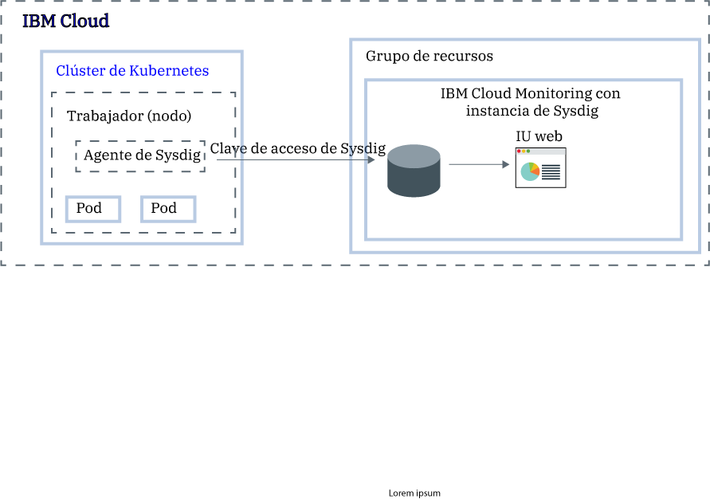

---

copyright:
  years:  2018, 2019
lastupdated: "2019-05-10"

keywords: Sysdig, IBM Cloud, monitoring, kubernetes, analyze metrics

subcollection: Sysdig

---

{:new_window: target="_blank"}
{:shortdesc: .shortdesc}
{:screen: .screen}
{:pre: .pre}
{:table: .aria-labeledby="caption"}
{:codeblock: .codeblock}
{:tip: .tip}
{:download: .download}
{:important: .important}
{:note: .note}


# Análisis de métricas para una app desplegada en un clúster de Kubernetes
{: #kubernetes_cluster}

Utilice esta guía de aprendizaje para aprender a configurar un clúster de {{site.data.keyword.containerlong}} para que reenvíe métricas al servicio {{site.data.keyword.mon_full}}.
{:shortdesc}

Para configurar un clúster para que reenvíe métricas, debe instalar un agente de Sysdig en cada nodo trabajador del clúster Kubernetes mediante un [DaemonSet ](https://kubernetes.io/docs/concepts/workloads/controllers/daemonset/). El agente de Sysdig utiliza una clave de acceso (señal) para autenticarse con la instancia de {{site.data.keyword.mon_full_notm}}. El agente de Sysdig actúa como recopilador de datos. Recopila automáticamente métricas como, por ejemplo, el uso de *CPU de nodo trabajador* y de *memoria de nodo trabajador*, el *tráfico HTTP de entrada y de salida de los contenedores* y datos sobre varios componentes de la infraestructura. Además, el agente puede recopilar métricas de aplicación personalizadas mediante una herramienta de recopilación compatible con Prometheus o una interfaz de StatsD. 

Las métricas se visualizan en una interfaz de usuario web de Sysdig.



## Objetivos
{: #kubernetes_cluster_objectives}

En esta guía de aprendizaje configurará métricas con Sysdig en su clúster de {{site.data.keyword.containerlong}}. En concreto hará lo siguiente:
*  Suministrar una instancia de {{site.data.keyword.mon_full_notm}}.
*  Configurar el agente de Sysdig en el clúster para que envíe métricas a Sysdig.
*  Utilizar la interfaz de usuario web de Sysdig para analizar las métricas del clúster.


## Antes de empezar
{: #kubernetes_cluster_prereqs}

1. Obtenga más información sobre {{site.data.keyword.mon_full_notm}}. Encontrará detalles en la sección [Acerca de](/docs/services/Monitoring-with-Sysdig?topic=Sysdig-about#about).

2. Obtenga un ID de usuario que sea miembro o propietario de una cuenta de {{site.data.keyword.cloud_notm}}. Para obtener un ID de usuario de {{site.data.keyword.cloud_notm}}, vaya a: [Registro ](https://cloud.ibm.com/login){:new_window}.

3. Instale la CLI de {{site.data.keyword.cloud_notm}} y el plugin de la CLI de Kubernetes. Para obtener más información, consulte [Instalación de la CLI de {{site.data.keyword.cloud_notm}}](/docs/cli?topic=cloud-cli-ibmcloud-cli#ibmcloud-cli).

4. [Cree un clúster](/docs/containers?topic=containers-clusters#clusters) o utilice un clúster de {{site.data.keyword.containerlong_notm}} existente.
    *  El clúster debe ejecutar Kubernetes versión 1.10 o superior.
    *  El clúster no tiene que estar en la ubicación de **Dallas**, sino que puede estar en cualquier [región de {{site.data.keyword.containerlong_notm}}](/docs/containers/cs_regions.html#regions-and-zones).

5. Asegúrese de que a su ID de usuario se le asignen las siguientes políticas de {{site.data.keyword.iamlong}}:

| Recurso                             | Ámbito de la política de acceso | Rol    | Región    | Información                  |
|--------------------------------------|----------------------------|---------|-----------|------------------------------|
| Grupo de recursos **predeterminado**           |  Grupo de recursos            | Visor  | Us-south  | Esta política es necesaria para permitir que el usuario vea las instancias de servicio en el grupo de recursos predeterminado.    |
| Servicio {{site.data.keyword.mon_full_notm}} |  Grupo de recursos            | Editor  | Us-south  | Esta política es necesaria para permitir que el usuario suministre y administre el servicio {{site.data.keyword.mon_full_notm}} en el grupo de recursos predeterminado.   |
| Instancia de clúster de Kubernetes          |  Recurso                 | Editor  | Us-south  | Esta política es necesaria para configurar el secreto y el agente de Sysdig en el clúster de Kubernetes. |
{: caption="Tabla 1. Lista de políticas de IAM necesarias para completar la guía de aprendizaje" caption-side="top"}

Para obtener más información sobre los roles de IAM de {{site.data.keyword.containerlong}}, consulte [Permisos de acceso de usuario](/docs/containers?topic=containers-access_reference#access_reference).


## Paso 1: Suministrar una instancia de {{site.data.keyword.mon_full_notm}}
{: #kubernetes_cluster_step1}

En esta guía de aprendizaje de iniciación se ofrecen instrucciones para suministrar una instancia en {{site.data.keyword.mon_full_notm}} en la región EE. UU. sur. Para obtener más información sobre las regiones soportadas, consulte el apartado [Regiones](/docs/services/Monitoring-with-Sysdig?topic=Sysdig-endpoints).

Para suministrar una instancia de {{site.data.keyword.mon_full_notm}} mediante la interfaz de usuario de {{site.data.keyword.cloud_notm}}, siga los pasos siguientes:

1. [Inicie una sesión en su cuenta de {{site.data.keyword.cloud_notm}} ](https://cloud.ibm.com/login){:new_window}.

	Cuando inicia una sesión con su ID de usuario y su contraseña, se abre la interfaz de usuario de {{site.data.keyword.cloud_notm}}.

2. Pulse **Catálogo**. Se abrirá la lista de servicios disponibles en {{site.data.keyword.cloud_notm}}.

3. Para filtrar la lista de servicios que se visualiza, seleccione la categoría **Herramientas de desarrollador**.

4. Pulse el mosaico **{{site.data.keyword.mon_full_notm}}**. Se abre el panel de control *Observabilidad*.

5. Seleccione **Crear instancia**. 

6. Especifique un nombre para la instancia de servicio.

7. Seleccione el grupo de recursos **predeterminado**. 

    Puede suministrar la instancia en cualquier grupo de recursos en el que tenga permisos para crear recursos.

    De forma predeterminada, está establecido el grupo de recursos predeterminado (**default**).

8. Seleccione el plan de servicio **Prueba**. 

    De forma predeterminada, se selecciona el plan de **Prueba**.

    Para obtener más información acerca de los otros planes de servicio, consulte [Planes de servicio](/docs/services/Monitoring-with-Sysdig?topic=Sysdig-pricing_plans#pricing_plans).

9. Pulse **Crear**.

    Después de suministrar una instancia, se abre el panel de control *Observabilidad* y se muestran detalles correspondientes a las instancias de **Supervisión**. 


Para suministrar una instancia mediante la CLI, consulte [Suministro de una instancia mediante la CLI de {{site.data.keyword.cloud_notm}}](/docs/services/Monitoring-with-Sysdig?topic=Sysdig-provision#provision_cli).
{: note}


## Paso 2: Configurar el clúster de Kubernetes para que envíe métricas a la instancia
{: #kubernetes_cluster_step2}

Para configurar el clúster de Kubernetes para que envíe métricas a su instancia de {{site.data.keyword.mon_full_notm}}, debe instalar un pod de agente de Sysdig en cada nodo del clúster. El agente de Sysdig se instala mediante un DaemonSet que garantiza que se ejecute una instancia del agente en cada nodo trabajador. El agente de Sysdig recopila métricas del pod en el que está instalado y los reenvía a la instancia.

Para proporcionar la suite completa de métricas del sistema, el agente de Sysdig necesita tener un estado con privilegios.
{: note}

Para configurar el clúster de Kubernetes para que reenvíe métricas a la instancia de {{site.data.keyword.mon_full_notm}}, siga los pasos siguientes desde la línea de mandatos:

1. Abra un terminal. A continuación, inicie una sesión en {{site.data.keyword.cloud_notm}}. Ejecute el mandato siguiente y siga las indicaciones:

    ```
    ibmcloud login -a cloud.ibm.com
    ```
    {: codeblock}

    Seleccione la cuenta en la que está disponible el clúster.

2. Configure el entorno de clúster. Ejecute los mandatos siguientes:

    En primer lugar, obtenga el mandato para establecer la variable de entorno y descargar los archivos de configuración de Kubernetes.

    ```
    ibmcloud ks cluster-config <cluster_name_or_ID>
    ```
    {: codeblock}

    Cuando termine la descarga de los archivos de configuración, se muestra un mandato que puede utilizar para establecer la vía de acceso al archivo de configuración de Kubernetes local como variable de entorno. Copie y pegue el mandato que se muestra en el terminal para definir la variable de entorno `KUBECONFIG`.

    Cada vez que inicie la sesión en la CLI de {{site.data.keyword.containerlong}} para trabajar con clústeres, deberá ejecutar estos mandatos para establecer el archivo de configuración del clúster como una variable de la sesión. La CLI de Kubernetes utiliza esta variable para buscar un archivo de configuración local y los certificados necesarios para conectar con el clúster en {{site.data.keyword.cloud_notm}}.
    {: tip}

3. Obtenga la clave de acceso de Sysdig. Para obtener más información, consulte [Obtención de la clave de acceso mediante la IU de {{site.data.keyword.cloud_notm}}](/docs/services/Monitoring-with-Sysdig?topic=Sysdig-access_key#access_key_ibm_cloud_ui).

4. Obtenga el URL de ingestión de los [puntos finales del recopilador de Sysdig](/docs/services/Monitoring-with-Sysdig?topic=Sysdig-endpoints#endpoints_ingestion).

5. Despliegue el agente de Sysdig. Ejecute el mandato siguiente:

    ```
    curl -sL https://raw.githubusercontent.com/draios/sysdig-cloud-scripts/master/agent_deploy/IBMCloud-Kubernetes-Service/install-agent-k8s.sh | bash -s -- -a SYSDIG_ACCESS_KEY -c COLLECTOR_ENDPOINT -t TAG_DATA -ac 'sysdig_capture_enabled: false'
    ```
    {: pre}

    Donde

    * **SYSDIG_ACCESS_KEY** es la clave de ingestión de la instancia que ha recuperado anteriormente.

    * **COLLECTOR_ENDPOINT** es el URL de ingestión de la región en la que está disponible la instancia de supervisión que ha recuperado anteriormente.

    * **TAG_DATA** son etiquetas separadas por comas con el formato *NOMBRE_ETIQUETA_VALOR:ETIQUETA*. Puede asociar una o varias etiquetas al agente de Sysdig. Por ejemplo: *role:serviceX,location:us-south*. Más adelante podrá utilizar estas etiquetas para identificar las métricas del entorno en el que se ejecuta el agente.

    * Establezca **sysdig_capture_enabled** en *false* para inhabilitar la característica de captura de Sysdig. De forma predeterminada, está establecido en *true*. Para obtener más información, consulte [Cómo trabajar con capturas](/docs/services/Monitoring-with-Sysdig?topic=Sysdig-captures#captures).

6. Verifique que el agente de Sysdig se ha creado correctamente y compruebe su estado. Ejecute el mandato siguiente:

    ```
    kubectl get pods -n ibm-observe
    ```
    {: codeblock}

    El despliegue se realiza correctamente cuando se ven una o varios pods de `sysdig-agent`. El número de pods de `sysdig-agent` es igual al número de nodos trabajadores del clúster. Todos los pods deben estar en un estado `Running`.


## Paso 3. Iniciar la interfaz de usuario web de Sysdig
{: #kubernetes_cluster_step3}

Para iniciar la interfaz de usuario web de Sysdig a través de la consola {{site.data.keyword.cloud_notm}}, siga los pasos siguientes.

Solo puede tener una sesión de interfaz de usuario web abierta por navegador.
{: imp}

1. [Inicie una sesión en su cuenta de {{site.data.keyword.cloud_notm}} ](https://cloud.ibm.com/login){:new_window}.

	Cuando inicia una sesión con su ID de usuario y su contraseña, se abre el panel de control de {{site.data.keyword.cloud_notm}}.

2. En el menú , seleccione **Observabilidad**. 

3. Seleccione **Supervisión**. Se muestra la lista de instancias que están disponibles en {{site.data.keyword.cloud_notm}}.

4. Localice su instancia y pulse **Ver Sysdig**.

    * **Primera vez**: como ya ha instalado el agente de Sysdig, puede saltarse los pasos del asistente de instalación, iniciación y realización de la incorporación.
    
    * **Siguiente veces:**: se abre la vista **Explorar**.


Si el agente de Sysdig no se ha instalado correctamente, si apunta a un punto final de ingestión incorrecto o si la clave de acceso es incorrecta, la página que se abre le indica qué debe hacer a continuación.

Por ejemplo, si el agente de Sysdig no se ha instalado correctamente, no puede saltarse el asistente de instalación. Es posible que aparezca un mensaje parecido al siguiente:
    
```
Waiting for the first node to connect... Go ahead and follow the instructions below.
```
{: screen}
    
Puede intentar las acciones siguientes:
*  Verifique que está utilizando el [punto final](/docs/services/Monitoring-with-Sysdig?topic=Sysdig-endpoints#endpoints_ingestion) `ingest` y no el punto final de Sysdig. 
*  Verifique que la [clave de acceso](/docs/services/Monitoring-with-Sysdig?topic=Sysdig-access_key) sea correcta.
*  Siga las instrucciones y repita los pasos de esta guía de aprendizaje.


## Paso 4: Supervisar el clúster
{: #kubernetes_cluster_step4}

Puede supervisar el clúster en la vista **EXPLORAR** que está disponible a través de la interfaz de usuario web de Sysdig. Esta vista es la página de inicio predeterminada y el punto de partida para resolver problemas y supervisar la infraestructura y los recursos del clúster.

En la sección *Host y contenedores*, puede ver la *tabla Explorar*, que es una lista de los nodos trabajadores de su clúster que están reenviando métricas a la instancia de supervisión. Cada entrada de nodo trabajador representa un grupo de objetos relacionados de la infraestructura para ese nodo trabajador.

Pulse **Host y contenedores** para cambiar los orígenes de datos. A continuación, seleccione un nodo trabajador. Los datos que se muestran corresponden al nodo trabajador que ha seleccionado. Si pulsa ** Volver a la tabla Explorar**, se muestra la *tabla Explorar*. 

**Personalización de la _tabla Explorar_**

Puede personalizar la *tabla Explorar*. 

* Cada columna muestra una métrica diferente. 
* Puede configurar cada métrica individualmente. 
* Puede cambiar el orden de las columnas. 

    Tenga en cuenta que, cuando se hacen cambios en el orden de las columnas existentes, el cambio se aplica a las distintas agrupaciones mientras dure la sesión. Si añade o elimina una columna, el cambio es permanente. 

* También puede configurar colores para resaltar valores y facilitar su lectura. 

Por ejemplo, para configurar códigos de colores para una columna, siga los pasos siguientes:

1. Seleccione una columna. Mueva el puntero del ratón sobre el título de la columna. A continuación, seleccione el icono de lápiz.
2. Conmute la barra para habilitar la codificación por colores.
3. Defina valores para los distintos umbrales.


**Personalización de paneles de control**

Para ver más detalles acerca de un nodo trabajador concreto, pulse en la entrada de la infraestructura y se abrirá en la tabla el panel de control *Visión general por host*. Puede explorar diferentes paneles de control y métricas pulsando el icono . Tenga en cuenta que solo puede seleccionar métricas y paneles de control que sean relevantes para el nodo trabajador seleccionado.

Para volver a la _tabla Explorar_ completa, pulse el botón **X (volver a la tabla Explorar)**.


Para obtener más información, consulte la [documentación de Sysdig](https://sysdigdocs.atlassian.net/wiki/spaces/Monitor/pages/222822446/The+Explore+Table).


## Pasos siguientes
{: #kubernetes_cluster_next_steps}

Cree un panel de control personalizado. Para obtener más información, consulte [Cómo trabajar con paneles de control](/docs/services/Monitoring-with-Sysdig?topic=Sysdig-dashboards#dashboards).

También puede aprender sobre las alertas. Para obtener más información, consulte [Cómo trabajar con alertas](/docs/services/Monitoring-with-Sysdig?topic=Sysdig-monitoring#monitoring_alerts). 


