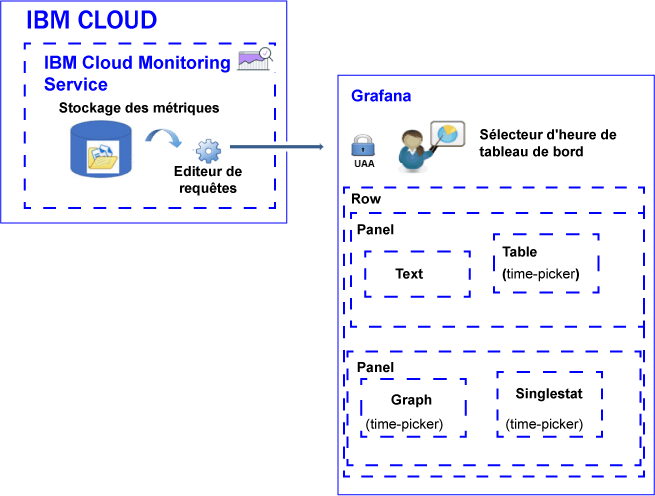

---

copyright:
  years: 2017, 2019

lastupdated: "2019-03-06"

keywords: IBM Cloud, monitoring

subcollection: cloud-monitoring

---

{:new_window: target="_blank"}
{:shortdesc: .shortdesc}
{:screen: .screen}
{:pre: .pre}
{:table: .aria-labeledby="caption"}
{:codeblock: .codeblock}
{:tip: .tip}
{:download: .download}
{:important: .important}
{:note: .note}

# Analyse de métriques
{: #analyze_metrics_ov}

Dans {{site.data.keyword.Bluemix}}, vous pouvez utiliser la plateforme de visualisation et de surveillance open source Grafana pour la surveillance, la recherche, l'analyse et la visualisation de métriques dans différents graphiques, comme des diagrammes et des tableaux. 
{:shortdesc}

## Présentation des composants
{: #overview}

Le service {{site.data.keyword.monitoringshort}} stocke des séries de données dans la base de données de stockage des métriques. Vous pouvez lancer des interrogations sur ces données via l'éditeur de requêtes. 

Dans Grafana, pour accéder aux données qui sont disponibles dans la base de données de stockage des métriques, vous devez vous connecter à un espace, une organisation et une région avec l'ID utilisateur et le mot de passe que vous utilisez pour vous connecter à {{site.data.keyword.Bluemix_notm}}. 

Pour visualiser les données, configurez un tableau de bord pouvant inclure une ou plusieurs lignes. Sur chaque ligne, vous pouvez définir plusieurs panneaux. 

* Une ligne regroupe des panneaux dans un tableau de bord. 
* Un panneau est la ressource de visualisation de base pour surveiller des métriques. 
* Un tableau de bord peut être balisé et inclure des annotations contenant des données que vous pouvez utiliser pour corréler les données dans les panneaux.

Vous pouvez définir les types de panneaux suivants : text, graph, table, singlestat. Chaque panneau offre des styles et des options de formatage différents que vous pouvez personnaliser. 

La quantité de données affichées dans un panneau est déterminée par la requête et par l'intervalle qui est défini. Vous pouvez définir un intervalle commun pour tous les panneaux au niveau du tableau de bord ou des intervalles individuels au niveau de chaque panneau.

La figure suivante illustre les différents composants que Grafana utilise à partir du service {{site.data.keyword.monitoringshort}} pour filtrer des données, et les ressources que vous pouvez utiliser dans Grafana pour visualiser et analyser les données :

