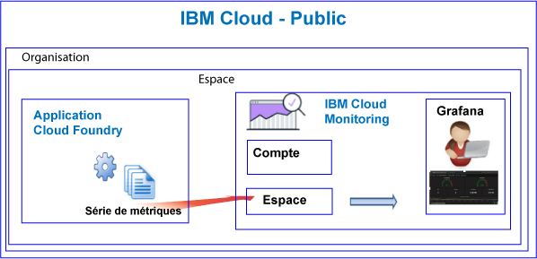

---

copyright:
  years: 2017, 2019

lastupdated: "2019-03-06"

keywords: IBM Cloud, monitoring

subcollection: cloud-monitoring

---

{:new_window: target="_blank"}
{:shortdesc: .shortdesc}
{:screen: .screen}
{:pre: .pre}
{:table: .aria-labeledby="caption"}
{:codeblock: .codeblock}
{:tip: .tip}
{:download: .download}
{:important: .important}
{:note: .note}


# Applications Cloud Foundry
 {:#monitoring_bluemix_apps}

Dans {{site.data.keyword.Bluemix}}, les métriques sont automatiquement collectées pour les applications Cloud Foundry (CF) qui s'exécutent dans la région publique et transmises au service {{site.data.keyword.monitoringlong}}. Vous pouvez utiliser Grafana à des fins d'analyse pour surveiller les performances de votre application CF. Vous pouvez également utiliser l'API Metrics pour interroger les métriques d'application CF et agir en fonction des données.
{:shortdesc}


## Surveillance des applications CF qui s'exécutent dans un environnement public
{: #public}


Tenez compte des informations suivantes lorsque vous utilisez le service {{site.data.keyword.monitoringshort}} pour surveiller une application CF :

* Vous devez mettre à disposition le service {{site.data.keyword.monitoringshort}} dans le même espace que celui dans lequel l'application CF s'exécute.
* Les métriques qui sont collectées pour une application CF sont automatiquement transmises au domaine d'espace dans le service {{site.data.keyword.monitoringshort}}. 
* Les métriques sont transmises à un domaine d'espace. Le domaine d'espace est celui dans lequel l'application CF s'exécute. 
* Vous pouvez également utiliser l'API Metrics pour interroger les métriques et agir en fonction des données. Par exemple, vous pouvez créer une automatisation qui interroge l'utilisation de l'unité centrale par votre application CF et la met à l'échelle si l'unité centrale utilisée devient trop élevée.

Le diagramme suivant offre une vue d'ensemble de la surveillance des applications CF dans {{site.data.keyword.Bluemix_notm}} :



## Surveillance des applications CF qui s'exécutent en dehors de {{site.data.keyword.Bluemix_notm}}
{: #outside}

Pour surveiller des applications CF qui s'exécutent en dehors de {{site.data.keyword.Bluemix_notm}}, vous pouvez utiliser l'API Metrics afin de transmettre vos métriques d'application CF au service {{site.data.keyword.monitoringshort}}.

* Pour plus d'informations sur l'API, voir [API Metrics](https://console.bluemix.net/apidocs/927-ibm-cloud-monitoring-metrics-api?&language=node#introduction).
* Pour plus d'informations sur l'utilisation de l'API, voir [Envoi de données à l'aide de l'API Metrics](/docs/services/cloud-monitoring/send-metrics/send_data_api.html#send_data_api).


## Affichage et analyse de métriques d'application CF
{: #monitoring_cfapps}

Pour surveiller les performances d'applications CF dans {{site.data.keyword.Bluemix_notm}}, utilisez Grafana. 

Le service {{site.data.keyword.monitoringlong}} utilise la plateforme de visualisation et d'analyse open source Grafana dont vous pouvez vous servir pour surveiller, rechercher, analyser et visualiser vos métriques dans différents graphiques, par exemple, dans des diagrammes et des tableaux.

Vous pouvez démarrer Grafana depuis un navigateur. Pour plus d'informations, voir [Accès au tableau de bord Grafana depuis un navigateur Web](/docs/services/cloud-monitoring/grafana/navigating_grafana.html#launch_grafana_from_browser).

**Remarque :** vous devez lancer Grafana dans la même région {{site.data.keyword.Bluemix_notm}} que celle où l'instance d'application CF s'exécute.


Pour surveiller des applications CF, vous devez définir une ou plusieurs requêtes dans Grafana. Pour plus d'informations, voir [Configuration d'une requête de métrique dans Grafana](/docs/services/cloud-monitoring/grafana/define_query.html#define_query). 

Vous pouvez également définir des alertes sur des requêtes. Pour plus d'informations, voir [Configuration d'alertes](/docs/services/cloud-monitoring/config_alerts_ov.html#config_alerts_ov).


## Métriques d'unité centrale
{: #cpu_metrics}

La série de métriques qui est automatiquement collectée pour chaque application CF inclut des données relatives à l'utilisation de l'unité centrale.


<table>
  <caption>Métriques d'unité centrale collectées pour une application CF</caption>
  <tr>
    <th>Métrique</th>
    <th>Description</th>
  </tr>
  <tr>
    <td>cpu-utilization</td>
    <td>Pourcentage d'utilisation de l'unité centrale par rapport à la limite du conteneur.</td>
  </tr>
</table>


## Métriques de disque
{: #disk_metrics}

La série de métriques qui est automatiquement collectée pour chaque application CF inclut des données relatives à la taille de disque utilisée, la taille totale de disque disponible et le pourcentage de disque utilisé.


<table>
  <caption>Métriques de disque collectées pour une application CF</caption>
  <tr>
    <th>Métrique</th>
    <th>Description</th>
  </tr>
  <tr>
    <td>disk-bytes-total</td>
    <td>Taille de disque du conteneur dans lequel l'application CF s'exécute. La valeur est définie en octets.</td>
  </tr>
  <tr>
    <td>disk-bytes-used</td>
    <td>Taille de disque du conteneur utilisé sur le disque par l'application CF. La valeur est définie en octets.</td>
  </tr>
  <tr>
    <td>disk-utilization</td>
    <td>Pourcentage de disque qui est utilisé par l'application CF.</td>
  </tr>
</table>

**Remarque :** 

* Vous spécifiez la taille de disque lorsque vous envoyez l'application CF.
* Lorsque votre utilisation du disque atteint 90 %, il est recommandé d'effectuer une mise à l'échelle de l'application CF.

## Métriques de mémoire
{: #mem_metrics}

La série de métriques qui est automatiquement collectée pour chaque application CF inclut des données relatives à la mémoire utilisée, la mémoire totale disponible et le pourcentage de mémoire utilisé.

<table>
  <caption>Métriques de mémoire collectées pour une application CF</caption>
  <tr>
    <th>Métrique</th>
    <th>Description</th>
  </tr>
  <tr>
    <td>memory-bytes-total</td>
    <td>Mémoire, exprimée en octets, qui est disponible pour l'application CF.</td>
  </tr>
  <tr>
    <td>memory-bytes-used</td>
    <td>Mémoire, exprimée en octets, qui est utilisée par l'instance d'application CF.</td>
  </tr>
  <tr>
    <td>memory-utilization</td>
    <td>Pourcentage de mémoire qui est utilisé par l'application CF.</td>
  </tr>
</table>


## Format des requêtes de métrique
{: #query_format}


Les requêtes que vous définissez dans Grafana pour surveiller une application Cloud Foundry doivent être conformes au format suivant : 

```
{Source}.{Cloud Type}.{Service Name}.{Region}.{CFapp Name}.{CFapp Index}.{CFapp container}.{Metric Type}.{Metric Subtype}.[Functions]
```
{: codeblock}

Voici des exemples de la série de métriques qui est collectée pour une instance d'application CF nommée logtester dans la région Sydney :

```
ibmcloud.public.cloud-foundry.au-syd.logtester.0.container.cpu.utilization
ibmcloud.public.cloud-foundry.au-syd.logtester.0.container.disk.bytes-total
ibmcloud.public.cloud-foundry.au-syd.logtester.0.container.disk.bytes-used
ibmcloud.public.cloud-foundry.au-syd.logtester.0.container.disk.utilization
ibmcloud.public.cloud-foundry.au-syd.logtester.0.container.memory.bytes-total
ibmcloud.public.cloud-foundry.au-syd.logtester.0.container.memory.bytes-used
ibmcloud.public.cloud-foundry.au-syd.logtester.0.container.memory.utilization
```
{: screen}

Pour plus d'informations, voir [Format des métriques des applications CF](/docs/services/cloud-monitoring/reference/cfapps_metrics_format.html#cfapps_metrics_format).

**Remarque :** tous les caractères autorisés dans les noms d'application CF ne sont pas admis dans les noms de série de métriques. Par exemple, les majuscules ne sont pas autorisées. Les caractères qui composent le nom d'application CF que vous pouvez voir dans Grafana lorsque vous définissez une requête sont tous convertis en minuscules.


