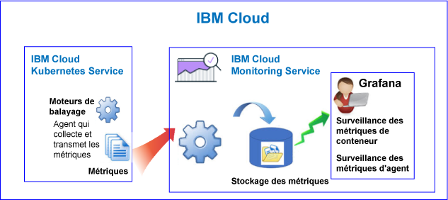
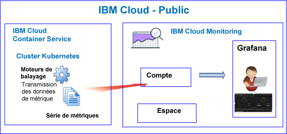
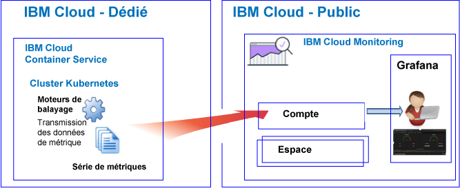

---

copyright:
  years: 2017, 2019

lastupdated: "2019-03-06"

keywords: IBM Cloud, monitoring

subcollection: cloud-monitoring

---

{:new_window: target="_blank"}
{:shortdesc: .shortdesc}
{:screen: .screen}
{:pre: .pre}
{:table: .aria-labeledby="caption"}
{:codeblock: .codeblock}
{:tip: .tip}
{:download: .download}
{:important: .important}
{:note: .note}

# {{site.data.keyword.containershort_notm}}
{: #monitoring_bmx_containers_ov}

Dans {{site.data.keyword.Bluemix}}, les métriques de cluster sont automatiquement collectées. Vous pouvez utiliser Grafana pour surveiller les performances de votre cluster. 
{:shortdesc}

**Remarque :** 

* Les métriques sont collectées et disponibles pour la surveillance via le service {{site.data.keyword.monitoringshort}} pour les conteneurs qui s'exécutent dans des clusters standard.
* Pour surveiller les métriques de cluster, vous devez mettre à disposition d'une instance du service Monitoring. Pour plus d'informations, voir [Mise à disposition du service Monitoring](/docs/services/cloud-monitoring/how-to?topic=cloud-monitoring-provision#provision).

## A propos de la surveillance dans un environnement public
{: #public1}

Dans {{site.data.keyword.Bluemix_notm}}, vous pouvez utiliser le service {{site.data.keyword.monitoringshort}} pour stocker et analyser des métriques de conteneur et des métriques de cluster Kubernetes qui sont automatiquement collectées par {{site.data.keyword.containershort}} dans un environnement public.

Vous pouvez disposer d'un ou de plusieurs clusters Kubernetes sur votre compte. Les métriques sont collectées automatiquement par {{site.data.keyword.containershort}} dès que le cluster est mis à disposition.  Des métriques de conteneur sont collectées dès que le pod est déployé. Des métriques sont automatiquement transmises au service {{site.data.keyword.monitoringshort}} :

Lorsque vous créez un cluster, les métriques sont transmises au domaine de compte dans le service {{site.data.keyword.monitoringshort}}. Pour que les métriques puissent être transmises au domaine de compte, le propriétaire de clé {{site.data.keyword.containershort}} doit posséder les règles IAM suivantes :

* Règle IAM avec des droits **editor** pour le service {{site.data.keyword.monitoringshort}}.
* Règle IAM avec des droits **administrator** pour {{site.data.keyword.containershort}}.

Le diagramme suivant offre une vue d'ensemble de la surveillance pour {{site.data.keyword.containershort}} :

Le moteur de balayage est un processus qui s'exécute sur l'hôte et effectue une surveillance des métriques sans intervention d'agent. Il collecte par défaut en continu les métriques d'unité centrale et de mémoire de tous les conteneurs.

Pour analyser des métriques dans Grafana pour un cluster, prenez en compte les informations suivantes :

* Vous devez lancer Grafana dans la région publique où l'instance {{site.data.keyword.monitoringshort}} que vous utilisez pour afficher les métriques est mise à disposition. 
* Vous pouvez utiliser le tableau de bord Grafana par défaut **ClusterMonitoringDashboard** pour surveiller votre cluster.
* Vous pouvez également configurer des tableaux de bord Grafana personnalisés afin de visualiser des données de métrique pour un cluster dans la région publique du Cloud où le cluster est créé.
* Votre ID utilisateur doit être doté des droits permettant d'afficher des métriques. 

    Pour afficher les métriques dans le domaine de compte, un utilisateur doit posséder une règle IAM pour le service {{site.data.keyword.monitoringshort}}. Il requiert les droits **Afficheur**. 

Le diagramme suivant offre une vue d'ensemble de la surveillance dans un environnement public pour {{site.data.keyword.containershort}}. Le cluster transmet des métriques au domaine de compte :

## A propos de la surveillance dans un environnement dédié
{: #dedicated}

Dans {{site.data.keyword.Bluemix_notm}}, vous pouvez utiliser le service {{site.data.keyword.monitoringshort}} dans un environnement public pour stocker et analyser des métriques de conteneur et des métriques de cluster Kubernetes qui sont automatiquement collectées par {{site.data.keyword.containershort}} dans un environnement dédié.

Vous pouvez disposer d'un ou de plusieurs clusters Kubernetes sur votre compte. Les métriques sont collectées automatiquement par {{site.data.keyword.containershort}} dès que le cluster est mis à disposition.  Des métriques de conteneur sont collectées dès que le pod est déployé. Des métriques sont automatiquement transmises au domaine de compte du service {{site.data.keyword.monitoringshort}}.

Lorsque vous créez un cluster, les métriques sont transmises au domaine de compte dans le service {{site.data.keyword.monitoringshort}}. Pour que les métriques puissent être transmises au domaine de compte, le propriétaire de clé {{site.data.keyword.containershort}} doit posséder les règles IAM suivantes :

* Règle IAM avec des droits **editor** pour le service {{site.data.keyword.monitoringshort}}.
* Règle IAM avec des droits **administrator** pour {{site.data.keyword.containershort}}.

Pour afficher et analyser des métriques pour un cluster dans Grafana, tenez compte des informations suivantes :

* Vous devez lancer Grafana dans la région publique du cloud où le cluster est disponible dans l'environnement un dédié. Par exemple, si un cluster est mis à disposition dans un environnement dédié dans la région Sud des Etats-Unis, vous devez lancer Grafana dans la région Sud des Etats-Unis dans un environnement public.
* Vous pouvez utiliser le tableau de bord Grafana par défaut **ClusterMonitoringDashboard** pour surveiller votre cluster.
* Vous pouvez également configurer des tableaux de bord Grafana personnalisés afin de visualiser des données de métrique pour un cluster dans la région publique du Cloud où le cluster est créé.
* Votre ID utilisateur doit posséder une règle IAM pour gérer le service {{site.data.keyword.monitoringshort}}. Vous devez disposer des droits de type**Viewer** pour afficher des métriques dans le domaine de compte.  

Le diagramme suivant offre une vue d'ensemble de la surveillance dans un environnement dédié pour {{site.data.keyword.containershort}} :

## Conteneurs : Métriques d'unité centrale
{: #cpu_metrics_containers}

Le tableau suivant répertorie les métriques d'unité centrale automatiquement capturées pour un conteneur :

| Métrique | Description | Unités |
|----------|---------|---------|
| `cpu.num-cores` | Cette métrique rend compte du nombre de coeurs d'UC disponibles pour le conteneur.  Par défaut, cette métrique rend compte du nombre de coeurs sur l'agent. Si vous définissez une limite au nombre de coeurs disponibles pour le conteneur, cette métrique rend compte du nombre de coeurs défini dans cette limite. | Nombre décimal |
| `cpu.usage` | Cette métrique rend compte du nombre de nanosecondes de temps d'UC sur tous les coeurs.  Une utilisation élevée de l'unité centrale peut entraîner des temps d'attente. Une utilisation élevée de l'UC témoigne d'une capacité de traitement insuffisante. | Nanosecondes |
| `cpu.usage-pct` | Cette métrique rend compte du temps UC utilisé en pourcentage de la capacité de l'UC.  Par défaut, la capacité d'UC est déterminée par le nombre de coeurs sur l'agent. Si vous définissez des limites à la capacité d'UC du conteneur, cette métrique rend compte de l'utilisation de l'unité centrale sous forme de pourcentage des limites définies. Une utilisation élevée de l'unité centrale peut entraîner des temps d'attente. Une utilisation élevée de l'UC témoigne d'une capacité de traitement insuffisante. | Pourcentage |
| `cpu.usage-pct-container-requested`  | Cette métrique rend compte du temps UC utilisé en pourcentage d'UC demandée du conteneur.  Si vous ne définissez pas l'UC demandés sur un conteneur, cette métrique n'est pas exposée pour le conteneur. | Pourcentage |
{: caption="Métriques d'unité centrale pour les conteneurs" caption-side="top"} 

## Conteneurs : Métriques de mémoire
{: #memory_metrics}

Le tableau suivant répertorie les métriques de mémoire qui sont automatiquement capturées :

| Métrique | Description | Unités |
|----------|---------|---------|
| `memory.current` | Cette métrique rend compte du nombre d'octets de mémoire utilisé actuellement par le conteneur. | Octets |
| `memory.limit` | Cette métrique rend compte de la limite de mémoire du conteneur. Par défaut, les containers peuvent opèrent sans limites de mémoire. Un container peut consommer autant de mémoire que celle disponible sur l'agent où il s'exécute. Lorsque vous déployez un pod, vous pouvez fixer des limites quant à la quantité de mémoire qu'il peut utiliser. | Octets |
| `memory.usage-pct` | Cette métrique rend compte de la mémoire utilisée en pourcentage de la limite de mémoire du conteneur.  Si vous définissez des limites à la quantité de mémoire qu'un conteneur peut utiliser, cette métrique rend compte de l'utilisation de la mémoire en pourcentage des limites définies. | Pourcentage | 
| `memory.working-set` | Cette métrique rend compte du nombre d'octets de mémoire active utilisé actuellement par le conteneur dans le cache à chaud. | Octets |
{: caption="Métriques de mémoire pour les conteneurs" caption-side="top"} 

## Pods : Métriques de réseau
{: #network_metrics_pods}

Le tableau suivant répertorie les métriques de réseau qui sont liées à la réception de données et qui sont automatiquement capturées :

| Métrique | Description | Unités |
|----------|---------|---------|
| `container.namespace.podName.network.rx.bytes` | Cette métrique rend compte du nombre d'octets reçus par le pod.  | Octets  |
| `container.namespace.podName.network.rx.error` | Cette métrique rend compte du nombre d'erreurs qui se sont produites sur le pod lors de la réception de trames. | Nombre  |
| `container.namespace.podName.network.rx.packets` | Cette métrique rend compte du nombre de paquets reçus par le pod.  | Nombre  |
{: caption="Métriques de réseau RX pour les pods" caption-side="top"} 

Le tableau suivant répertorie les métriques de réseau qui sont liées à la transmission de données et qui sont automatiquement capturées :

| Métrique | Description | Unités |
|----------|---------|---------|
| `container.namespace.podName.network.tx.bytes` | Cette métrique rend compte du nombre d'octets envoyés au pod.  | Octets  |
| `container.namespace.podName.network.tx.errors` | Cette métrique rend compte du nombre d'erreurs qui se sont produites sur le pod lors de l'envoi de trames.  | Nombre  |
| `container.namespace.podName.network.tx.packets` | Cette métrique rend compte du nombre de paquets envoyés au pod.  | Nombre  |
{: caption="Métriques de réseau TX pour les pods" caption-side="top"} 

## Noeuds worker : Métriques de disque
{: #disk_metrics_workers}

Le tableau suivant répertorie les métriques de disque qui sont automatiquement capturées pour un noeud worker :

| Métrique | Description | Unités |
|----------|---------|---------|
| `worker.disk.diskDevice.read.bytes` | Cette métrique rend compte de la vitesse d'E-S de lecture de l'unité de disque.  | Octets  |
| `worker.disk.diskDevice.read.io` | Cette métrique rend compte du débit de lecture de l'unité.  | Octets par seconde  |
| `worker.disk.diskDevice.read.reads` | Cette métrique rend compte de la vitesse d'E-S de lecture maximale de l'unité de disque.  | Octets par seconde  |
| `worker.disk.diskDevice.read.waits` | Cette métrique rend compte du temps pendant lequel le noeud worker attend une demande d'E-S de lecture.  | Octets par seconde  |
| `worker.disk.diskDevice.write.bytes` | Cette métrique rend compte de la vitesse d'E-S d'écriture d'une unité de disque.  | Octets  |
| `worker.disk.diskDevice.write.io` | Cette métrique rend compte du débit d'écriture de l'unité.  | Octets par seconde  |
| `worker.disk.diskDevice.write.writes` | Cette métrique rend compte de la vitesse d'E-S d'écriture maximale de l'unité de disque.  | Octets par seconde  |
| `worker.disk.diskDevice.write.waits` | Cette métrique rend compte du temps pendant lequel le noeud worker attend une demande d'E-S d'écriture.  | Octets par seconde  |
| `worker.disk.diskDevice.size`| Cette métrique rend compte de la capacité de stockage de l'unité.  | Octets  |
| `worker.disk.diskDevice.used` | Cette métrique rend compte du nombre d'octets utilisés sur l'unité.  | Octets  |
| `worker.disk.diskDevice.usedpct` | Cette métrique rend compte du pourcentage de stockage utilisé sur l'unité.  | Pourcentage  |
{: caption="Métriques de disque pour les noeuds worker" caption-side="top"} 

## Noeuds worker : Métriques de charge
{: #load_metrics_workers}

Le tableau suivant répertorie les métriques de charge qui sont automatiquement capturées pour un noeud worker :

| Métrique | Description | Unités |
|----------|---------|---------|
| `load.avg-1` | Cette métrique rend compte de la charge d'UC moyenne pour l'hôte Kubernetes au cours de la dernière minute.  Une charge d'UC moyenne supérieure au nombre de coeurs sur l'agent indique que du trafic vers l'hôte est en file d'attente.  | Nombre  |
| `load.avg-5` | Cette métrique rend compte de la charge d'UC moyenne pour l'hôte Kubernetes au cours des 5 dernières minutes.  Une charge d'UC moyenne supérieure au nombre de coeurs sur l'agent indique que du trafic vers l'hôte est en file d'attente.  | Nombre  |
| `load.avg-15` | Cette métrique rend compte de la charge d'UC moyenne pour l'hôte Kubernetes au cours des 15 dernières minutes.  Une charge d'UC moyenne supérieure au nombre de coeurs sur l'agent indique que du trafic vers l'hôte est en file d'attente.  |  Nombre |
{: caption="Métriques de charge pour les noeuds worker" caption-side="top"} 

## Noeuds worker : Métriques de mémoire
{: #memory_metrics_workers}

Le tableau suivant répertorie les métriques de mémoire qui sont automatiquement capturées pour un noeud worker :

| Métrique | Description | Unités |
|----------|---------|---------|
| `memory.available` | Cette métrique rend compte du nombre d'octets de mémoire disponibles pour un noeud worker.   | Octets  |
| `memory.used` | Cette métrique rend compte du nombre d'octets de mémoire utilisé actuellement par le noeud worker.  | Octets  |
{: caption="Métriques de mémoire pour les noeuds worker" caption-side="top"} 

## Noeuds worker : Métriques de réseau
{: #network_metrics_workers}

Le tableau suivant répertorie les métriques de réseau qui sont liées à la réception de données et qui sont automatiquement capturées :

| Métrique | Description | Unités |
|----------|---------|---------|
| `network.interface.rx.bytes` | Cette métrique rend compte du nombre d'octets reçus par le noeud worker sur l'interface.  | Octets  |
| `network.interface.rx.errs` | Cette métrique rend compte du nombre d'erreurs qui se sont produites sur le noeud worker lors de la réception de trames sur l'interface. | Nombre |
| `network.interface.rx.packets` | Cette métrique rend compte du nombre de paquets reçus par le noeud worker sur l'interface. | Nombre |
{: caption="Métriques de réseau RX pour les noeuds worker" caption-side="top"} 

Le tableau suivant répertorie les métriques de réseau qui sont liées à la transmission de données et qui sont automatiquement capturées :

| Métrique | Description | Unités |
|----------|---------|---------|
| `network.interface.tx.bytes` | Cette métrique rend compte du nombre d'octets envoyés par le noeud worker via l'interface. | Octets  |
| `network.interface.tx.err` | Cette métrique rend compte du nombre d'erreurs qui se sont produites sur le noeud worker lors de l'envoi de trames sur l'interface.  | Nombre  |
| `network.interface.tx.packets` | Cette métrique rend compte du nombre de paquets envoyés par le noeud worker via l'interface.  | Nombre  |
{: caption="Métriques de réseau TX pour les noeuds worker" caption-side="top"} 

Le tableau suivant répertorie les métriques de réseau qui sont liées à des connecteurs ouverts et qui sont automatiquement capturées :

| Métrique | Description | Unités |
|----------|---------|---------|
| `network.sockets.udp`  `network.sockets.udp6`  `network.sockets.tcp`  `network.sockets.tcp6.open` | Cette métrique rend compte du nombre de connecteurs ouverts pour un protocole.   | Nombre  |
| `network.sockets.tcp`  `network.sockets.tcp6.timewait` | Cette métrique rend compte du nombre de connecteurs TCP ouverts à l'état `time wait`.  | Nombre  |
{: caption="Métriques de réseau de connecteurs pour les noeuds worker" caption-side="top"} 

## Définition de requêtes pour surveiller des ressources dans un cluster Kubernetes
{: #monitoring_metrics_kube}

Pour surveiller les performances des conteneurs et des agents qui sont déployés dans un cluster Kubernetes dans {{site.data.keyword.Bluemix_notm}}, utilisez Grafana. 

Le service {{site.data.keyword.monitoringlong}} utilise la plateforme de visualisation et d'analyse open source Grafana dont vous pouvez vous servir pour surveiller, rechercher, analyser et visualiser vos métriques dans différents graphiques, par exemple, dans des diagrammes et des tableaux.

Vous pouvez démarrer Grafana depuis un navigateur. Pour plus d'informations, voir [Accès au tableau de bord Grafana depuis un navigateur Web](/docs/services/cloud-monitoring/grafana?topic=cloud-monitoring-navigating_grafana#launch_grafana_from_browser).

Pour surveiller les conteneurs et les agents qui s'exécutent dans un cluster Kubernetes, vous devez définir une requête dans Grafana pour chaque ressource :

* Pour définir une requête qui surveille une métrique d'UC pour un conteneur, voir [Configuration de métriques d'unité centrale pour un conteneur dans Grafana](/docs/services/cloud-monitoring/containers?topic=cloud-monitoring-config_cpu_containers#config_cpu_containers).
* Pour définir une requête qui surveille une métrique de mémoire pour un conteneur, voir [Configuration de métriques de mémoire pour un conteneur dans Grafana](/docs/services/cloud-monitoring/containers?topic=cloud-monitoring-config_mem_container#config_mem_container).
* Pour définir une requête qui surveille une métrique de charge pour un agent, voir [Configuration de métriques de charge pour un agent dans Grafana](/docs/services/cloud-monitoring/containers?topic=cloud-monitoring-config_load_worker#config_load_worker).

Le format de la requête varie en fonction des types de ressource et des types de requête :

* Pour plus d'informations sur le format des requêtes permettant de surveiller l'unité centrale pour un conteneur, voir [Format de requête de métrique d'unité centrale pour un conteneur](/docs/services/cloud-monitoring/reference?topic=cloud-monitoring-metrics_format_containers#cpu_containers). 
* Pour plus d'informations sur le format des requêtes permettant de surveiller la charge pour un agent, voir [Format de requête de métrique de charge pour un agent](/docs/services/cloud-monitoring/reference?topic=cloud-monitoring-metrics_format_containers#load_workers).
* Pour plus d'informations sur le format des requêtes permettant de surveiller la mémoire pour un conteneur, voir [Format de requête de métrique de mémoire pour un conteneur](/docs/services/cloud-monitoring/reference?topic=cloud-monitoring-metrics_format_containers#mem_containers).

## Configuration du trafic réseau pour les configurations de pare-feu personnalisées dans {{site.data.keyword.Bluemix_notm}}
{: #ports}

Lorsqu'un pare-feu supplémentaire est configuré ou si vous avez personnalisé les paramètres de pare-feu dans votre infrastructure {{site.data.keyword.Bluemix_notm}} (SoftLayer), vous devez autoriser le trafic réseau sortant du noeud d'agent vers le service {{site.data.keyword.monitoringshort}}. 

Vous devez ouvrir le port TCP 443 et le port TCP 9091 depuis chaque agent vers le service {{site.data.keyword.monitoringshort}} pour les adresses IP suivantes dans votre pare-feu personnalisé :

<table>
  <tr>
    <th>Région</th>
    <th>URL d'ingestion</th>
	<th>Adresses IP publiques</th>
  </tr>
  <tr>
    <td>Allemagne</td>
	<td>ingest-eu-fra.logging.bluemix.net</td>
	<td>158.177.88.43  159.122.87.107</td>
  </tr>
  <tr>
    <td>Royaume-Uni</td>
	<td>ingest.logging.eu-gb.bluemix.net</td>
	<td>169.50.115.113</td>
  </tr>
  <tr>
    <td>Sud des Etats-Unis</td>
	<td>ingest.logging.ng.bluemix.net</td>
	<td>169.48.79.236  169.46.186.113</td>
  </tr>
  <tr>
    <td>Sydney</td>
	<td>ingest-au-syd.logging.bluemix.net</td>
	<td>130.198.76.125  168.1.209.20</td>
  </tr>
</table>

## Tutoriels
{: #tutorial}

Pour apprendre à utiliser le service {{site.data.keyword.monitoringshort}} dans le but de surveiller les performances du conteneur, voir[Analyse de métriques dans Grafana pour une application qui est déployée dans un cluster Kubernetes](/docs/services/cloud-monitoring/tutorials?topic=cloud-monitoring-container_service_metrics#container_service_metrics).

Pour apprendre à créer un tableau de bord Grafana dans le service {{site.data.keyword.monitoringshort}} dans le but de surveiller les performances de votre cluster, voir [Création d'un tableau de bord Grafana pour surveiller un cluster Kubernetes](/docs/services/cloud-monitoring/tutorials?topic=cloud-monitoring-container_grafana_dashboard#container_grafana_dashboard).
