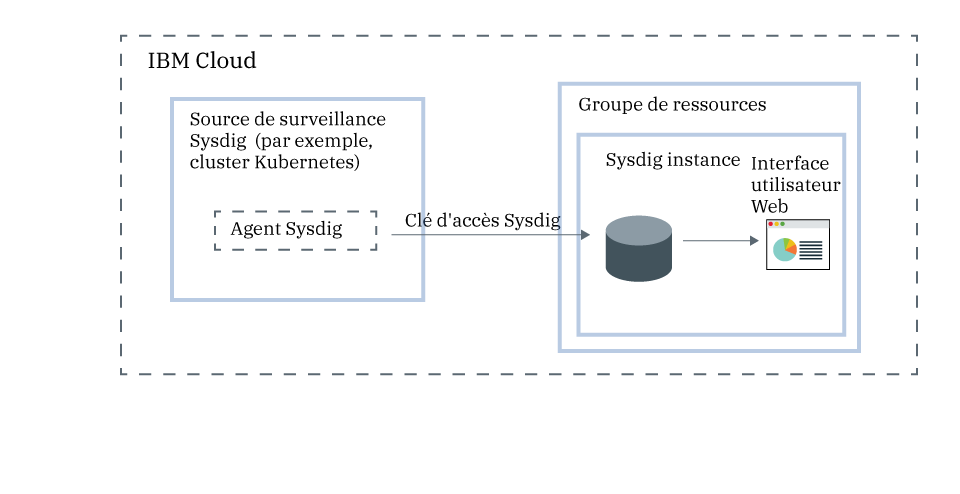

---

copyright:
  years:  2018, 2019
lastupdated: "2019-05-09"

keywords: Sysdig, IBM Cloud, monitoring, getting started

subcollection: Sysdig

---

{:new_window: target="_blank"}
{:shortdesc: .shortdesc}
{:screen: .screen}
{:pre: .pre}
{:table: .aria-labeledby="caption"}
{:codeblock: .codeblock}
{:tip: .tip}
{:download: .download}
{:important: .important}
{:note: .note}

# Tutoriel d'initiation
{: #getting-started}

{{site.data.keyword.mon_full_notm}} est un système de gestion d'intelligence de conteneur, tiers et natif pour le cloud, que vous pouvez inclure dans votre architecture
{{site.data.keyword.cloud_notm}}. Il vous permet d'obtenir une visibilité opérationnelle des performances et de la santé de vos applications, services et plateformes. Il propose aux administrateurs, aux équipes DevOps et aux développeurs une télémétrie pour pile complète et des fonctions avancées permettant de surveiller et de traiter les incidents, de définir des alertes et de concevoir des tableaux de bord personnalisés. {{site.data.keyword.mon_full_notm}} est exploité par Sysdig en partenariat avec {{site.data.keyword.IBM_notm}}.
{:shortdesc}

La figure suivante présente les composants du service {{site.data.keyword.mon_full_notm}} qui s'exécute sur {{site.data.keyword.cloud_notm}} :

## Fonctions
{: #features}

**Accélérer le diagnostic et la résolution des incidents de performances.**

{{site.data.keyword.mon_full_notm}} offre une visibilité détaillée de votre infrastructure et de vos applications grâce à son aptitude à traiter les incidents tant au niveau du service qu'à celui du système. Les tableaux de bord prédéfinis et les alertes simplifient l'identification des menaces ou problèmes potentiels. {{site.data.keyword.mon_full_notm}} permet aux développeurs et aux équipes DevOps de surveiller et de traiter les incidents liés aux performances en temps réel, d'identifier la source des erreurs et d'éliminer les problèmes. 

**Maîtriser les coûts de votre infrastructure de surveillance.**

{{site.data.keyword.mon_full_notm}} inclut une fonctionnalité qui vous aide à maîtriser les coûts de votre infrastructure de surveillance dans {{site.data.keyword.cloud_notm}}. Vous pouvez configurer les sources de métrique dont vous souhaitez surveiller les performances. Vous pouvez activer une alerte prédéfinie qui vous avertit des modifications d'utilisation qui auront une incidence sur votre facturation. 

**Explorer et visualiser facilement l'ensemble de votre environnement.**

{{site.data.keyword.mon_full_notm}} facilite l'exploration visuelle de votre environnement. Les mappes de topologie dynamiques offrent une vue des dépendances existant entre les services. Les requêtes multidimensionnelles sur des métriques à rotation, cardinalité et fréquence élevées accélèrent le traitement des incidents. Les tableaux de bord personnalisables vous permettent de visualiser ce qui compte le plus. 

**Obtenir des informations Kubernetes et de conteneur essentielles pour la surveillance dynamique de microservices.**

{{site.data.keyword.mon_full_notm}} reconnaît automatiquement les environnements Kubernetes qui fournissent des alertes et des tableaux de bord prêts à l'emploi pour des clusters, des noeuds, des espaces de nom, des services, des déploiements, des pods, etc. Un agent unique par noeud reconnaît dynamiquement tous les microservices et collecte automatiquement les métriques et événements provenant de diverses sources dont Kubernetes, des hôtes, des réseaux, des conteneurs, des processus, des applications et des métriques personnalisées comme Prometheus, JMX et StatsD. 

**Réduire l'impact des situations anormales avec des notifications proactives.**

{{site.data.keyword.mon_full_notm}} inclut des alertes et des notifications multicanal que vous pouvez utiliser pour réduire l'impact sur vos opérations quotidiennes et accélérer votre réactivité et votre temps de réponse face aux anomalies, au temps d'indisponibilité et à la dégradation des performances. Les canaux de notification que vous pouvez facilement configurer sont les *e-mails*, les *piles*, *PagerDuty*, les *webhooks*, *OpsGenie* et *VictorOps*.

## Avant de commencer
{: #prereqs}

Vous devez disposer d'un ID utilisateur qui soit membre ou propriétaire d'un compte {{site.data.keyword.cloud_notm}}. Pour obtenir un ID utilisateur {{site.data.keyword.cloud_notm}}, accédez à [Inscription ](https://cloud.ibm.com/login){:new_window}.

Le service est disponible dans les régions suivantes :
* *Sud des Etats-Unis*
* *EU-DE*
* *EU-GB*
* *JP-TOK*

Vous pouvez terminer la procédure de mise en route dans une des régions prises en charge.

## Etape 1 : Gestion de l'accès utilisateur
{: #step1}

Une règle d'accès avec un rôle utilisateur IAM doit être affectée à chaque utilisateur disposant d'un accès au service {{site.data.keyword.mon_full_notm}} sur votre compte. La règle détermine les actions que l'utilisateur peut effectuer dans le cadre du service ou de l'instance que vous sélectionnez. Les actions autorisées sont personnalisées et définies en tant qu'opérations exécutables sur le service. Les actions sont ensuite mappées vers des rôles utilisateur IAM. Pour plus d'informations, voir [Gestion de l'accès utilisateur dans {{site.data.keyword.cloud_notm}}](/docs/services/Monitoring-with-Sysdig?topic=Sysdig-iam#iam).

Lorsqu'un utilisateur est doté de droits dans {{site.data.keyword.cloud_notm}} qui lui permettent d'utiliser le service {{site.data.keyword.mon_full_notm}}, il reçoit automatiquement un rôle Sysdig. Ce rôle détermine les actions qu'un utilisateur est autorisé à exécuter. Les rôles valides sont *Administrateur Sysdig* et *Utilisateur Sysdig*. Pour plus d'informations, voir [Mappage de rôles Sysdig vers des rôles {{site.data.keyword.cloud_notm}}](/docs/services/Monitoring-with-Sysdig?topic=Sysdig-iam#iam_sysdig).

Avant de mettre à disposition une instance, prenez en compte les informations suivantes :
* Le propriétaire du compte peut créer, visualiser et supprimer une instance d'un service dans {{site.data.keyword.cloud_notm}}, et peut autoriser d'autres utilisateurs à utiliser le service {{site.data.keyword.mon_full_notm}}.
* Vous devez disposer des autorisations nécessaires pour créer des ressources dans le groupe de ressources *Par défaut*.
* Les autres utilisateurs {{site.data.keyword.cloud_notm}} dotés de droits `administrateur` ou `éditeur`
peuvent gérer le service {{site.data.keyword.mon_full_notm}} dans {{site.data.keyword.cloud_notm}}. Ces utilisateurs doivent également disposer
de droits de plateforme pour créer des ressources dans le cadre du groupe de ressources où ils prévoient de mettre à disposition l'instance.

Pour accorder à un utilisateur le rôle d'administrateur du service et pour gérer des instances au sein d'un groupe de ressources dans le compte, l'utilisateur doit disposer d'une règle IAM pour le service {{site.data.keyword.mon_full_notm}} avec le rôle de plateforme **Administrateur** dans le cadre du groupe de ressources. 

Procédez comme suit pour affecter un rôle d'administrateur au service {{site.data.keyword.mon_full_notm}} dans le cadre d'un groupe de ressources : 

1. Dans la barre de menus, cliquez sur **Gérer** &gt; **Accès (IAM)** puis sélectionnez **Utilisateurs**.
2. Sur la ligne de l'utilisateur auquel vous voulez affecter un accès, sélectionnez le menu **Actions**, puis cliquez sur **Affecter un accès**.
3. Sélectionnez **Affecter l'accès au sein d'un groupe de ressources**.
4. Sélectionnez un groupe de ressources.
5. Si aucun rôle n'a encore été accordé à l'utilisateur pour le groupe de ressources sélectionné, choisissez-en un pour la zone **Affecter l'accès à un groupe de ressources**. 

    Selon le rôle que vous sélectionnez, l'utilisateur peut afficher le groupe de ressources sur son tableau de bord, modifier le nom du groupe de ressources, ou gérer l'accès des utilisateurs au groupe. 
    
    Vous pouvez sélectionner **Aucun accès**, si vous souhaitez que l'utilisateur ait uniquement accès au service {{site.data.keyword.mon_full_notm}} dans le groupe de ressources.

6. Sélectionnez **{{site.data.keyword.mon_full_notm}}**.
7. Sélectionnez le rôle de plateforme **Administrateur**.
8. Cliquez sur **Affecter**.

## Etape 2 : Mise à disposition d'une instance du service {{site.data.keyword.mon_full_notm}}
{: #step2}

Pour ajouter des fonctions de surveillance avec {{site.data.keyword.mon_full_notm}} dans {{site.data.keyword.cloud_notm}}, vous devez mettre à disposition une instance du service {{site.data.keyword.mon_full_notm}}. 

Lorsque vous mettez à disposition une instance, vos données sont envoyées à un tiers.
{: tip}

Vous pouvez mettre à disposition une instance dans le cadre d'un groupe de ressources. Un groupe de ressources vous permet d'organiser vos services à des fins de contrôle d'accès et de facturation. Vous pouvez mettre à disposition l'instance {{site.data.keyword.mon_full_notm}} dans le groupe de ressources *par défaut* ou dans un groupe de ressources personnalisé.

Lorsque vous mettez à disposition une instance, vous obtenez automatiquement une clé d'ingestion, appelée *clé d'accès Sysdig*.

Pour mettre à disposition une instance via l'interface utilisateur {{site.data.keyword.cloud_notm}}, procédez comme suit :

1. Connectez-vous à votre compte {{site.data.keyword.cloud_notm}}.

    Cliquez sur le tableau de bord [{{site.data.keyword.cloud_notm}} ](https://cloud.ibm.com/login){:new_window} pour lancer le tableau de bord {{site.data.keyword.cloud_notm}}.

	Une fois que vous êtes connecté avec votre ID utilisateur et votre mot de passe, l'interface utilisateur {{site.data.keyword.cloud_notm}} s'ouvre.

2. Cliquez sur **Catalogue**. La liste des services disponibles dans {{site.data.keyword.cloud_notm}} s'affiche.

3. Pour filtrer la liste de services qui s'affiche, sélectionnez la catégorie **Developer Tools**.

4. Cliquez sur la vignette **{{site.data.keyword.mon_full_notm}}**.

5. Sélectionnez un plan de service. Par défaut, le plan **Essai** est défini.

    Pour plus d'informations sur les plans de service, voir [Tarification](/docs/services/Monitoring-with-Sysdig?topic=Sysdig-pricing_plans#pricing_plans).

6. Sélectionnez un groupe de ressources. Le groupe de ressources **par défaut** est défini automatiquement.

7. Cliquez sur **Créer** pour mettre à disposition une instance.

L'interface utilisateur du service s'ouvre.

**Remarque :** Pour mettre à disposition une instance de Sysdig via l'interface de ligne de commande, voir [Mise à disposition de Sysdig via l'interface
de ligne de commande {{site.data.keyword.cloud_notm}}](/docs/services/Monitoring-with-Sysdig?topic=Sysdig-provision#provision_cli).

## Etape 3 : Configuration d'un agent Sysdig
{: #step3}

Après la mise à disposition d'une instance, vous devez configurer un agent Sysdig pour chaque source de métriques à surveiller. Une source de métriques est une ressource de cloud dont vous souhaitez surveiller et contrôler les performances et la santé. Par exemple, il peut s'agir d'un cluster Kubernetes.  

L'agent Sysdig collecte automatiquement des métriques prédéfinies et génère des rapports les concernant. Vous utilisez la *clé d'accès Sysdig* pour configurer l'agent Sysdig qui est responsable de la collecte et de la transmission des données de métriques à votre instance. Pour plus d'informations, voir [Utilisation des clés d'accès](/docs/services/Monitoring-with-Sysdig?topic=Sysdig-access_key#access_key).

Vous pouvez configurer un agent Sysdig pour l'un des environnements suivants :

* Kubernetes, GKE et OpenShift.
* Conteneurs Docker ou services non conteneurisés.
* Mesos, Marathon et DCOS.
* Installations Linux.

Par exemple, pour configurer votre cluster Kubernetes pour qu'il envoie des métriques à votre instance Sysdig, vous devez installer un pod `sysdig-agent` sur chaque noeud de votre cluster. L'agent Sysdig collecte les données à partir du pod où il est installé, puis les transmet à votre instance Sysdig.

Effectuez l'un des tutoriels suivants pour apprendre à déployer un agent Sysdig :

| Ressource                |	Tutoriel                        | Environnement                | Scénario   |
|-------------------------|---------------------------------|----------------------------|------------|
| Conteneurs qui s'exécutent sur {{site.data.keyword.containershort}} |[Analyser les métriques d'une application déployée dans un cluster Kubernetes](/docs/services/Monitoring-with-Sysdig?topic=Sysdig-kubernetes_cluster#kubernetes_cluster) | {{site.data.keyword.cloud_notm}} Public |  |
|Linux Ubuntu/Debian | [Analyser les métriques d'un serveur Ubuntu](/docs/services/Monitoring-with-Sysdig?topic=Sysdig-ubuntu#ubuntu) | Sur site |  |
{: caption="Tableau 1. Tutoriels d'initiation à l'utilisation d'{{site.data.keyword.mon_full_notm}}" caption-side="top"} 

Pour plus d'informations, voir [Configuration d'un agent Sysdig](/docs/services/Monitoring-with-Sysdig?topic=Sysdig-config_agent#config_agent) et [Suppression d'un agent Sysdig](/docs/services/Monitoring-with-Sysdig?topic=Sysdig-remove#remove).

Une fois que l'agent Sysdig est déployé, la collecte et la transmission des métriques à l'instance sont automatiques. L'agent Sysdig collecte automatiquement des métriques prédéfinies et génère des rapports les concernant. Vous pouvez également configurer quelles métriques surveiller dans un environnement. Les données pour les métriques personnalisées sont également collectées automatiquement.

## Etape 4 : Lancement de l'interface utilisateur Web
{: #step4}

Après la mise à disposition d'une instance du service {{site.data.keyword.mon_full_notm}} dans {{site.data.keyword.Bluemix}} et la configuration d'un agent Sysdig pour votre noeud, vous pouvez afficher, surveiller et gérer des données via l'interface utilisateur Web du service.

Vous pouvez lancer l'interface utilisateur Web dans le cadre de l'instance Sysdig, à partir de l'interface utilisateur {{site.data.keyword.cloud_notm}}. 

Pour lancer l'interface utilisateur Web Sysdig, procédez comme suit :

1. Connectez-vous à votre compte {{site.data.keyword.cloud_notm}}.

    Cliquez sur le tableau de bord [{{site.data.keyword.cloud_notm}} ](https://cloud.ibm.com/login){:new_window} pour lancer le tableau de bord {{site.data.keyword.cloud_notm}}.

	Une fois que vous êtes connecté avec votre ID utilisateur et votre mot de passe, le tableau de bord {{site.data.keyword.cloud_notm}} s'ouvre.

2. Dans le menu de navigation, sélectionnez **Observabilité**. 

3. Sélectionnez **Surveillance**. 

    La liste des instances de surveillance disponibles sur {{site.data.keyword.cloud_notm}} s'affiche.

4. Sélectionnez une instance. Cliquez ensuite sur **Afficher Sysdig**.

L'interface utilisateur Web {{site.data.keyword.mon_full_notm}} s'ouvre. L'onglet *Explorer* est affiché par défaut.

Par défaut, les utilisateurs sont automatiquement ajoutés en tant que membres de l'équipe **Monitor Operations**, qui est prédéfinie pour chaque instance {{site.data.keyword.mon_full_notm}}. Les utilisateurs disposent de droits complets pour afficher toutes les données dans l'interface utilisateur Web. **Remarque :** Un administrateur peut limiter l'accès aux données en gérant les utilisateurs en équipes et en contrôlant quelles données sont visibles. Par exemple, pour restreindre les droits d'affichage des utilisateurs, un administrateur peut créer une équipe par défaut avec une portée et une visibilité limitées. Ensuite, il peut affecter manuellement des utilisateurs à d'autres équipes. Pour plus d'informations, voir [Utilisation des équipes](/docs/services/Monitoring-with-Sysdig?topic=Sysdig-teams#teams).

## Etape 5 : Surveillance de votre environnement
{: #step5}

Vous pouvez analyser des données dans l'onglet *Explorer* et dans l'onglet *Tableau de bord* de l'interface utilisateur Web. Les vues de métrique et les tableaux de bord vous permettent de surveiller les données. 

* Utilisez une vue de métrique pour surveiller une métrique individuelle.
* Utilisez des tableaux de bord pour obtenir une vue spécialisée des données réseau, des données d'application, de la topologie, des services, des hôtes et des conteneurs en surveillant les données via des panneaux. Un panneau affiche une métrique ou un groupe de métriques dans un tableau de bord.
{: tip}

L'onglet *Explorer* vous permet de surveiller des données à l'aide des métriques et tableaux de bord par défaut. Vous pouvez utiliser des libellés pour définir de nouveaux groupes d'infrastructure, que vous pouvez ensuite utiliser pour agréger différemment les données et pour surveiller votre environnement. Vous pouvez également utiliser des tableaux de bord personnalisés que vous définissez via l'onglet *Tableau de bord*.

L'onglet *Tableau de bord* vous permet de surveiller des données à l'aide de l'un des tableaux de bord par défaut ou en en créant de nouveaux.

Pour plus d'informations, voir [Surveillance de votre environnement](/docs/services/Monitoring-with-Sysdig?topic=Sysdig-monitoring#monitoring).

## Etape 6 : Gestion des données
{: #step6}

Vous pouvez utiliser des libellés pour regrouper des ressources d'infrastructure en hiérarchies logiques, filtrer des données et fractionner les données agrégées en segments. Personnalisez l'agrégation des données lorsque vous configurez un graphique ou créez une alerte pour une métrique. Définissez la portée d'un tableau de bord, d'un panneau ou d'une alerte pour filtrer des points de données. Limitez l'accès aux données en gérant l'accès aux données des utilisateurs via des équipes. 

Par exemple, pour une vue de métrique, vous pouvez définir la portée des données, le mode d'agrégation des données, ainsi que les filtres temporels et de groupe à appliquer aux données. 

Pour plus d'informations, voir [Gestion des données](/docs/services/Monitoring-with-Sysdig?topic=Sysdig-manage#manage).

## Etape suivante : Configuration d'alertes et exploration d'événements
{: #next}

Vous pouvez utiliser des événements pour passer en revue, suivre et résoudre les problèmes. Un événement est une notification qui vous informe sur un fait qui s'est produit dans l'un des noeuds qui transmettent les données à votre instance {{site.data.keyword.mon_full_notm}}. 

Il existe différents types d'événements : 

* Les *événements d'alerte* sont des événements qui sont déclenchés par des alertes configurées par l'utilisateur. Par exemple, configurez des alertes pour être averti des problèmes nécessitant une attention particulière. Pour plus d'informations, voir [Utilisation des alertes](/docs/services/Monitoring-with-Sysdig?topic=Sysdig-monitoring#monitoring_alerts).
* Les *événements d'infrastructure* sont des événements qui sont collectés à partir de noeuds Kubernetes et Docker. Par défaut, l'agent Sysdig reconnaît et collecte automatiquement les données provenant d'un groupe d'événements spécifique. Vous pouvez éditer le fichier de configuration de l'agent pour activer davantage d'événements.
* Les *événements personnalisés* que vous configurez via les intégrations suivantes : Slackbot, scripts Python préconfigurés, scripts Python personnalisés créés par l'utilisateur, ou demandes cURL.

Lorsque vous définissez une alerte, vous devez définir la condition qui déclenche la notification, un ou plusieurs canaux de notification par le biais desquels vous voulez être averti, la gravité de l'alerte et le type d'alerte. 

Vous pouvez configurer un ou plusieurs canaux de notification dans la section *Paramètres* de l'interface utilisateur Web. Les canaux de notification valides sont les *e-mails*, les *piles*, *PagerDuty*, les *webhooks*, *OpsGenie* et *VictorOps*. Pour plus d'informations, voir [Utilisation des canaux de notification](/docs/services/Monitoring-with-Sysdig?topic=Sysdig-notifications#notifications).

La section *Alertes* dans l'interface utilisateur Web affiche la liste des alertes prédéfinies. A partir de cette vue, vous pouvez activer et désactiver les alertes prédéfinies, modifier des alertes existantes et créer de nouvelles alertes. Pour plus d'informations, voir [Utilisation des alertes ](https://sysdigdocs.atlassian.net/wiki/spaces/Monitor/pages/205324292/Alerts){:new_window}.

Explorez ensuite la section [Utilisation d'événements personnalisés ](https://sysdigdocs.atlassian.net/wiki/spaces/Monitor/pages/222822463/Custom+Events){:new_window}.

