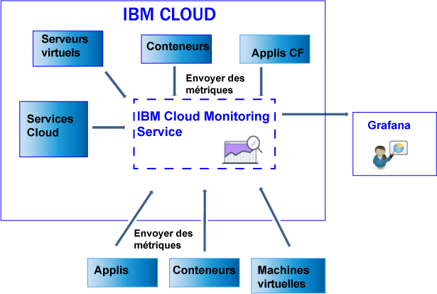

---

copyright:
  years: 2017, 2019

lastupdated: "2019-03-06"

keywords: IBM Cloud, monitoring

subcollection: cloud-monitoring

---

{:new_window: target="_blank"}
{:shortdesc: .shortdesc}
{:screen: .screen}
{:pre: .pre}
{:table: .aria-labeledby="caption"}
{:codeblock: .codeblock}
{:tip: .tip}
{:download: .download}
{:important: .important}
{:note: .note}

# Envoi et extraction de données
{: #send_retrieve_metrics_ov}

Vous pouvez envoyer des métriques à un espace à l'aide de l'API Metrics ou en configurant le plug-in {{site.data.keyword.monitoringshort}}, qui est un plug-in collectd. Vous pouvez extraire des métriques à l'aide de l'API Metrics.
{:shortdesc}

		
## Envoi de métriques
{: #send}

La figure suivante offre une vue d'ensemble des différentes ressources à partir desquelles vous pouvez envoyer des métriques au service {{site.data.keyword.monitoringshort}} :

Pour les conteneurs qui s'exécutent dans un cluster Kubernetes dans {{site.data.keyword.Bluemix_notm}}, et pour des services sélectionnés, les métriques système de base sont automatiquement collectées. 
Vous pouvez également collecter d'autres métriques ou envoyer des métriques depuis l'extérieur d'{{site.data.keyword.IBM_notm}} dans le service {{site.data.keyword.monitoringshort}}. Différente méthodes sont disponibles. Les tableaux suivants répertorient les méthodes par source de métriques :

<table>
  <caption>Tableau 1. Méthodes d'envoi de métriques au service {{site.data.keyword.monitoringshort}} pour des ressources {{site.data.keyword.IBM_notm}} Cloud.</caption>
  <tr>
    <th>Source de métriques</th>
	<th>API Metrics</th>
    <th>Plug-in {{site.data.keyword.monitoringshort}} (collectd)</th>	
	<th>Plus d'infos</th>
  </tr>
  <tr>
    <td>Conteneurs qui s'exécutent dans un cluster Kubernetes dans {{site.data.keyword.Bluemix_notm}}</td>
	<td>Oui</td>
	<td>Oui</td>
	<td>Les métriques système de base sont automatiquement collectées. Vous pouvez installer collectd de manière explicite et envoyer des métriques avancées ou personnalisées qui ne sont pas fournies par défaut.</td>
  </tr>
  <tr>
    <td>Applications Cloud Foundry</td>
	<td>Oui</td>
	<td>Non</td>
	<td></td>
  </tr>
  <tr>
    <td>Serveurs virtuels </td>
	<td>Oui</td>
	<td>Oui</td>
	<td>**Remarque :** Non pris en charge sous Windows.</td>
  </tr>
</table>

<table>
  <caption>Tableau 2. Méthodes d'envoi de métriques au service {{site.data.keyword.monitoringshort}} depuis l'extérieur d'{{site.data.keyword.IBM_notm}}.</caption>
  <tr>
    <th>Source de métriques</th>
	<th>API Metrics</th>
    <th>Plug-in {{site.data.keyword.monitoringshort}} (collectd)</th>	
	<th>Plus d'infos</th>
  </tr>
  <tr>
    <td>Conteneurs</td>
	<td>Oui</td>
	<td>Oui</td>
	<td>Vous pouvez utiliser *supervisord* comme noeud final de conteneur pour exécuter et gérer à la fois votre application et collectd.</td>
  </tr>
  <tr>
    <td>Applications</td>
	<td>Oui</td>
	<td>Non</td>
	<td></td>
  </tr>
  <tr>
    <td>Services</td>
	<td>Oui</td>
	<td>Non</td>
	<td></td>
  </tr>
  <tr>
    <td>Machines virtuelles</td>
	<td>Oui</td>
	<td>Oui</td>
	<td>**Remarque :** Non pris en charge sous Windows.</td>
  </tr>
</table>

Pour envoyer des métriques au service {{site.data.keyword.monitoringshort}}, prenez en compte les informations suivantes : 

* Vous devez indiquer l'espace dans lequel vous voulez envoyer les métriques.

* Vous devez fournir un jeton de sécurité ou une clé d'API pour gérer le service {{site.data.keyword.monitoringshort}}. 

* L'ID {{site.data.keyword.IBM_notm}} de l'utilisateur qui envoie des métriques doit avoir une règle IAM affectée pour le service {{site.data.keyword.monitoringshort}}. Les rôles IAM suivants autorisent un utilisateur à envoyer des métriques : *Administrateur*, *Editeur* et *Opérateur*.

* Vous devez indiquer le noeud final d'API où vous envoyez les métriques. Il existe un noeud final par région. Par exemple, pour la région Sud des Etats-Unis, le noeud final est le suivant : `https://metrics.ng.bluemix.net/v1/metrics`. Pour plus d'informations sur les noeuds finaux, voir [Adresses URL du service {{site.data.keyword.monitoringshort}}](/docs/services/cloud-monitoring?topic=cloud-monitoring-monitoring_ov#region){: new_window}.

Vous pouvez envoyer des métriques au service {{site.data.keyword.monitoringshort}} en utilisant l'une des méthodes suivantes :

* *Méthode 1 : Configurez le plug-in {{site.data.keyword.monitoringshort}}. *

    Pour plus d'informations, voir [Configuration du plug-in {{site.data.keyword.monitoringshort}}](/docs/services/cloud-monitoring/send-metrics?topic=cloud-monitoring-conf_monitoring_plugin#conf_monitoring_plugin).

    La figure suivante offre une vue d'ensemble de l'utilisation du plug-in {{site.data.keyword.monitoringshort}} pour envoyer des métriques au service {{site.data.keyword.monitoringshort}} :

    

* *Méthode 2 : Utilisez l'API Metrics. *

    Pour plus d'informations, voir [Envoi de métriques à l'aide de l'API Metrics](/docs/services/cloud-monitoring/send-metrics?topic=cloud-monitoring-send_data_api#send_data_api).

## Extraction de métriques
{: #retrieve}

Si vous avez besoin d'effectuer une analyse plus approfondie en dehors du service {{site.data.keyword.monitoringshort}} ou si votre application nécessite d'utiliser des métriques pour prendre des décisions, vous pouvez utiliser l'API Metrics pour extraire jusqu'à cinq métriques par requête. 

* Pour plus d'informations sur l'extraction de métriques, voir [Extraction de métriques à partir d'un domaine](/docs/services/cloud-monitoring/retrieve-metrics?topic=cloud-monitoring-retrieve_data_api#retrieve_data_api)
* Pour plus d'informations sur l'API Metrics, voir [API Metrics](https://console.bluemix.net/apidocs/927-ibm-cloud-monitoring-rest-api?&language=node#introduction){: new_window}.

Pour extraire des métriques, prenez en compte les informations suivantes : 

* Vous devez définir l'espace à partir duquel vous voulez extraire les données. 
* Vous devez fournir un jeton de sécurité ou une clé d'API pour gérer le service {{site.data.keyword.monitoringshort}}. 
* Vous devez spécifier un chemin d'accès à 1 ou plusieurs métriques. Pour plus d'informations, voir [Définition des métriques](/docs/services/cloud-monitoring/retrieve-metrics?topic=cloud-monitoring-retrieve_data_api#metrics).
* Vous pouvez éventuellement spécifier une période personnalisée. Par défaut, si vous ne spécifiez pas de période, les données que vous extrayez sont celles qui correspondent aux 24 dernières heures. Pour plus d'informations, voir [Configuration d'une période](/docs/services/cloud-monitoring/retrieve-metrics?topic=cloud-monitoring-retrieve_data_api#time).

## Liste des métriques
{: #show_metrics}

Vous pouvez afficher la liste des métriques disponibles dans un espace.

Pour afficher la liste des métriques, prenez en compte les informations suivantes : 

* Vous devez définir l'espace {{site.data.keyword.Bluemix_notm}} dont vous souhaitez afficher la liste de métriques disponibles.

* Vous devez fournir un jeton de sécurité ou une clé d'API pour gérer le service {{site.data.keyword.monitoringshort}}. 

* Vous devez spécifier une requête qui définit le chemin à partir duquel afficher la liste des métriques. Par exemple, pour afficher la liste de toutes les métriques dans un espace, vous pouvez définir la requête comme suit : `query=*` 

    La valeur par défaut est `*`, qui spécifie le point de départ au niveau racine pour l'espace.
	
* Vous pouvez utiliser l'appel API `Endpoint/v1/metrics/list` où Endpoint représente le point d'entrée vers le service. 

    Chaque région a une adresse URL différente. Par exemple, pour la région Sud des Etats-Unis, vous pouvez utiliser le noeud final d'API `https://metrics.ng.bluemix.net/v1/metrics/list` 

    Pour la liste des noeuds finaux par région, voir [Noeuds finaux](/docs/services/cloud-monitoring?topic=cloud-monitoring-send_retrieve_metrics_ov#endpoints).

    Pour plus d'informations sur l'API, voir [API Metrics](https://console.bluemix.net/apidocs/927-ibm-cloud-monitoring-rest-api?&language=node#introduction){: new_window}.

## Noeuds finaux d'envoi de métriques
{: #endpoints}

 Le tableau suivant répertorie les noeuds finaux par région :
	
<table>
    <caption>Liste des noeuds finaux</caption>
	<tr>
	  <th>Région</th>
	  <th>URL</th>
	  <th>Port collecté</th>
	</tr>
	<tr>
	  <td>Allemagne</td>
	  <td>[https://metrics.eu-de.bluemix.net](https://metrics.eu-de.bluemix.net)</td>
	  <td>9095</td>
	</tr>
	<tr>
	  <td>Sydney</td>
	  <td>[https://metrics.au-syd.bluemix.net](https://metrics.au-syd.bluemix.net)</td>
	  <td>9095</td>
	</tr>
	<tr>
	  <td>Royaume-Uni</td>
	  <td>[https://metrics.eu-gb.bluemix.net](https://metrics.eu-gb.bluemix.net)</td>
	  <td>9095</td>
	</tr>
	<tr>
	  <td>Sud des Etats-Unis</td>
	  <td>[https://metrics.ng.bluemix.net](https://metrics.ng.bluemix.net)</td>
	  <td>9095</td>
	</tr>
</table>

 
