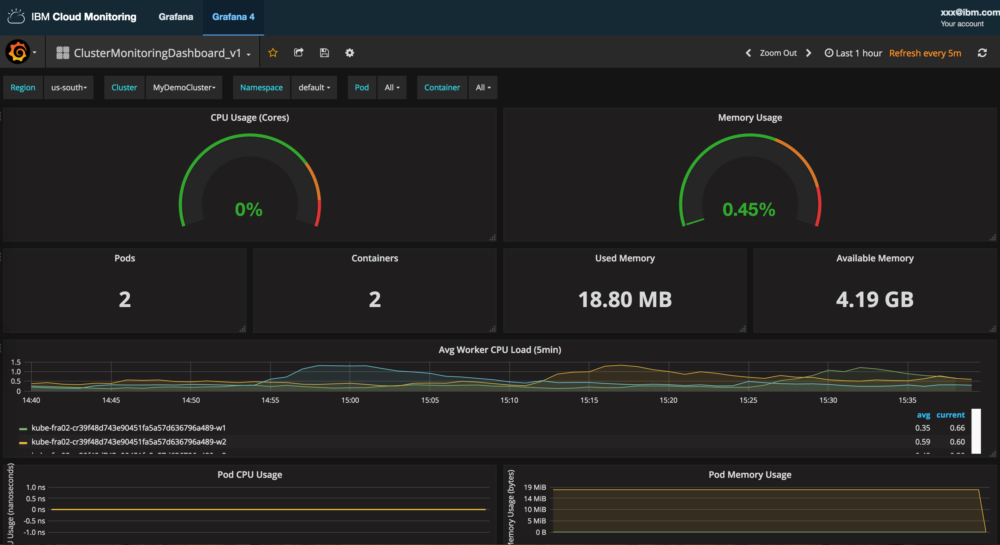

---

copyright:
  years: 2017, 2019

lastupdated: "2019-03-06"

keywords: IBM Cloud, monitoring

subcollection: cloud-monitoring

---

{:new_window: target="_blank"}
{:shortdesc: .shortdesc}
{:screen: .screen}
{:pre: .pre}
{:table: .aria-labeledby="caption"}
{:codeblock: .codeblock}
{:tip: .tip}
{:download: .download}
{:important: .important}
{:note: .note}


# Analyse des métriques dans Grafana pour un cluster Kubernetes
{: #container_service_metrics}

Utilisez ce tutoriel pour apprendre à utiliser le service {{site.data.keyword.monitoringlong}} afin de surveiller les performances de votre conteneur. 
{:shortdesc}


## Objectifs
{: #ks_objectives}

Apprenez à rechercher et à analyser des métriques de conteneur pour une application déployée dans un cluster Kubernetes :

1. Identifiez l'emplacement où les métriques qui sont collectées dans un cluster sont envoyées au service {{site.data.keyword.monitoringshort}}. 
2. Lancez Grafana et définissez le domaine {{site.data.keyword.monitoringshort}} dans lequel vous pourrez visualiser les métriques de cluster.
3. Recherchez et analysez les métriques de conteneur pour une application qui est déployée dans un cluster Kubernetes sous {{site.data.keyword.Bluemix_notm}}.

Ce tutoriel vous guide dans les étapes du scénario de bout en bout suivant dans {{site.data.keyword.Bluemix_notm}} : mise à disposition d'un cluster, identification de l'emplacement où le cluster envoie des métriques au service {{site.data.keyword.monitoringshort}} dans {{site.data.keyword.Bluemix_notm}}, déploiement d'une application dans le cluster et utilisation de Grafana pour visualiser et filtrer des métriques de conteneur pour ce cluster.


**Remarque :** pour suivre ce tutoriel, vous devez remplir les conditions prérequises décrites ci-après et suivre les tutoriels qui sont liés à partir des différentes étapes.


## Prérequis
{: #ks_prereqs}

1. Etre membre ou propriétaire d'un compte {{site.data.keyword.Bluemix_notm}} doté des droits permettant de créer des clusters standard Kubernetes, de déployer des applications dans des clusters et d'interroger les métriques dans {{site.data.keyword.Bluemix_notm}} à des fins de surveillance dans Grafana.

    Les règles suivantes doivent être affectées à votre ID utilisateur pour {{site.data.keyword.Bluemix_notm}} :
    
    * Une règle IAM pour {{site.data.keyword.containershort}} avec des droits *operator* ou *administrator*.
    
    Pour plus d'informations, voir [Affectation d'une règle IAM à un utilisateur via l'interface utilisateur IBM Cloud](/docs/services/cloud-monitoring/security?topic=cloud-monitoring-grant_permissions#assign_policy_ui).

2. Disposer d'une session de terminal depuis laquelle vous pouvez gérer le cluster Kubernetes et déployer des applications depuis la ligne de commande. Les exemples dans ce tutoriel sont valables pour un système Ubuntu Linux.

3. Installez les interfaces de ligne de commande pour gérer {{site.data.keyword.containershort}} dans votre système Ubuntu.

    * Installez l'interface de ligne de commande {{site.data.keyword.Bluemix_notm}}. 
    * Installez l'interface de ligne de commande {{site.data.keyword.containershort}} pour créer et gérer vos clusters Kubernetes dans {{site.data.keyword.containershort}} et pour déployer des applications conteneurisées sur votre cluster.
    
    Pour plus d'informations, voir [Installation de l'interface de ligne de commande {{site.data.keyword.Bluemix_notm}}.](/docs/cli?topic=cloud-cli-ibmcloud-cli#overview)
    
    

    
 

## Etape 1 : Mise à disposition d'un cluster Kubernetes
{: #ks_step1}

Procédez comme suit :

1. Créez un cluster Kubernetes standard. Pour plus d'informations, voir la rubrique relative à la [création d'un cluster Kubernetes standard](/docs/containers?topic=containers-cs_cluster_tutorial#cs_cluster_tutorial).

2. Configurez le contexte de cluster dans un terminal. Une fois le contexte défini, vous pouvez gérer le cluster Kubernetes et déployer l'application dans ce cluster.

    Connectez-vous à la région, l'organisation et l'espace dans l'environnement {{site.data.keyword.Bluemix_notm}} associé au cluster que vous avez créé. Pour plus d'informations, voir [Comment se connecter à {{site.data.keyword.Bluemix_notm}}](/docs/services/CloudLogAnalysis/qa?topic=cloudloganalysis-cli_qa#login).

	Initialisez le plug-in du service {{site.data.keyword.containershort}}.

	```
	ibmcloud cs init
	```
	{: codeblock}

    Définissez votre cluster comme contexte du terminal.
    
	```
	ibmcloud cs cluster-config MyCluster
	```
	{: codeblock}

    La sortie de l'exécution de cette commande fournit la commande que vous devez exécuter dans votre terminal pour définir le chemin d'accès à votre fichier de configuration. Par exemple :

	```
	export KUBECONFIG=/Users/ibm/.bluemix/plugins/container-service/clusters/MyCluster/kube-config-hou02-MyCluster.yml
	```
	{: codeblock}

    Copiez et collez la commande afin de définir la variable d'environnement dans votre terminal, puis appuyez sur **Entrée**.


## Etape 2 : Octroi des droits permettant à votre utilisateur d'afficher des métriques dans le domaine de compte
{: #ks_step2}

Pour autoriser un utilisateur à visualiser des métriques dans un domaine de compte, vous devez affecter à cet utilisateur une règle IAM pour le service {{site.data.keyword.monitoringshort}} avec un rôle **Viewer**.

Pour autoriser un utilisateur à gérer le service {{site.data.keyword.monitoringshort}}, procédez comme suit :

1. Connectez vous à la console {{site.data.keyword.Bluemix_notm}}.

    Ouvrez un navigateur Web et lancez le tableau de bord {{site.data.keyword.Bluemix_notm}} : [http://bluemix.net ](http://bluemix.net){:new_window}
	
	Après que vous vous êtes connecté avec votre ID utilisateur et votre mot de passe, l'interface utilisateur {{site.data.keyword.Bluemix_notm}} s'ouvre.

2. Dans la barre de menus, cliquez sur **Gérer > Compte > Utilisateurs**. 

    La fenêtre *Utilisateurs* affiche une liste d'utilisateurs avec leur adresse électronique pour le compte actuellement sélectionné.
	
3. Si l'utilisateur est membre du compte, sélectionnez le nom de l'utilisateur dans la liste ou cliquez sur **Gérer un utilisateur** dans le menu *Actions*.

    Si l'utilisateur n'est pas membre du compte, voir [Invitation d'utilisateurs](/docs/iam?topic=iam-iamuserinv#iamuserinv).

4. Sélectionnez **Règles d'accès > Affecter un accès > Affecter l'accès aux ressources**.

5. Choisissez le service **{{site.data.keyword.monitoringlong}}**, sélectionnez la région dans laquelle le cluster est disponible, **US-South** pour ce tutoriel, puis sélectionnez un rôle, **viewer**.


## Etape 3 : Octroi de droits au propriétaire de clé {{site.data.keyword.containershort_notm}}
{: #ks_step3}

Pour que le cluster puisse transmettre des métriques au domaine de compte, le propriétaire de clé {{site.data.keyword.containershort}} doit posséder les règles IAM suivantes :

* Règle IAM avec des droits **editor** pour le service {{site.data.keyword.monitoringshort}}.
* Règle IAM avec des droits **administrator** pour {{site.data.keyword.containershort}}.


Pour octroyer les droits au propriétaire de compte {{site.data.keyword.containershort}}, procédez comme suit :

1. Connectez vous à la console {{site.data.keyword.Bluemix_notm}}.

    Ouvrez un navigateur Web et lancez le tableau de bord {{site.data.keyword.Bluemix_notm}} : [http://bluemix.net ](http://bluemix.net){:new_window}
	
	Après que vous vous êtes connecté avec votre ID utilisateur et votre mot de passe, l'interface utilisateur {{site.data.keyword.Bluemix_notm}} s'ouvre.

2. Dans la barre de menus, cliquez sur **Gérer > Compte > Utilisateurs**. 

    La fenêtre *Utilisateurs* affiche une liste d'utilisateurs avec leur adresse électronique pour le compte actuellement sélectionné.
	
3. Recherchez l'ID utilisateur du propriétaire de clé {{site.data.keyword.containershort}}.

    Exécutez la commande `ibmcloud cs api-key-info ClusterName` pour obtenir l'ID utilisateur du propriétaire de clé {{site.data.keyword.containershort}}.

4. Sélectionnez **Règles d'accès > Affecter un accès > Affecter l'accès aux ressources**.

5. Choisissez le service **{{site.data.keyword.monitoringlong}}**, sélectionnez la région dans laquelle le cluster est disponible, **US-South** pour ce tutoriel, puis sélectionnez un rôle, **editor**.	

6. Répétez les étapes 2 à 4, puis choisissez le service {{site.data.keyword.containershort}}. Sélectionnez **Toutes les régions** et le rôle **administrator**.	


## Etape 4 : Déploiement d'un exemple d'application dans le cluster Kubernetes
{: #ks_step4}

Déployez et exécutez un modèle d'application dans le cluster Kubernetes. Effectuez les étapes du tutoriel suivant pour déployer l'exemple d'application :[Leçon 1 : Déploiement d'applications d'instance uniques sur des clusters Kubernetes](/docs/containers?topic=containers-cs_apps_tutorial#cs_apps_tutorial_lesson1).

L'application est une application Hello World Node.js :

```
var express = require('express')
var app = express()

app.get('/', function(req, res) {
  res.send('Hello world! Your app is up and running in a cluster!\n')
})
app.listen(8080, function() {
  console.log('Sample app is listening on port 8080.')
})
```
{: screen}

Dans cet exemple d'application, lorsque vous testez votre application dans un navigateur, l'application consigne dans stdout le message suivant : `L'exemple d'application est à l'écoute sur le port 8080.`


## Etape 5 : Lancement de Grafana et définition du domaine des métriques
{: #ks_step5}

Lancez Grafana à partir d'un domaine et définissez le domaine {{site.data.keyword.monitoringshort}} dans lequel vous pourrez visualiser les métriques de cluster.

Pour analyser les métriques pour un cluster, vous devez accéder à Grafana dans la région publique du cloud où le cluster a été créé. Pour plus d'informations, voir [Accès au tableau de bord Grafana depuis un navigateur Web](/docs/services/cloud-monitoring/grafana?topic=cloud-monitoring-navigating_grafana#launch_grafana_from_browser).

1. A partir d'un navigateur, démarrez Grafana. 

    Entrez l'adresse URL du service {{site.data.keyword.monitoringshort}} pour la région où vous avez créé le cluster. 
    
    Pour obtenir les adresses URL par région, voir [URL pour le service de surveillance](/docs/services/cloud-monitoring?topic=cloud-monitoring-monitoring_ov#region).

    Par exemple, pour la région Sud des Etats-Unis, démarrez : [https://metrics.ng.bluemix.net/](https://metrics.ng.bluemix.net/).

2. Définissez le domaine {{site.data.keyword.monitoringshort}} sur **Account**.

    Dans Grafana, sélectionnez votre ID. Ensuite, assurez-vous que vous êtes connecté au compte approprié, puis choisissez un domaine. Sélectionnez `Domain = account`.

    Les clusters transmettent les métriques au domaine de métriques de compte. 

## Etape 6 : Surveillance du cluster dans Grafana
{: #ks_step6}

{{site.data.keyword.containershort}} fournit un tableau de bord Grafana que vous pouvez utiliser pour surveiller vos métriques de cluster. 

Pour ouvrir l'exemple de tableau de bord, procédez comme suit :

1. Sélectionnez le bouton de basculement de la barre de menus latérale .
2. Sélectionnez **Dashboards**.
3. Cliquez sur **Open**.
4. Sélectionnez **ClusterMonitoringDashboard_v1**.

L'exemple de tableau de bord s'ouvre. 




## Etapes suivantes
{: #ks_next_steps}

Définissez une alerte pour une métrique. Pour plus d'informations, voir [Configuration d'alertes](/docs/services/cloud-monitoring?topic=cloud-monitoring-config_alerts_ov#config_alerts_ov).
