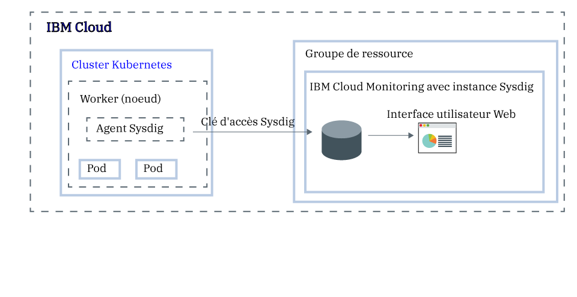

---

copyright:
  years:  2018, 2019
lastupdated: "2019-05-10"

keywords: Sysdig, IBM Cloud, monitoring, kubernetes, analyze metrics

subcollection: Sysdig

---

{:new_window: target="_blank"}
{:shortdesc: .shortdesc}
{:screen: .screen}
{:pre: .pre}
{:table: .aria-labeledby="caption"}
{:codeblock: .codeblock}
{:tip: .tip}
{:download: .download}
{:important: .important}
{:note: .note}


# Analyse des métriques d'une application déployée dans un cluster Kubernetes
{: #kubernetes_cluster}

Utilisez ce tutoriel pour apprendre à configurer un cluster {{site.data.keyword.containerlong}} pour la transmission de métriques au service {{site.data.keyword.mon_full}}.
{:shortdesc}

Pour configurer un cluster pour la transmission de métriques, vous devez installer un Sysdig agent sur chaque noeud worker de votre cluster Kubernetes à l'aide d'un [DaemonSet ](https://kubernetes.io/docs/concepts/workloads/controllers/daemonset/). L'agent Sysdig utilise une clé d'accès (jeton) pour s'authentifier sur l'instance {{site.data.keyword.mon_full_notm}}. L'agent Sysdig fait office de collecteur de données. Il collecte automatiquement des métriques telles que l'utilisation d'*UC de noeud worker* et de la *mémoire de noeud worker*, le *trafic HTTP entrant et sortant de vos conteneurs*, ainsi que des données concernant plusieurs composants d'infrastructure. En outre, l'agent peut collecter des métriques d'application personnalisées à l'aide d'un scraper compatible avec Prometheus ou d'une façade StatsD. 

Vous pouvez afficher des métriques via l'interface utilisateur Web de Sysdig.



## Objectifs
{: #kubernetes_cluster_objectives}

Dans ce tutoriel, vous configurez des métriques avec Sysdig dans votre cluster {{site.data.keyword.containerlong}}. Notamment, vous :
*  Mettez à disposition une instance {{site.data.keyword.mon_full_notm}}.
*  Configurez l'agent Sysdig dans votre cluster afin d'envoyer des métriques à Sysdig.
*  Utilisez l'interface utilisateur Web Sysdig pour analyser vos métriques de cluster. 


## Avant de commencer
{: #kubernetes_cluster_prereqs}

1. Documentez-vous sur {{site.data.keyword.mon_full_notm}}. Pour plus d'informations, voir [A propos de](/docs/services/Monitoring-with-Sysdig?topic=Sysdig-about#about).

2. Prenez un ID utilisateur qui soit membre ou propriétaire d'un compte {{site.data.keyword.cloud_notm}}. Pour obtenir un ID utilisateur {{site.data.keyword.cloud_notm}}, accédez à [Inscription ](https://cloud.ibm.com/login){:new_window}.

3. Installez l'interface CLI {{site.data.keyword.cloud_notm}} et le plug-in d'interface de ligne de commande Kubernetes. Pour plus d'informations, voir [Installation de l'interface de ligne de commande {{site.data.keyword.cloud_notm}}.](/docs/cli?topic=cloud-cli-ibmcloud-cli#ibmcloud-cli)

4. [Créez un cluster](/docs/containers?topic=containers-clusters#clusters) ou utilisez un cluster {{site.data.keyword.containerlong_notm}} existant.
    *  Le cluster doit exécuter Kubernetes version 1.10 ou ultérieure.
    *  Le cluster n'a pas besoin d'être à l'emplacement **Dallas**, mais peut se trouver dans toute [région {{site.data.keyword.containerlong_notm}}](/docs/containers/cs_regions.html#regions-and-zones).

5. Vérifiez que les règles {{site.data.keyword.iamlong}} suivantes sont affectées à votre ID utilisateur :

| Ressource                             | Portée de la règle d'accès | Rôle    | Région    | Informations                  |
|--------------------------------------|----------------------------|---------|-----------|------------------------------|
| Groupe de ressources **default**           |  Groupe de ressources            | Afficheur  | Us-south  | Cette règle est requise pour permettre à l'utilisateur de voir les instances de service dans le groupe de ressources par défaut.    |
| Service {{site.data.keyword.mon_full_notm}} |  Groupe de ressources            | Editeur  | Us-south  | Cette règle est requise pour permettre à l'utilisateur de mettre à disposition et d'administrer le service {{site.data.keyword.mon_full_notm}} dans le groupe de ressources par défaut.   |
| Instance de cluster Kubernetes          |  Ressource                 | Editeur  | Us-south  | Cette règle est requise pour configurer la valeur confidentielle et l'agent Sysdig dans le cluster Kubernetes. |
{: caption="Tableau 1. Liste des règles IAM requises pour l'exécution du tutoriel" caption-side="top"}

Pour plus d'informations sur les rôles IAM {{site.data.keyword.containerlong}}, voir [Droits d'accès utilisateur](/docs/containers?topic=containers-access_reference#access_reference).


## Etape 1. Mise à disposition d'une instance {{site.data.keyword.mon_full_notm}}
{: #kubernetes_cluster_step1}

Dans ce tutoriel d'initiation, des instructions sont fournies pour la mise à disposition d'une instance {{site.data.keyword.mon_full_notm}} dans la région Sud des Etats-Unis. Pour plus d'informations sur les régions prises en charge, voir [Régions](/docs/services/Monitoring-with-Sysdig?topic=Sysdig-endpoints).

Pour mettre à disposition une instance {{site.data.keyword.mon_full_notm}} via l'interface utilisateur {{site.data.keyword.cloud_notm}}, procédez comme suit :

1. [Connectez-vous à votre compte {{site.data.keyword.cloud_notm}} ](https://cloud.ibm.com/login){:new_window}.

	Une fois que vous êtes connecté avec votre ID utilisateur et votre mot de passe, l'interface utilisateur {{site.data.keyword.cloud_notm}} s'ouvre.

2. Cliquez sur **Catalogue**. La liste des services disponibles dans {{site.data.keyword.cloud_notm}} s'affiche.

3. Pour filtrer la liste de services qui s'affiche, sélectionnez la catégorie **Developer Tools**.

4. Cliquez sur la vignette **{{site.data.keyword.mon_full_notm}}**. Le tableau de bord *Observabilité* s'ouvre.

5. Sélectionnez **Créer une instance**. 

6. Saisissez un nom pour l'instance de service.

7. Sélectionnez le groupe de ressources **default**.  

    Vous pouvez mettre à disposition l'instance dans un groupe de ressources où vous disposez des droits pour créer des ressources.

    Le groupe de ressources **default** est défini par défaut.

8. Sélectionnez le plan de service **Essai**. 

    Par défaut, le plan **Essai** est défini.

    Pour plus d'informations sur les autres plans de service, voir [Plans de tarification](/docs/services/Monitoring-with-Sysdig?topic=Sysdig-pricing_plans#pricing_plans).

9. Cliquez sur **Créer**.

    Une fois que vous avez mis à disposition une instance, le tableau de bord *Observabilité* s'ouvre sur les détails de vos instances de **Surveillance**. 


Pour mettre une instance à disposition via l'interface de ligne de commande, voir [Mise à disposition d'une instance via l'interface de ligne de commande {{site.data.keyword.cloud_notm}}](/docs/services/Monitoring-with-Sysdig?topic=Sysdig-provision#provision_cli).
{: note}


## Etape 2. Configuration de votre cluster Kubernetes pour envoyer des métriques à votre instance
{: #kubernetes_cluster_step2}

Pour configurer votre cluster Kubernetes pour qu'il envoie des métriques à votre instance {{site.data.keyword.mon_full_notm}}, vous devez installer un pod d'agent Sysdig sur chaque noeud de votre cluster. L'agent Sysdig est installé via un DaemonSet qui vérifie qu'une instance de l'agent s'exécute sur chaque noeud worker. L'agent Sysdig collecte des métriques à partir du pod où il est installé, puis les transmet à votre instance.

Pour fournir la suite complète des métriques système, l'agent Sysdig doit disposer d'un statut privilégié.
{: note}

Pour configurer votre cluster Kubernetes pour qu'il transmette des métriques à votre instance {{site.data.keyword.mon_full_notm}}, procédez comme suit à partir de la ligne de commande :

1. Ouvrez un terminal. Ensuite, connectez-vous à {{site.data.keyword.cloud_notm}}. Exécutez la commande suivante et suivez les invites :

    ```
    ibmcloud login -a cloud.ibm.com
    ```
    {: codeblock}

    Sélectionnez le compte où le cluster est disponible.

2. Configurez l'environnement de cluster. Exécutez les commandes suivantes :

    Lancez d'abord la commande permettant de définir la variable d'environnement et téléchargez les fichiers de configuration Kubernetes.

    ```
    ibmcloud ks cluster-config <cluster_name_or_ID>
    ```
    {: codeblock}

    Une fois les fichiers de configuration téléchargés, une commande s'affiche ; elle vous permet de définir le chemin vers le fichier de configuration Kubernetes local en tant que variable d'environnement. Copiez et collez la commande qui s'affiche sur votre terminal pour définir la variable d'environnement `KUBECONFIG`.

    Chaque fois que vous vous connectez à l'interface CLI d'{{site.data.keyword.containerlong}} pour gérer vos clusters, vous devez lancer ces commandes pour définir le chemin d'accès au fichier de configuration du cluster par le biais d'une variable de session. L'interface CLI de Kubernetes utilise cette variable pour localiser un fichier de configuration local et les certificats requis pour connexion au cluster dans {{site.data.keyword.cloud_notm}}.
    {: tip}

3. Obtenez la clé d'accès Sysdig. Pour plus d'informations, voir [Obtention de la clé d'accès via l'interface utilisateur {{site.data.keyword.cloud_notm}}](/docs/services/Monitoring-with-Sysdig?topic=Sysdig-access_key#access_key_ibm_cloud_ui).

4. Obtenez l'URL d'ingestion depuis les [noeuds finaux de collecteur Sysdig](/docs/services/Monitoring-with-Sysdig?topic=Sysdig-endpoints#endpoints_ingestion).

5. Déployez l'agent Sysdig. Exécutez la commande suivante :

    ```
    curl -sL https://raw.githubusercontent.com/draios/sysdig-cloud-scripts/master/agent_deploy/IBMCloud-Kubernetes-Service/install-agent-k8s.sh | bash -s -- -a SYSDIG_ACCESS_KEY -c COLLECTOR_ENDPOINT -t TAG_DATA -ac 'sysdig_capture_enabled: false'
    ```
    {: pre}

    où

    * **SYSDIG_ACCESS_KEY** est la clé d'ingestion pour l'instance précédemment extraite.

    * **COLLECTOR_ENDPOINT** est l'URL d'ingestion de la région où se trouve l'instance de surveillance précédemment extraite.

    * **TAG_DATA** sont des étiquettes séparées par une virgule qui se présentent sous la forme *TAG_NAME:TAG_VALUE*. Vous pouvez associer une ou plusieurs étiquettes à votre agent Sysdig. Exemple : *role:serviceX,location:us-south*. Vous pouvez utiliser ces étiquettes ultérieurement pour identifier les métriques provenant de l'environnement où l'agent s'exécute.

    * Définissez **sysdig_capture_enabled** sur *false* pour désactiver la fonction de capture Sysdig. La valeur par défaut est *true*. Pour plus d'informations, voir [Utilisation des captures](/docs/services/Monitoring-with-Sysdig?topic=Sysdig-captures#captures).

6. Vérifiez que l'agent Sysdig a été créé, ainsi que son statut. Exécutez la commande suivante :

    ```
    kubectl get pods -n ibm-observe
    ```
    {: codeblock}

    Le déploiement a abouti lorsque vous voyez un ou plusieurs pods `sysdig-agent`. Le nombre de pods `sysdig-agent` est égal au nombre de noeuds worker de votre cluster. Tous les pods doivent être à l'état `Running`.


## Etape 3. Lancement de l'interface utilisateur Web Sysdig
{: #kubernetes_cluster_step3}

Pour lancer l'interface utilisateur Web Sysdig via la console {{site.data.keyword.cloud_notm}}, procédez comme suit. 

Une seule session d'interface utilisateur Web peut s'ouvrir par navigateur.
{: imp}

1. [Connectez-vous à votre compte {{site.data.keyword.cloud_notm}} ](https://cloud.ibm.com/login){:new_window}.

	Une fois que vous êtes connecté avec votre ID utilisateur et votre mot de passe, le tableau de bord {{site.data.keyword.cloud_notm}} s'ouvre.

2. Depuis le menu , sélectionnez **Observabilité**. 

3. Sélectionnez **Surveillance**. La liste des instances disponibles sur {{site.data.keyword.cloud_notm}} s'affiche.

4. Recherchez votre instance et cliquez sur **Afficher Sysdig**.

    * **Première fois** : Parce que vous avez déjà installé l'agent Sysdig, vous pouvez passer l'assistant d'installation, la mise en route et terminer l'intégration.
    
    * **Fois suivantes** : La vue **Explorer** s'ouvre.


Si l'agent Sysdig n'est pas installé correctement, pointe vers le mauvais noeud final d'ingestion ou que la clé d'accès est incorrecte, la page qui s'ouvre vous informe de la procédure à suivre.

Si, par exemple, l'agent Sysdig n'a pas été correctement installé, vous ne pouvez pas ignorer l'agent d'installation. Il est possible qu'un message similaire au suivant s'affiche :
    
```
Waiting for the first node to connect... Go ahead and follow the instructions below.
```
{: screen}
    
Vous pouvez essayer les actions suivantes :
*  Vérifiez que vous utilisez le [noeud final](/docs/services/Monitoring-with-Sysdig?topic=Sysdig-endpoints#endpoints_ingestion) `ingest` et non le noeud final Sysdig. 
*  Vérifiez que la [clé d'accès](/docs/services/Monitoring-with-Sysdig?topic=Sysdig-access_key) est correcte.
*  Suivez toute instruction supplémentaire et répétez les étapes de ce tutoriel.


## Etape 4. Surveillance de votre cluster
{: #kubernetes_cluster_step4}

Vous pouvez surveiller votre cluster dans la vue **EXPLORE**, qui est disponible via l'interface utilisateur Web Sysdig. Cette vue est votre page d'accueil par défaut et le point de départ pour identifier les problèmes et surveiller votre infrastructure et vos ressources de cluster. 

A la section *Host and containers*, vous pouvez voir la *table d'exploration*, une liste des noeuds worker de votre cluster qui transmettent des métriques à l'instance de surveillance. Chaque entrée de noeud worker représente un groupe d'objets d'infrastructure connexes pour ce noeud worker.

Cliquez sur **Host and containers**  pour basculer entre les sources de données. Ensuite, sélectionnez un noeud worker. Les données affichées correspondent au noeud worker que vous avez sélectionné. Si vous cliquez sur **Back to Explore Table**, le *tableau Explore* s'affiche. 

**Personnalisation de la _table d'exploration_**

Vous pouvez personnaliser la *table d'exploration*. 

* Chaque colonne contient une métrique différente. 
* Vous pouvez configurer chaque métrique individuellement. 
* Vous pouvez modifier l'ordre des colonnes. 

    Notez que lorsque vous apportez des modifications à l'ordre des colonnes existantes, la modification demeure sur les différents regroupements tant que vous êtes connecté. Si vous ajoutez ou supprimez une colonne, la modification est permanente.  

* Vous pouvez également configurer des couleurs pour mettre en évidence des valeurs et améliorer la lisibilité. 

Par exemple, pour configurer le codage couleur pour une colonne, procédez comme suit :

1. Sélectionnez une colonne. Déplacez la souris sur le titre de la colonne. Ensuite, sélectionnez l'icône en forme de crayon.
2. Activez la barre pour activer le codage couleur.
3. Définissez des valeurs pour les différents seuils.


**Personnalisation des tableaux de bord**

Pour afficher plus de détails sur un noeud worker particulier, cliquez sur l'entrée d'infrastructure et le tableau de bord *Overview by Host* s'ouvre dans la table. Vous pouvez explorer différents tableaux de bord et métriques en cliquant sur l'icône . Notez que vous pouvez uniquement sélectionner des métriques et tableaux de bord qui sont pertinents pour le noeud worker sélectionné. 

Pour revenir à la _table d'exploration_ complète, cliquez sur le bouton **X (Back to Explore Table)**.


Pour plus d'informations, consultez la [documentation Sysdig](https://sysdigdocs.atlassian.net/wiki/spaces/Monitor/pages/222822446/The+Explore+Table).


## Etapes suivantes
{: #kubernetes_cluster_next_steps}

Créez un tableau de bord personnalisé. Pour plus d'informations, voir [Utilisation des tableaux de bord](/docs/services/Monitoring-with-Sysdig?topic=Sysdig-dashboards#dashboards).

Vous pouvez également obtenir des informations sur les alertes. Pour plus d'informations, voir [Utilisation des alertes](/docs/services/Monitoring-with-Sysdig?topic=Sysdig-monitoring#monitoring_alerts). 


