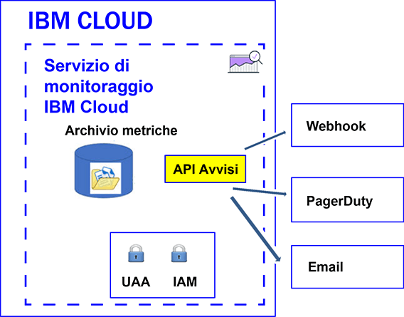

---

copyright:
  years: 2017, 2019

lastupdated: "2019-03-06"

keywords: IBM Cloud, monitoring

subcollection: cloud-monitoring

---

{:new_window: target="_blank"}
{:shortdesc: .shortdesc}
{:screen: .screen}
{:pre: .pre}
{:table: .aria-labeledby="caption"}
{:codeblock: .codeblock}
{:tip: .tip}
{:download: .download}
{:important: .important}
{:note: .note}


# Configurazione degli avvisi
{: #config_alerts_ov}

Il servizio {{site.data.keyword.monitoringshort}} fornisce un sistema di avvisi basati su query. Puoi configurare gli avvisi utilizzando l'API {{site.data.keyword.monitoringshort}} o tramite Grafana. Per configurare un avviso, devi impostare le regole e i metodi di notifica per ogni query della metrica che desideri monitorare. Puoi comunicare gli avvisi inviando un'e-mail, attivando un webhook o inviando un avviso a PagerDuty.
{:shortdesc}

Puoi definire un avviso per attivare una notifica per una metrica. Un avviso è definito da una regola che descrive la query di metrica da monitorare, il valore di soglia, l'azione da eseguire quando la soglia viene superata e uno o più metodi di notifica.  

La seguente tabella elenca i diversi metodi e le azioni supportate, che puoi utilizzare con gli avvisi:

<table>
  <caption>Metodi per utilizzare gli avvisi</caption>
	<tr>
    <th>Metodo</th>
		<th>Definisci un avviso</th>
		<th>Aggiorna un avviso</th>
		<th>Elimina un avviso</th>
	</tr>
	<tr>
    <td>API Avvisi</td>
		<td>Sì</td>
		<td>Sì</td>
		<td>sì</td>
	</tr>
	<tr>
    <td>Grafana</td>
		<td>Sì</td>
		<td>Sì</td>
		<td>Sì</td>
	</tr>
</table>

**Nota:** gli avvisi che definisci utilizzando l'API Avvisi non vengono visualizzati nel dashboard Grafana.


La seguente figura mostra i diversi tipi di notifica che puoi configurare nel servizio {{site.data.keyword.monitoringshort}} per ricevere avvisi:



Puoi definire gli avvisi per una singola istanza oppure per più istanze. Quando una query da te monitorata mediante una regola di avviso include un carattere jolly, quest'ultimo identifica più destinazioni, ossia più istanze di servizi o istanze di applicazioni. Ogni 5 minuti, il servizio {{site.data.keyword.monitoringshort}} esegue la query configurata in una regola di avviso e controlla gli ultimi datapoint restituiti per ciascuna istanza o per più istanze. Il servizio {{site.data.keyword.monitoringshort}} tiene traccia dell'ultimo stato per ciascuna istanza e genera un nuovo avviso se lo stato dell'avviso subisce variazioni. 


## Utilizzo degli avvisi utilizzando l'API Avvisi
{: #api}

Puoi definire, aggiornare o eliminare gli avvisi utilizzando l'API Avvisi.

Per definire un avviso per una query della metrica utilizzando l'API Avvisi, devi:

1. Definire una o più query della metrica in un dashboard Grafana. 

    **Nota:** non puoi definire gli avvisi nei dashboard Grafana che utilizzano le variabili del template.

2. Configura un avviso per una query della metrica definito nel dashboard Grafana.

    * [Configurazione di un avviso che invia un'email](/docs/services/cloud-monitoring/alerts/configure_email_alert.html#configure_email_alert).
    * [Configurazione di un avviso che invia una notifica PagerDuty](/docs/services/cloud-monitoring/alerts/configure_pagerduty_alert.html#configure_pagerduty_alert).
    * [Configurazione di un avviso che invia una notifica Webhook](/docs/services/cloud-monitoring/alerts/configure_webhook_alert.html#configure_webhook_alert).

    **Nota:** puoi soltanto definire le notifiche email per le query della metrica definite nel dominio della metrica dell'account.


## Utilizzo degli avvisi utilizzando Grafana
{: #grafana}

Puoi definire ed eliminare gli avvisi direttamente in un dashboard Grafana. Puoi anche aggiornare le definizioni delle regole. Tuttavia, tutte le modifiche al canale di notifica devono essere effettuate utilizzando l'API Avvisi.

Tieni conto delle seguenti informazioni quando utilizzi gli avvisi in Grafana:

* Per modificare i canali di notifica assegnati a una regola, devi utilizzare l'API Avvisi.
* Quando elimini un canale di notifica in un dominio dello spazio, le regole con questo canale configurato non vengono aggiornate. Devi utilizzare l'API Avvisi per modificare la regola e rimuovere tale canale di notifica da essa. 

Per definire un avviso per una query della metrica direttamente in un dashboard Grafana, devi:

1. Definire una o più query della metrica in un dashboard Grafana. 

    **Nota:** non puoi definire gli avvisi nei dashboard Grafana che utilizzano le variabili del template.

2. Configura un avviso per una query della metrica definito nel dashboard Grafana.

    Per ulteriori informazioni, vedi [Configurazione degli avvisi in Grafana](/docs/services/cloud-monitoring/alerts/config_alerts_grafana.html#config_alerts_grafana).


## Stati di avviso
{: #status}

Un avviso può avere uno dei seguenti stati quando la regola è abilitata:

* *OK*: lo stato di una regola è impostato su *OK* quando:
    
	* I dati sono disponibili nel servizio {{site.data.keyword.monitoringshort}} per la query di metrica associata a tale regola. Hai impostato una soglia di avvertenza e una soglia di errore. Il valore dei dati non supera il valore di soglia.
	 
	* Non ci sono dati nel servizio {{site.data.keyword.monitoringshort}} per la query di metrica associata a tale regola e configuri la proprietà della regola `allow_no_data` su *true*.           
	 
* *WARNING*: lo stato della regola è impostato su *WARNING* quando i dati sono disponibili nel servizio {{site.data.keyword.monitoringshort}} per la query di metrica associata a tale regola. Hai impostato una soglia di avvertenza e una soglia di errore. Il valore dei dati è compreso tra il valore della soglia di avvertenza e il valore della soglia di errore.
	
* *ERROR*: lo stato della regola è impostato su *ERROR* quando i dati sono disponibili nel servizio {{site.data.keyword.monitoringshort}} per la query di metrica associata a tale regola. Hai impostato una soglia di avvertenza e una soglia di errore. Il valore della soglia di errore viene raggiunto.  

* *UNKNOWN*: lo stato della regola è impostato su *UNKNOWN* quando non ci sono dati nel servizio {{site.data.keyword.monitoringshort}} per la query di metrica associata a tale regola. Puoi configurare se ricevere o meno una notifica sulla base della proprietà `allow_no_data` che configuri per la regola. Se imposti questa proprietà su `false`, verrai avvisato che non sono stati trovati dati per la regola.


	
## Cronologia degli avvisi
{: #history}

Ogni volta che lo stato di un avviso cambia, il record della cronologia dell'avviso viene aggiornato. Puoi utilizzare l'API Avvisi (*/v1/alert/history*) per richiamare le informazioni sulla cronologia di una metrica.

Lo stato di un avviso viene utilizzato per definire lo stato in uno dei seguenti scenari:

* Stato della query prima che la regola attivi una notifica.
* Stato della query dopo che la regola è stata attivata. 

Ad esempio, se viene superata una soglia di avvertenza, viene generato un record di cronologia che registrerà la transizione da *OK* a *WARNING*. Allo stesso modo, quando il valore torna al di sotto della soglia, viene generato un record di cronologia per registrare la transizione da *WARNING* a *OK*.

Per ulteriori informazioni, vedi [Recupero della cronologia di una regola](/docs/services/cloud-monitoring/alerts/retrieve_history.html#retrieve_history).


## Regole
{: #rules1}

Una regola descrive la query di metrica da monitorare, il valore di soglia e l'azione da intraprendere quando la soglia viene superata. 

* Puoi creare, eliminare, aggiornare, visualizzare i dettagli per una regola ed elencare tutte le regole utilizzando l'API Avvisi. Per ulteriori informazioni, vedi [Gestione delle regole](/docs/services/cloud-monitoring/alerts/rules.html#rules).

    * Per creare una regola, consulta [Creazione di una regola](/docs/services/cloud-monitoring/alerts/rules.html#create).
	* Per eliminare una regola, consulta [Eliminazione di una regola](/docs/services/cloud-monitoring/alerts/rules.html#delete).
	* Per aggiornare una regola, consulta [Aggiornamento di una regola](/docs/services/cloud-monitoring/alerts/rules.html#update).
	* Per elencare tutte le regole, consulta [Elenco di tutte le regole](/docs/services/cloud-monitoring/alerts/rules.html#list).
	* Per visualizzare le informazioni su una regola, consulta [Visualizzazione dei dettagli di una regola](/docs/services/cloud-monitoring/alerts/rules.html#showing-the-details-of-a-rule).

* Il sistema di avviso controlla ogni 5 minuti le regole che sono abilitate nello spazio.

* Per impostazione predefinita, una regola è abilitata quando la crei. Tuttavia, puoi definire la regola, e disabilitarla, configurando il campo *enable* come `false`.

* Quando il parametro regole *comparison* è impostato su below, il valore di error_level deve essere inferiore al valore del livello di avvertenza. Quando il parametro regole *comparison* è impostato su above, il valore di error_level deve essere superiore al valore del livello di avvertenza.

* Per impostazione predefinita, una regola viene creata con il campo *allow_no_data* impostato su `true`. Quando non sono disponibili dei datapoint, le notifiche non vengono inviate a meno che non venga attivata la condizione della regola. Se desideri ricevere una notifica che ti informi che non sono stati trovati dati per la regola X, devi impostare il campo *allow_no_data* su `false`. 

**Suggerimento:** verifica la query da te monitorata tramite una regola di avviso in Grafana. Controlla che non vada in timeout. Ad esempio, una query può andare in timeout a causa della configurazione di un lungo periodo di tempo o se definisci una query che include un carattere jolly. Nota che, quando si verifica un timeout della query in Grafana, un avviso configurato per tale query non viene attivato.

Per definire una regola, sono obbligatori i seguenti campi:

<table>
  <caption>Tabella 1. Elenco di campi utilizzati per definire una regola.</caption>
  <tr>
    <th>Nome campo</th>
	<th>Descrizione</th>
  </tr>
  <tr>
    <td>name</td>
	<td>Nome della regola. Questo nome deve essere univoco.</td>
  </tr>
  <tr>
    <td>description</td>
	<td>Riepilogo della regola.</td>
  </tr>
  <tr>
    <td>expression</td>
	<td>Query di metrica che vuoi monitorare e con cui inviare un avviso se viene superata una soglia. <br>Le espressioni valide sono: nome di una singola metrica, più metriche identificate con dei caratteri jolly o le funzioni per aggregare i dati. <br>**Suggerimento:** puoi copiare una query verificata da Grafana.</td>
  </tr>
  <tr>
    <td>enabled</td>
	<td>Descrive lo stato della regola: <br>Imposta su `true` per abilitare la regola. <br>Imposta su `false` per disabilitare la regola. <br>Per impostazione predefinita, è impostata su `true`.</td>
  </tr>
  <tr>
    <td>from</td>
	<td>Punto temporale iniziale utilizzato per analizzare i dati in base ai valori di soglia. Ad esempio: `"from": "-5min"`</td>
  </tr>
  <tr>
    <td>until</td>
	<td>Punto temporale finale utilizzato per analizzare i dati in base ai valori di soglia. Ad esempio: `"until": "now"`</td>
  </tr>
  <tr>
    <td>comparison</td>
	<td>Operazione di confronto utilizzata per identificare il tipo di controllo da effettuare. I valori validi sono: *below* e *above*. </td>
  </tr>
  <tr>
    <td>comparison_scope</td>
	<td>Definisce l'ambito dei dati da analizzare. <br>Imposta su *last* per esaminare l'ultimo valore della serie (i dati disponibili per la query).</td>
  </tr>
  <tr>
    <td>error_level</td>
	<td>Definisce la soglia che imposti per attivare un avviso di errore. <br>Imposta il valore per cui, se raggiunto, viene generato un avviso di errore. Ad esempio: `"error_level" : 27.94`</td>
  </tr>
  <tr>
    <td>warning_level</td>
	<td>Definisce la soglia che imposti per attivare un avviso di avvertenza. <br>Imposta il valore per cui, se raggiunto, viene generato un avviso di avvertenza. Ad esempio: `"warning_level" : 24`</td>
  </tr>
  <tr>
    <td>frequency</td>
	<td>Definisce la frequenza con cui viene eseguito il controllo. <br>È misurata in minuti, ore o giorni, ad esempio, 5min, 1h, 7d. <br>Ad esempio, per controllare ogni minuto, puoi impostare `"frequency": "1min"`. <br>**Nota:** attualmente, la frequenza è fissata a 5 minuti.</td>
  </tr>
  <tr>
    <td>dashboard_url</td>
	<td>Definisce l'URL di un dashboard Grafana in cui è definita la query che viene monitorata.</td>
  </tr>
    <tr>
    <td>allow_no_data</td>
	<td>Definisce la condizione in base alla quale viene inviata una notifica quando non ci sono datapoint disponibili. <br>Per impostazione predefinita, è impostata su `true`. <br>Imposta su `false` se vuoi essere avvisato quando non vengono trovati dati per la regola X.</td>
  </tr>
  <tr>
    <td>notifications</td>
	<td>Il nome di una notifica che definisce l'azione che vuoi attivare per la regola. <br>**Nota:** puoi definire 1 o più notifiche per regola elencando i nomi di notifica separati da virgole.</td>
  </tr>
</table>

Di seguito è riportato un esempio di una regola:

```
{
  "name": "checkbytesin1",
  "description": "MH check Bytes In per second",
  "expression": "movingAverage(messagehub.65ad9211-1234-5678-a751-c82123411eee.1.kafka-java-console-sa
mple-topic.BytesInPerSec.15MinuteRate,\"5min\")",
  "enabled": true,
  "from": "-5min",
  "until": "now",
  "comparison": "below",
  "comparison_scope": "last",
   "error_level" : 22.94,
   "warning_level" : 25,
  "frequency": "1min",
  "dashboard_url": "https://metrics.ng.bluemix.net",
  "notifications": [
    "emailXXX"
  ]
}
```
{: screen}


## Notifiche
{: #alert_notifications}

Una notifica descrive il metodo e i dettagli utilizzati per segnalare quando viene attivato un avviso. Ad esempio, per ottenere una notifica di avvertenza e una notifica di errore per una metrica, definisci una regola che monitora la soglia di avvertenza e definisci una regola che monitora la soglia di errore. 

* Una notifica viene inviata solo quando lo stato dell'avviso cambia, ad esempio quando lo stato di un avviso per una metrica cambia da "OK" a "ERROR" o da "ERROR" a "WARNING". 

    **Nota:** se una regola di avviso rimane allo stesso stato, *OK*, *WARNING* *ERROR* o *UNKNOWN*, non verrà attivata nuovamente sulla successiva iterazione.

* Le notifiche sono considerate come eventi di 24 ore. Non puoi specificare un intervallo di tempo in cui una notifica può essere attivata.

* Puoi configurare 1 o più metodi di notifica per regola elencando i nomi di notifica separati da virgole. 

* Puoi utilizzare l'[API REST Avvisi](https://console.bluemix.net/apidocs/940-ibm-cloud-monitoring-alerts-api?&language=node#introduction){: new_window} per creare, eliminare e aggiornare una notifica, per visualizzare i dettagli di una notifica e per elencare le notifiche definite in uno spazio.

    * Per creare una notifica, consulta [Creazione di una notifica](/docs/services/cloud-monitoring/alerts/notifications.html#notifications_create).
	* Per eliminare una notifica, consulta [Eliminazione di una notifica](/docs/services/cloud-monitoring/alerts/notifications.html#notifications_delete).
	* Per aggiornare una notifica, consulta [Aggiornamento di una notifica](/docs/services/cloud-monitoring/alerts/notifications.html#notifications_update).
	* Per elencare tutte le notifiche, consulta [Elenco di tutte le notifiche](/docs/services/cloud-monitoring/alerts/notifications.html#notifications_list).
	* Per visualizzare le informazioni su una notifica, consulta [Visualizzazione dei dettagli di una notifica](/docs/services/cloud-monitoring/alerts/notifications.html#show).

* Puoi configurare una notifica email, una configurazione PagerDuty e una notifica webhook. 

**Nota:** definisci le notifiche di avviso indipendentemente dalle regole in modo da poter riutilizzare le notifiche con più regole.

	
## Notifica - Template JSON
{: #notification_template}
	
Una notifica è un file JSON. 

La seguente tabella include un template di notifica per il tipo del metodo di notifica:

<table>
  <caption>Tabella 3. Template di notifica</caption>
  <tr>
    <th>Tipo</th>
	<th>Template</th>
	<th>Esempio</th>
  </tr>
  <tr>
    <td>Email</td>
	<td>
	```
	{
	"name": "Template_Name",
	"type": "Email",
	"description" : "Description",
	"detail": "EmailAddress"
	}
	```
	{: screen}
	</td>
	<td>
	```
	{
	"name": "my-email",
	"type": "Email",
	"description" : "Invia notifica e-mail se esiste un problema di infrastruttura.",
	"detail": "xxx@yyy.com"
	}
	```
	{: screen}
	</td>
  </tr>
  <tr>
    <td>Webhook</td>
	<td>
	```
	{
	"name": "Template_Name",
	"type": "Webhook",
	"description" : "Description",
	"detail": "Endpoint"
	}
	```
	{: codeblock}
	</td>
	<td>
	```
	{
	"name": "my-webhook",
	"type": "Webhook",
	"description" : "Attiva un webhook se esiste un problema di infrastruttura..",
	"detail": "https://myendpoint.bluemix.net?key=abcd1234"
	}
	```
	{: screen}
	</td>
  </tr>
  <tr>
    <td>Pagerduty</td>
	<td>
	```
	"name": "Template_Name",
	"type": "PagerDuty",
	"description" : "Description",
	"detail": "Pagerduty_APIkey"
	}
	```
	{: codeblock}
	</td>
	<td>
	```
	{
	"name": "my-pagerduty",
	"type": "PagerDuty",
	"description" : "Attiva un avviso PagerDuty se esiste un problema di infrastruttura..",
	"detail": "abcd1234"
	}
	```
	{: screen}
	</td>
  </tr>
</table>

Dove

* *Template_Name* definisce il nome del template di notifica.
* *Description* spiega quando viene utilizzato questo tipo di notifica.
* *EmailAddress* definisce l'indirizzo e-mail del destinatario della notifica.
* *Endpoint* definisce l'URL in cui effettuare il POST. 
* *Pagerduty_APIkey*  definisce una chiave API univoca. Questa chiave API viene generata da un amministratore o proprietario dell'account PagerDuty.


## Regole - Template JSON
{: #rules_template}

Una regola è descritta utilizzando un file JSON. 

Il seguente codice è un template per una regola:

```
{
"name": "Enter rule name",
"description": "Desccribe rule",
"expression": "Add metric query",
"enabled": true,
"from": "-5min",
"until": "now",
"comparison": "below",
"comparison_scope": "last",
"error_level" : xxxx,
"warning_level" : xxxx,
"frequency": "1min",
"dashboard_url": "https://metrics.ng.bluemix.net",
"notifications": [
 "List of Notifications by name. Include all the motification methods for this rule separated by commas."
 ]
}
```
{: screen}


