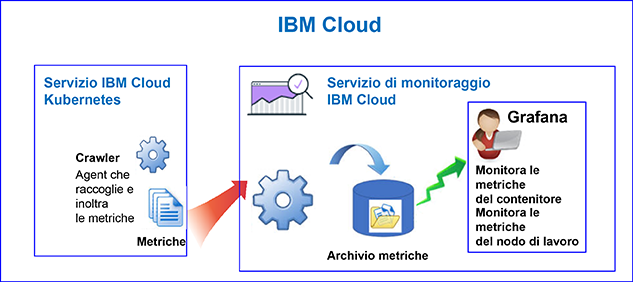
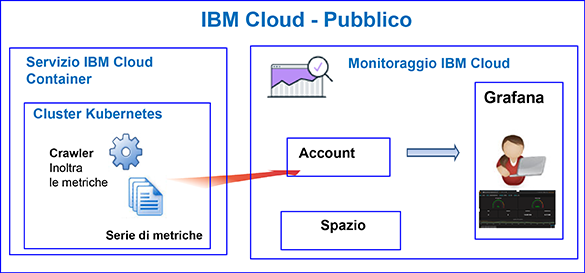

---

copyright:
  years: 2017, 2019

lastupdated: "2019-03-06"

keywords: IBM Cloud, monitoring

subcollection: cloud-monitoring

---

{:new_window: target="_blank"}
{:shortdesc: .shortdesc}
{:screen: .screen}
{:pre: .pre}
{:table: .aria-labeledby="caption"}
{:codeblock: .codeblock}
{:tip: .tip}
{:download: .download}
{:important: .important}
{:note: .note}

# {{site.data.keyword.containershort_notm}}
{: #monitoring_bmx_containers_ov}

In {{site.data.keyword.Bluemix}}, le metriche del cluster vengono raccolte automaticamente. Puoi utilizzare Grafana per monitorare le prestazioni del tuo cluster. 
{:shortdesc}

**Nota:** 

* Le metriche sono raccolte e disponibili per il monitoraggio tramite il servizio {{site.data.keyword.monitoringshort}} per i contenitori in esecuzione in cluster standard.
* Per monitorare le metriche del cluster, devi eseguire il provisioning di un'istanza del servizio di monitoraggio. Per ulteriori informazioni, vedi [Provisioning del servizio di monitoraggio](/docs/services/cloud-monitoring/how-to/provision.html#provision).

## Informazioni sul monitoraggio in Pubblico
{: #public1}

In {{site.data.keyword.Bluemix_notm}}, puoi utilizzare il servizio {{site.data.keyword.monitoringshort}} per archiviare e analizzare le metriche del contenitore e del cluster Kubernetes che vengono raccolte automaticamente da {{site.data.keyword.containershort}} in Pubblico.

In un account, puoi avere 1 o più cluster Kubernetes. Le metriche vengono raccolte automaticamente da {{site.data.keyword.containershort}} non appena viene eseguito il provisioning del cluster.  Le metriche del contenitore vengono raccolte non appena il pod viene distribuito. Le metriche vengono automaticamente inoltrate al servizio {{site.data.keyword.monitoringshort}}:

Quando crei un cluster, le metriche vengono inoltrate al dominio dell'account nel servizio {{site.data.keyword.monitoringshort}}. Per le metriche che devono essere inoltrate al dominio dell'account, il proprietario della chiave {{site.data.keyword.containershort}} deve disporre delle seguenti politiche IAM:

* Politica IAM con autorizzazioni da **editor** per il servizio {{site.data.keyword.monitoringshort}}.
* Politica IAM con autorizzazioni da **amministratore** per {{site.data.keyword.containershort}}.

La seguente figura mostra una visualizzazione di alto livello del monitoraggio per {{site.data.keyword.containershort}}:

Il crawler è un processo che viene eseguito nell'host ed effettua il monitoraggio senza agent delle metriche. Per impostazione predefinita, il crawler raccoglie costantemente le metriche di memoria e CPU da tutti i contenitori.

Per analizzare le metriche in Grafana per un cluster, tieni in considerazione le seguenti informazioni:

* Devi avviare Grafana nella stessa regione pubblica in cui viene eseguito il provisioning dell'istanza {{site.data.keyword.monitoringshort}} che utilizzi per visualizzare le metriche. 
* Puoi utilizzare il dashboard Grafana predefinito **ClusterMonitoringDashboard** per monitorare il tuo cluster.
* Puoi anche configurare dei dashboard Grafana personalizzati per visualizzare i dati della metrica per un cluster nella regione di cloud pubblico in cui è stato creato il cluster.
* Il tuo ID utente deve disporre delle autorizzazioni per visualizzare le metriche. 

    Per visualizzare le metriche nel dominio dell'account, un utente ha bisogno di una politica IAM per il servizio {{site.data.keyword.monitoringshort}}. L'utente ha bisogno delle autorizzazioni da **Visualizzatore**. 

La seguente figura mostra una visualizzazione di alto livello del monitoraggio in Pubblico per {{site.data.keyword.containershort}}. Il cluster inoltra le metriche al dominio dell'account:

## Informazioni sul monitoraggio in Dedicato
{: #dedicated}

In {{site.data.keyword.Bluemix_notm}}, puoi utilizzare il servizio {{site.data.keyword.monitoringshort}} in Pubblico per archiviare e analizzare le metriche del contenitore e del cluster Kubernetes che vengono raccolte automaticamente da {{site.data.keyword.containershort}} in Dedicato.

In un account, puoi avere 1 o più cluster Kubernetes. Le metriche vengono raccolte automaticamente da {{site.data.keyword.containershort}} non appena viene eseguito il provisioning del cluster.  Le metriche del contenitore vengono raccolte non appena il pod viene distribuito. Le metriche vengono automaticamente inoltrate al dominio dell'account del servizio {{site.data.keyword.monitoringshort}}.

Quando crei un cluster, le metriche vengono inoltrate al dominio dell'account nel servizio {{site.data.keyword.monitoringshort}}. Per le metriche che devono essere inoltrate al dominio dell'account, il proprietario della chiave {{site.data.keyword.containershort}} deve disporre delle seguenti politiche IAM:

* Politica IAM con autorizzazioni da **editor** per il servizio {{site.data.keyword.monitoringshort}}.
* Politica IAM con autorizzazioni da **amministratore** per {{site.data.keyword.containershort}}.

Per visualizzare e analizzare le metriche di un cluster in Grafana, tieni conto delle seguenti informazioni:

* Devi avviare Grafana nella stessa regione cloud pubblica in cui è disponibile il cluster in Dedicato. Ad esempio, se viene eseguito il provisioning di un cluster in Dedicato nella regione Stati Uniti Sud, devi avviare Grafana nella regione Stati Uniti Sud in Pubblico.
* Puoi utilizzare il dashboard Grafana predefinito **ClusterMonitoringDashboard** per monitorare il tuo cluster.
* Puoi anche configurare dei dashboard Grafana personalizzati per visualizzare i dati della metrica per un cluster nella regione di cloud pubblico in cui è stato creato il cluster.
* Il tuo ID utente deve disporre di una politica IAM per utilizzare il servizio {{site.data.keyword.monitoringshort}}. Hai bisogno delle autorizzazioni da **Visualizzatore** per visualizzare le metriche nel dominio dell'account.  

La seguente figura mostra una visualizzazione di alto livello del monitoraggio in Dedicato per {{site.data.keyword.containershort}}:

## Contenitori: metriche CPU
{: #cpu_metrics_containers}

La seguente tabella elenca le metriche della CPU che vengono acquisite automaticamente per un contenitore:

| Metrica | Descrizione | Unità |
|----------|---------|---------|
| `cpu.num-cores` | Questa metrica riporta il numero di core CPU disponibili per il contenitore.  Per impostazione predefinita, questa metrica riporta il numero di core nel nodo di lavoro. Se imposti un limite al numero di core disponibili per il contenitore, questa metrica riporta il numero di core che hai impostato in tale limite. | Numero decimale |
| `cpu.usage` | Questa metrica riporta i nanosecondi del tempo CPU in tutti i core.  Quando l'utilizzo della CPU è elevato, puoi notare un ritardo. L'utilizzo elevato della CPU indica un potere di elaborazione insufficiente. | Nanosecondi |
| `cpu.usage-pct` | Questa metrica riporta il tempo CPU utilizzato come percentuale della capacità della CPU.  Per impostazione predefinita, la capacità CPU viene determinata dal numero di core sul nodo di lavoro. Se imposti i limiti alla capacità della CPU del contenitore, questa metrica riporta l'utilizzo della CPU come una percentuale dei limiti che hai impostato. Quando la percentuale dell'utilizzo della CPU è elevata, puoi notare un ritardo. L'utilizzo elevato della CPU indica un potere di elaborazione insufficiente. | Percentuale |
| `cpu.usage-pct-container-requested`  | Questa metrica riporta il tempo CPU utilizzato come percentuale della CPU richiesta del contenitore.  Se non imposti la CPU richiesta di un contenitore, questa metrica non viene esposta per il contenitore. | Percentuale |
{: caption="Metriche della CPU per i contenitori" caption-side="top"} 

## Contenitori: metriche della memoria
{: #memory_metrics}

La seguente tabella elenca le metriche della memoria che vengono acquisite automaticamente:

| Metrica | Descrizione | Unità |
|----------|---------|---------|
| `memory.current` | Questa metrica riporta i byte della memoria che il contenitore sta attualmente utilizzando. | Byte |
| `memory.limit` | Questa metrica riporta il limite di memoria del contenitore. Per impostazione predefinita, i contenitori vengono eseguiti senza limiti di memoria. Un contenitore può utilizzare la quantità di memoria presente sul nodo di lavoro in cui è in esecuzione. Quando distribuisci un pod, puoi impostare dei limiti alla quantità di memoria che i suoi contenitori possono utilizzare.  | Byte |
| `memory.usage-pct` | Questa metrica riporta la memoria utilizzata come una percentuale del limite della memoria del contenitore.  Se imposti i limiti sulla quantità di memoria che un contenitore può utilizzare, questa metrica riporta l'utilizzo della memoria come una percentuale dei limiti che hai impostato. | Percentuale | 
| `memory.working-set` | Questa metrica riporta i byte della memoria attiva che il contenitore sta attualmente utilizzando nella cache warm. | Byte |
{: caption="Metriche della memoria per i contenitori" caption-side="top"} 

## Pod: metriche di rete
{: #network_metrics_pods}

La seguente tabella elenca le metriche di rete correlate alla ricezione dei dati e che vengono acquisite automaticamente:

| Metrica | Descrizione | Unità |
|----------|---------|---------|
| `container.namespace.podName.network.rx.bytes` | Questa metrica riporta il numero di byte che il pod riceve.  | Byte  |
| `container.namespace.podName.network.rx.error` | Questa metrica riporta il numero di errori che il pod ha riscontrato durante la ricezione dei frame. | Numero  |
| `container.namespace.podName.network.rx.packets` | Questa metrica riporta il numero di pacchetti che il pod riceve.  | Numero  |
{: caption="Metriche di rete RX per i pod" caption-side="top"} 

La seguente tabella elenca le metriche di rete correlate alla trasmissione dei dati e che vengono acquisite automaticamente:

| Metrica | Descrizione | Unità |
|----------|---------|---------|
| `container.namespace.podName.network.tx.bytes` | Questa metrica riporta il numero di byte inviati al pod.  | Byte  |
| `container.namespace.podName.network.tx.errors` | Questa metrica riporta il numero di errori che il pod ha riscontrato durante l'invio dei frame.  | Numero  |
| `container.namespace.podName.network.tx.packets` | Questa metrica riporta il numero di pacchetti inviati al pod.  | Numero  |
{: caption="Metriche di rete TX per i pod" caption-side="top"} 

## Nodi di lavoro: metriche del disco
{: #disk_metrics_workers}

La seguente tabella elenca le metriche del disco che vengono acquisite automaticamente per un nodo di lavoro:

| Metrica | Descrizione | Unità |
|----------|---------|---------|
| `worker.disk.diskDevice.read.bytes` | Questa metrica riporta la velocità IO di lettura del dispositivo disco.  | Byte  |
| `worker.disk.diskDevice.read.io` | Questa metrica riporta la velocità effettiva di trasmissione della lettura per il dispositivo.  | Byte al secondo  |
| `worker.disk.diskDevice.read.reads` | Questa metrica riporta la velocità IO di lettura massima del dispositivo disco.  | Byte al secondo  |
| `worker.disk.diskDevice.read.waits` | Questa metrica riporta il tempo di attesa del nodo di lavoro per una richiesta IO di lettura.  | Byte al secondo  |
| `worker.disk.diskDevice.write.bytes` | Questa metrica riporta la velocità IO di scrittura di un dispositivo disco.  | Byte  |
| `worker.disk.diskDevice.write.io` | Questa metrica riporta la velocità effettiva di trasmissione della scrittura per il dispositivo.  | Byte al secondo  |
| `worker.disk.diskDevice.write.writes` | Questa metrica riporta la velocità IO di scrittura massima del dispositivo disco.  | Byte al secondo  |
| `worker.disk.diskDevice.write.waits` | Questa metrica riporta il tempo di attesa del nodo di lavoro per una richiesta IO di scrittura.  | Byte al secondo  |
| `worker.disk.diskDevice.size`| Questa metrica riporta la capacità di archiviazione del dispositivo.  | Byte  |
| `worker.disk.diskDevice.used` | Questa metrica riporta il numero di byte che vengono utilizzati nel dispositivo.  | Byte  |
| `worker.disk.diskDevice.usedpct` | Questa metrica riporta la percentuale di archiviazione utilizzata sul dispositivo.  | Percentuale  |
{: caption="Metriche del disco per i nodi di lavoro" caption-side="top"} 

## Nodi di lavoro: metriche di carico
{: #load_metrics_workers}

La seguente tabella elenca le metriche della CPU che vengono acquisite automaticamente per un nodo di lavoro:

| Metrica | Descrizione | Unità |
|----------|---------|---------|
| `load.avg-1` | Questa metrica riporta il carico della CPU medio per l'host Kubernetes nell'ultimo minuto.  Un carico della CPU medio superiore al numero di core sul nodo di lavoro indica che il traffico all'host è in coda  | Numero  |
| `load.avg-5` | Questa metrica riporta il carico della CPU medio per l'host Kubernetes negli ultimi 5 minuti.  Un carico della CPU medio superiore al numero di core sul nodo di lavoro indica che il traffico all'host è in coda.  | Numero  |
| `load.avg-15` | Questa metrica riporta il carico della CPU medio per l'host Kubernetes negli ultimi 15 minuti.  Un carico della CPU medio superiore al numero di core sul nodo di lavoro indica che il traffico all'host è in coda.  |  Numero |
{: caption="Metriche di carico per i nodi di lavoro" caption-side="top"} 

## Nodi di lavoro: metriche della memoria
{: #memory_metrics_workers}

La seguente tabella elenca le metriche della memoria che vengono acquisite automaticamente per un nodo di lavoro:

| Metrica | Descrizione | Unità |
|----------|---------|---------|
| `memory.available` | Questa metrica riporta i byte di memoria che sono liberi per l'utilizzo di un nodo di lavoro.   | Byte  |
| `memory.used` | Questa metrica riporta i byte della memoria che il nodo di lavoro sta attualmente utilizzando.  | Byte  |
{: caption="Metriche della memoria per i nodi di lavoro" caption-side="top"} 

## Nodi di lavoro: metriche di rete
{: #network_metrics_workers}

La seguente tabella elenca le metriche di rete correlate alla ricezione dei dati e che vengono acquisite automaticamente:

| Metrica | Descrizione | Unità |
|----------|---------|---------|
| `network.interface.rx.bytes` | Questa metrica riporta il numero di byte che vengono ricevuti dal nodo di lavoro nell'interfaccia.  | Byte  |
| `network.interface.rx.errs` | Questa metrica riporta il numero di errori che il nodo di lavoro ha riscontrato durante la ricezione dei frame nell'interfaccia. | Numero |
| `network.interface.rx.packets` | Questa metrica riporta il numero di pacchetti che vengono ricevuti dal nodo di lavoro nell'interfaccia. | Numero |
{: caption="Metriche di rete RX per i nodi di lavoro" caption-side="top"} 

La seguente tabella elenca le metriche di rete correlate alla trasmissione dei dati e che vengono acquisite automaticamente:

| Metrica | Descrizione | Unità |
|----------|---------|---------|
| `network.interface.tx.bytes` | Questa metrica riporta il numero di byte che il nodo di lavoro ha inviato tramite l'interfaccia. | Byte  |
| `network.interface.tx.err` | Questa metrica riporta il numero di errori che il nodo di lavoro ha riscontrato durante l'invio dei frame nell'interfaccia.  | Numero  |
| `network.interface.tx.packets` | Questa metrica riporta il numero di pacchetti che il nodo di lavoro ha inviato tramite l'interfaccia.  | Numero  |
{: caption="Metriche di rete TX per i nodi di lavoro" caption-side="top"} 

La seguente tabella elenca le metriche di rete correlate ai socket aperti e che vengono acquisite automaticamente:

| Metrica | Descrizione | Unità |
|----------|---------|---------|
| `network.sockets.udp`  `network.sockets.udp6`  `network.sockets.tcp`  `network.sockets.tcp6.open` | Questa metrica riporta il numero di socket aperti per un protocollo.   | Numero  |
| `network.sockets.tcp`  `network.sockets.tcp6.timewait` | Questa metrica riporta il numero di socket TCP aperti nello stato `time wait`.  | Numero  |
{: caption="Metriche di rete dei socket per i nodi di lavoro" caption-side="top"} 

## Definizione delle query per monitorare le risorse in un cluster Kubernetes
{: #monitoring_metrics_kube}

Per monitorare le prestazioni dei contenitori e dei nodi di lavoro che vengono distribuiti in un cluster Kubernetes in {{site.data.keyword.Bluemix_notm}}, utilizza Grafana. 

Il servizio {{site.data.keyword.monitoringlong}} utilizza Grafana, una piattaforma di analisi e visualizzazione open source, che puoi utilizzare per monitorare, ricercare, analizzare e visualizzare le tue metriche in vari tipi di grafici, ad esempio, diagrammi e tabelle.

Puoi avviare Grafana da un browser. Per ulteriori informazioni, vedi [Passaggio al dashboard Grafana da un browser web](/docs/services/cloud-monitoring/grafana/navigating_grafana.html#launch_grafana_from_browser).

Per monitorare i contenitori e i nodi di lavoro che vengono eseguiti in un cluster Kubernetes, devi definire una query Grafana per ogni risorsa:

* Per definire una query che monitora una metrica della CPU per un contenitore, consulta [Configurazione delle metriche della CPU per un contenitore in Grafana](/docs/services/cloud-monitoring/containers/config_cpu_containers.html#config_cpu_containers).
* Per definire una query che monitora una metrica della memoria per un contenitore, consulta [Configurazione delle metriche della memoria per un contenitore in Grafana](/docs/services/cloud-monitoring/containers/config_mem_container.html#config_mem_container).
* Per definire una query che monitora una metrica di carico per un nodo di lavoro, consulta [Configurazione delle metriche di carico per un nodo di lavoro in Grafana](/docs/services/cloud-monitoring/containers/config_load_worker.html#config_load_worker).

Il formato della query è differente per tipo di risorsa e di query:

* Per ulteriori informazioni sul formato delle query per monitorare la CPU di un contenitore, consulta [Formato della query della metrica della CPU per un contenitore](/docs/services/cloud-monitoring/reference/metrics_format_containers.html#cpu_containers). 
* Per ulteriori informazioni sul formato delle query per monitorare il carico di un nodo di lavoro, consulta [Formato della query della metrica di carico per un nodo di lavoro](/docs/services/cloud-monitoring/reference/metrics_format_containers.html#load_workers).
* Per ulteriori informazioni sul formato delle query per monitorare la memoria di un contenitore, consulta [Formato della query della metrica della memoria per un contenitore](/docs/services/cloud-monitoring/reference/metrics_format_containers.html#mem_containers).

## Configurazione del traffico di rete per le configurazioni del firewall personalizzato in {{site.data.keyword.Bluemix_notm}}
{: #ports}

Quando hai un ulteriore firewall configurato o devi configurare le impostazioni del firewall nella tua infrastruttura {{site.data.keyword.Bluemix_notm}} (SoftLayer), devi consentire il traffico di rete in uscita dal nodo di lavoro al servizio {{site.data.keyword.monitoringshort}}. 

Devi aprire le porte TCP 443 e TCP 9091 da ogni nodo di lavoro al servizio {{site.data.keyword.monitoringshort}} per i seguenti indirizzi IP nel tuo firewall personalizzato:

<table>
  <tr>
    <th>Regione</th>
    <th>URL di inserimento</th>
	<th>Indirizzi IP pubblici</th>
  </tr>
  <tr>
    <td>Germania</td>
	<td>ingest-eu-fra.logging.bluemix.net</td>
	<td>158.177.88.43  159.122.87.107</td>
  </tr>
  <tr>
    <td>Regno Unito</td>
	<td>ingest.logging.eu-gb.bluemix.net</td>
	<td>169.50.115.113</td>
  </tr>
  <tr>
    <td>Stati Uniti Sud</td>
	<td>ingest.logging.ng.bluemix.net</td>
	<td>169.48.79.236  169.46.186.113</td>
  </tr>
  <tr>
    <td>Sydney</td>
	<td>ingest-au-syd.logging.bluemix.net</td>
	<td>130.198.76.125  168.1.209.20</td>
  </tr>
</table>

## Esercitazioni
{: #tutorial}

Per informazioni su come utilizzare il servizio {{site.data.keyword.monitoringshort}} per monitorare le prestazioni del tuo contenitore, consulta [Analizza le metriche in Grafana per un'applicazione distribuita in un cluster Kubernetes](/docs/services/cloud-monitoring/tutorials/container_service_metrics.html#container_service_metrics).

Per informazioni su come creare un dashboard Grafana nel servizio {{site.data.keyword.monitoringshort}} per monitorare le prestazioni del tuo cluster, consulta [Crea un dashboard Grafana per monitorare un cluster Kubernetes](/docs/services/cloud-monitoring/tutorials/container_grafana_dashboard.html#container_grafana_dashboard).
