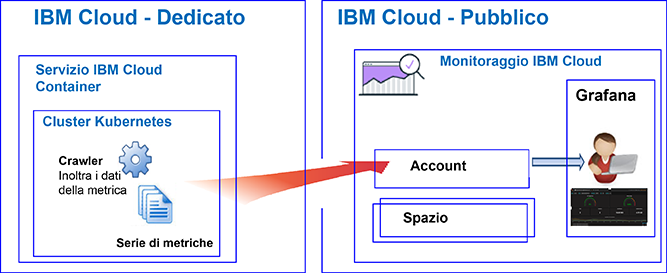
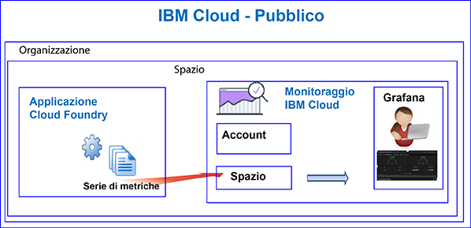

---

copyright:
  years: 2017, 2019

lastupdated: "2019-03-22"

keywords: IBM Cloud, monitoring

subcollection: cloud-monitoring

---

{:new_window: target="_blank"}
{:shortdesc: .shortdesc}
{:screen: .screen}
{:pre: .pre}
{:table: .aria-labeledby="caption"}
{:codeblock: .codeblock}
{:tip: .tip}
{:download: .download}
{:important: .important}
{:note: .note}

# Esercitazione introduttiva
{: #getting-started}

Utilizza questa esercitazione per imparare ad utilizzare il servizio {{site.data.keyword.monitoringlong}} in {{site.data.keyword.cloud_notm}}.
{:shortdesc}

Per impostazione predefinita, {{site.data.keyword.cloud_notm}} offre le funzionalità di monitoraggio integrate per servizi selezionati. Puoi utilizzare il servizio {{site.data.keyword.monitoringlong_notm}} per espandere le tue funzionalità di raccolta e conservazione quando lavori con le metriche e per essere in grado di definire regole e avvisi che ti informano di condizioni che richiedono attenzione. Il servizio {{site.data.keyword.monitoringshort}} offre funzioni che ti forniscono le informazioni dettagliate su come le tue applicazioni stanno eseguendo e utilizzando le risorse e che ti aiutano a identificare rapidamente le tendenze e a rilevare e diagnosticare i problemi, il tutto con tempi di realizzazione immediati e costi di proprietà ridotti. Monitori il tuo ambiente tramite Grafana. 

## Prima di iniziare
{: #gs_prereqs}

Devi disporre di un ID utente che è un membro o un proprietario di un account {{site.data.keyword.cloud_notm}}. Per ottenere un ID utente {{site.data.keyword.cloud_notm}}, vai a: [Registrazione ](https://cloud.ibm.com/login){:new_window}

## Passo 1: scegli una risorsa cloud che desideri monitorare
{: #gs_step1}

In {{site.data.keyword.cloud_notm}}, le applicazioni CF, i contenitori in esecuzione in {{site.data.keyword.containershort}} e i servizi selezionati, raccolgono i dati delle serie di metriche automaticamente e li inoltrano al servizio {{site.data.keyword.monitoringshort}}.

La seguente tabella elenca differenti risorse cloud. Completa l'esercitazione per una risorsa per iniziare ad utilizzare il servizio {{site.data.keyword.monitoringshort}}:

<table>
  <caption>Esercitazioni per iniziare ad utilizzare il servizio {{site.data.keyword.monitoringshort}} </caption>
  <tr>
    <th>Risorsa</th>
    <th>Esercitazione</th>
    <th>Ambiente cloud</th>
    <th>Scenario</th>
  </tr>
  <tr>
    <td>Contenitori in esecuzione su {{site.data.keyword.containershort}}</td>
    <td>[Analizza le metriche in Grafana per un'applicazione distribuita in un cluster Kubernetes](/docs/services/cloud-monitoring/tutorials?topic=cloud-monitoring-container_service_metrics#container_service_metrics)</td>
    <td>Pubblico  Dedicato</td>
    <td></td>
  </tr>
  <tr>
    <td>Applicazioni CF</td>
    <td>[Analizza le metriche in Grafana per un'applicazione CF](/docs/services/cloud-monitoring/tutorials?topic=cloud-monitoring-cfapps_metrics#cfapps_metrics)</td>
    <td>Pubblico</td>
    <td></td>
  </tr>
</table>

## Passo 2: configura le autorizzazioni di un utente per visualizzare le metriche
{: #gs_step2}

Per controllare le azioni di {{site.data.keyword.monitoringshort}} che un utente può eseguire, puoi assegnare i ruoli e le politiche a un utente. 

Esistono due tipi di autorizzazioni di sicurezza in {{site.data.keyword.cloud_notm}} che controllano le azioni che gli utenti possono eseguire quando utilizzano il servizio {{site.data.keyword.monitoringshort}}:

* Ruoli Cloud Foundry (CF): concedi a un utente un ruolo CF per definire le autorizzazioni di cui dispone per visualizzare le metriche in uno spazio.
* Ruoli IAM: concedi a un utente una politica IAM per definire le autorizzazioni di cui dispone per visualizzare le metriche nel dominio dell'account.

Completa la seguente procedura per concedere a un utente le autorizzazioni per visualizzare le metriche in uno spazio:

1. [Accedi alla console {{site.data.keyword.cloud_notm}} ](http://cloud.ibm.com/login){:new_window}
	
	Dopo aver effettuato l'accesso con il tuo ID utente e la tua password, viene aperta la IU {{site.data.keyword.cloud_notm}}.

2. Dalla barra del menu, fai clic su **Gestisci > Account > Utenti**. 

    La finestra *Utenti* visualizza un elenco di utenti con i rispettivi indirizzi email per l'account attualmente selezionato.
	
3. Se l'utente è un membro dell'account, seleziona il nome utente dall'elenco o fai clic su **Gestisci utente** dal menu *Azioni*.

    Se l'utente non è un membro dell'account, consulta [Invito di utenti](/docs/iam?topic=iam-iamuserinv#iamuserinv).

4. Seleziona **Accesso Cloud Foundry** e poi seleziona l'organizzazione.

    Viene visualizzato l'elenco di spazi disponibili in tale organizzazione.

5. Scegli lo spazio in cui hai eseguito il provisioning del servizio {{site.data.keyword.monitoringshort}}. Quindi, dal menu delle azioni, seleziona **Modifica ruolo spazio**.

6. Seleziona *Revisore*. 

    Puoi selezionare 1 o più ruoli dello spazio. Tutti i seguenti ruoli consentono a un utente di visualizzare i log: *Gestore*, *Sviluppatore* e *Revisore*
	
7. Fai clic su **Salva ruolo**.

Per ulteriori informazioni, vedi [Concessione delle autorizzazioni](/docs/services/cloud-monitoring/security?topic=cloud-monitoring-grant_permissions#grant_permissions).

Per verificare che l'utente possa visualizzare i dati della metrica, avvia Grafana nella regione cloud in cui hai completato una delle esercitazioni. Ad esempio, per la regione Stati Uniti Sud, apri un browser web e immetti il seguente URL: [https://metrics.ng.bluemix.net/](https://metrics.ng.bluemix.net/)

Per ulteriori informazioni su come avviare Grafana in altre regioni, vedi [Passaggio a Grafana da un browser web](/docs/services/cloud-monitoring/grafana?topic=cloud-monitoring-navigating_grafana#navigating_grafana).

**Nota:** quando avvii Grafana, se ricevi un messaggio che indica che il *token di connessione non è valido*, controlla le tue autorizzazioni nello spazio. Questo messaggio è un'indicazione che il tuo ID utente non dispone delle autorizzazioni per visualizzare le metriche.
    

## Passi successivi 
{: #gs_next_steps}

Definisci un avviso per una metrica. Per ulteriori informazioni, vedi [Configurazione degli avvisi](/docs/services/cloud-monitoring?topic=cloud-monitoring-config_alerts_ov#config_alerts_ov).
