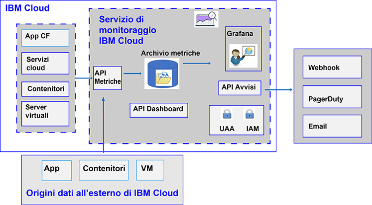

---

copyright:
  years: 2017, 2019

lastupdated: "2019-03-06"

keywords: IBM Cloud, monitoring

subcollection: cloud-monitoring

---

{:new_window: target="_blank"}
{:shortdesc: .shortdesc}
{:screen: .screen}
{:pre: .pre}
{:table: .aria-labeledby="caption"}
{:codeblock: .codeblock}
{:tip: .tip}
{:download: .download}
{:important: .important}
{:note: .note}

# Informazioni su
{: #monitoring_ov}

Usa il servizio {{site.data.keyword.monitoringlong}} per espandere le tue funzionalità di raccolta e conservazione quando lavori con le metriche e per essere in grado di definire regole e avvisi che ti informano di condizioni che richiedono attenzione. Potenzia il team DevOps con le funzioni che ti forniscono informazioni su come le tue applicazioni eseguono e consumano le risorse. Identifica rapidamente le tendenze e rileva e diagnostica i problemi, il tutto con tempi di realizzazione immediati e costi di proprietà ridotti. Utilizza Grafana per monitorare il tuo ambiente. 
{:shortdesc}

La seguente figura mostra una visualizzazione di alto livello delle diverse risorse da cui puoi inviare le metriche al servizio {{site.data.keyword.monitoringshort}} per l'analisi:

{{site.data.keyword.Bluemix}}, per impostazione predefinita, raccoglie e visualizza le metriche per l'utilizzo della CPU, l'utilizzo della memoria e l'I/O di rete per {{site.data.keyword.containershort}}. Puoi utilizzare il servizio {{site.data.keyword.monitoringshort}} in {{site.data.keyword.Bluemix_notm}} per raccogliere e misurare automaticamente le metriche chiave dall'ambiente e dalle applicazioni. Non è richiesta alcuna strumentazione speciale per raccogliere le metriche. Ad esempio, puoi utilizzare le informazioni fornite dalle metriche delle prestazioni per monitorare in che modo un servizio viene eseguito nel cloud, per rilevare colli di bottiglia delle risorse e per controllare lo SLA (Service Level Agreement). Quando analizzi i dati delle prestazioni di un servizio, puoi rilevare delle situazioni che possono causare un collo di bottiglia delle risorse e di conseguenza influire sullo SLA del servizio per i tuoi clienti. Adottando delle azioni tempestive, puoi prevenire situazioni che possono compromettere il tuo business.  

Puoi inviare le metriche per le tue applicazioni CF (Cloud Foundry) e VM (Virtual Machine, macchine virtuali) nel servizio {{site.data.keyword.monitoringshort}}. Per ulteriori informazioni su come inviare le metriche, vedi [Invio di metriche al servizio {{site.data.keyword.monitoringshort}}](/docs/services/cloud-monitoring/send_retrieve_metrics_ov.html#send_retrieve_metrics_ov).

Puoi eseguire il provisioning del servizio {{site.data.keyword.monitoringshort}} tramite il catalogo {{site.data.keyword.Bluemix_notm}}.  

Puoi visualizzare e analizzare le metriche raccolte dal servizio {{site.data.keyword.monitoringshort}} tramite il dashboard {{site.data.keyword.Bluemix_notm}}.  

## Perché utilizzare il servizio di monitoraggio
{: #value}

1. **Dedica meno tempo a strumentare la tua applicazione e più tempo ad aumentarne il valore**

    Il servizio {{site.data.keyword.monitoringlong_notm}} raccoglie automaticamente i dati delle metriche dai servizi {{site.data.keyword.IBM_notm}} Cloud, eliminando la necessità degli agent. Le API consentono di aggiungere metriche personalizzate e di eseguire query nei dati di monitoraggio. 
	
	Il servizio {{site.data.keyword.monitoringlong_notm}} offre la raccolta delle metriche a una volta al minuto.  Il piano Lite conserva le metriche a piena risoluzione per 15 giorni.  Il piano Premium conserva le metriche a piena risoluzione per 45 giorni.

2. **Estendi facilmente il monitoraggio nella tua applicazione con le API**

    Integra i tuoi dati di monitoraggio nelle tue applicazioni e operazioni tramite le API del servizio {{site.data.keyword.monitoringshort}}. Utilizza le API per aggiungere metriche di business e di applicazione pertinenti ai tuoi dati di monitoraggio cloud. Puoi anche utilizzare le API per inviare dati di metrica dall'esterno del cloud {{site.data.keyword.IBM_notm}} nel servizio {{site.data.keyword.monitoringshort}}.

3. **Ottieni informazioni approfondite sul tuo ambiente per rilevare, diagnosticare e individuare rapidamente i problemi**

    Visualizza le prestazioni dell'applicazione e dell'infrastruttura con dei dashboard flessibili e che possono essere personalizzati dall'utente. {{site.data.keyword.monitoringlong_notm}} ti offre la potenza, la flessibilità e la familiarità di Grafana per creare e adattare rapidamente il dashboard alle esigenze di applicazione.
	
4. **Sviluppa dei dashboard riutilizzabili e rendili interattivi**

    Il Grafana ospitato del servizio {{site.data.keyword.monitoringlong_notm}} fornisce il supporto per sviluppare dei dashboard personalizzati con un'ampia gamma di opzioni di visualizzazione.  Rendi i tuoi dashboard dinamici con il templating utilizzando query di metrica con variabili.

5. **Ricevi avvisi**

    Definisci le regole per informarti sulle condizioni che richiedono attenzione. Il servizio {{site.data.keyword.monitoringlong_notm}} offre un'API che puoi utilizzare per impostare le soglie delle prestazioni e per essere avvisato quando le soglie vengono superate. Definisci le regole di avviso per una singola istanza del servizio o istanza dell'applicazione e le regole di avviso che inviano segnalazioni su una serie di istanze. Quando viene attivato un avviso, ottieni una notifica tramite un'email, un evento PagerDuty, una notifica webhook o una qualsiasi combinazione dei tre elementi.

6. **Scegli il piano di servizio adatto alle tue esigenze** 

    Puoi scegliere il piano di servizio Lite o il piano di servizio Premium per soddisfare in modo adeguato le tue esigenze d'uso.  Il piano Lite offre una raccolta di metriche della piattaforma di base e una generazione di avvisi complementare.  In alternativa, puoi selezionare il piano Premium per abilitare un maggiore consumo di metriche con un periodo di conservazione più lungo, per aumentare il numero di avvisi che puoi definire, compresi gli avvisi che inviano segnalazioni su molteplici servizi ed applicazioni, e per ottenere l'accesso alle API dei servizi.

 
## Piani di servizio
{: #plan}

Il servizio {{site.data.keyword.monitoringshort}} fornisce più piani. Ogni piano ha diverse funzionalità di raccolta, conservazione e definizione degli avvisi delle metriche. 

Puoi modificare un piano tramite la IU di {{site.data.keyword.Bluemix_notm}} o attraverso la riga di comando. Puoi aggiornare o ridurre il tuo piano in qualsiasi momento. Per ulteriori informazioni sugli upgrade dei piani di servizio in {{site.data.keyword.Bluemix_notm}}, vedi [Modifica del piano](/docs/services/cloud-monitoring/plan/change_plan.html#change_plan). 

La seguente tabella illustra i piani disponibili quando esegui il provisioning del servizio {{site.data.keyword.monitoringshort}} in uno spazio:

<table>
    <caption>Tabella 1. Riepilogo dei piani per il servizio {{site.data.keyword.monitoringshort}} per spazio.</caption>
      <tr>
        <th>Piano</th>
        <th>Invio di metriche utilizzando l'API</th>
        <th>Periodo di conservazione delle metriche</th>
        <th>Avvisi</th>
		    <th>Metodi di notifica</th>
      </tr>
      <tr>
        <td>Lite (predefinito)</td>
        <td>Non disponibile</td>
        <td>15 giorni</td>
        <td>Puoi definire fino a 10 regole di avviso con singole query della metrica o 1 regola di avviso che include un carattere jolly.</td>
		    <td>Email</td>
      </tr>
      <tr>
        <td>Premium</td>
        <td>Disponibile</td>
        <td>45 giorni</td>
        <td>Puoi definire regole di avviso che includono regole con caratteri jolly.</td>
		    <td>Email, webhook, PagerDuty</td>
      </tr>
</table>

**Nota:** il piano Lite offre le stesse funzioni delle funzionalità di monitoraggio integrate in {{site.data.keyword.Bluemix_notm}}. Il dominio dell'account offre le stesse funzioni del piano Lite.

## Periodo di conservazione delle metriche
{: #metrics_retention}

La seguente tabella riepiloga il periodo di conservazione sulla base del tuo piano di servizio:

<table>
    <caption>Tabella 2. Riepilogo del periodo di conservazione per il servizio {{site.data.keyword.monitoringshort}}.</caption>
      <tr>
        <th>Piano</th>
        <th>Periodo di conservazione</th>
      </tr>
      <tr>
        <td>Lite (predefinito)</td>
        <td>Le metriche vengono archiviate ogni minuto per 15 giorni. (1m:15d)</td>
      </tr>
      <tr>
        <td>Premium</td>
        <td>Le metriche vengono archiviate ogni minuto per 45 giorni. (1m:45d)</td>
      </tr>
</table>

Le metriche che non hanno ricevuto dati per gli ultimi 7 giorni vengono eliminate. Il servizio {{site.data.keyword.monitoringshort}} elimina tutti i dati per un percorso di metrica che sembra essere di natura transitoria identificando le metriche che non sono state scritte negli ultimi 7 giorni. Ad esempio:

* Quando un contenitore viene eliminato, le metriche associate a tale contenitore rimangono per 7 giorni, dopo di che vengono eliminate.
* Se hai un misuratore statsd denominato `<space_id>.test.statsd.gauge-hello` e non scrivi in esso per una settimana, la metrica verrà identificata come transitoria e quindi verrà eliminata insieme a tutte le relative informazioni sulla cronologia. 

## Provisioning del servizio di monitoraggio
{: #provision1}

Nel catalogo {{site.data.keyword.Bluemix_notm}}, puoi trovare il servizio {{site.data.keyword.monitoringshort}} nella sezione **DevOps**. Per ulteriori informazioni sul provisioning di un servizio in {{site.data.keyword.Bluemix_notm}}, consulta [Provisioning del servizio {{site.data.keyword.monitoringshort}}](/docs/services/cloud-monitoring/how-to/provision.html#provision).

Considera le seguenti informazioni sul servizio {{site.data.keyword.monitoringshort}}:

* Puoi eseguire il provisioning solo di una istanza del servizio {{site.data.keyword.monitoringshort}} per spazio.
* Per raccogliere le metriche per le risorse cloud in esecuzione in uno spazio Cloud Foundry, devi eseguire il provisioning del servizio nello stesso spazio in cui sono in esecuzione le risorse.

## Regioni
{: #regions}

Il servizio {{site.data.keyword.monitoringshort}} è disponibile nelle seguenti regioni:

* Germania
* Sydney
* Regno Unito
* Stati Uniti Sud

## URL per il servizio di monitoraggio
{: #region}

Il servizio {{site.data.keyword.monitoringshort}} è disponibile per tutti coloro che dispongono di un ID {{site.data.keyword.Bluemix_notm}} e delle autorizzazioni per utilizzare il servizio in {{site.data.keyword.Bluemix_notm}}.

* Per ogni regione in cui è disponibile il servizio {{site.data.keyword.monitoringshort}}, esiste un insieme diverso di endpoint. 
* Esiste un singolo URL condiviso dagli endpoint API/IU Web e inserimento.
* La porta 443 è una porta TLS utilizzata per accedere alla metriche attraverso l'API e la IU Web (Grafana).

La seguente tabella elenca gli URL per regione:

<table>
  <caption>Elenco di endpoint per lavorare con il servizio {{site.data.keyword.monitoringshort}}</caption>
  <tr>
    <th>Regione</th>
	<th>Endpoint</th>
  </tr>
  <tr>
    <td>Germania</td>
	<td>[https://metrics.eu-de.bluemix.net](https://metrics.eu-de.bluemix.net)</td>
  </tr>
  <tr>
    <td>Sydney</td>
	<td>[https://metrics.au-syd.bluemix.net](https://metrics.au-syd.bluemix.net)</td>
  </tr>
  <tr>
    <td>Regno Unito</td>
	<td>[https://metrics.eu-gb.bluemix.net](https://metrics.eu-gb.bluemix.net)</td>
  </tr>
  <tr>
    <td>Stati Uniti Sud</td>
	<td>[https://metrics.ng.bluemix.net/](https://metrics.ng.bluemix.net/)</td>
  </tr>
</table>

