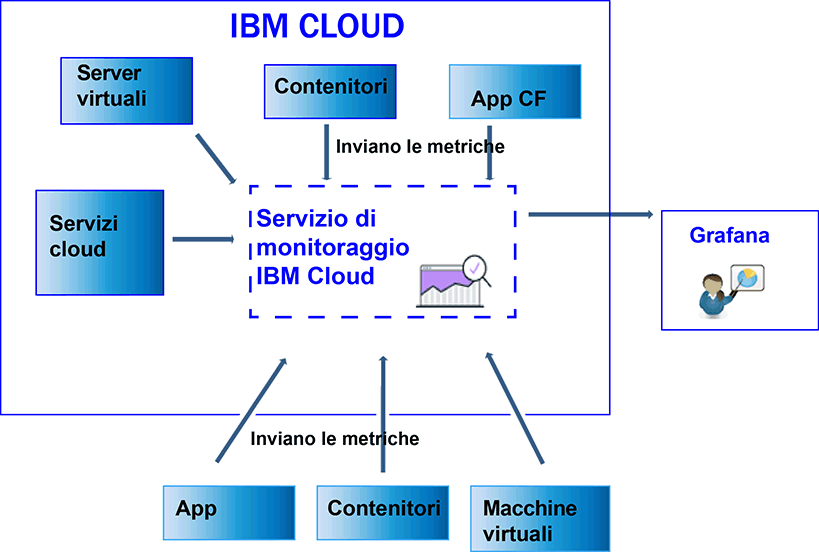

---

copyright:
  years: 2017, 2019

lastupdated: "2019-03-06"

keywords: IBM Cloud, monitoring

subcollection: cloud-monitoring

---

{:new_window: target="_blank"}
{:shortdesc: .shortdesc}
{:screen: .screen}
{:pre: .pre}
{:table: .aria-labeledby="caption"}
{:codeblock: .codeblock}
{:tip: .tip}
{:download: .download}
{:important: .important}
{:note: .note}

# Invio e recupero di dati
{: #send_retrieve_metrics_ov}

Puoi inviare le metriche a uno spazio utilizzando l'API Metriche o configurando il plugin {{site.data.keyword.monitoringshort}}, che è un plugin collectd. Puoi recuperare le metriche utilizzando l'API Metriche.
{:shortdesc}

		
## Invio di metriche
{: #send}

La seguente figura mostra una visualizzazione di alto livello delle diverse origini dati da cui puoi inviare le metriche al servizio {{site.data.keyword.monitoringshort}}:

Per i contenitori in esecuzione in un cluster Kubernetes in {{site.data.keyword.Bluemix_notm}} e per i servizi selezionati, le metriche del sistema di base vengono automaticamente raccolte. 
Puoi anche raccogliere ulteriori metriche o inviarle al di fuori di {{site.data.keyword.IBM_notm}} Cloud, al servizio {{site.data.keyword.monitoringshort}}. Sono disponibili diversi metodi. Le seguenti tabelle elencano i metodi per origine delle metriche:

<table>
  <caption>Tabella 1. Metodi per inviare le metriche al servizio {{site.data.keyword.monitoringshort}} per le risorse {{site.data.keyword.IBM_notm}} Cloud.</caption>
  <tr>
    <th>Origine delle metriche</th>
	<th>API Metriche</th>
    <th>Plugin {{site.data.keyword.monitoringshort}} (collectd)</th>	
	<th>Ulteriori informazioni</th>
  </tr>
  <tr>
    <td>I contenitori in esecuzione in un cluster Kubernetes in {{site.data.keyword.Bluemix_notm}}</td>
	<td>Sì</td>
	<td>Sì</td>
	<td>Le metriche del sistema di base vengono raccolte automaticamente. Puoi installare collectd esplicitamente e inviare metriche personalizzate o avanzate non fornite per impostazione predefinita.</td>
  </tr>
  <tr>
    <td>Applicazioni Cloud Foundry</td>
	<td>Sì</td>
	<td>No</td>
	<td></td>
  </tr>
  <tr>
    <td>Server virtuali </td>
	<td>Sì</td>
	<td>Sì</td>
	<td>**Nota:** non supportato per Windows.</td>
  </tr>
</table>

<table>
  <caption>Tabella 2. Metodi per inviare le metriche al servizio {{site.data.keyword.monitoringshort}} al di fuori di {{site.data.keyword.IBM_notm}} Cloud.</caption>
  <tr>
    <th>Origine delle metriche</th>
	<th>API Metriche</th>
    <th>Plugin {{site.data.keyword.monitoringshort}} (collectd)</th>	
	<th>Ulteriori informazioni</th>
  </tr>
  <tr>
    <td>Contenitori</td>
	<td>Sì</td>
	<td>Sì</td>
	<td>Puoi utilizzare *supervisord* come endpoint del contenitore per eseguire e gestire la tua applicazione e collectd.</td>
  </tr>
  <tr>
    <td>Applicazioni</td>
	<td>Sì</td>
	<td>No</td>
	<td></td>
  </tr>
  <tr>
    <td>Servizi</td>
	<td>Sì</td>
	<td>No</td>
	<td></td>
  </tr>
  <tr>
    <td>Macchine virtuali (VM)</td>
	<td>Sì</td>
	<td>Sì</td>
	<td>**Nota:** non supportato per Windows.</td>
  </tr>
</table>

Per inviare metriche nel servizio {{site.data.keyword.monitoringshort}}, considera le seguenti informazioni: 

* Devi specificare lo spazio a cui desideri inviare le metriche.

* Devi fornire un token di sicurezza o una chiave API per lavorare con il servizio {{site.data.keyword.monitoringshort}}. 

* L'ID {{site.data.keyword.IBM_notm}} dell'utente che invia le metriche deve avere una politica IAM assegnata per il servizio {{site.data.keyword.monitoringshort}}. I seguenti ruoli IAM consentono a un utente di inviare le metriche: *Amministratore*, *Editor* e *Operatore*.

* Devi specificare l'endpoint API a cui stai inviando le metriche. È presente un endpoint per regione. Ad esempio, per la regione Stati Uniti Sud, l'endpoint è il seguente: `https://metrics.ng.bluemix.net/v1/metrics`. Per ulteriori informazioni sugli endpoint, vedi [URL per il servizio {{site.data.keyword.monitoringshort}}](/docs/services/cloud-monitoring/monitoring_ov.html#region){: new_window}.

Puoi inviare metriche al servizio {{site.data.keyword.monitoringshort}} utilizzando uno dei seguenti metodi:

* *Metodo 1: Configura il plugin {{site.data.keyword.monitoringshort}}. *

    Per ulteriori informazioni, vedi [Configurazione del plugin {{site.data.keyword.monitoringshort}}](/docs/services/cloud-monitoring/send-metrics/conf_monitoring_plugin.html#conf_monitoring_plugin).

    La seguente figura mostra una visualizzazione di alto livello di come utilizzare il plugin {{site.data.keyword.monitoringshort}} per inviare le metriche al servizio {{site.data.keyword.monitoringshort}}:

    

* *Metodo 2: Utilizza l'API Metriche. *

    Per ulteriori informazioni, consulta [Invio delle metriche utilizzando l'API Metriche](/docs/services/cloud-monitoring/send-metrics/send_data_api.html#send_data_api).

## Recupero di metriche
{: #retrieve}

Se devi effettuare ulteriori analisi al di fuori del servizio {{site.data.keyword.monitoringshort}} o se la tua applicazione deve utilizzare le metriche per prendere decisioni, puoi utilizzare l'API Metriche per richiamare un massimo di cinque metriche per richiesta. 

* Per ulteriori informazioni su come richiamare le metriche, vedi [Richiamo delle metriche da un dominio](/docs/services/cloud-monitoring/retrieve-metrics/retrieve_data_api.html#retrieve_data_api)
* Per ulteriori informazioni sull'API Metriche, vedi [API Metriche](https://console.bluemix.net/apidocs/927-ibm-cloud-monitoring-rest-api?&language=node#introduction){: new_window}.

Per recuperare le metriche, considera le seguenti informazioni: 

* Devi impostare lo spazio da dove vuoi recuperare i dati. 
* Devi fornire un token di sicurezza o una chiave API per lavorare con il servizio {{site.data.keyword.monitoringshort}}. 
* Devi specificare un percorso a 1 o più metriche. Per ulteriori informazioni, vedi [Definizione delle metriche](/docs/services/cloud-monitoring/retrieve-metrics/retrieve_data_api.html#metrics).
* Facoltativamente, puoi specificare un periodo di tempo personalizzato. Per impostazione predefinita, se non specifichi un periodo di tempo, i dati che recuperi sono quelli corrispondenti alle ultime 24 ore. Per ulteriori informazioni, vedi [Configurazione un periodo di tempo](/docs/services/cloud-monitoring/retrieve-metrics/retrieve_data_api.html#time).

## Elenco delle metriche
{: #show_metrics}

Puoi elencare le metriche disponibili in uno spazio.

Per elencare le metriche, considera le seguenti informazioni: 

* Devi impostare lo spazio {{site.data.keyword.Bluemix_notm}} per cui vuoi elencare le metriche disponibili.

* Devi fornire un token di sicurezza o una chiave API per lavorare con il servizio {{site.data.keyword.monitoringshort}}. 

* Devi specificare una query che definisce il percorso da cui elencare le metriche. Ad esempio, per elencare tutte le metriche in uno spazio, puoi impostare la query: `query=*` 

    Il valore predefinito è `*`, che specifica il punto di inizio al livello root per lo spazio.
	
* Puoi utilizzare la chiamata API `Endpoint/v1/metrics/list` dove Endpoint rappresenta il punto di ingresso del servizio. 

    Ogni regione ha un URL differente. Ad esempio, per la regione Stati Uniti Sud, puoi utilizzare l'endpoint API `https://metrics.ng.bluemix.net/v1/metrics/list` 

    Per ottenere un elenco degli endpoint per regione, consulta [Endpoint](/docs/services/cloud-monitoring/send_retrieve_metrics_ov.html#endpoints).

    Per ulteriori informazioni sull'API, vedi [l'API Metriche](https://console.bluemix.net/apidocs/927-ibm-cloud-monitoring-rest-api?&language=node#introduction){: new_window}.

## Endpoint per inviare le metriche
{: #endpoints}

 La seguente tabella elenca gli endpoint per regione:
	
<table>
    <caption>Elenco degli endpoint</caption>
	<tr>
	  <th>Regione</th>
	  <th>URL</th>
	  <th>porta collectd</th>
	</tr>
	<tr>
	  <td>Germania</td>
	  <td>[https://metrics.eu-de.bluemix.net](https://metrics.eu-de.bluemix.net)</td>
	  <td>9095</td>
	</tr>
	<tr>
	  <td>Sydney</td>
	  <td>[https://metrics.au-syd.bluemix.net](https://metrics.au-syd.bluemix.net)</td>
	  <td>9095</td>
	</tr>
	<tr>
	  <td>Regno Unito</td>
	  <td>[https://metrics.eu-gb.bluemix.net](https://metrics.eu-gb.bluemix.net)</td>
	  <td>9095</td>
	</tr>
	<tr>
	  <td>Stati Uniti Sud</td>
	  <td>[https://metrics.ng.bluemix.net](https://metrics.ng.bluemix.net)</td>
	  <td>9095</td>
	</tr>
</table>

 
