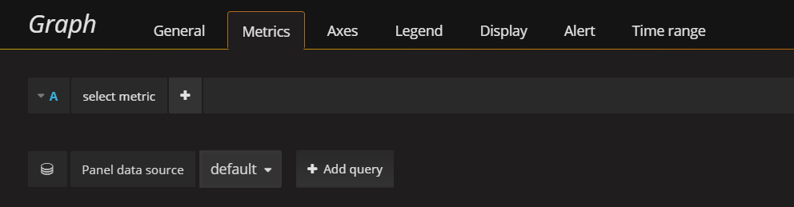

---

copyright:
  years: 2017, 2019

lastupdated: "2019-03-06"

keywords: IBM Cloud, monitoring

subcollection: cloud-monitoring

---

{:new_window: target="_blank"}
{:shortdesc: .shortdesc}
{:screen: .screen}
{:pre: .pre}
{:table: .aria-labeledby="caption"}
{:codeblock: .codeblock}
{:tip: .tip}
{:download: .download}
{:important: .important}
{:note: .note}

# Analizza le metriche in Grafana per un'applicazione CF
{: #cfapps_metrics}

Utilizza questa esercitazione per imparare ad utilizzare il servizio {{site.data.keyword.monitoringlong}} per monitorare le prestazioni di un'applicazione Cloud Foundry (CF) in esecuzione in {{site.data.keyword.Bluemix_notm}} Pubblico. 
{:shortdesc}

## Obbiettivi
{: #objectives}

Impara a ricercare e analizzare le metriche per un'applicazione CF:

1. Distribuisci un'applicazione CF.
2. Avvia Grafana e imposta il dominio {{site.data.keyword.monitoringshort}} in cui puoi visualizzare le metriche dell'applicazione CF.
3. Ricerca e analizza le metriche di un'applicazione CF in esecuzione in uno spazio di {{site.data.keyword.Bluemix_notm}}.

Questa esercitazione presuppone che stai utilizzando la regione Stati Uniti Sud.

## Prerequisiti
{: #cfapps_prereqs}

1. Devi essere un membro o un proprietario di un account {{site.data.keyword.Bluemix_notm}} con le autorizzazioni per eseguire il provisioning dei servizi in uno spazio, distribuire le applicazioni CF ed eseguire le query delle metriche in {{site.data.keyword.Bluemix_notm}} tramite il servizio {{site.data.keyword.monitoringshort}}.

    Il tuo ID utente di {{site.data.keyword.Bluemix_notm}} deve avere un ruolo CF per lo spazio in cui viene eseguito il provisioning dell'applicazione CF e del servizio {{site.data.keyword.monitoringshort}}. Il ruolo richiesto è *sviluppatore*.
    
    Per ulteriori informazioni, consulta [Concessione a un utente di un ruolo CF utilizzando la IU IBM Cloud](/docs/services/cloud-monitoring/security/assign_policy.html#grant_permissions_ui_space).

2. Esegui il provisioning del servizio {{site.data.keyword.monitoringshort}} in uno spazio in cui hai le autorizzazioni per eseguire il provisioning dei servizi nella regione Stati Uniti Sud.

    Per ulteriori informazioni, vedi [Provisioning del servizio {{site.data.keyword.monitoringshort}}](/docs/services/cloud-monitoring/how-to/provision.html#provision).

## Passo 1: concedi le tue autorizzazioni utente per utilizzare la applicazioni CF e il servizio {{site.data.keyword.monitoringshort}}
{: #cfapps_step1}

Per concedere a un utente le autorizzazioni per distribuire le applicazioni CF in uno spazio o per visualizzare le metriche in un dominio dello spazio, devi assegnare a tale utente un ruolo CF che descrive le azioni che può eseguire con il servizio {{site.data.keyword.monitoringshort}} nello spazio e in {{site.data.keyword.Bluemix_notm}}. 

**Nota:** questa esercitazione presuppone che sei il proprietario dell'account o che disponi delle autorizzazioni per aggiungere i ruoli al tuo ID utente. Se non disponi delle autorizzazioni, richiedi al proprietario di completare questa procedura.

Completa la seguente procedura per concedere a un utente le autorizzazioni per completare questa esercitazione:

1. Accedi alla console {{site.data.keyword.Bluemix_notm}}.

    Apri un browser web e avvia il dashboard {{site.data.keyword.Bluemix_notm}}: [http://bluemix.net ](http://bluemix.net){:new_window}
	
	Dopo aver effettuato l'accesso con il tuo ID utente e la tua password, viene aperta la IU {{site.data.keyword.Bluemix_notm}}.

2. Dalla barra del menu, fai clic su **Gestisci > Account > Utenti**. 

    La finestra *Utenti* visualizza un elenco di utenti con i rispettivi indirizzi email per l'account attualmente selezionato.
	
3. Trova il nome utente dall'elenco e fai clic su **Gestisci utente** dal menu *Azioni*.

4. Seleziona **Accesso Cloud Foundry** e poi seleziona **Assegna organizzazione**.

5. Immetti i seguenti valori: 

    <table>
      <caption>Elenco dei valori da selezionare</caption>
      <tr>
        <th>Campo</th>
        <th>Valore</th>
      </tr>
      <tr>
        <td>Organizzazione</td>
        <td>MyOrg</td>
      </tr>
      <tr>
        <td>Ruolo organizzazione</td>
        <td>Nessun ruolo organizzazione</td>
      </tr>
      <tr>
        <td>Regione</td>
        <td>Stati Uniti Sud</td>
      </tr>
      <tr>
        <td>Spazio</td>
        <td>sviluppo</td>
      </tr>
      <tr>
        <td>Ruolo spazio</td>
        <td>sviluppatore</td>
      </tr>
    </table>
	
6. Fai clic su **Salva ruolo**.
 

## Passo 2: distribuisci un'applicazione CF
{: #cfapps_step2}

Completa la seguente procedura dalla console {{site.data.keyword.Bluemix_notm}}:

1. Fai clic su **Catalogo** nella barra degli strumenti {{site.data.keyword.Bluemix_notm}}.

2. Fai clic su **Applicazioni Cloud Foundry > Liberty for Java**. 

3. Immetti le seguenti informazioni:

    * **Nome applicazione**: il nome dell'applicazione. Deve essere univoco.
    * **Regione**: scegli Stati Uniti Sud.
    * **Organizzazione**: scegli l'organizzazione in cui hai eseguito il provisioning del servizio {{site.data.keyword.monitoringshort}}.
    * **Spazio**: scegli lo spazio in cui hai eseguito il provisioning del servizio {{site.data.keyword.monitoringshort}}.

3. Fai clic su **Crea**.

Appena l'applicazione CF è in esecuzione, vengono raccolte e inoltrate le metriche al servizio {{site.data.keyword.monitoringshort}}.

## Passo 3: avvia Grafana e configura il dominio delle metriche
{: #cfapps_step3}

Avvia Grafana da un browser e configura il dominio {{site.data.keyword.monitoringshort}} in cui puoi visualizzare le metriche dell'applicazione CF.

1. Da un browser, avvia Grafana. 

    Immetti l'URL del servizio {{site.data.keyword.monitoringshort}} della regione in cui è stato eseguito il provisioning del servizio {{site.data.keyword.monitoringshort}}.
    
    Per ottenere gli URL per regione, consulta [URL per il servizio di monitoraggio](/docs/services/cloud-monitoring/monitoring_ov.html#region).

    Ad esempio, per la regione Stati Uniti Sud, avvia: [https://metrics.ng.bluemix.net/](https://metrics.ng.bluemix.net/).

2. Configura il dominio {{site.data.keyword.monitoringshort}} in cui puoi visualizzare le metriche del cluster.

    In Grafana, seleziona il tuo ID. Quindi, controlla di essere nell'account corretto e scegli `Domain = space`.

    Verifica che i nomi dell'organizzazione e dello spazio corrispondano a quelli in cui hai distribuito l'applicazione CF ed eseguito il provisioning del servizio {{site.data.keyword.monitoringshort}}.

## Passo 4: crea un dashboard Grafana per monitorare una metrica
{: #cfapps_step4}

Completa la seguente procedura per creare un nuovo dashboard in Grafana:

1. Seleziona il commutatore della barra dei menu laterale .
2. Seleziona **Dashboard**.
3. Fai clic su **Nuovo**

Si aprirà un dashboard. Il dashboard include una riga vuota che è pronta per la configurazione.

In Grafana, aggiungi le righe per dividere il dashboard in sezioni. Una riga raggruppa 1 o più pannelli. In una riga, un pannello è l'unità di visualizzazione più piccola che puoi configurare per visualizzare i dati per una metrica, ad esempio puoi scegliere un pannello grafico o un pannello tabella. Puoi trascinare e rilasciare i pannelli per riorganizzarli in un dashboard. I dati visualizzati da un pannello vengono configurati tramite query. In un pannello, puoi definire una o più query. Ogni query rappresenta una serie di dati diversa. Puoi anche impostare l'intervallo di tempo per un pannello. Normalmente, l'intervallo di tempo è impostato dal selezionatore di tempo del *Dashboard*.

Definisci la query che filtra i dati da visualizzare nel grafico. Questa query monitora la percentuale di utilizzo della CPU verso il limite del contenitore.

Per le informazioni sul formato della query, consulta [Formato della query Grafana per le applicazioni CF](/docs/services/cloud-monitoring/reference/cfapps_metrics_format.html#cfapps_metrics_format).
    
1. Aggiungi un pannello *Grafico* per monitorare i nanosecondi del tempo cpu in tutti i core per un contenitore.
    
    1. Seleziona **Grafico**.
    
    2. Fai clic sul titolo del grafico e quindi seleziona **modifica**.
    
        Si apre la scheda *Metriche*. Qui puoi vedere l'origine dati predefinita.
    
        
    
2. Definisci la query che filtra i dati da visualizzare nel grafico. 
    
    Nella scheda *Metriche*, seleziona **Aggiungi query**.  Viene aggiunta una voce di query. Ogni query viene etichettata con una lettera.
    
    
        
    1. Fai clic su **Seleziona metrica** e scegli l'origine: `ibmcloud`.
    
    2. Fai clic su **Seleziona metrica** e scegli il tipo di cloud: `public`.
    
    3. Fai clic su **Seleziona metrica** e scegli `cloud-foundry`.
    
    4. Fai clic su **Seleziona metrica** e scegli la regione da cui stai lavorando, ad esempio, `us-south` per la regione Stati Uniti Sud.
    
    5. Fai clic su **Seleziona metrica** e scegli il nome dell'applicazione CF, ad esempio, `logtester`.
    
    6. Fai clic su **Seleziona metrica** e scegli l'indice dell'istanza dell'applicazione CF, ad esempio, `0`.

    7. Fai clic su **Seleziona metrica** e scegli `container`.
    
    9. Fai clic su **Seleziona metrica** e scegli una metrica. Per monitorare la *Percentuale di utilizzo della CPU* di un contenitore, scegli `cpu-utilization`.

    10. Fai clic sull'immagine del segno più  e scegli una funzione. Puoi aggiungere una funzione per trasformare, combinare ed eseguire calcoli sui dati disponibili per una metrica.
        
        Ad esempio, puoi aggiungere la funzione **alias(newName)** per aggiungere un alias per una metrica. Questo alias viene utilizzato per stampare una stringa anziché il nome della metrica nella legenda visualizzata nel grafico.
        
        Per aggiungere un alias per la tua metrica, completa la seguente procedura:
        
        1. Fai clic sul simbolo più.
        2. Seleziona **Speciale**. 
        3 Seleziona **alias**.
        4. Immetti una stringa, ad esempio `My sample metric`.
        

## Passo 5: salva il dashboard
{: #cfapps_step5}

Salva il dashboard per un successivo riutilizzo.

1. Fai clic sull'immagine di salvataggio del dashboard .

    

2. Immetti il nome del dashboard.
3. Fai clic su **Salva**.

## Passi successivi
{: #cfapps_next_steps}

Definisci un avviso per una metrica. Per ulteriori informazioni, vedi [Configurazione degli avvisi](/docs/services/cloud-monitoring/config_alerts_ov.html#config_alerts_ov).
