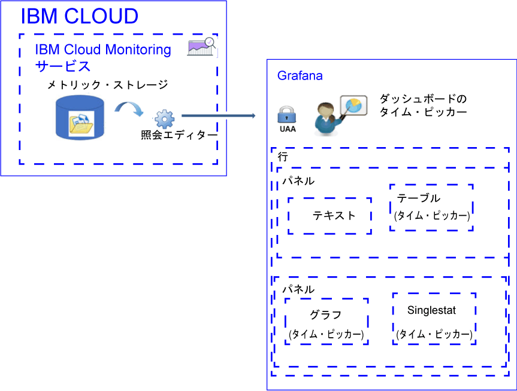

---

copyright:
  years: 2017, 2019

lastupdated: "2019-03-06"

keywords: IBM Cloud, monitoring

subcollection: cloud-monitoring

---

{:new_window: target="_blank"}
{:shortdesc: .shortdesc}
{:screen: .screen}
{:pre: .pre}
{:table: .aria-labeledby="caption"}
{:codeblock: .codeblock}
{:tip: .tip}
{:download: .download}
{:important: .important}
{:note: .note}

# メトリックの分析
{: #analyze_metrics_ov}

{{site.data.keyword.Bluemix}} では、視覚化およびモニターのためのオープン・ソース・プラットフォームである Grafana を使用して、さまざまなグラフ (図表や表など) でメトリックのモニター、検索、分析、および視覚化を行うことができます。 
{:shortdesc}

## コンポーネントの概要
{: #overview}

{{site.data.keyword.monitoringshort}} サービスは、一連のデータをメトリック・ストレージ・データベースに保管します。 照会エディターを通じてこのデータを照会できます。 

Grafana では、メトリック・ストレージ・データベースで使用可能なデータにアクセスするには、{{site.data.keyword.Bluemix_notm}} へのログインに使用するユーザー ID とパスワードで、スペース、組織、および地域にログインする必要があります。 

データを視覚化するには、1 つ以上の行を含むことができるダッシュボードを構成します。 各行で、複数のパネルを定義できます。 

* 行は、ダッシュボード内のパネルをグループ化します。 
* パネルは、メトリックをモニターするための基本的な視覚化リソースです。 
* ダッシュボードに、タグを付けることができ、パネル間でデータを相互に関連付けるために使用できるデータを含むアノテーションを組み込むことができます。

テキスト、グラフ、表、singlestat の各タイプのパネルを定義できます。 それぞれのパネルで、異なるスタイルおよびフォーマット・オプションが提供され、それらはユーザーがカスタマイズできます。 

パネルに表示されるデータの量は、照会と、設定された時刻範囲によって決まります。 ダッシュボード・レベルですべてのパネルに共通の時刻範囲を設定することも、パネルごとに個別の時刻範囲を設定することもできます。

次の図に、Grafana がデータをフィルターに掛けるために {{site.data.keyword.monitoringshort}} サービスから使用するさまざまなコンポーネントと、ユーザーがデータを視覚化して分析するために Grafana で使用できるリソースを示します。

