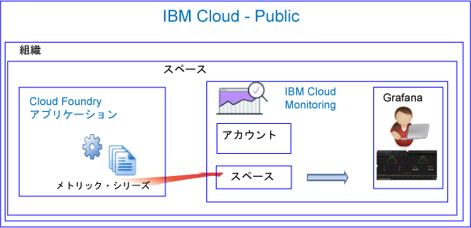

---

copyright:
  years: 2017, 2019

lastupdated: "2019-03-06"

keywords: IBM Cloud, monitoring

subcollection: cloud-monitoring

---

{:new_window: target="_blank"}
{:shortdesc: .shortdesc}
{:screen: .screen}
{:pre: .pre}
{:table: .aria-labeledby="caption"}
{:codeblock: .codeblock}
{:tip: .tip}
{:download: .download}
{:important: .important}
{:note: .note}


# Cloud Foundry アプリ
 {:#monitoring_bluemix_apps}

{{site.data.keyword.Bluemix}} では、Public 地域で実行されている Cloud Foundry (CF) アプリのメトリックは自動的に収集され、{{site.data.keyword.monitoringlong}} サービスに転送されます。 分析に Grafana を使用すると、CF アプリケーションのパフォーマンスをモニターすることができます。 さらに、メトリック API を使用して CF アプリのメトリックを照会し、そのデータに基づいてアクションを実行することができます。
{:shortdesc}


## Public で実行されている CF アプリのモニタリング
{: #public}


{{site.data.keyword.monitoringshort}} サービスを使用して CF アプリをモニターするときは、以下の情報を考慮してください。

* CF アプリが実行されているスペースと同じスペース内に {{site.data.keyword.monitoringshort}} サービスをプロビジョンする必要があります。
* CF アプリについて収集されるメトリックは、{{site.data.keyword.monitoringshort}} サービス内のスペース・ドメインに自動的に転送されます。 
* メトリックは、スペース・ドメインに転送されます。 スペース・ドメインは、CF アプリが実行されているスペース・ドメインに対応します。 
* また、メトリック API を使用してメトリックを照会し、そのデータに基づいてアクションを実行することもできます。 例えば、CF アプリの CPU 使用率を照会し、CPU が高くなってきたらアプリをスケーリングする自動化を作成できます。

以下の図は、{{site.data.keyword.Bluemix_notm}} での CF アプリのモニタリングの概略を示したものです。



## {{site.data.keyword.Bluemix_notm}} の外部で実行されている CF アプリのモニタリング
{: #outside}

{{site.data.keyword.Bluemix_notm}} の外部で実行されている CF アプリをモニターするために、メトリック API を使用して CF アプリのメトリックを {{site.data.keyword.monitoringshort}} サービスに転送することができます。

* API について詳しくは、[メトリック API](https://console.bluemix.net/apidocs/927-ibm-cloud-monitoring-metrics-api?&language=node#introduction) を参照してください。
* API　の使用について詳しくは、[メトリック API を使用したデータの送信](/docs/services/cloud-monitoring/send-metrics/send_data_api.html#send_data_api)を参照してください。


## CF アプリのメトリックの表示および分析
{: #monitoring_cfapps}

{{site.data.keyword.Bluemix_notm}} で CF アプリケーションのパフォーマンスをモニターするには、Grafana を使用します。 

{{site.data.keyword.monitoringlong}} サービスは、Grafana を使用します。Grafana は、さまざまなグラフ (例えば、チャートや表) でメトリックをモニター、検索、分析、および視覚化するために使用できる、分析および視覚化のためのオープン・ソース・プラットフォームです。

Grafana は、ブラウザーから起動できます。 詳しくは、[Web ブラウザーから Grafana ダッシュボードへのナビゲート](/docs/services/cloud-monitoring/grafana/navigating_grafana.html#launch_grafana_from_browser)を参照してください。

**注:** Grafana は、CF アプリ・インスタンスが実行されている {{site.data.keyword.Bluemix_notm}} 地域と同じ地域内で起動する必要があります。


CF アプリケーションをモニターするには、Grafana で 1 つ以上の照会を定義する必要があります。 詳しくは、[Grafana でのメトリック照会の構成](/docs/services/cloud-monitoring/grafana/define_query.html#define_query)を参照してください。 

また、照会にアラートを定義することもできます。 詳しくは、[アラートの構成](/docs/services/cloud-monitoring/config_alerts_ov.html#config_alerts_ov)を参照してください。


## CPU メトリック
{: #cpu_metrics}

各 CF アプリケーションについて自動的に収集されるメトリック・シリーズには、CPU 使用率に関するデータが含まれます。


<table>
  <caption>CF アプリケーションについて収集される CPU メトリック</caption>
  <tr>
    <th>メトリック</th>
    <th>説明</th>
  </tr>
  <tr>
    <td>cpu-utilization</td>
    <td>コンテナーの限度に対する CPU 使用率のパーセンテージ。</td>
  </tr>
</table>


## ディスクのメトリック
{: #disk_metrics}

各 CF アプリケーションについて自動的に収集されるメトリック・シリーズには、使用されているディスク・サイズ、使用可能なディスク・サイズの合計、および使用されているディスクのパーセンテージに関するデータが含まれます。


<table>
  <caption>CF アプリケーションについて収集されるディスク・メトリック</caption>
  <tr>
    <th>メトリック</th>
    <th>説明</th>
  </tr>
  <tr>
    <td>disk-bytes-total</td>
    <td>CF アプリが実行されているコンテナーのディスク・サイズ。 バイト単位で定義された値。</td>
  </tr>
  <tr>
    <td>disk-bytes-used</td>
    <td>CF アプリによってディスク上で使用されているコンテナーのディスク・サイズ。 バイト単位で定義された値。</td>
  </tr>
  <tr>
    <td>disk-utilization</td>
    <td>CF アプリによって使用されているディスクのパーセンテージ。</td>
  </tr>
</table>

**注:** 

* ディスク・サイズは、CF アプリをプッシュするときに指定します。
* disk-utilization が 90% に達したら、CF アプリのスケーリングを検討します。

## メモリーのメトリック
{: #mem_metrics}

各 CF アプリケーションについて自動的に収集されるメトリック・シリーズには、使用されているメモリー、使用可能なメモリーの合計、および使用されているメモリーのパーセンテージに関するデータが含まれます。

<table>
  <caption>CF アプリケーションについて収集されるメモリー・メトリック</caption>
  <tr>
    <th>メトリック</th>
    <th>説明</th>
  </tr>
  <tr>
    <td>memory-bytes-total</td>
    <td>CF アプリで使用可能なメモリー (バイト単位)。</td>
  </tr>
  <tr>
    <td>memory-bytes-used</td>
    <td>CF アプリ・インスタンスによって使用されているメモリー (バイト単位)。</td>
  </tr>
  <tr>
    <td>memory-utilization</td>
    <td>CF アプリによって使用されているメモリーのパーセンテージ。</td>
  </tr>
</table>


## メトリック照会のフォーマット
{: #query_format}


Cloud Foundry アプリケーションをモニターするために Grafana に定義する照会は、以下のフォーマットに準拠している必要があります。 

```
{Source}.{Cloud Type}.{Service Name}.{Region}.{CFapp Name}.{CFapp Index}.{CFapp container}.{Metric Type}.{Metric Subtype}.[Functions]
```
{: codeblock}

例として以下に示す、シドニー地域で logtester という名前の CF アプリ・インスタンスについて収集されるメトリック・シリーズのサンプルをご覧ください。

```
ibmcloud.public.cloud-foundry.au-syd.logtester.0.container.cpu.utilization
ibmcloud.public.cloud-foundry.au-syd.logtester.0.container.disk.bytes-total
ibmcloud.public.cloud-foundry.au-syd.logtester.0.container.disk.bytes-used
ibmcloud.public.cloud-foundry.au-syd.logtester.0.container.disk.utilization
ibmcloud.public.cloud-foundry.au-syd.logtester.0.container.memory.bytes-total
ibmcloud.public.cloud-foundry.au-syd.logtester.0.container.memory.bytes-used
ibmcloud.public.cloud-foundry.au-syd.logtester.0.container.memory.utilization
```
{: screen}

詳細情報については、[CF アプリのメトリックのフォーマット](/docs/services/cloud-monitoring/reference/cfapps_metrics_format.html#cfapps_metrics_format)を参照してください。

**注:** CF アプリ名で使用できる文字のすべてが、メトリック・シリーズ名でも使用できるとは限りません。 例えば、大文字は許可されません。 照会を定義するときに Grafana に表示される CF アプリ名は、すべて小文字に変更されます。


