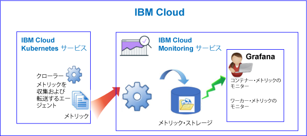
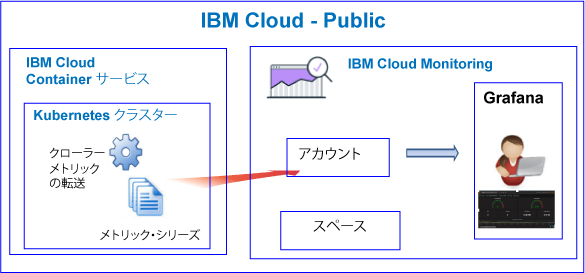
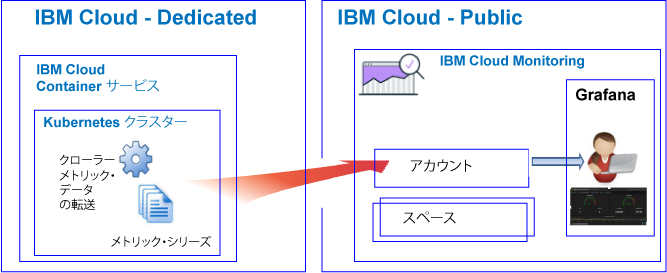

---

copyright:
  years: 2017, 2019

lastupdated: "2019-03-06"

keywords: IBM Cloud, monitoring

subcollection: cloud-monitoring

---

{:new_window: target="_blank"}
{:shortdesc: .shortdesc}
{:screen: .screen}
{:pre: .pre}
{:table: .aria-labeledby="caption"}
{:codeblock: .codeblock}
{:tip: .tip}
{:download: .download}
{:important: .important}
{:note: .note}

# {{site.data.keyword.containershort_notm}}
{: #monitoring_bmx_containers_ov}

{{site.data.keyword.Bluemix}} では、クラスター・メトリックは自動的に収集されます。 Grafana を使用して、クラスターのパフォーマンスをモニターできます 
{:shortdesc}

**注:** 

* 標準クラスターで実行中のコンテナーに関して、メトリックが収集され、{{site.data.keyword.monitoringshort}} サービスでのモニターに使用できます。
* クラスター・メトリックをモニターするには、Monitoring サービスのインスタンスをプロビジョンする必要があります。詳しくは、[Monitoring サービスのプロビジョニング](/docs/services/cloud-monitoring/how-to/provision.html#provision)を参照してください。

## Public でのモニタリングについて
{: #public1}

{{site.data.keyword.Bluemix_notm}} では、Public の {{site.data.keyword.containershort}} によって自動的に収集されるコンテナー・メトリックと Kubernetes クラスター・メトリックを、{{site.data.keyword.monitoringshort}} サービスを使用して保管および分析することができます。

1 つのアカウント内に 1 つ以上の Kubernetes クラスターを持つことができます。 クラスターがプロビジョンされるとすぐに、{{site.data.keyword.containershort}} によってメトリックが自動的に収集されます。  コンテナー・メトリックは、ポッドがデプロイされるとすぐに収集されます。 メトリックは、以下のように {{site.data.keyword.monitoringshort}} サービスに自動的に転送されます。

クラスターを作成すると、メトリックは {{site.data.keyword.monitoringshort}} サービス内のアカウント・ドメインに転送されます。 メトリックがアカウント・ドメインに転送されるためには、{{site.data.keyword.containershort}} キー所有者が次の IAM ポリシーを持っている必要があります。

* {{site.data.keyword.monitoringshort}} サービスの**エディター**権限が設定された IAM ポリシー。
* {{site.data.keyword.containershort}} の**管理者**権限が設定された IAM ポリシー。

以下の図は、{{site.data.keyword.containershort}} のモニタリングの概要図を示しています。

クローラーは、ホストで稼働しているプロセスであり、メトリックのエージェントレス・モニタリングを実行します。 クローラー
は、デフォルトで、すべてのコンテナーから CPU のメトリックおよびメモリーのメトリックを常に収集します。

クラスターのメトリックを Grafana で分析するには、以下の情報を考慮してください。

* メトリックを表示するために使用している {{site.data.keyword.monitoringshort}} インスタンスがプロビジョンされている Public 地域で Grafana を起動する必要があります。 
* デフォルトの Grafana ダッシュボード **ClusterMonitoringDashboard** を使用してクラスターをモニターできます。
* また、カスタム Grafana ダッシュボードを構成して、クラスターが作成されている Cloud Public 地域でクラスターのメトリック・データを視覚化することもできます。
* ユーザー ID はメトリックの表示権限を持っている必要があります。 

    アカウント・ドメイン内のメトリックを表示するには、ユーザーは {{site.data.keyword.monitoringshort}} サービスの IAM ポリシーを持っている必要があります。 ユーザーには**ビューアー**権限が必要です。 

以下の図は、Public での {{site.data.keyword.containershort}} のモニタリングの概略を示しています。 クラスターは、メトリックをアカウント・ドメインに転送します。

## Dedicated でのモニタリングについて
{: #dedicated}

{{site.data.keyword.Bluemix_notm}} では、Public の {{site.data.keyword.monitoringshort}} サービスを使用して、Dedicated で {{site.data.keyword.containershort}} によって自動的に収集されるコンテナー・メトリックと Kubernetes クラスター・メトリックを保管および分析することができます。

1 つのアカウント内に 1 つ以上の Kubernetes クラスターを持つことができます。 クラスターがプロビジョンされるとすぐに、{{site.data.keyword.containershort}} によってメトリックが自動的に収集されます。  コンテナー・メトリックは、ポッドがデプロイされるとすぐに収集されます。 メトリックは、{{site.data.keyword.monitoringshort}} サービスのアカウント・ドメインに自動的に転送されます。

クラスターを作成すると、メトリックは {{site.data.keyword.monitoringshort}} サービス内のアカウント・ドメインに転送されます。 メトリックがアカウント・ドメインに転送されるためには、{{site.data.keyword.containershort}} キー所有者が次の IAM ポリシーを持っている必要があります。

* {{site.data.keyword.monitoringshort}} サービスの**エディター**権限が設定された IAM ポリシー。
* {{site.data.keyword.containershort}} の**管理者**権限が設定された IAM ポリシー。

Grafana でクラスターのメトリックを表示および分析するには、以下の情報を考慮してください。

* Grafana は、クラスターが Dedicated 上で使用可能な Cloud Public 地域で起動する必要があります。 例えば、クラスターが、米国南部の Dedicated 上にプロビジョンされている場合は、米国南部地域の Public 上で Grafana を起動する必要があります。
* デフォルトの Grafana ダッシュボード **ClusterMonitoringDashboard** を使用してクラスターをモニターできます。
* また、カスタム Grafana ダッシュボードを構成して、クラスターが作成されている Cloud Public 地域でクラスターのメトリック・データを視覚化することもできます。
* ユーザー ID は、{{site.data.keyword.monitoringshort}} サービスを処理するために IAM ポリシーを持っている必要があります。 アカウント・ドメイン内でメトリックを表示するためには、**ビューアー**権限が必要です。  

以下の図は、Dedicated での {{site.data.keyword.containershort}} のモニタリングの概略を示しています。

## コンテナー: CPU メトリック
{: #cpu_metrics_containers}

以下の表に、コンテナーに関して自動的に収集される CPU メトリックをリストします。

| メトリック | 説明 | 単位 |
|----------|---------|---------|
| `cpu.num-cores` | このメトリックは、コンテナーに使用可能な CPU コアの数を報告します。  デフォルトで、
このメトリックはワーカー上のコアの数を報告します。 コンテナーで使用可能なコアの数に制限を設定すると、このメトリックはその制限に設定したコアの数を報告します。 | 10 進数 |
| `cpu.usage` | このメトリックは、すべてのコアでの CPU 時間 (ナノ秒) を報告します。  CPU 使用量が大きい場合、遅延が生じることがあります。 CPU 使用量が大きいということは、処理能力が不十分であることを示します。 | ナノ秒 |
| `cpu.usage-pct` | このメトリックは、使用 CPU 時間を、CPU の能力のパーセンテージで報告します。  デフォルトで、CPU の能力はワーカー上のコアの数によって決定されます。 コンテナーの CPU の能力に制限を設定すると、このメトリックは、設定した制限のパーセンテージとして CPU 使用量を報告します。 CPU 使用量のパーセンテージが大きい場合、遅延が生じることがあります。 CPU 使用量が大きいということは、処理能力が不十分であることを示します。 | パーセンテージ |
| `cpu.usage-pct-container-requested`  | このメトリックは、使用 CPU 時間を、コンテナーが要求する CPU に占めるパーセンテージで報告します。  要求された CPU をコンテナーに設定しないと、このメトリックはそのコンテナーに対して公開されません。 | パーセンテージ |
{: caption="コンテナー用の CPU メトリック" caption-side="top"} 

## コンテナー: メモリー・メトリック
{: #memory_metrics}

以下の表に、自動的に収集されるメモリー・メトリックをリストします。

| メトリック | 説明 | 単位 |
|----------|---------|---------|
| `memory.current` | このメトリックは、コンテナーが現在使用しているメモリーのバイト数を報告します。 | バイト |
| `memory.limit` | このメトリックは、コンテナーのメモリー制限を報告します。 デフォルトでは、コンテナーはメモリー制限なしで実行されます。 コンテナーは、そのコンテナーが実行されているワーカー上と同じ量のメモリーを消費できます。 ポッドをデプロイするときに、そのコンテナーが使用できるメモリー量の限度を設定できます。 | バイト |
| `memory.usage-pct` | このメトリックは、使用メモリーを、コンテナーのメモリー制限に占めるパーセンテージとして報告します。  コンテナーが使用できるメモリー容量に制限を設定すると、このメトリック
は、設定した制限のパーセンテージとしてメモリーの使用量を報告します。 | パーセンテージ | 
| `memory.working-set` | このメトリックは、コンテナーがウォーム・キャッシュで現在使用しているアクティブ・メモリーのバイト数を報告します。 | バイト |
{: caption="コンテナー用のメモリーのメトリック" caption-side="top"} 

## ポッド: ネットワーク・メトリック
{: #network_metrics_pods}

以下の表に、自動的に収集される、データの受信に関連するネットワーク・メトリックをリストします。

| メトリック | 説明 | 単位 |
|----------|---------|---------|
| `container.namespace.podName.network.rx.bytes` | このメトリックは、ポッドが受信するバイトの数を報告します。  | バイト  |
| `container.namespace.podName.network.rx.error` | このメトリックは、フレームの受信中にポッドで発生したエラーの数を報告します。 | 数値  |
| `container.namespace.podName.network.rx.packets` | このメトリックは、ポッドが受信するパケットの数を報告します。  | 数値  |
{: caption="ポッド用の RX ネットワーク・メトリック" caption-side="top"} 

以下の表に、自動的に収集される、データの送信に関連するネットワーク・メトリックをリストします。

| メトリック | 説明 | 単位 |
|----------|---------|---------|
| `container.namespace.podName.network.tx.bytes` | このメトリックは、ポッドに送信されるバイトの数を報告します。  | バイト  |
| `container.namespace.podName.network.tx.errors` | このメトリックは、フレームの送信中にポッドで発生したエラーの数を報告します。  | 数値  |
| `container.namespace.podName.network.tx.packets` | このメトリックは、ポッドに送信されるパケットの数を報告します。  | 数値  |
{: caption="ポッド用の TX ネットワーク・メトリック" caption-side="top"} 

## ワーカー: ディスク・メトリック
{: #disk_metrics_workers}

以下の表に、ワーカーに関して自動的に収集されるディスク・メトリックをリストします。

| メトリック | 説明 | 単位 |
|----------|---------|---------|
| `worker.disk.diskDevice.read.bytes` | このメトリックは、ディスク装置の読み取り入出力速度を報告します。  | バイト  |
| `worker.disk.diskDevice.read.io` | このメトリックは、装置の読み取りスループットを報告します。  | バイト/秒  |
| `worker.disk.diskDevice.read.reads` | このメトリックは、ディスク装置の最大読み取り入出力速度を報告します。  | バイト/秒  |
| `worker.disk.diskDevice.read.waits` | このメトリックは、ワーカーが読み取り入出力要求を待機する時間を報告します。  | バイト/秒  |
| `worker.disk.diskDevice.write.bytes` | このメトリックは、ディスク装置の書き込み入出力速度を報告します。  | バイト  |
| `worker.disk.diskDevice.write.io` | このメトリックは、装置の書き込みスループットを報告します。  | バイト/秒  |
| `worker.disk.diskDevice.write.writes` | このメトリックは、ディスク装置の最大書き込み入出力速度を報告します。  | バイト/秒  |
| `worker.disk.diskDevice.write.waits` | このメトリックは、ワーカーが書き込み入出力要求を待機する時間を報告します。  | バイト/秒  |
| `worker.disk.diskDevice.size`| このメトリックは、装置の記憶容量を報告します。  | バイト  |
| `worker.disk.diskDevice.used` | このメトリックは、装置で使用されるバイトの数を報告します。  | バイト  |
| `worker.disk.diskDevice.usedpct` | このメトリックは、装置で使用されるストレージのパーセンテージを報告します。  | パーセンテージ  |
{: caption="ワーカー用のディスク・メトリック" caption-side="top"} 

## ワーカー: ロード・メトリック
{: #load_metrics_workers}

以下の表に、ワーカーに関して自動的に収集される CPU メトリックをリストします。

| メトリック | 説明 | 単位 |
|----------|---------|---------|
| `load.avg-1` | このメトリックは、Kubernetes ホストの過去 1 分間の平均 CPU 負荷を報告します。  ワーカー上のコアの数よりも平均 CPU 負荷が大きい場合は、ホストへのトラフィックにキューイングが発生していることを示します。  | 数値  |
| `load.avg-5` | このメトリックは、Kubernetes ホストの過去 5 分間の平均 CPU 負荷を報告します。  ワーカー上のコアの数よりも平均 CPU 負荷が大きい場合は、ホストへのトラフィックにキューイングが発生していることを示します。  | 数値  |
| `load.avg-15` | このメトリックは、Kubernetes ホストの過去 15 分間の平均 CPU 負荷を報告します。  ワーカー上のコアの数よりも平均 CPU 負荷が大きい場合は、ホストへのトラフィックにキューイングが発生していることを示します。  |  数値 |
{: caption="ワーカーのロード・メトリック" caption-side="top"} 

## ワーカー: メモリー・メトリック
{: #memory_metrics_workers}

以下の表に、ワーカーに関して自動的に収集されるメモリー・メトリックをリストします。

| メトリック | 説明 | 単位 |
|----------|---------|---------|
| `memory.available` | このメトリックは、ワーカーが自由に使用できるメモリーのバイト数を報告します。   | バイト  |
| `memory.used` | このメトリックは、ワーカーが現在使用しているメモリーのバイト数を報告します。  | バイト  |
{: caption="ワーカー用のメモリーのメトリック" caption-side="top"} 

## ワーカー: ネットワーク・メトリック
{: #network_metrics_workers}

以下の表に、自動的に収集される、データの受信に関連するネットワーク・メトリックをリストします。

| メトリック | 説明 | 単位 |
|----------|---------|---------|
| `network.interface.rx.bytes` | このメトリックは、ワーカーがインターフェースで受信したバイトの数を報告します。  | バイト  |
| `network.interface.rx.errs` | このメトリックは、インターフェースでのフレームの受信中にワーカーで発生したエラーの数を報告します。 | 数値 |
| `network.interface.rx.packets` | このメトリックは、ワーカーがインターフェースで受信したパケットの数を報告します。 | 数値 |
{: caption="ワーカー用の RX ネットワーク・メトリック" caption-side="top"} 

以下の表に、自動的に収集される、データの送信に関連するネットワーク・メトリックをリストします。

| メトリック | 説明 | 単位 |
|----------|---------|---------|
| `network.interface.tx.bytes` | このメトリックは、ワーカーがインターフェースから送信したバイトの数を報告します。 | バイト  |
| `network.interface.tx.err` | このメトリックは、インターフェースでのフレームの送信中にワーカーで発生したエラーの数を報告します。  | 数値  |
| `network.interface.tx.packets` | このメトリックは、ワーカーがインターフェースから送信したパケットの数を報告します。  | 数値  |
{: caption="ワーカー用の TX ネットワーク・メトリック" caption-side="top"} 

以下の表に、自動的に収集される、オープン・ソケットに関連するネットワーク・メトリックをリストします。

| メトリック | 説明 | 単位 |
|----------|---------|---------|
| `network.sockets.udp`  `network.sockets.udp6`  `network.sockets.tcp`  `network.sockets.tcp6.open` | このメトリックは、プロトコルのオープン・ソケットの数を報告します。   | 数値  |
| `network.sockets.tcp`  `network.sockets.tcp6.timewait` | このメトリックは、`time wait` 状態になっているオープン TCP ソケットの数を報告します。  | 数値  |
{: caption="ワーカー用のソケット・ネットワーク・メトリック" caption-side="top"} 

## Kubernetes クラスター内のリソースをモニターするための照会の定義
{: #monitoring_metrics_kube}

{{site.data.keyword.Bluemix_notm}} 内の Kubernetes クラスターにデプロイされるコンテナーおよびワーカーのパフォーマンスをモニターするには、Grafana を使用します。 

{{site.data.keyword.monitoringlong}} サービスは、Grafana を使用します。Grafana は、さまざまなグラフ (例えば、チャートや表) でメトリックをモニター、検索、分析、および視覚化するために使用できる、分析および視覚化のためのオープン・ソース・プラットフォームです。

Grafana は、ブラウザーから起動できます。 詳しくは、[Web ブラウザーから Grafana ダッシュボードへのナビゲート](/docs/services/cloud-monitoring/grafana/navigating_grafana.html#launch_grafana_from_browser)を参照してください。

Kubernetes クラスターで実行されているコンテナーおよびワーカーをモニターするには、以下のように各リソースの照会を Grafana に定義する必要があります。

* コンテナーの CPU メトリックをモニターする照会を定義するには、[Grafana でのコンテナーの CPU メトリックの構成](/docs/services/cloud-monitoring/containers/config_cpu_containers.html#config_cpu_containers)を参照してください。
* コンテナーのメモリー・メトリックをモニターする照会を定義するには、[Grafana でのコンテナーのメモリー・メトリックの構成](/docs/services/cloud-monitoring/containers/config_mem_container.html#config_mem_container)を参照してください。
* ワーカーのロード・メトリックをモニターする照会を定義するには、[Grafana でのワーカーのロード・メトリックの構成](/docs/services/cloud-monitoring/containers/config_load_worker.html#config_load_worker)を参照してください。

照会のフォーマットは、リソース・タイプおよび照会のタイプごとに異なります。

* コンテナーの CPU をモニターする照会のフォーマットについて詳しくは、[コンテナーの CPU メトリック照会のフォーマット](/docs/services/cloud-monitoring/reference/metrics_format_containers.html#cpu_containers)を参照してください。 
* ワーカーのロードをモニターする照会のフォーマットについて詳しくは、[ワーカーのロード・メトリック照会のフォーマット](/docs/services/cloud-monitoring/reference/metrics_format_containers.html#load_workers)を参照してください。
* コンテナーのメモリーをモニターする照会のフォーマットについて詳しくは、[コンテナーのメモリー・メトリック照会のフォーマット](/docs/services/cloud-monitoring/reference/metrics_format_containers.html#mem_containers)を参照してください。

## {{site.data.keyword.Bluemix_notm}} のカスタム・ファイアウォール構成に対するネットワーク・トラフィックの構成
{: #ports}

セットアップされた追加ファイアウォールがある場合や、{{site.data.keyword.Bluemix_notm}} インフラストラクチャー (SoftLayer) でファイアウォール設定をカスタマイズした場合は、ワーカー・ノードから {{site.data.keyword.monitoringshort}} サービスへの発信ネットワーク・トラフィックを許可する必要があります。 

カスタマイズしたファイアウォール内の次の IP アドレスに対して、各ワーカーから {{site.data.keyword.monitoringshort}} サービスへ TCP ポート 443 および TCP ポート 9091 を開く必要があります。

<table>
  <tr>
    <th>地域</th>
    <th>取り込み URL</th>
	<th>パブリック IP アドレス</th>
  </tr>
  <tr>
    <td>ドイツ</td>
	<td>ingest-eu-fra.logging.bluemix.net</td>
	<td>158.177.88.43  159.122.87.107</td>
  </tr>
  <tr>
    <td>英国</td>
	<td>ingest.logging.eu-gb.bluemix.net</td>
	<td>169.50.115.113</td>
  </tr>
  <tr>
    <td>米国南部</td>
	<td>ingest.logging.ng.bluemix.net</td>
	<td>169.48.79.236  169.46.186.113</td>
  </tr>
  <tr>
    <td>シドニー</td>
	<td>ingest-au-syd.logging.bluemix.net</td>
	<td>130.198.76.125  168.1.209.20</td>
  </tr>
</table>

## チュートリアル
{: #tutorial}

{{site.data.keyword.monitoringshort}} サービスを使用してコンテナーのパフォーマンスをモニターする方法を学習するには、[Grafana での Kubernetes クラスターにデプロイされたアプリに関するメトリックの分析](/docs/services/cloud-monitoring/tutorials/container_service_metrics.html#container_service_metrics)を参照してください。

クラスターのパフォーマンスをモニターするために {{site.data.keyword.monitoringshort}} サービスで Grafana ダッシュボードを作成する方法を学習するには、[Kubernetes クラスターをモニターするための Grafana ダッシュボードの作成](/docs/services/cloud-monitoring/tutorials/container_grafana_dashboard.html#container_grafana_dashboard)を参照してください。
