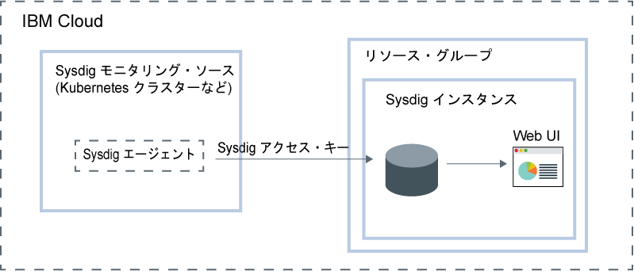
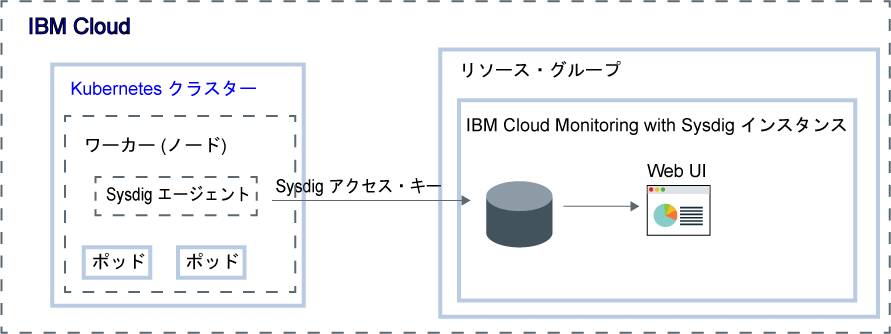

---

copyright:
  years:  2018, 2019
lastupdated: "2019-03-06"

keywords: Sysdig, IBM Cloud, monitoring, getting started

subcollection: Sysdig

---

{:new_window: target="_blank"}
{:shortdesc: .shortdesc}
{:screen: .screen}
{:pre: .pre}
{:table: .aria-labeledby="caption"}
{:codeblock: .codeblock}
{:tip: .tip}
{:download: .download}
{:important: .important}
{:note: .note}

# 入門チュートリアル
{: #getting-started}

{{site.data.keyword.mon_full_notm}} は、{{site.data.keyword.cloud_notm}} アーキテクチャーの一部として組み込むことができる、サード・パーティーのクラウド・ネイティブなコンテナー・インテリジェント管理システムです。 このシステムを使用して、アプリケーション、サービス、およびプラットフォームのパフォーマンスと正常性を可視化して運用できます。 モニター、トラブルシューティング、アラートの定義、カスタム・ダッシュボードの設計のための拡張機能により、管理者、DevOps チーム、開発者のフルスタック・テレメトリーを提供します。 {{site.data.keyword.mon_full_notm}} は、{{site.data.keyword.IBM_notm}} との協力関係のもと、Sysdig によって運用されます。
{:shortdesc}

次の図は、{{site.data.keyword.cloud_notm}} で実行中の {{site.data.keyword.mon_full_notm}} サービスのコンポーネント概要を示しています。

## フィーチャー
{: #features}

**パフォーマンスの問題の診断と解決の迅速化**

{{site.data.keyword.mon_full_notm}} は、サービス・レベルからシステム・レベルまでの幅広いトラブルシューティング機能により、ご使用のインフラストラクチャーとアプリケーションを詳細に可視化します。 事前定義されたダッシュボードとアラートが、潜在的な脅威または問題の特定を容易にします。 {{site.data.keyword.mon_full_notm}} を使用することで、開発者と DevOps チームはパフォーマンスの問題をリアルタイムにモニターしてトラブルシューティングし、エラーの原因を特定して、問題を排除できます。 

**モニタリング・インフラストラクチャーのコストの制御**

{{site.data.keyword.mon_full_notm}} には、{{site.data.keyword.cloud_notm}} 内のモニタリング・インフラストラクチャーのコストの制御に役立つ機能が含まれています。 ユーザーは、パフォーマンスをモニターする対象のメトリック・ソースを構成できます。 事前定義のアラートにより、請求に影響する使用量の変更について警告を出すようにすることができます。 

**ご使用の環境全体の容易な探索と視覚化**

{{site.data.keyword.mon_full_notm}} によって、ご使用の環境を容易に視覚的に探索できます。 動的なトポロジー・マップには、サービス間の依存関係が示されます。 高チャーン、高カーディナリティー、高頻度のメトリックにわたるマルチディメンションの照会が、トラブルシューティングを加速します。 カスタマイズ可能なダッシュボードを使用することで、一番重要な問題を視覚化することができます。 

**動的なマイクロサービス・モニタリングに関する重要な Kubernetes およびコンテナーの洞察を獲得**

{{site.data.keyword.mon_full_notm}} は、すぐに使用可能なダッシュボードと、クラスター、ノード、名前空間、サービス、デプロイメント、ポッドなどについてのアラートを提供する Kubernetes 環境を自動検出します。 ノードごとに単一のエージェントがすべてのマイクロサービスを検出し、Kubernetes、ホスト、ネットワーク、コンテナー、プロセス、アプリケーションや、Prometheus、JMX、StatsD のようなカスタム・メトリックを含むさまざまなソースから、メトリックとイベントを自動収集します。 

**プロアクティブな通知によって異常状態の影響を軽減**

{{site.data.keyword.mon_full_notm}} には、日常的な運用への影響を軽減するために使用できるアラートとマルチチャネル通知が含まれ、異常、ダウン時間、パフォーマンス低下への対応時間が短縮されます。 簡単に構成できる通知チャネルには、*E メール*、*Slack*、*PagerDuty*、*Webhooks*、*OpsGenie*、*VictorOps* などがあります。

## 始める前に
{: #prereqs}

{{site.data.keyword.cloud_notm}} アカウントのメンバーまたは所有者であるユーザー ID が必要です。 {{site.data.keyword.cloud_notm}} ユーザー ID を取得するには、[「登録」](https://cloud.ibm.com/login){:new_window} にアクセスしてください。

このサービスは、現在、米国南部で使用可能です。 米国南部地域での入門ステップを実行します。

## ステップ 1: ユーザー・アクセスの管理
{: #step1}

ご使用のアカウント内の {{site.data.keyword.mon_full_notm}} サービスにアクセスするすべてのユーザーには、IAM ユーザー役割が定義されたアクセス・ポリシーを割り当てる必要があります。 そのポリシーによって、選択したサービスまたはインスタンスのコンテキスト内でユーザーが実行できるアクションが決まります。 許可されるアクションは、サービス上で実行できる操作としてカスタマイズされて定義されます。 その後、操作は IAM ユーザー役割にマップされます。 詳しくは、[{{site.data.keyword.cloud_notm}} でのユーザー・アクセスの管理](/docs/services/Monitoring-with-Sysdig?topic=Sysdig-iam#iam)を参照してください。

{{site.data.keyword.cloud_notm}} で {{site.data.keyword.mon_full_notm}} サービスを使用する権限がユーザーに付与されると、このユーザーには Sysdig 役割が自動的に付与されます。 この役割によって、ユーザーが実行する権限を持つアクションが決まります。 有効な役割は、*Sysdig 管理者*および *Sysdig ユーザー*です。 詳しくは、[Sysdig 役割の {{site.data.keyword.cloud_notm}} 役割へのマップ](/docs/services/Monitoring-with-Sysdig?topic=Sysdig-iam#iam_sysdig)を参照してください。

インスタンスをプロビジョンする前に、以下の情報を考慮してください。
* アカウント所有者は、{{site.data.keyword.cloud_notm}} 内のサービスのインスタンスを作成、表示、および削除でき、{{site.data.keyword.mon_full_notm}} サービスを使用する権限を他のユーザーに付与できます。
* *デフォルト* のリソース・グループのリソースを作成する権限が必要です。
* `administrator` 権限または `editor` 権限を持つ他の {{site.data.keyword.cloud_notm}} ユーザーは、{{site.data.keyword.cloud_notm}} の {{site.data.keyword.mon_full_notm}} サービスを管理できます。 また、これらのユーザーには、インスタンスをプロビジョンする予定のリソース・グループのコンテキスト内でリソースを作成するプラットフォーム権限も必要です。

ユーザーにサービスの管理者役割を付与し、アカウントのリソース・グループ内のインスタンスを管理するには、ユーザーが、リソース・グループのコンテキスト内での**管理者**のプラットフォーム役割とともに、{{site.data.keyword.mon_full_notm}} サービスの IAM ポリシーを持っている必要があります。 

リソース・グループのコンテキスト内で {{site.data.keyword.mon_full_notm}} サービスに対する管理者役割をユーザーに割り当てるには、以下のステップを実行します。 

1. メニュー・バーで**「管理」** &gt; **「アクセス (IAM)」**をクリックして、**「ユーザー」**を選択します。
2. アクセス権限を割り当てる対象のユーザーの行で、**「アクション」**メニューを選択し、**「アクセス権限の割り当て」**をクリックします。
3. **「リソース・グループ内のアクセス権限の割り当て」**を選択します。
4. リソース・グループを選択します。
5. ユーザーに選択したリソース・グループの役割が付与されていない場合は、**「リソース・グループへのアクセス権限の割り当て」**フィールドの役割を選択します。 

    選択した役割に応じて、ユーザーはダッシュボードでのリソース・グループの表示、リソース・グループ名の編集、またはグループへのユーザー・アクセスの管理を行うことができます。 
    
    ユーザーがリソース・グループの {{site.data.keyword.mon_full_notm}} サービスにのみアクセスできるようにするには、**「アクセス権限なし」**を選択します。

6. 「**{{site.data.keyword.mon_full_notm}}**」を選択します。
7. プラットフォーム役割**「管理者」**を選択します。
8. **「割り当て」**をクリックします。

## ステップ 2: {{site.data.keyword.mon_full_notm}} サービスのインスタンスのプロビジョン
{: #step2}

{{site.data.keyword.cloud_notm}} で、モニタリング機能を {{site.data.keyword.mon_full_notm}}に追加するには、{{site.data.keyword.mon_full_notm}} サービスのインスタンスをプロビジョンする必要があります。 

インスタンスをプロビジョンすると、データが第三者に送信されます。
{: tip}

リソース・グループのコンテキスト内でインスタンスをプロビジョンします。 リソース・グループを使用すると、アクセス制御および請求処理の目的でサービスを編成できます。 {{site.data.keyword.mon_full_notm}} インスタンスは、*デフォルト*・リソース・グループまたはカスタム・リソース・グループにプロビジョンできます。

インスタンスをプロビジョンすると、*Sysdig アクセス・キー* と呼ばれる取り込みキーが自動的に取得されます。

{{site.data.keyword.cloud_notm}} UI を使用してインスタンスをプロビジョンするには、以下のステップを実行します。

1. {{site.data.keyword.cloud_notm}} アカウントにログインします。

    [{{site.data.keyword.cloud_notm}} ダッシュボード ](https://cloud.ibm.com/login){:new_window} をクリックして、{{site.data.keyword.cloud_notm}} ダッシュボードを起動します。

	ユーザー ID とパスワードを使用してログインすると、{{site.data.keyword.cloud_notm}} UI が開きます。

2. **「カタログ」**をクリックします。 {{site.data.keyword.cloud_notm}} で使用可能なサービスのリストが開きます。

3. 表示されるサービスのリストをフィルタリングするには、**「開発者用ツール」**カテゴリーを選択します。

4. **「{{site.data.keyword.mon_full_notm}}」**タイルをクリックします。

5. サービス・プランを選択します。 デフォルトでは、**「トライアル」**プランが設定されています。

    サービス・プランについて詳しくは、[料金](/docs/services/Monitoring-with-Sysdig?topic=Sysdig-pricing_plans#pricing_plans)を参照してください。

6. リソース・グループを選択します。 デフォルトでは、**デフォルト**のリソース・グループが設定されています。

7. **「作成」**をクリックして、インスタンスをプロビジョンします。

サービス UI が開きます。

**注:** CLI を使用して Sysdig のインスタンスをプロビジョンするには、[{{site.data.keyword.cloud_notm}} CLI を使用した Sysdig のプロビジョン](/docs/services/Monitoring-with-Sysdig?topic=Sysdig-provision#provision_cli)を参照してください。

## ステップ 3: Sysdig エージェントの構成
{: #step3}

インスタンスをプロビジョンした後に、モニターする各メトリック・ソースの Sysdig エージェントを構成する必要があります。 メトリック・ソースとは、そのパフォーマンスと正常性をモニターして制御する必要があるクラウド・リソースです。 例えば、メトリック・ソースは、Kubernetes クラスターにすることができます。  

Sysdig エージェントは、事前定義メトリックを自動的に収集して報告します。 メトリック・データを収集して、ご使用のインスタンスに転送する Sysdig エージェントを構成するには、*Sysdig アクセス・キー* を使用します。 詳しくは、[アクセス・キーの処理](/docs/services/Monitoring-with-Sysdig?topic=Sysdig-access_key#access_key)を参照してください。

以下のいずれかの環境のための Sysdig エージェントを構成できます。

* Kubernetes、GKE、および OpenShift。
* Docker コンテナーまたはコンテナー化されていないサービス。
* Mesos、Marathon、および DCOS。
* Linux インストール済み環境。

例えば、ご使用の Sysdig インスタンスにメトリックを送信する Kubernetes クラスターを構成するには、ご使用のクラスターの各ノードに `sysdig-agent` ポッドをインストールする必要があります。 Sysdig エージェントは、インストールされているポッドからデータを収集して、ご使用の Sysdig インスタンスに転送します。

Sysdig エージェントのデプロイ方法を学習するには、以下のいずれかのチュートリアルを行います。

| リソース                |	チュートリアル                        | 環境                | シナリオ   |
|-------------------------|---------------------------------|----------------------------|------------|
| {{site.data.keyword.containershort}} で実行されているコンテナー |[Kubernetes クラスターにデプロイされたアプリに関するメトリックの分析](/docs/services/Monitoring-with-Sysdig?topic=Sysdig-kubernetes_cluster#kubernetes_cluster) | {{site.data.keyword.cloud_notm}} (パブリック) |  |
|Linux Ubuntu/Debian | [Ubuntu サーバーのメトリックの分析](/docs/services/Monitoring-with-Sysdig?topic=Sysdig-ubuntu#ubuntu) | オンプレミス |  |
{: caption="表 1. {{site.data.keyword.mon_full_notm}} の入門チュートリアル" caption-side="top"} 

詳しくは、[Sysdig エージェントの構成](/docs/services/Monitoring-with-Sysdig?topic=Sysdig-config_agent#config_agent)および [Sysdig エージェントの削除](/docs/services/Monitoring-with-Sysdig?topic=Sysdig-remove#remove)を参照してください。

Sysdig エージェントのデプロイ後は、メトリックの収集と転送が自動化されます。 Sysdig エージェントは、事前定義メトリックを自動的に収集して報告します。 環境でモニターするメトリックを構成することもできます。 カスタム・メトリックのデータも自動的に収集されます。

## ステップ 4: Web UI の起動
{: #step4}

{{site.data.keyword.Bluemix}} で {{site.data.keyword.mon_full_notm}} サービスのインスタンスをプロビジョンし、ノードの Sysdig エージェントを構成した後に、サービスの Web UI を使用してデータを表示、モニター、および管理できます。

{{site.data.keyword.cloud_notm}} UI から Sysdig インスタンスのコンテキスト内で Web UI を起動します。 

Sysdig Web UI を起動するには、以下のステップを実行します。

1. {{site.data.keyword.cloud_notm}} アカウントにログインします。

    [{{site.data.keyword.cloud_notm}} ダッシュボード ](https://cloud.ibm.com/login){:new_window} をクリックして、{{site.data.keyword.cloud_notm}} ダッシュボードを起動します。

	ユーザー ID とパスワードを使用してログインすると、{{site.data.keyword.cloud_notm}} ダッシュボードが開きます。

2. ナビゲーション・メニューで、**「プログラム識別情報」**を選択します。 

3. **「モニタリング」**を選択します。 

    {{site.data.keyword.cloud_notm}} で使用可能なモニタリング・インスタンスのリストが表示されます。

4. インスタンスを 1 つ選択します。 次に、**「Sysdig の表示 (View Sysdig)」**をクリックします。

{{site.data.keyword.mon_full_notm}} Web UI が開きます。 デフォルトでは、*「探索」*タブが表示されます。

デフォルトでは、ユーザーが、{{site.data.keyword.mon_full_notm}} インスタンスごとに事前定義されている**モニター操作**チームのメンバーとして自動的に追加されます。 ユーザーには、Web UI のすべてのデータを表示する完全な権限があります。 **注:** 管理者は、チームのユーザーを管理し、表示可能なデータを制御して、データへのアクセスを制限できます。 例えば、管理者は限定された有効範囲と可視性を持つデフォルト・チームを作成して、ユーザーの表示権限を制限できます。 その後、ユーザーを他のチームに手動で割り当てます。 詳しくは、[チームの処理](/docs/services/Monitoring-with-Sysdig?topic=Sysdig-teams#teams)を参照してください。

## ステップ 5: 環境のモニター
{: #step5}

Web UI の*「探索」*タブおよび*「ダッシュボード」*タブでデータを分析できます。 メトリック・ビューおよびダッシュボードを使用してデータをモニターします。 

* メトリック・ビューを使用して、個々のメトリックをモニターします。
* ダッシュボードを使用して、パネルでデータをモニターすることにより、ネットワーク・データ、アプリケーション・データ、トポロジー、サービス、ホストおよびコンテナーを専門的に洞察します。 パネルでは、メトリックまたはメトリックのグループがダッシュボードに表示されます。
{: tip}

*「探索」*タブで、デフォルトのメトリックとデフォルトのダッシュボードを使用して、データをモニターできます。 ラベルを使用すると、新しいインフラストラクチャー・グループを定義し、その後、これらのグループを使用してデータを異なる方法で集約し、環境をモニターできます。 また、*「ダッシュボード」*タブを介して定義したカスタム・ダッシュボードを使用することもできます。

*「ダッシュボード」*タブでは、デフォルトのダッシュボードのいずれかを使用するか、または新しいダッシュボードを作成して、データをモニターできます。

詳しくは、[環境のモニタリング](/docs/services/Monitoring-with-Sysdig?topic=Sysdig-monitoring#monitoring)を参照してください。

## ステップ 6: データの管理
{: #step6}

ラベルを使用してインフラストラクチャー・リソースを論理階層にグループ化し、データをフィルターで除外して、集合データをセグメントに分割できます。 メトリックのグラフを構成したり、アラートを作成したりする場合にデータが集計される方法をカスタマイズします。 データ・ポイントをフィルターで除外するダッシュボード、パネル、またはアラートの有効範囲を設定します。 ユーザーのチームからのデータ・アクセスを管理して、データへのアクセスを制限します。 

例えば、メトリック・ビューに対して、データの有効範囲、データの集約方法、およびデータに適用される時間フィルターとグループ・フィルターを定義できます。 

詳しくは、[データの管理](/docs/services/Monitoring-with-Sysdig?topic=Sysdig-manage#manage)を参照してください。

## 次のステップ: アラートの構成とイベントの探索
{: #next}

イベントを使用して、問題を確認、追跡、および解決できます。 イベントとは、{{site.data.keyword.mon_full_notm}} インスタンスにデータを転送するいずれかのノード内で発生した何らかの動作について知らせる通知です。 

イベントには、さまざまなタイプがあります。 

* *アラート・イベント* は、ユーザーが構成したアラートによってトリガーされるイベントです。 例えば、注意が必要な問題を通知するアラートを構成します。 詳しくは、[アラートの処理](/docs/services/Monitoring-with-Sysdig?topic=Sysdig-monitoring#monitoring_alerts)を参照してください。
* *インフラストラクチャー・ベース・イベント* は、Docker ノードおよび Kubernetes ノードから収集されるイベントです。 デフォルトでは、Sysdig エージェントは選択したイベントのグループから自動的にデータを検出し、収集します。 エージェント構成ファイルを編集して、さらにイベントを有効にすることができます。
* 統合 (Slackbot、事前に構築された Python スクリプト、カスタム・ユーザーによって作成された Python スクリプト、または cURL 要求) のいずれかを介して構成する*カスタム・イベント*。

アラートを定義する場合、通知をトリガーする条件、通知に使用する必要がある 1 つ以上の通知チャネル、アラートの重大度、およびアラートのタイプを定義する必要があります。 

Web UI の*「設定」*セクションで 1 つ以上の通知チャネルを構成します。 有効な通知チャネルは、*E メール*、*Slack*、*PagerDuty*、*Webhooks*、*OpsGenie*、および *VictorOps* です。 詳しくは、[通知チャネルの処理](/docs/services/Monitoring-with-Sysdig?topic=Sysdig-notifications#notifications)を参照してください。

Web UI の*「アラート (Alerts)」*セクションには、事前定義されたアラートのリストが表示されます。 このビューで、事前定義されたアラートの有効化と無効化、既存のアラートの変更、および新しいアラートの作成を行うことができます。 詳しくは、[Working with alerts ](https://sysdigdocs.atlassian.net/wiki/spaces/Monitor/pages/205324292/Alerts){:new_window} を参照してください。

次に、[Working with custom events ](https://sysdigdocs.atlassian.net/wiki/spaces/Monitor/pages/222822463/Custom+Events){:new_window} を探索します。

