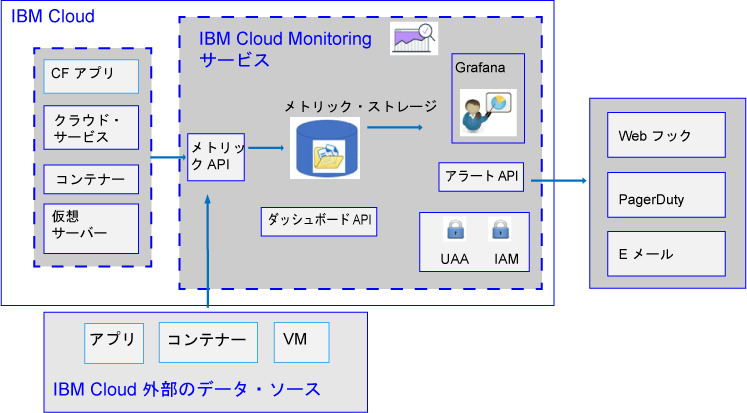

---

copyright:
  years: 2017, 2019

lastupdated: "2019-03-06"

keywords: IBM Cloud, monitoring

subcollection: cloud-monitoring

---

{:new_window: target="_blank"}
{:shortdesc: .shortdesc}
{:screen: .screen}
{:pre: .pre}
{:table: .aria-labeledby="caption"}
{:codeblock: .codeblock}
{:tip: .tip}
{:download: .download}
{:important: .important}
{:note: .note}

# 概要
{: #monitoring_ov}

{{site.data.keyword.monitoringlong}} サービスを使用して、メトリックを処理する際の収集機能と保存機能を拡張し、注意が必要な状態を通知するルールとアラートの定義を可能にします。 アプリのパフォーマンスとリソース消費に関する洞察を提供する機能によって DevOps チームを支援します。 迅速なトレンドの特定、問題の検出と診断、これらをすべて、即時評価と低い総所有コストで実行します。 Grafana を使用してご使用環境をモニターします。 
{:shortdesc}

以下の図は、{{site.data.keyword.monitoringshort}} サービスにメトリックを分析のために送信できるさまざまなリソースの概要図を示しています。

{{site.data.keyword.Bluemix}} は、デフォルトで、{{site.data.keyword.containershort}} の CPU 使用量、メモリー使用量、およびネットワーク入出力のメトリックを収集して表示します。 {{site.data.keyword.Bluemix_notm}} で {{site.data.keyword.monitoringshort}} サービスを使用すると、ご使用の環境およびアプリケーションから主要メトリックを自動的に収集し、測定することができます。 メトリックの収集には、特別な計測装置は必要ありません。 例えば、パフォーマンス・メトリックによって提供される情報を使用して、サービスがクラウドでどのように稼働しているのかをモニターしたり、リソースのボトルネックを検出したり、SLA (Service Level Agreement) を監視したりできます。 サービスのパフォーマンス・データを分析している時、リソースのボトルネックを引き起こし、結果的にクライアントへのサービス SLA に影響する可能性のある状況を検出できます。 早期に処置することで、業務に悪影響を与える可能性のある状況を防止できます。  

ご使用の Cloud Foundry (CF) アプリケーションおよび仮想マシン (VM) のメトリックを {{site.data.keyword.monitoringshort}} サービスに送信できます。 メトリックの送信方法について詳しくは、[{{site.data.keyword.monitoringshort}} サービスへのメトリックの送信](/docs/services/cloud-monitoring?topic=cloud-monitoring-send_retrieve_metrics_ov#send_retrieve_metrics_ov)を参照してください。

{{site.data.keyword.Bluemix_notm}} カタログを通じて {{site.data.keyword.monitoringshort}} サービスをプロビジョンできます。  

{{site.data.keyword.monitoringshort}} サービスによって収集されたメトリックを {{site.data.keyword.Bluemix_notm}} ダッシュボードを使用して表示および分析できます。  

## なぜ Monitoring サービスを使用するか
{: #value}

1. **アプリケーションの装備の時間を削減し、その価値の強化により多くの時間を費やす**

    {{site.data.keyword.monitoringlong_notm}} サービスは、{{site.data.keyword.IBM_notm}} Cloud サービスからメトリック・データを自動的に収集するため、エージェントは必要ありません。 API を使用すると、カスタム・メトリックの追加やモニタリング・データの照会を簡単に行えます。 
	
	{{site.data.keyword.monitoringlong_notm}} サービスは、毎分 1 回のメトリック収集を提供します。  ライト・プランでは、メトリックを完全な分解能で15 日間保持します。  プレミアム・プランでは、メトリックを完全な分解能で 45 日間保持します。

2. **API により、アプリケーションへのモニタリングの拡張が容易になる**

    {{site.data.keyword.monitoringshort}} サービスの API を介して、モニタリング・データをアプリケーションおよび操作に統合します。 API を使用して、関連するアプリケーション・メトリックおよびビジネス・メトリックを Cloud Monitoring データに追加します。 API を使用すると、メトリック・データを {{site.data.keyword.IBM_notm}} Cloud の外部から  {{site.data.keyword.monitoringshort}} サービスに送信することもできます。

3. **環境についての洞察を得て、問題を迅速に検出、診断、特定する**

    柔軟で、ユーザーによるカスタマイズが可能なダッシュボードにより、アプリケーションおよびインフラストラクチャーのパルスを視覚化します。 {{site.data.keyword.monitoringlong_notm}} は、強力で柔軟性があり、使いやすい Grafana を提供することにより、ダッシュボードを素早く構築し、アプリケーションのニーズに適応できるようにします。
	
4. **再使用可能なダッシュボードを構築し、対話式にする**

    {{site.data.keyword.monitoringlong_notm}} サービスでホストされている Grafana は、多数の視覚化オプションを持つカスタム・ダッシュボードの構築をサポートします。  変数を含むメトリック照会を使用して、テンプレート作成によりダッシュボードを動的にします。

5. **アラートを受信する**

    注意を要する状態をユーザーに通知するためのルールを定義します。 {{site.data.keyword.monitoringlong_notm}} サービスは、パフォーマンスしきい値を設定し、それらのしきい値に違反した場合に通知を受け取るために使用できる API を提供します。 単一のサービス・インスタンスまたはアプリ・インスタンスのアラート・ルール、および一連のインスタンスについて報告するアラート・ルールを定義します。 アラートがトリガーされたときに、E メールによる通知、PagerDuty イベント、Webhook 通知、またはその 3 つからの任意の組み合わせを受け取ります。

6. **ニーズに適合するサービス・プランを選択する** 

    使用のニーズに適合するように、ライト・サービス・プランまたはプレミアム・サービス・プランを選択できます。  ライト・プランは、基本的なプラットフォーム・メトリック収集と、補足のアラート機能を提供します。  あるいは、プレミアム・プランを選択することもできます。このプランを選択すると、保持する期間をより長くしてさらに多くのメトリックを使用したり、より多くのアラート (複数のサービスおよびアプリに関して報告するアラートなど) を定義したり、サービスの API にアクセスしたりすることが可能になります。

 
## サービス・プラン
{: #plan}

{{site.data.keyword.monitoringshort}} サービスでは、複数のプランが用意されています。 各プランは、異なるメトリック収集、保存、およびアラート定義の機能を持っています。 

プランは、{{site.data.keyword.Bluemix_notm}} UI またはコマンド・ラインを介して変更できます。 プランのアップグレード、またはライト・プランへの切り替えは、いつでも実行できます。 {{site.data.keyword.Bluemix_notm}} でのサービス・プランのアップグレードについて詳しくは、[プランの変更](/docs/services/cloud-monitoring/plan?topic=cloud-monitoring-change_plan#change_plan)を参照してください。 

以下の表は、スペースに {{site.data.keyword.monitoringshort}} サービスをプロビジョンする場合に使用可能なプランの概要を示しています。

<table>
    <caption>表 1. スペースごとの {{site.data.keyword.monitoringshort}} サービスのプランの要約</caption>
      <tr>
        <th>プラン</th>
        <th>API を使用したメトリックの送信</th>
        <th>メトリック保存期間</th>
        <th>アラート</th>
		    <th>通知方法</th>
      </tr>
      <tr>
        <td>ライト (デフォルト)</td>
        <td>利用不可</td>
        <td>15 日</td>
        <td>最大 10 個のアラート・ルールを単一メトリック照会と共に定義することも、ワイルドカードを含む 1 つのアラート・ルールを定義することもできます。</td>
		    <td>E メール</td>
      </tr>
      <tr>
        <td>プレミアム</td>
        <td>利用可能</td>
        <td>45 日間</td>
        <td>ワイルドカードを使用したルールを含め、アラート・ルールを定義できます。</td>
		    <td>E メール、Webhook、PagerDuty</td>
      </tr>
</table>

**注:** ライト・プランは、{{site.data.keyword.Bluemix_notm}} の統合モニタリング機能と同じ機能を提供します。 アカウント・ドメインはライト・プランと同じ機能を提供します。

## メトリック保存期間
{: #metrics_retention}

以下の表に、サービス・プランに基づく保存期間を要約します。

<table>
    <caption>表 2. {{site.data.keyword.monitoringshort}} サービスの保存期間の要約</caption>
      <tr>
        <th>プラン</th>
        <th>保存期間</th>
      </tr>
      <tr>
        <td>ライト (デフォルト)</td>
        <td>メトリックは、15 日間毎分保管されます。 (1m:15d)</td>
      </tr>
      <tr>
        <td>プレミアム</td>
        <td>メトリックは、45 日間毎分保管されます。 (1m:45d)</td>
      </tr>
</table>

直近 7 日間にデータを受けとらなかったメトリックは削除されます。 {{site.data.keyword.monitoringshort}} サービスは、過去 7 日間書き込まれていないメトリックを識別することにより、事実上一時的と思われるメトリック・パスの全データを削除します。 以下に例を示します。

* コンテナーが削除されると、そのコンテナーに関連付けられたメトリックは 7 日間存在し、その後、それらのメトリックは削除されます。
* `<space_id>.test.statsd.gauge-hello` という名前の statsd ゲージがあり、それに 1 週間書き込まないと、メトリックは一時的と見なされ、そのメトリックはすべての履歴情報と共に削除されます。 

## Monitoring サービスのプロビジョニング
{: #provision1}

{{site.data.keyword.Bluemix_notm}} カタログの **DevOps** セクションに {{site.data.keyword.monitoringshort}} サービスがあります。 {{site.data.keyword.Bluemix_notm}} でのサービスのプロビジョニングについて詳しくは、[{{site.data.keyword.monitoringshort}} サービスのプロビジョニング](/docs/services/cloud-monitoring/how-to?topic=cloud-monitoring-provision#provision)を参照してください。

{{site.data.keyword.monitoringshort}} サービスに関する以下の情報を考慮してください。

* プロビジョンできる {{site.data.keyword.monitoringshort}} サービスのインスタンスは 1 つのスペースにつき 1 つのみです。
* Cloud Foundry スペース内で実行されているクラウド・リソースのメトリックを収集するには、リソースが実行されているスペースと同じスペース内にこのサービスをプロビジョンする必要があります。

## 地域
{: #regions}

{{site.data.keyword.monitoringshort}} サービスは、以下の地域で使用可能です。

* ドイツ
* シドニー
* 英国
* 米国南部

## Monitoring サービスの URL
{: #region}

{{site.data.keyword.monitoringshort}} サービスは、{{site.data.keyword.Bluemix_notm}} ID を持ち、かつ {{site.data.keyword.Bluemix_notm}} でこのサービスを使用して処理を行う権限を持つユーザーであれば、誰でも使用できます。

* {{site.data.keyword.monitoringshort}} サービスが利用可能な地域ごとに、別々のエンドポイント・セットがあります。 
* INGEST および API/Web UI のエンドポイントによって共有される単一 URL があります。
* ポート 443 は、API および Web UI (Grafana) を介してメトリックにアクセスするために使用される TLS ポートです。

以下の表は、地域ごとの URL を示しています。

<table>
  <caption>表 3. {{site.data.keyword.monitoringshort}} サービスを処理するためのエンドポイントのリスト</caption>
  <tr>
    <th>地域</th>
	<th>エンドポイント</th>
  </tr>
  <tr>
    <td>ドイツ</td>
	<td>[https://metrics.eu-de.bluemix.net](https://metrics.eu-de.bluemix.net)</td>
  </tr>
  <tr>
    <td>シドニー</td>
	<td>[https://metrics.au-syd.bluemix.net](https://metrics.au-syd.bluemix.net)</td>
  </tr>
  <tr>
    <td>英国</td>
	<td>[https://metrics.eu-gb.bluemix.net](https://metrics.eu-gb.bluemix.net)</td>
  </tr>
  <tr>
    <td>米国南部</td>
	<td>[https://metrics.ng.bluemix.net/](https://metrics.ng.bluemix.net/)</td>
  </tr>
</table>

