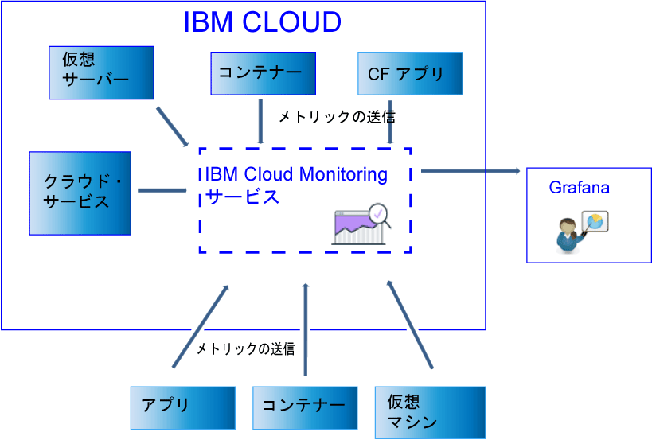

---

copyright:
  years: 2017, 2019

lastupdated: "2019-03-06"

keywords: IBM Cloud, monitoring

subcollection: cloud-monitoring

---

{:new_window: target="_blank"}
{:shortdesc: .shortdesc}
{:screen: .screen}
{:pre: .pre}
{:table: .aria-labeledby="caption"}
{:codeblock: .codeblock}
{:tip: .tip}
{:download: .download}
{:important: .important}
{:note: .note}

# データの送信および取得
{: #send_retrieve_metrics_ov}

Metrics API を使用するか、{{site.data.keyword.monitoringshort}} プラグイン (collectd プラグイン) を構成することによって、メトリックをスペースに送信することができます。 Metrics API を使用してメトリックを取得することができます。
{:shortdesc}

		
## メトリックの送信
{: #send}

以下の図は、{{site.data.keyword.monitoringshort}} サービスにメトリックを送信できるさまざまなデータ・ソースの概要図を示しています。

{{site.data.keyword.Bluemix_notm}} の Kubernetes クラスターで実行されるコンテナーおよび選択されたサービスの場合、基本のシステム・メトリックは自動的に収集されます。 
さらに多くのメトリックを収集することもできます。または、
{{site.data.keyword.IBM_notm}} Cloud の外から {{site.data.keyword.monitoringshort}} サービスへメトリックを
送信することもできます。 他にも使用可能な方法がいくつかあります。 以下の表は、メトリック・ソースごとの方法を示します。

<table>
  <caption>表 1. {{site.data.keyword.IBM_notm}} Cloud リソースについて {{site.data.keyword.monitoringshort}} サービスにメトリックを送信する方法</caption>
  <tr>
    <th>メトリック・ソース</th>
	<th>メトリック API</th>
    <th>{{site.data.keyword.monitoringshort}} プラグイン (collectd)</th>	
	<th>追加情報</th>
  </tr>
  <tr>
    <td>{{site.data.keyword.Bluemix_notm}} の Kubernetes クラスターで実行されるコンテナー</td>
	<td>はい</td>
	<td>はい</td>
	<td>基本のシステム・メトリックは自動的に収集されます。 collectd を明示的にインストールして、デフォルトで提供されない拡張メトリックまたはカスタム・メトリックを送信することができます。</td>
  </tr>
  <tr>
    <td>Cloud Foundry アプリケーション</td>
	<td>はい</td>
	<td>いいえ</td>
	<td></td>
  </tr>
  <tr>
    <td>仮想
サーバー </td>
	<td>はい</td>
	<td>はい</td>
	<td>**注:** Windows ではサポート対象外です。</td>
  </tr>
</table>

<table>
  <caption>表 2. {{site.data.keyword.IBM_notm}} Cloud の外から {{site.data.keyword.monitoringshort}} サービスにメトリックを送信する方法</caption>
  <tr>
    <th>メトリック・ソース</th>
	<th>メトリック API</th>
    <th>{{site.data.keyword.monitoringshort}} プラグイン (collectd)</th>	
	<th>追加情報</th>
  </tr>
  <tr>
    <td>コンテナー</td>
	<td>はい</td>
	<td>はい</td>
	<td>*supervisord* をコンテナー・エンドポイントとして使用し、ご使用のアプリと collectd の両方を実行して管理することができます。</td>
  </tr>
  <tr>
    <td>アプリケーション</td>
	<td>はい</td>
	<td>いいえ</td>
	<td></td>
  </tr>
  <tr>
    <td>サービス</td>
	<td>はい</td>
	<td>いいえ</td>
	<td></td>
  </tr>
  <tr>
    <td>仮想マシン (VM)</td>
	<td>はい</td>
	<td>はい</td>
	<td>**注:** Windows ではサポート対象外です。</td>
  </tr>
</table>

{{site.data.keyword.monitoringshort}} サービスにメトリックを送信するには、以下の情報を考慮してください。 

* メトリックを送信するスペースを指定する必要があります。

* {{site.data.keyword.monitoringshort}} サービスで作業するためのセキュリティー・トークンまたは API キーを入力する必要があります。 

* メトリックを送信するユーザーの {{site.data.keyword.IBM_notm}} ID には、
{{site.data.keyword.monitoringshort}} サービスに割り当てられた IAM ポリシーが必要です。 次の IAM 役割により、ユーザーはメトリックを送信することができます。
*管理者*、*編集者*、および*オペレーター*。

* メトリックを送信する API エンドポイントを指定する必要があります。 地域ごとに 1 つのエンドポイントがあります。 例えば、米国南部地域の場合は、エンドポイントは以下になります:
`https://metrics.ng.bluemix.net/v1/metrics`。 エンドポイントについて詳しくは、[{{site.data.keyword.monitoringshort}} サービスの URL](/docs/services/cloud-monitoring?topic=cloud-monitoring-monitoring_ov#region){: new_window}を参照してください。

以下の方法のいずれかを使用して、{{site.data.keyword.monitoringshort}} サービスにメトリックを送信することができます。

* *方法 1: {{site.data.keyword.monitoringshort}} プラグインの構成*

    詳しくは、[{{site.data.keyword.monitoringshort}} プラグインの構成](/docs/services/cloud-monitoring/send-metrics?topic=cloud-monitoring-conf_monitoring_plugin#conf_monitoring_plugin)を参照してください。

    以下の図は、{{site.data.keyword.monitoringshort}} プラグインを使用して {{site.data.keyword.monitoringshort}} サービスにメトリックを送信する方法の概要図を示しています。

    

* *方法 2: Metrics API の使用*

    詳しくは、
[Metrics API を使用したメトリックの送信](/docs/services/cloud-monitoring/send-metrics?topic=cloud-monitoring-send_data_api#send_data_api)を
参照してください。

## メトリックの取得
{: #retrieve}

{{site.data.keyword.monitoringshort}} サービスの外側から詳細
に分析する必要がある場合、または、ご使用のアプリケーションで行う決定にメトリックの使用が必要である場合は、
Metrics API を使用して 1 要求につき最大で 5 つのメトリックを取得することができます。 

* メトリックの取得方法について詳しくは、[ドメインからのメトリックの取得](/docs/services/cloud-monitoring/retrieve-metrics?topic=cloud-monitoring-retrieve_data_api#retrieve_data_api)を参照してください。
* Metrics API について詳しくは、
[Metrics API](https://console.bluemix.net/apidocs/927-ibm-cloud-monitoring-rest-api?&language=node#introduction){: new_window} を参照してください。

メトリックを取得するには、以下の情報を考慮してください。 

* データの取得元のスペースを設定する必要があります。 
* {{site.data.keyword.monitoringshort}} サービスで作業するためのセキュリティー・トークンまたは API キーを入力する必要があります。 
* 1 つ以上のメトリックのパスを指定する必要があります。 詳しくは、[メトリックの定義](/docs/services/cloud-monitoring/retrieve-metrics?topic=cloud-monitoring-retrieve_data_api#metrics)を参照してください。
* オプションで、カスタム期間を指定できます。 デフォルトでは、期間を指定しない場合、取得するデータは直近の 24 時間に対応するデータです。 詳しくは、[期間の構成](/docs/services/cloud-monitoring/retrieve-metrics?topic=cloud-monitoring-retrieve_data_api#time)を参照してください。

## メトリックのリスト表示
{: #show_metrics}

スペース内で使用可能なメトリックをリストできます。

メトリックをリストするには、以下の情報を考慮してください。 

* 使用可能なメトリックをリストする対象の {{site.data.keyword.Bluemix_notm}} スペースを設定する必要があります。

* {{site.data.keyword.monitoringshort}} サービスで作業するためのセキュリティー・トークンまたは API キーを入力する必要があります。 

* メトリックをリストするパスを定義する照会を指定する必要があります。 例えば、スペース内のすべてのメトリックをリストする場合、照会を `query=*` と設定できます。 

    デフォルトは、開始点をスペースのルート・レベルに指定する `*` です。
	
* API 呼び出し `Endpoint/v1/metrics/list` を使用することができます。ここで、Endpoint はサービスへのエントリー・ポイントを示しています。 

    各地域の URL は異なります。 例えば、米国南部地域の場合は、API エンドポイント
`https://metrics.ng.bluemix.net/v1/metrics/list` を使用することができます。 

    地域ごとのエンドポイントのリストを取得するには、
[エンドポイント](/docs/services/cloud-monitoring?topic=cloud-monitoring-send_retrieve_metrics_ov#endpoints)を参照してください。

    API について詳しくは、[Metrics API](https://console.bluemix.net/apidocs/927-ibm-cloud-monitoring-rest-api?&language=node#introduction){: new_window} を参照してください。

## メトリックを送信するエンドポイント
{: #endpoints}

 以下の表は、地域ごとのエンドポイントを示しています。
	
<table>
    <caption>エンドポイントのリスト</caption>
	<tr>
	  <th>地域</th>
	  <th>URL</th>
	  <th>collectd ポート</th>
	</tr>
	<tr>
	  <td>ドイツ</td>
	  <td>[https://metrics.eu-de.bluemix.net](https://metrics.eu-de.bluemix.net)</td>
	  <td>9095</td>
	</tr>
	<tr>
	  <td>シドニー</td>
	  <td>[https://metrics.au-syd.bluemix.net](https://metrics.au-syd.bluemix.net)</td>
	  <td>9095</td>
	</tr>
	<tr>
	  <td>英国</td>
	  <td>[https://metrics.eu-gb.bluemix.net](https://metrics.eu-gb.bluemix.net)</td>
	  <td>9095</td>
	</tr>
	<tr>
	  <td>米国南部</td>
	  <td>[https://metrics.ng.bluemix.net](https://metrics.ng.bluemix.net)</td>
	  <td>9095</td>
	</tr>
</table>

 
