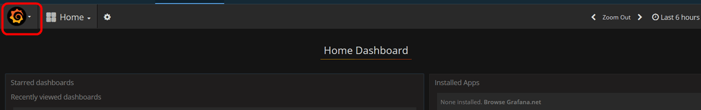
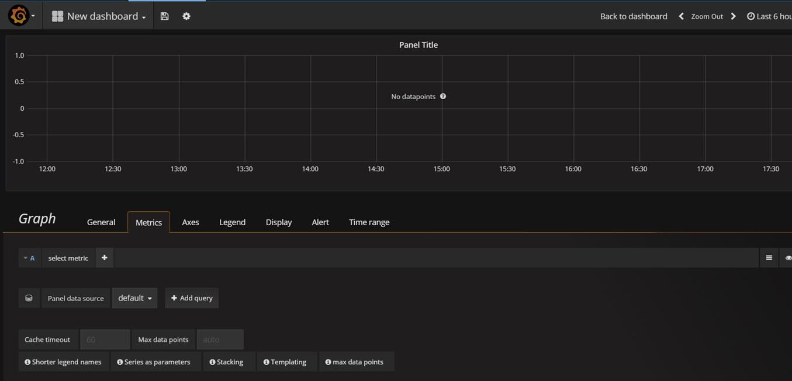

---

copyright:
  years: 2017, 2019

lastupdated: "2019-03-06"

keywords: IBM Cloud, monitoring

subcollection: cloud-monitoring

---

{:new_window: target="_blank"}
{:shortdesc: .shortdesc}
{:screen: .screen}
{:pre: .pre}
{:table: .aria-labeledby="caption"}
{:codeblock: .codeblock}
{:tip: .tip}
{:download: .download}
{:important: .important}
{:note: .note}

# Kubernetes クラスターをモニターするための Grafana ダッシュボードの作成
{: #container_grafana_dashboard}

このチュートリアルでは、クラスターのパフォーマンスをモニターするために、{{site.data.keyword.monitoringlong}} サービスで Grafana ダッシュボードを作成する方法を説明します。 
{:shortdesc}

## 達成目標
{: #cgd_objectives}

以下のように Kubernetes クラスターにデプロイされたアプリのコンテナー・メトリックの検索および分析方法について説明します。

1. Grafana を起動し、クラスター・メトリックを表示できる {{site.data.keyword.monitoringshort}} ドメインを設定します。
2. Grafana ダッシュボードを作成し、コンテナーの CPU 使用量をモニターするメトリックを定義します。

## 想定事項
{: #cgd_assumptions}

チュートリアルでは、以下を想定しています。

* 米国南部地域に、使用可能なクラスターがあります。 
* ご使用のユーザー ID は、**ビューアー**権限が設定された {{site.data.keyword.monitoringshort}} サービスの IAM ポリシーを持っています。

このチュートリアルを完了するには、チュートリアル[『Kubernetes クラスターにデプロイされたアプリに関する Grafana でのメトリックの分析』](/docs/services/cloud-monitoring/tutorials/container_service_metrics.html#container_service_metrics)を完了するか、クラスターがプロビジョンされ、少なくとも 1 つのアプリケーションがそこにデプロイされている必要があります。

## 手順 1: Grafana の起動
{: #cgd_step1}

ブラウザーから Grafana を起動し、クラスター・メトリックを表示できる {{site.data.keyword.monitoringshort}} ドメインを設定します。

クラスターのメトリックを分析するには、そのクラスターが作成されているクラウド Public 地域で Grafana にアクセスする必要があります。 詳しくは、[Web ブラウザーから Grafana ダッシュボードへのナビゲート](/docs/services/cloud-monitoring/grafana/navigating_grafana.html#launch_grafana_from_browser)を参照してください。

1. ブラウザーから Grafana を起動します。 

    クラスターを作成した地域の {{site.data.keyword.monitoringshort}} サービス URL を入力します。 
    
    地域ごとの URL を取得するには、[Monitoring サービスの URL](/docs/services/cloud-monitoring/monitoring_ov.html#region) を参照してください。

    例えば、米国南部地域の場合は、[https://metrics.ng.bluemix.net/](https://metrics.ng.bluemix.net/)を起動します。

2. {{site.data.keyword.monitoringshort}} ドメインを **account** に設定します。

    Grafana で、ID を選択します。 次に、正しいアカウントにログインしていることを確認して、`Domain = account` を選択します。

## 手順 2: Grafana ダッシュボードの作成
{: #cgd_step2}

以下の手順を実行して、新規ダッシュボードを作成します。

1. サイド・メニュー・バーのトグル を選択します。
2. **「Dashboards」**を選択します。
3. **「New」**をクリックします

ダッシュボードが開きます。 ダッシュボードには、すぐに構成できる空の行が含まれています。

Grafana で、ダッシュボードを複数のセクションに分割するための行を追加します。 行は、1 つ以上のパネルをグループ化します。 1 行の中では、パネルが最小の視覚化単位であり、メトリックのデータを表示するために構成 (例えば、グラフ・パネルや表パネルを選択できる) できます。 パネルをドラッグ・アンド・ドロップして、ダッシュボード内でパネルを再配置することができます。 パネルが表示するデータは、照会を介して構成されます。 1 つのパネルに 1 つ以上の照会を定義できます。 各照会は、異なるデータ・セットを表しています。 その他に、パネルの時刻範囲を設定することもできます。 通常、この時刻範囲は、*ダッシュボード*のタイム・ピッカーによって設定されます。

## 手順 3: メトリックをモニターするためのグラフをダッシュボードに追加
{: #cgd_step3}

以下のステップを実行します。

1. **「Graph」**をクリックします。

2. グラフのタイトルをクリックし、次に**「edit」**を選択します。

    *「Metrics」*タブが開きます。 デフォルト・データ・ソースが表示されています。

## 手順 4: メトリック照会の定義
{: #cgd_step4}

グラフに表示されるデータをフィルターに掛ける照会を定義します。 この照会では、コンテナーの全コアにわたって CPU 時間のナノ秒をモニターします。

照会のフォーマットについて詳しくは、[コンテナーに関して収集される CPU メトリックの照会フォーマット](/docs/services/cloud-monitoring/reference/metrics_format_containers.html#cpu_containers)を参照してください。
 
*「Metrics」*タブで、**「Add query」**を選択します。  照会項目が追加されます。 各照会には、1 文字のラベルが付いています。 

 
	
以下の手順を実行して照会を定義します。
        
1. ソースを指定するために**「Select metric」**をクリックし、次に `ibmcloud` を選択します。
    
2. クラウド・タイプを指定するために**「Select metric」**をクリックし、次に `public` を選択します。
    
3. サービス名を指定するために**「Select metric」**をクリックし、次に `containers-kubernetes` を選択します。
	
4. **「Select metric」**をクリックして地域を指定し、次に、クラスターが実行されている地域を選択します。 例えば、`us-south` です。
    
5. **「Select metric」**をクリックしてクラスター名を指定し、次に、コンテナーが実行されているクラスターの名前を選択します。
		
6. **「Select metric」**をクリックしてメトリック・ソースを指定します。 **「container」**を選択します。
		
7. 名前空間を指定するために**「Select metric」**をクリックします。 次に、コンテナーに関連付けられている、クラスター内の名前空間の名前を入力します。
		
8. **「Select metric」**をクリックしてポッド名を指定します。
	
9. **「Select metric」**をクリックして、モニターするコンテナーのコンテナー名を指定します。
	
10. **「Select metric」**をクリックしてメトリック・タイプを指定し、次に**「Select metric」**をクリックしてメトリックのサブタイプを指定します。
	
    例えば、コンテナーの全コアにわたって CPU 時間のナノ秒をモニターするには、タイプには**「cpu」**を選択し、サブタイプには**「usage」** を選択します。
		
	CPU メトリックのリストについては、
[コンテナー用の CPU メトリック](/docs/services/cloud-monitoring/containers/monitoring_containers_ov.html#cpu_metrics_containers)を参照してください。
    
11. 正符号イメージ  をクリックし、関数を選択します。 関数を追加すると、メトリックに使用可能なデータを変換したり、結合したり、それらのデータに対して計算を実行したりすることができます。

    例えば、**alias(newName)** 関数を追加して、メトリックの別名を追加することができます。 この別名は、グラフに表示される凡例にメトリック名の代わりにストリングを表示するために使用されます。

    メトリックの別名を追加するには、以下の手順を実行します。

    1. 正符号をクリックします。
    2. **「Special」**を選択します。
    3. **「alias」**を選択します。
    4. ストリング (例えば、`My sample metric`) を入力します。

## 手順 5: ダッシュボードの保存
{: #cgd_step5}

後で再利用するためにダッシュボードを保存します。

1. ダッシュボードの保存イメージ  をクリックします。.

    

2. ダッシュボードの名前を入力します。
3. **「保存」**をクリックします。

## 次の手順
{: #cgd_next_steps}

メトリックのアラートを定義します。 詳しくは、[アラートの構成](/docs/services/cloud-monitoring/config_alerts_ov.html#config_alerts_ov)を参照してください。
