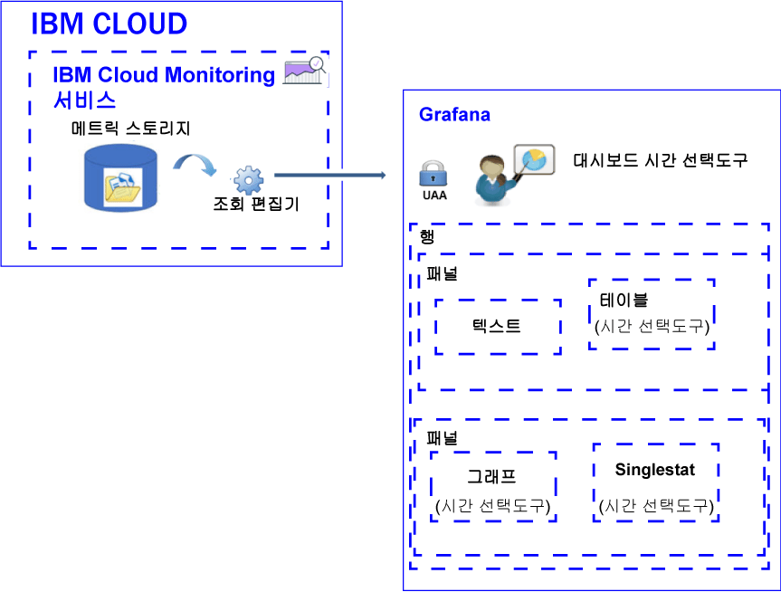

---

copyright:
  years: 2017, 2019

lastupdated: "2019-03-06"

keywords: IBM Cloud, monitoring

subcollection: cloud-monitoring

---

{:new_window: target="_blank"}
{:shortdesc: .shortdesc}
{:screen: .screen}
{:pre: .pre}
{:table: .aria-labeledby="caption"}
{:codeblock: .codeblock}
{:tip: .tip}
{:download: .download}
{:important: .important}
{:note: .note}

# 메트릭 분석
{: #analyze_metrics_ov}

{{site.data.keyword.Bluemix}}에서는 오픈 소스 시각화 및 모니터링 플랫폼인 Grafana를 사용하여 메트릭을 모니터링하고 검색하고 분석하고 다양한 그래프(예: 차트 및 표)로 시각화할 수 있습니다. 
{:shortdesc}

## 컴포넌트 개요
{: #overview}

{{site.data.keyword.monitoringshort}} 서비스는 일련의 데이터를 메트릭 스토리지 데이터베이스에 저장합니다. 사용자는 조회 편집기를 통해 이 데이터를 조회할 수 있습니다. 

Grafana에서 메트릭 스토리지 데이터베이스에 있는 데이터에 액세스하려면 {{site.data.keyword.Bluemix_notm}}에 로그인할 때 사용하는 사용자 ID 및 비밀번호를 사용하여 영역, 조직 및 지역에 로그인해야 합니다. 

데이터는 하나 이상의 행을 포함할 수 있는 대시보드를 구성하여 시각화합니다. 각 행에서는 여러 패널을 정의할 수 있습니다. 

* 하나의 행은 대시보드에 있는 여러 패널을 그룹화합니다. 
* 패널은 메트릭을 모니터링하는 데 사용되는 기본 시각화 리소스입니다. 
* 대시보드는 태그 지정될 수 있으며 패널 간에 데이터를 상관시키는 데 사용할 수 있는 데이터를 포함할 수 있습니다.

정의할 수 있는 패널 유형은 text, graph, table, singlestat입니다. 각 패널은 사용자 정의 가능한 서로 다른 스타일 및 형식화 옵션을 제공합니다. 

패널에 표시되는 데이터의 양은 설정된 조회 및 시간 범위에 따라 결정됩니다. 대시보드 레벨에서 모든 패널에 공통된 시간 범위를 설정하거나, 패널당 개별 시간 범위를 설정할 수 있습니다.

다음 그림은 Grafana가 데이터를 필터링하는 데 사용하는 {{site.data.keyword.monitoringshort}} 서비스의 다양한 컴포넌트, 그리고 Grafana에서 사용자가 데이터를 시각화하고 분석하는 데 사용할 수 있는 리소스를 보여줍니다.

