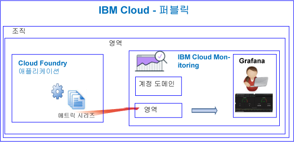

---

copyright:
  years: 2017, 2019

lastupdated: "2019-03-06"

keywords: IBM Cloud, monitoring

subcollection: cloud-monitoring

---

{:new_window: target="_blank"}
{:shortdesc: .shortdesc}
{:screen: .screen}
{:pre: .pre}
{:table: .aria-labeledby="caption"}
{:codeblock: .codeblock}
{:tip: .tip}
{:download: .download}
{:important: .important}
{:note: .note}


# Cloud Foundry 앱
 {:#monitoring_bluemix_apps}

{{site.data.keyword.Bluemix}}에서는 퍼블릭 지역에서 실행되는 CF(Cloud Foundry) 앱에 대해 메트릭이 자동으로 수집되고 {{site.data.keyword.monitoringlong}} 서비스로 전달됩니다. 분석을 위해 Grafana를 사용하여 CF 애플리케이션의 성능을 모니터링할 수 있습니다. 또한 메트릭 API를 사용하여 CF 앱 메트릭을 조회하고 데이터를 기반으로 하여 조치를 취할 수 있습니다.
{:shortdesc}


## 퍼블릭에서 실행 중인 CF 앱 모니터링
{: #public}


{{site.data.keyword.monitoringshort}} 서비스를 사용하여 CF 앱을 모니터링할 때 다음 정보를 고려하십시오.

* CF 앱이 실행 중인 영역과 동일한 영역에서 {{site.data.keyword.monitoringshort}} 서비스를 프로비저닝해야 합니다.
* CF 앱에 대해 수집된 메트릭이 자동으로 {{site.data.keyword.monitoringshort}} 서비스 내의 영역 도메인으로 전달됩니다. 
* 메트릭이 영역 도메인으로 전달됩니다. 영역 도메인은 CF 앱이 실행 중인 위치에 해당됩니다. 
* 또한 메트릭 API를 사용하여 메트릭을 조회하고 데이터를 기반으로 하여 조치를 취할 수 있습니다. 예를 들어, CF 앱의 CPU 사용률을 조회하는 자동화를 작성하고 CPU 사용률이 높아질 때 CPU를 스케일링할 수 있습니다.

다음 그림은 {{site.data.keyword.Bluemix_notm}}의 CF 앱 모니터링에 대한 상위 레벨 보기를 보여줍니다.



## {{site.data.keyword.Bluemix_notm}} 외부에서 실행 중인 CF 앱 모니터링
{: #outside}

{{site.data.keyword.Bluemix_notm}} 외부에서 실행 중인 CF 앱을 모니터링하려면 메트릭 API를 사용하여 CF 앱 메트릭을 {{site.data.keyword.monitoringshort}} 서비스로 전달할 수 있습니다.

* API에 대한 자세한 정보는 [메트릭 API](https://console.bluemix.net/apidocs/927-ibm-cloud-monitoring-metrics-api?&language=node#introduction)를 참조하십시오.
* API 사용에 대한 자세한 정보는 [메트릭 API를 사용하여 데이터 전송](/docs/services/cloud-monitoring/send-metrics?topic=cloud-monitoring-send_data_api#send_data_api)을 참조하십시오.


## CF 앱 메트릭 보기 및 분석
{: #monitoring_cfapps}

{{site.data.keyword.Bluemix_notm}}에서 CF 애플리케이션의 성능을 모니터링하려면 Grafana를 사용하십시오. 

{{site.data.keyword.monitoringlong}} 서비스는 오픈 소스 분석 및 시각화 플랫폼인 Grafana를 사용하여 메트릭을 모니터링하고, 검색하고, 분석하고, 다양한 그래프(예: 차트 및 표)로 시각화합니다.

Grafana는 브라우저에서 실행할 수 있습니다. 자세한 정보는 [웹 브라우저에서 Grafana 대시보드로 이동](/docs/services/cloud-monitoring/grafana?topic=cloud-monitoring-navigating_grafana#launch_grafana_from_browser)을 참조하십시오.

**참고:** CF 앱이 실행 중인 지역과 동일한 {{site.data.keyword.Bluemix_notm}} 지역에서 Grafana를 실행해야 합니다.


CF 애플리케이션을 모니터링하려면 Grafana에서 한 개 이상의 조회를 정의해야 합니다. 자세한 정보는 [Grafana에서 메트릭 조회 구성](/docs/services/cloud-monitoring/grafana?topic=cloud-monitoring-define_query#define_query)을 참조하십시오. 

또한 조회에 대한 경보를 정의할 수 있습니다. 자세한 정보는 [경보 구성](/docs/services/cloud-monitoring?topic=cloud-monitoring-config_alerts_ov#config_alerts_ov)을 참조하십시오.


## CPU 메트릭
{: #cpu_metrics}

각 CF 애플리케이션에 대해 자동으로 수집되는 메트릭 시리즈는 CPU 사용률에 대한 데이터를 포함합니다.


<table>
  <caption>CF 애플리케이션에 대해 수집된 CPU 메트릭</caption>
  <tr>
    <th>Metric</th>
    <th>설명</th>
  </tr>
  <tr>
    <td>cpu-utilization</td>
    <td>컨테이너의 한계에 대한 CPU 사용률의 백분율입니다.</td>
  </tr>
</table>


## 디스크 메트릭
{: #disk_metrics}

각 CF 애플리케이션에 대해 자동으로 수집되는 메트릭 시리즈는 사용되는 디스크 크기, 사용 가능한 총 디스크 크기 및 사용되는 디스크의 백분율에 대한 데이터를 포함합니다.


<table>
  <caption>CF 애플리케이션에 대해 수집된 디스크 메트릭</caption>
  <tr>
    <th>Metric</th>
    <th>설명</th>
  </tr>
  <tr>
    <td>disk-bytes-total</td>
    <td>CF 앱이 실행 중인 컨테이너의 디스크 크기입니다. 값은 바이트 단위로 정의됩니다.</td>
  </tr>
  <tr>
    <td>disk-bytes-used</td>
    <td>CF 앱이 디스크에서 사용하는 컨테이너의 디스크 크기입니다. 값은 바이트 단위로 정의됩니다.</td>
  </tr>
  <tr>
    <td>disk-utilization</td>
    <td>CF 앱에서 사용하는 디스크의 백분율입니다.</td>
  </tr>
</table>

**참고:** 

* CF 앱을 푸시할 때 디스크 크기를 지정하십시오.
* 디스크 사용률이 90%에 근접하면 CF 앱을 스케일링하는 것을 고려하십시오.

## 메모리 메트릭
{: #mem_metrics}

각 CF 애플리케이션에 대해 자동으로 수집되는 메트릭 시리즈는 사용되는 메모리, 사용 가능한 총 메모리 및 사용되는 메모리의 백분율에 대한 데이터를 포함합니다.

<table>
  <caption>CF 애플리케이션에 대해 수집된 메모리 메트릭</caption>
  <tr>
    <th>Metric</th>
    <th>설명</th>
  </tr>
  <tr>
    <td>memory-bytes-total</td>
    <td>CF 앱에 대해 사용 가능한 메모리를 바이트 단위로 표시합니다.</td>
  </tr>
  <tr>
    <td>memory-bytes-used</td>
    <td>CF 앱 인스턴스에 대해 사용되는 메모리를 바이트 단위로 표시합니다.</td>
  </tr>
  <tr>
    <td>memory-utilization</td>
    <td>CF 앱에서 사용하는 메모리의 백분율입니다.</td>
  </tr>
</table>


## 메트릭 조회 형식
{: #query_format}


Cloud Foundry 애플리케이션을 모니터링하기 위해 Grafana에서 정의하는 조회는 다음 형식을 준수해야 합니다. 

```
{Source}.{Cloud Type}.{Service Name}.{Region}.{CFapp Name}.{CFapp Index}.{CFapp container}.{Metric Type}.{Metric Subtype}.[Functions]
```
{: codeblock}

예를 들어, 시드니 지역에서 이름이 logtester인 CF 앱 인스턴스에 대해 수집된 메트릭 시리즈 샘플을 보십시오.

```
ibmcloud.public.cloud-foundry.au-syd.logtester.0.container.cpu.utilization
ibmcloud.public.cloud-foundry.au-syd.logtester.0.container.disk.bytes-total
ibmcloud.public.cloud-foundry.au-syd.logtester.0.container.disk.bytes-used
ibmcloud.public.cloud-foundry.au-syd.logtester.0.container.disk.utilization
ibmcloud.public.cloud-foundry.au-syd.logtester.0.container.memory.bytes-total
ibmcloud.public.cloud-foundry.au-syd.logtester.0.container.memory.bytes-used
ibmcloud.public.cloud-foundry.au-syd.logtester.0.container.memory.utilization
```
{: screen}

자세한 정보는 [CF 앱 메트릭 형식](/docs/services/cloud-monitoring/reference?topic=cloud-monitoring-cfapps_metrics_format#cfapps_metrics_format)을 참조하십시오.

**참고:** CF 앱 이름에 사용할 수 있는 모든 문자를 메트릭 시리즈 이름에 사용할 수 있는 것은 아닙니다. 예를 들어, 대문자는 사용할 수 없습니다. 조회를 정의할 때 Grafana에 표시되는 CF 앱 이름이 모두 소문자로 변경됩니다.


